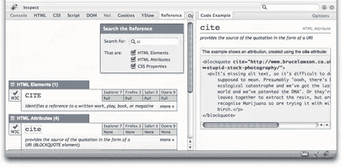

# 介绍 CodeBurner:Firebug 的 SitePoint HTML & CSS 参考工具

> 原文：<https://www.sitepoint.com/introducing-codeburner-the-sitepoint-reference-tool-for-firebug/>

CodeBurner 的新版本已经发布。这个版本不依赖于 Firebug——它是一个独立的扩展，并且在有限的时间内与一本免费的书捆绑在一起！[立即拿起你的。](https://getfirebug.com/)

为了配合重新设计的 [SitePoint Reference](https://reference.sitepoint.com/) 网站的发布，我们非常兴奋地发布了我们开发的新浏览器扩展——它可以将我们的参考数据放在您的测试环境中。

FireScope [CodeBurner](https://getfirebug.com/) 是流行的 web 开发工具 [Firebug](https://getfirebug.com/) 的一个新插件，它为 <abbr title="Hypertext Markup Language">HTML</abbr> 和 <abbr title="Cascading Style Sheets">CSS</abbr> 扩展了参考资料。该工具直接使用来自我们参考网站的数据，提供关于使用和浏览器兼容性的最准确和最新的信息，一切尽在您的浏览器中！

CodeBurner 的核心功能围绕着一个新的**参考**面板，它包含了一个搜索 HTML 元素、属性和 CSS 属性的搜索工具。该工具还挂钩到 <abbr title="Hypertext Markup Language">HTML</abbr> 和 <abbr title="Cascading Style Sheets">CSS</abbr> 面板中的上下文菜单、 <abbr title="Document Object Model">DOM</abbr> crumbtrail 和检查器，添加选项来查找选定的项目(即在“参考”面板中搜索)或查看代码示例。更多信息，截图和下载扩展，**请访问~~FireScope~~[CodeBurner 主页](https://getfirebug.com/)** 。

由[your truly](https://www.brothercake.com/)、 ~~FireScope~~ CodeBurner 撰写，增加了 Firebug 中已经令人印象深刻的可用工具范围，进一步证实了它作为 web 开发人员可用的最有用的开发工具的地位。

但是其他浏览器呢…？好吧，对于 Internet Explorer 的用户来说，有 IE8 的 [SitePoint 网页切片和加速器。如果有足够的需求，我们也可以开发其他工具——比如 Internet Explorer 和 Opera 的工具栏，或者不依赖 Firebug 的 Firefox 的独立版本。这对你有用吗？请务必让我们知道！](https://www.sitepoint.com/introducing-the-sitepoint-web-slices-and-accelerator-for-ie8/)

我们非常有兴趣听听你对 ~~FireScope~~ CodeBurner 的看法——你喜欢它的哪些方面，你不太在乎的那些方面，或者你认为它应该具备的任何新功能。请在下面发表评论，或者如果你想让你的观点更加私密，请发电子邮件至 support@sitepoint.com

最重要的是，我们真的希望你喜欢使用 ~~FireScope~~ CodeBurner，就像我们喜欢把它放在一起一样。我们将在不久的将来写关于开发过程的文章。

## 分享这篇文章