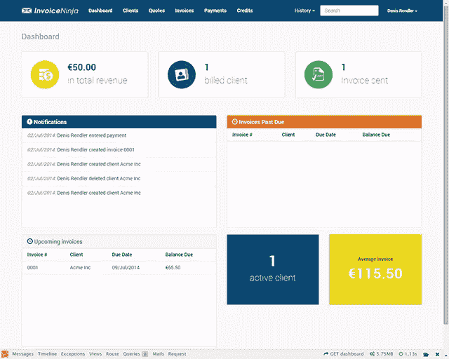
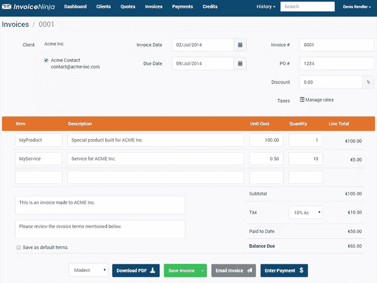
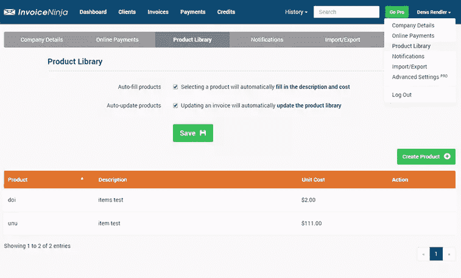

# InvoiceNinja 简介:自托管发票

> 原文：<https://www.sitepoint.com/introducing-invoiceninja-self-hosted-invoicing/>

对于一个自由职业者来说，没有什么比时间更重要。跟踪发票或做文书工作会很快变得乏味，并占据很大一部分时间。三月份，我向您展示了 [FusionInvoice](https://www.sitepoint.com/self-hosted-free-invoicing-app-fusioninvoice/) ，一个跟踪您的客户和发票的工具。尽管这是一个好用的工具，但它的开源版本已经停产，部分被 [InvoicePlane](https://invoiceplane.com/) 接管。然而，在本帖中，我想向你介绍 [InvoiceNinja](https://www.invoiceninja.com/) 。

## 介绍 InvoiceNinja

InvoiceNinja 是一个开源的自托管和云托管的发票平台。

忠实于它的座右铭，InvoiceNinja 的界面简单直观，使创建发票变得轻而易举。像管理客户、开具新发票或增加付款等任务只是简单的操作，即使是没有经验的用户也能轻松完成。其简单的仪表板欢迎用户显示有关发票创建及其状态的相关信息。发票的实时预览将有助于您在发送给客户之前轻松地进行审核。

通过与 PayPal、Google Wallet 和 21 个其他支付处理器的集成，InvoiceNinja 使您的客户直接通过该应用程序报销您的工作费用变得非常容易。

在技术层面上，InvoiceNinja 的核心是最新版本的 Laravel 框架，而它的 UI 是建立在 Twitter Bootstrap 库之上的。这种集成可以很容易地更新自托管版本的主题，完全符合您的要求，并具有响应性布局和移动友好的开箱即用。

Knockout.js 是一个 Javascript MVVM 库，它将丰富的用户界面与业务逻辑连接起来，在 jsPDF Javascript 库的帮助下，您只需点击几下鼠标，就可以轻松地将发票直接导出为 PDF 文件或通过电子邮件发送给客户。

## 安装步骤

使用 Laravel 的 Homestead 预打包流浪盒时，安装到本地环境非常简单。Homestead 可以在任何 Windows、Mac 或 Linux 主机系统上运行，包括已经安装和配置的 Nginx web 服务器、PHP 5.5 和 MySQL 5.5 数据库服务器。

Bruno sk orc 很好地解释了如何通过 5 个简单的步骤建立并运营家园。如果你不熟悉 Homestead，你可以看看他的文章，这里我们就不赘述了。请确保您遵循他的步骤，但跳过第 5 步，并且在我们为我们的应用程序进行定制之前不要启动虚拟机。

现在，如果你按照布鲁诺的指示，你已经下载了你的机器上的家园虚拟机定制为我们的 InvoiceNinja 安装，这是一个简单的 4 行更改。

在您喜欢的编辑器中打开 Homestead.yaml 文件，并根据您的安装路径更改下面几行:

```
folders:
  - map: /path/to/your_installation
    to: /home/vagrant/invoice-ninja 
```

和

```
sites:
  - map: invoice.ninja.dev
    to: /home/vagrant/invoice-ninja/public 
```

`folders/map: /path/to/your_installation`指的是您在主机上设置的路径。这是文件最终将被下载的地方，尽管对于 VM 来说，它们看起来像是被安装在了一个空盒子里。

这些就是我们需要的所有修改。现在只需使用`vagrant up`命令启动虚拟机，让它完成安装。

当 VM 的安装完成后，应该不会超过几分钟，我们将开始从 Github 下载 InvoiceNinja 及其所有依赖项。

要开始下载应用程序，只需使用`vagrant ssh`命令 SSH 到 Homestead VM。登录后，在提示符下运行下一个命令:

```
$ cd ~/invoice-ninja 
```

这将把工作目录更改为我们之前设置的在 VM 中托管应用程序的文件夹。

要开始将 InvoiceNinja 下载到我们的本地环境，请运行下一个命令:

```
$ git clone https://github.com/hillelcoren/invoice-ninja.git . 
```

注意:确保在`clone`命令的末尾包含点号，否则 Git 会创建一个子文件夹，这会破坏我们之前为 Nginx 站点配置设置的路径。

为了保持项目使用的任何第三方依赖项的最新状态，开发团队正在使用 Composer。(如果你不熟悉 Composer，Sitepoint 有一篇由 Alexander Cogneau 撰写的非常好的[文章，可以帮助你快速掌握 Composer 的使用)。](https://www.sitepoint.com/php-dependency-management-with-composer/)

现在，让我们通过运行下一个命令来安装其余的库:

```
$ composer install 
```

注意:Github 对未认证用户的限制是每小时 60 个请求。由于这个限制，当被要求安装其余组件时，你必须用你的 Github 帐户登录。如果您没有 Github 帐户，请创建一个。

下载完所有依赖项后，让我们通过运行下一个命令来准备数据库:

```
$ mysql -u root -psecret 
```

Homestead box 预装和配置了 MySQL。默认配置创建了一个名为“homestead”的用户，密码为“secret”。该用户将拥有大部分管理权限，但在我们的例子中，我们需要“root”用户，以便创建“ninja”用户并将其分配给我们的数据库，该用户在 InvoiceNinja 应用程序中默认配置。通过添加`ninja`用户，我们将避免改变应用程序的默认配置，但是如果您觉得可以快速改变 InvoiceNinja 的配置文件中的数据库连接设置，您可以跳过这一步中的最后两个命令。

成功登录 MySQL 提示符后，运行下面一系列命令:

```
mysql > CREATE DATABASE `ninja` DEFAULT CHARACTER SET utf8 COLLATE utf8_general_ci;
mysql > CREATE USER 'ninja'@'localhost' IDENTIFIED BY 'ninja';
mysql > GRANT ALL PRIVILEGES ON `ninja`.* TO 'ninja'@'localhost';
mysql > FLUSH PRIVILEGES; 
```

就是这样。我们创建了数据库，并为“ninja”用户配置了访问数据库所需的所有权限。

完成设置后，让我们通过运行下一个命令来播种数据库:

```
$ php artisan migrate --seed 
```

## 创建我们的第一张发票

现在我们已经成功地在系统上安装了 InvoiceNinja，让我们创建第一张给 ACME Inc .的发票。

登录后，如果您选择创建一个公司简介，您将受到精心设计的仪表板的欢迎。



正如你可能注意到的，这个设计简单而优雅，并且预先为用户提供了所有必要的信息。这种设计在移动设备上变得非常方便，因为移动设备缺少桌面上丰富的页面空间。

InvoiceNinja 能够维护客户列表、发票和项目税率、服务和产品，所有这些都可以轻松链接到新的发票。

要添加客户，您可以在创建发票时添加，也可以从页面顶部的主菜单中选择`Clients > New Client`命令。

现在让我们创建一个名为 ACME Inc .的新客户端，并按照下面的屏幕截图填写详细信息。


填写完所有字段并保存客户端后，继续`Invoices > New Invoice`创建我们的第一张发票，如下一张截图所示。



创建发票时，通过选择`Manage rates`并添加税率详情，可以轻松管理税率。

使用 InvoiceNinja，您还可以添加直接适用于发票的百分比折扣。

点击您的用户名，从右上角显示的菜单中选择`Product Library`,即可管理产品和服务。



简单吧？

## 结论

客户的数据和产品已经保存，创建新发票只需添加每种产品或服务的数量，并选择交付方式 PDF 格式或通过电子邮件发送发票链接。

然而，这种简单和快速也有不好的一面。只有 4 个模板的发票和唯一的定制你可以做的没有潜入代码是改变主要和次要的颜色。货币是按客户保存的，这意味着您不能选择对同一客户的某张发票使用不同的货币。只有在创建发票或报价时，才能使用管理税率等其他选项。您也不能选择应用固定折扣。我注意到的一个最大的问题是，如果你删除一个客户，与该客户相关的所有发票也会被删除，但应用程序不会就此向你发出警告。

在以后的文章中，我们将会看到如何解决这些问题，并使应用程序满足我们的需求。你试过了吗？做过延期吗？让我们知道！

## 分享这篇文章