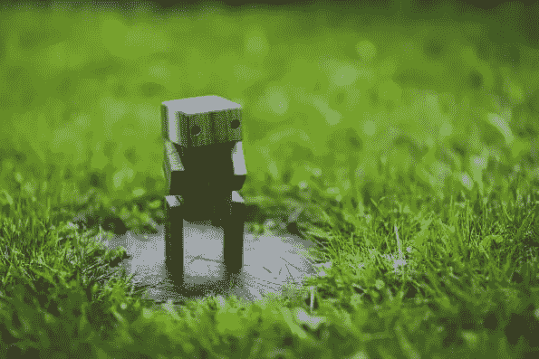

# 介绍:聊天机器人与我们的第一个迷你课程

> 原文：<https://www.sitepoint.com/introducing-mini-courses-with-chatbots/>

大多数访问 SitePoint 的人都是为了学习。当我们遇到问题时，我们会迅速寻找解决方案。如果我们对某个网络主题不够熟悉，或者想要扩展我们在某个特定技能集或工具方面的知识，我们会寻找快速课程来教我们更多。我们一直在研究。

随着时间的限制越来越多，很难找到时间工作/学习、吃饭、社交和睡觉。难怪我们倾向于将书签标记的 2-6 小时课程放在次要位置。*我们明白了*。

这就是为什么我们很高兴推出**迷你课程**，这是一个专为您快速休息而设计的较短课程。

### 迷你课程和课程有什么不同？

除了更短之外，你还会注意到迷你课程更加集中，真正探索一个主题，跳过了 web 开发的基础知识。

我们将深入挖掘利基主题、框架和工具，为您提供一个更大的学习库。

最大最好的消息是……*它是免费的！*没错。您需要成为 SitePoint 用户才能访问我们的迷你课程，但只需点击一个按钮即可加入。

### 我们的第一个迷你课程什么时候开始？

**今天！**我们刚刚在 [MS Bots](https://www.sitepoint.com/premium/courses/ms-bots-2939/?utm_source=sitepoint&utm_medium=article&utm_campaign=0096_ms_bots) 上推出了我们的第一个迷你课程。

机器人已经慢慢接管了开发领域，有人预测它们将导致应用程序开发的下滑。现在你可以了解使用微软聊天机器人框架开发你自己的聊天机器人需要做些什么。

### MS Bots 将涵盖哪些内容？

在这个 1 小时的课程中，我们还将向您展示如何整合智能工具，如 a [LUIS.ai](https://www.luis.ai/) ，这是一个用于您的机器人的语言理解工具。没有人情味的聊天机器人是不完整的，这可以通过[文本分析 API](https://www.microsoft.com/cognitive-services/en-us/text-analytics-api) 进行情感分析和适当的机器人响应。最后，你将会用我上面提到的所有工具*和更多工具*建立一个推荐电影的 Skype 机器人。

你到底要学什么，怎么学？让我们更深入地研究一下这些教训。

1.  **微软机器人框架入门**
    我们将向您展示如何使用微软机器人框架创建您的第一个 Skype 机器人。
2.  测试 Skype 机器人
    你会发现在开发任何东西的时候都会遇到错误。我们将向您展示如何使用 [ngrok](https://www.sitepoint.com/use-ngrok-test-local-site/) 检测工具调试您的 Skype bot，并使用 bot 框架仿真器对其进行测试。
3.  路易斯的自然语言处理
    没有人喜欢单方面的对话，所以我们将在路易斯中创建模型，让我们的机器人理解和处理自然语言。
4.  **微软认知服务与文本分析 API**
    除了单方面的对话，每个人都希望自己被理解。我们将把文本分析 API 集成到我们的聊天机器人中，这样我们的机器人就可以带着情感进行相应的聊天。
5.  **用卡片格式化信息**
    这是给你心中的设计师的。我们将向您(和您的机器人)展示如何用图像和按钮格式化您的 Skype 消息。
6.  Azure Bot 服务
    Azure Bot 服务是行业首创的 Bot 即服务。我们将教你如何使用这个集成的在线环境来进行你可能从事的机器人开发。

MS Bots 是一门有趣的课程，但我们建议您充分了解 Node.js。如果你需要温习 Node.js，[这里有一门课](https://www.sitepoint.com/premium/courses/node-js-an-introduction-2866)你可以上。

你准备好开始你的聊天机器人冒险了吗？真正的问题是，在参加了[这个快速课程](https://www.sitepoint.com/premium/courses/ms-bots-2939/?utm_source=sitepoint&utm_medium=article&utm_campaign=0096_ms_bots)，**之后，你的下一个聊天机器人会做什么？**

## 分享这篇文章