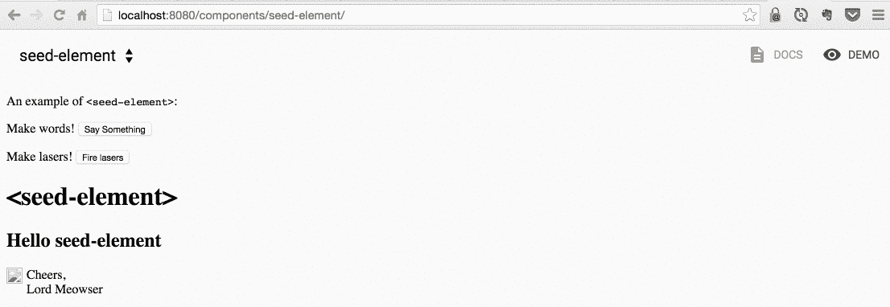
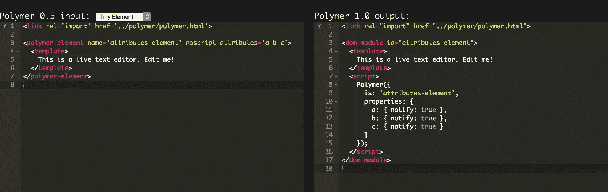

# 介绍聚合物开发的新工具

> 原文：<https://www.sitepoint.com/introducing-new-tools-for-polymer-development/>

*这篇文章由[陶兰特·斯帕希乌](https://www.sitepoint.com/author/tspahiu/)和[帕纳伊奥蒂斯·韦利萨拉科斯](https://github.com/pvgr)进行了同行评审。感谢 SitePoint 的所有同行评审员使 SitePoint 的内容尽可能做到最好！*

去年九月，谷歌举办了[2015](https://www.youtube.com/playlist?list=PLNYkxOF6rcICdISJclfQhj2S8QZGjXV8J)聚合物峰会。在这次会议上，开发人员提供了大量关于聚合物可能带来的新事物的信息。 [Polymer 1.0](https://www.polymer-project.org/1.0/docs/) 已经提前发布，这增加了许多人对今年大会的期待。在今年的演讲者中，有一位名叫 [Addy Osmani](http://addyosmani.com/) 的谷歌工程师，他因对几个开源项目的重要贡献而闻名。在他的演讲中，他介绍了一些用于聚合物开发的新工具。这些工具提供了开发人员可能需要了解的关于聚合物开发的一切，而不考虑先前的经验。我将要描述的许多工具需要通过`npm`下载，然后可以直接在你的计算机命令行中使用。对于那些不知道什么是聚合物并想在阅读我的文章之前深化主题的人，我建议看看这些资源:

*   [Web 组件和聚合物介绍(教程)](https://www.sitepoint.com/introduction-to-web-components-and-polymer-tutorial/)
*   [用聚合物构建图库组件](https://www.sitepoint.com/building-a-image-gallery-component-with-polymer/)
*   [用聚合物构建信用卡表单定制元素](https://www.sitepoint.com/building-credit-card-form-custom-element-polymer/)
*   [聚合物 1.0 升级指南](https://www.sitepoint.com/a-guide-to-upgrading-to-polymer-1-0/)

### 聚合物入门套件

[Polymer tarter kit 1.0](https://developers.google.com/web/tools/polymer-starter-kit/?hl=en) 可让开发人员立即投入使用。它包括一个由[大口](http://gulpjs.com/)驱动的构建系统。因此，开发人员可以开始编写他们自己的代码，并在浏览器中查看他们的应用程序更新。如果我们[检查这个项目的存储库](https://github.com/polymerelements/polymer-starter-kit/releases)，我们可以看到它维护得非常好，因为核心提交被突出显示在页面的顶部。Polymer 团队为开发人员提供了所有必要的文档，以帮助那些不熟悉 Polymer 的人在使用时感到舒适。

### 种子元素

种子元素项目为在聚合物中构建元素提供了一个样板。然而，它并不止于此！Seed element 将收集聚合物应用程序，并生成聚合物元素试图实现的不同功能的完整文档集。提供这种功能的能力是在 [IronComponent](https://github.com/PolymerElements/iron-component-page) 的帮助下完成的。

下面我们看到一个存在于浏览器中的种子元素的例子。此外，我们看到 seed-element 项目允许我们将视图从实际应用程序切换到用`IronComponent`元素生成的 API 文档。



[如果您想查看种子元素项目的存储库，您可以在这里找到它](https://github.com/polymerelements/seed-element)。也就是说，我们需要做的就是运行下面的命令，以便在我们的计算机上安装 seed-element 项目。

```
git clone https://github.com/polymerelements/seed-element && cd seed-element
```

### 多服务器

我们要看的下一个工具是 [Polyserve](https://github.com/PolymerLabs/polyserve) 。顾名思义，这个应用程序可以用来在浏览器中提供聚合物组件。在上面包含的 GIF 中，应用程序被用来为种子元素应用程序提供服务。要安装这个工具，我们可以运行以下命令。应该知道，我们需要在它后面附加-g 标志，因为我们需要对它进行全局访问。

```
npm install -g polyserve
```

现在，如果我们进入之前克隆的种子元素目录并运行命令`polyserve`，我们将看到上面 GIF 中显示的相同结果。该工具与`http-server` npm 模块极其相似。如你所见，这使得开始使用聚合物变得非常容易。

### 聚尿苷酸

Polyup 是一个非常令人印象深刻的工具，它帮助减轻了 Addy Osmani 所说的“元素内疚感”。这是一种负罪感，是花费大量时间在 0.5 版聚合物中构建一个元素，却发现它与 1.0 版聚合物不兼容的结果。令人难以置信的是，Polyup 自动化了“升级”Polymer 0.5 代码的过程，因此它与 1.0 兼容。Polyup 实际上会检查您的文件，并使用正确的语法重写元素。[对于那些有兴趣观看 polymer up 如何工作的现场示例的人，我建议访问 PolymerLabs Github 页面](http://polymerlabs.github.io/polyup/)。此外，我们可以在下面看到这个页面的截图。



可以通过运行以下命令来安装 Polyup:

```
npm install -g polyup
```

安装完成后，开发人员将可以使用 Polyup 命令行工具。通过运行`polyup <filename.html>`,我们可以坐下来看着 Polymer 升级组件，使它们在 1.0 版本中完全兼容。在谈到 Polyup 时，Addy Osmani 提到了一段代码，我将在下面列出。通过在一个 Polymer 项目中运行这个代码块，Polyup 将筛选一个项目中带有`.html`扩展名的每个文件，并将所有这些文件升级到 2.0 版本！

```
find . -name "*.html" -execdir polyup --overwrite "{}" \;
```

### Web 组件测试器

所有开发人员都知道测试是开发不可或缺的一部分。因此，毫不奇怪，最近一个 [Web 组件测试工具](https://github.com/Polymer/web-component-tester)已经推出，这样开发人员可以很容易地测试聚合物组件。它是建立在[摩卡](https://mochajs.org/)和[柴](http://chaijs.com/)之上的，这是两个比较流行的测试框架。因此，许多开发人员可以利用他们通过这些测试套件测试不同 JavaScript 框架的知识来编写聚合物组件的测试。

就像 Polyup 和 Polyserve 一样，这个工具可以通过运行以下命令通过`npm`下载:

```
npm install -g web-component-tester
```

一旦安装完毕，开发者就可以使用`wct`命令行工具。当在一个聚合物项目中运行时，这个命令将在`test`目录中的所有文件上运行。如果我们从种子元素存储库中检查文件夹结构，我们可以看到这个测试目录存在。

## 结论

Polymer 团队已经为 Web 开发领域提供了开始使用框架构建应用程序的所有必要手段。除了这些工具，Addy Osmani 还谈到了其他一些工具，如[硫化](https://github.com/polymer/vulcanize)和[保鲜盒](https://github.com/PolymerLabs/crisper)，它们在聚合物社区中非常受欢迎。如果你想看他的演讲，或者聚合物峰会的其他演讲，[你可以在会议的 YouTube 频道](https://www.youtube.com/playlist?list=PLNYkxOF6rcICdISJclfQhj2S8QZGjXV8J)上找到。

## 分享这篇文章