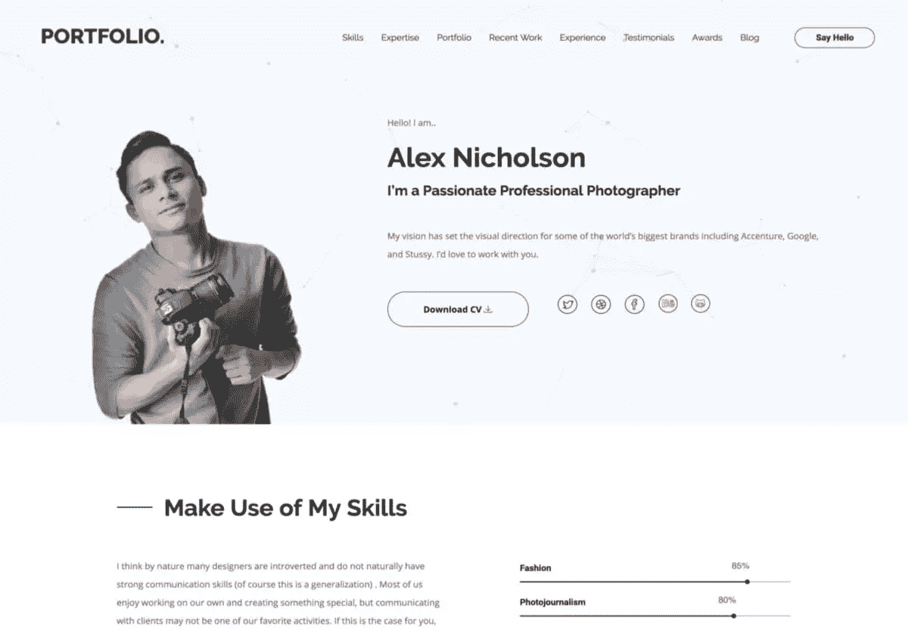
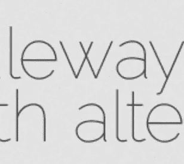
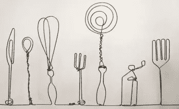
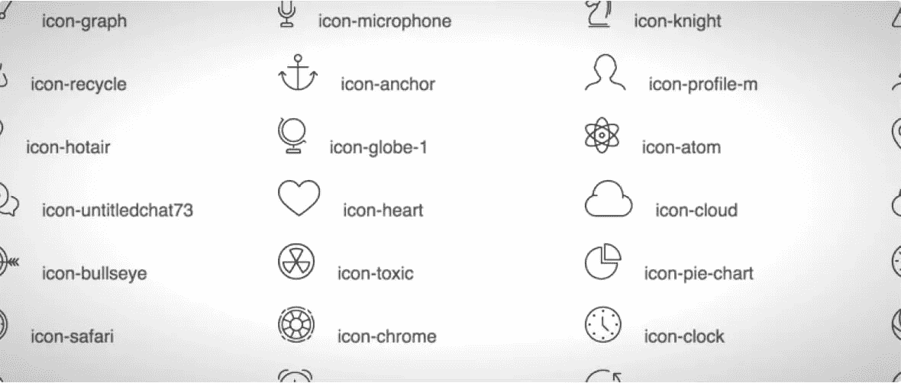
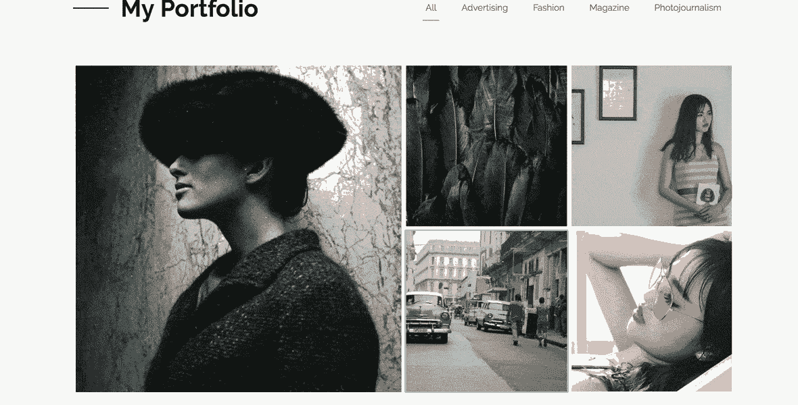
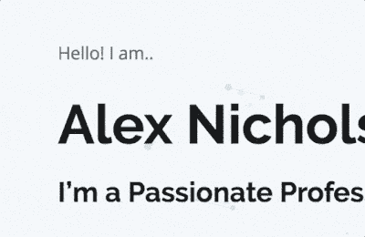

# 介绍组合 WordPress 主题——及其背后的设计决策

> 原文：<https://www.sitepoint.com/introducing-portfolio-wordpress-theme-and-the-design-decisions-behind-it/>

如果你想了解更多关于自定义主题开发的知识，请查看 SitePoint 高级课程 [WordPress 主题开发](https://www.sitepoint.com/premium/courses/wordpress-theme-development-2931)！

你可能已经注意到了，SitePoint 现在提供了我们自己的一系列优质 WordPress 主题。我们最新的并且我们认为最吸引人的主题叫做“T2”作品集。我们与一位非常有才华的设计师——来自 [DroitLab](https://dribbble.com/droitlab) 的 Shahadat 密切合作，试图为设计师、作家、艺术家甚至前端编码人员创造一个展示他们才华的理想平台。这份简报“简洁、公开、简约”。

我认为分解驱动它的关键设计决策可能是有用的。

## 1).选择版式:常规和开放无规则

排版选择总是被载入。可以说，没有其他设计决策会如此全面地渗透到设计的感觉中，但奇怪的是，用户却看不见。他们可能一天在脸书上阅读数千字，但让普通用户描述所用的字体，他们很可能会眨眨眼，耸耸肩。

SitePoint WordPress 作品集主题截图

对于作品集的标题，我们选择了谷歌目录中我最喜欢的无衬线字体——[rale way，Matt McInerney 极其优雅的创作](https://www.theleagueofmoveabletype.com/raleway)。

为什么我这么喜欢？看看那个“W”！

罗威看起来像弯曲和加工过的钢铁——就是你在 20 世纪 30-40 年代的邮局、学校和公共建筑上看到的那种字体。它总是锋利但不具攻击性。

开放的无规则的很适合这种体型。它比罗威更通用，但拥有许多新怪诞的特质——减去了一些独特的中世纪风格(如“w”)。他们可以轻松地共享同一页面上的空间。

## 2).选择图像

我们的排版为我们选择的图标指明了方向。Raleway 和 Open Sans Regular 都使用一种重量很轻的绳索——就像是用围栏钢丝制作的一样。

手工线框图像-Madebyjoel.com

我见过真实世界的栅栏线雕塑——这个来自[MadeByJoel.com](http://madebyjoel.com/2012/12/art-project-cafe-wire-sculpture.html?utm_source=rss&utm_medium=rss&utm_campaign=art-project-cafe-wire-sculpture)的原始作品非常棒——所以我们想延续图标的“铁丝网外观”,组装一组线性图标——总共大约 50 个。由于没有一个图标集有我们想要的，我们从许多来源策划了一个新的图标库，包括:

*   [线性图标](https://linearicons.com/free)
*   和图标
*   自定义手绘图标

它们都是 crisp SVG 格式，所以它们在从图标到特写插图的几乎任何比例下都可以正常工作。

## 3).画廊视图

在作品集网站中，展示你的作品达到最佳效果总是非常重要的。我们把画廊的重点放在展示一个正方形平铺的画廊布局中的视觉收藏品上，然后把每个单元都打开成一个杂志般的模式。您可以按类别过滤您的图像，或者将它们作为开放收藏全部浏览。

## 4).粒子几何效果

虽然我们希望英雄区保持开放和整洁，但我们认为在这样一个重要的面板中，意外的微妙接触不会不合适。我们在这里实现的粒子效果非常符合这个要求。它平静而迷人。

浮动节点和链接向量暗示了想法产生和联系的主题——这是设计师、作家和程序员的一项相关技能。它增加了设计的质感和深度，但不需要你关注更重要的页面元素——在这种情况下，就是你。这是件好事。

粒子效果在轻量级 JavaScript 和 canvas 中渲染，使其可以快速加载和运行，并可扩展到任何空间。我们正在寻找能让你制作自己的标志性粒子效果的方法。

## 总结

所以，这是这个项目背后的设计思想的快照。我认为 [Portfolio](https://www.sitepoint.com/wordpress-portfolio-theme/) 是我们迄今为止最好的作品，我期待着很快再次与 Shahadat 合作。

检查一下，让我们知道你的想法。

## 分享这篇文章