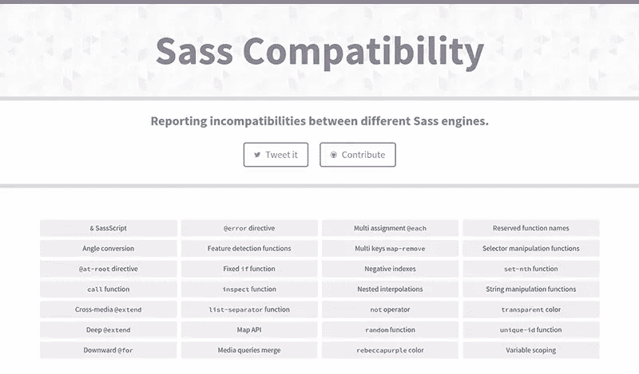
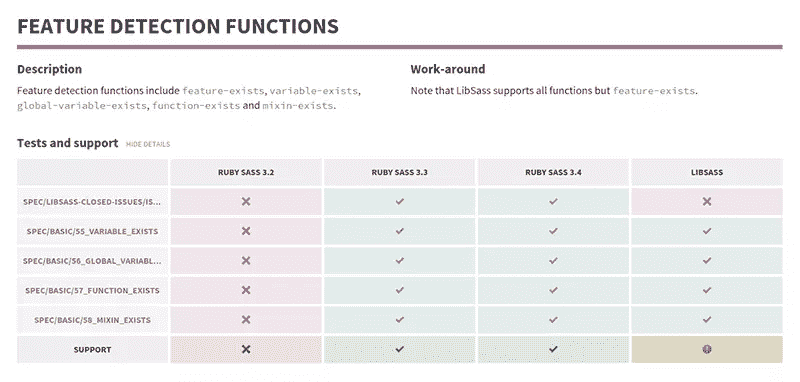

# 介绍 Sass 兼容性

> 原文：<https://www.sitepoint.com/introducing-sass-compatibility/>

几周来，在一些人的帮助下，我一直在收集 Ruby Sass 和 LibSass 之间的不一致之处。起初，它只是 GitHub 的一个要点，但后来，我用它做了一个带有自定义样式表和所有东西的 CodePen。这仍然不够，所以我做了一个完整的项目。我来介绍一下 [Sass-Compatibility](https://sass-compatibility.github.io) 。

Sass 兼容性的目标是提供不同 Sass 引擎之间的不一致性列表。当然不仅是 Ruby Sass 和 LibSass，还有 Ruby Sass 3.2 和 Ruby Sass 3.3，或者 Ruby Sass 3.3 和 Ruby Sass 3.4。

基本的场景是你想把你的代码库转移到 LibSass，但是因为缺少特性而不确定你是否能做到。我们会掩护你的。前往[https://sass-compatibility . github . io](https://sass-compatibility.github.io)，参观一下，并亲自检查一下，为了享受 LibSass 的速度，你是否可以放弃一些功能。

*注意:关于主题，请务必阅读詹姆斯·斯坦巴赫的《从 Ruby Sass 到 LibSass 的转换》。*

## 它是如何工作的？

一开始，主要是在 [SassMeister](http://sassmeister.com) 上进行手工测试，然后将结果写在一个表格中。相当乏味，而且扩展性不好(特别是因为我已经强调了 30 多个不一致的地方)，所以多亏了[瓦莱里安·加里亚特](https://twitter.com/valeriangalliat)，我很快就转移到了全自动系统。

你可能不知道，有个项目叫 [sass-spec](https://github.com/sass/sass-spec) 。Sass-spec 旨在为 Sass 引擎提供一个测试套件，以确保它们符合 Sass 的官方 Ruby 版本。然而，我们应该注意到，该项目目前处于一种奇怪的状态，它只有一些针对 LibSass 的测试，一些来自 Ruby Sass 3.0 之前的旧测试，一些禁用的测试…基本上，有点混乱。

也就是说，LibSass 的维护者做了大量的工作来保证所有的特性都经过 sass-spec 的测试。这意味着合并到 LibSass 代码库中的每个代码片段都有一个在 sass-spec 项目中编写的测试。

由于这个原因，我们决定从 LibSass 中提取测试，而不是重写它们。对于没有测试的不一致，要么我在 sass-spec 中添加一个，要么我专门为 sass 兼容性写一个。最终，我们的目标是只使用 sass-spec 的测试，而不是我自己的，但同时我们必须做我们必须做的事情。

无论如何，我们有一个[特性列表](https://github.com/sass-compatibility/sass-compatibility.github.io/blob/master/_data/features.yml)和一些[相关测试](https://github.com/sass-compatibility/sass-compatibility.github.io/blob/master/_data/tests.yml)。一个功能可以(应该？)进行几次测试，确保 100%覆盖。然后，我们有了一个(令人惊叹的) [Rakefile](https://github.com/sass-compatibility/sass-compatibility.github.io/blob/master/Rakefile) ，它迭代所有特性的所有测试，并通过 [SassMeister 的后端](https://github.com/sass-compatibility/sass-compatibility.github.io/blob/master/Rakefile#L63)运行它们。然后，它编写一个[支持文件](https://github.com/sass-compatibility/sass-compatibility.github.io/blob/master/_data/support.yml)，该文件在视图中用于显示所有内容。

## 现在怎么办？

首先， [LibSass 3.1 应该很快发布](https://github.com/sass/libsass/issues/697)修复了很多与 Ruby Sass 3.4 不一致的地方，例如:

*   `transparent`未被识别为颜色([libsass # 700](https://github.com/sass/libsass/issues/700))；
*   `rebeccapurple`没有被识别为颜色([libsass # 699](https://github.com/sass/libsass/issues/699))；
*   `not`、`and`、`or`未被保留的函数名([libsass # 713](https://github.com/sass/libsass/issues/713))；
*   `@error`不被支持([libsass # 704](https://github.com/sass/libsass/issues/704))；
*   递减`@for`循环不工作([libsass # 703](https://github.com/sass/libsass/issues/703))；
*   `feature-exists`不被支持([libsass # 702](https://github.com/sass/libsass/issues/702))；
*   `inspect`功能不被支持([libsass # 701](https://github.com/sass/libsass/issues/701))；
*   `random`功能不被支持([libsass # 657](https://github.com/sass/libsass/issues/657))；
*   `unique-id`功能不被支持([libsass # 636](https://github.com/sass/libsass/issues/636))；
*   带有引用键的映射不能用作变量参数([libsass # 721](https://github.com/sass/libsass/issues/721))；
*   `null`能够串联起来( [libsass#698](https://github.com/sass/libsass/issues/698) )。

我可能错过了许多 bug 修复和额外的特性，然而，这应该意味着在 LibSass 专栏中有更多的绿色块来实现 Sass 兼容性。这甚至可能导致我删除一些功能，一旦我确定他们在每个引擎的工作。

同样，我想避免运行[我自己的测试](https://github.com/sass-compatibility/sass-compatibility.github.io/tree/master/tests),只使用 sass-spec 的测试。这应该是可行的，因为[迈克尔·米夫萨德](https://twitter.com/xzyfer)告诉我，他，以及 Sass 和 LibSass 团队，希望 sass-spec 成为所有引擎的一个测试套件。

## 你如何能有所贡献？

您可以做几件事来促进 Sass 兼容性。最好的办法是找到 LibSass 和 Ruby Sass(或者其他引擎)之间的不一致，然后[提出一个关于它的问题](https://github.com/sass-compatibility/sass-compatibility.github.io/issues)。从那里，我们将尝试把它添加到网站，并报告给 Ruby Sass 或 LibSass，以便他们可以修复它。

同样，我们总是需要更多的测试和更好的测试。如果你认为你可以改进一个测试套件(无论是在 sass-spec 上还是在 Sass-Compatibility 自己的测试上)，如果你能提交一个小小的[拉请求](https://github.com/sass-compatibility/sass-compatibility.github.io/pulls)，那就太棒了。像`@extend`或`@at-root`这样的一些特性对整体测试来说相当复杂，所以如果你发现了一个未覆盖的边缘情况，一定要告诉我们。

此外，如果您发现有什么问题，请务必联系我们，以便我们检查发生了什么。错误时有发生。

无论如何，我希望这个项目能够帮助 Sass 社区向前发展。

## 分享这篇文章