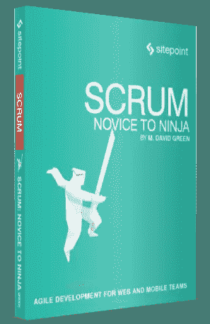
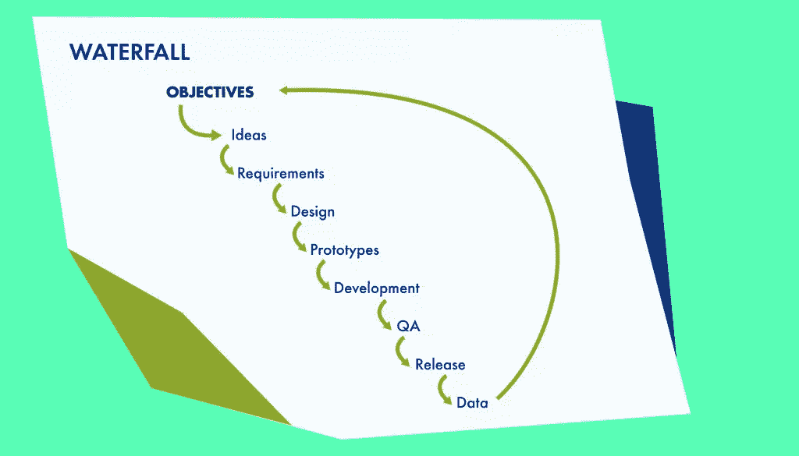
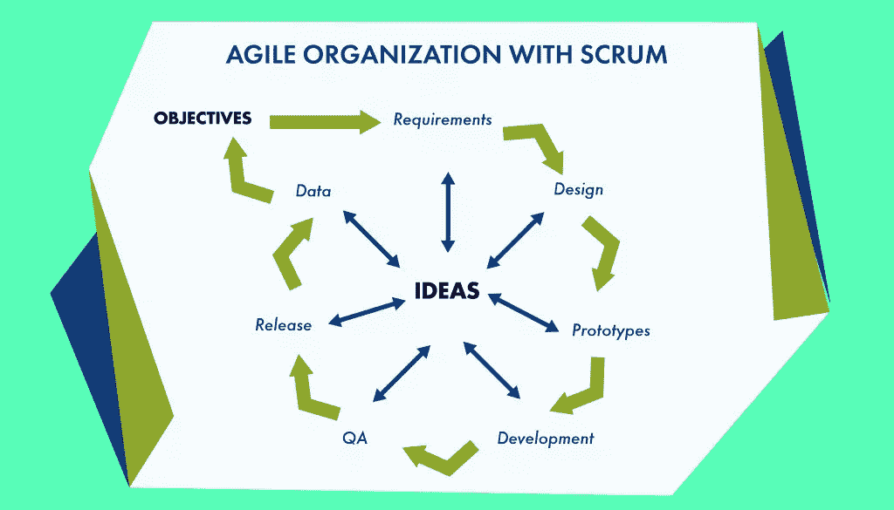
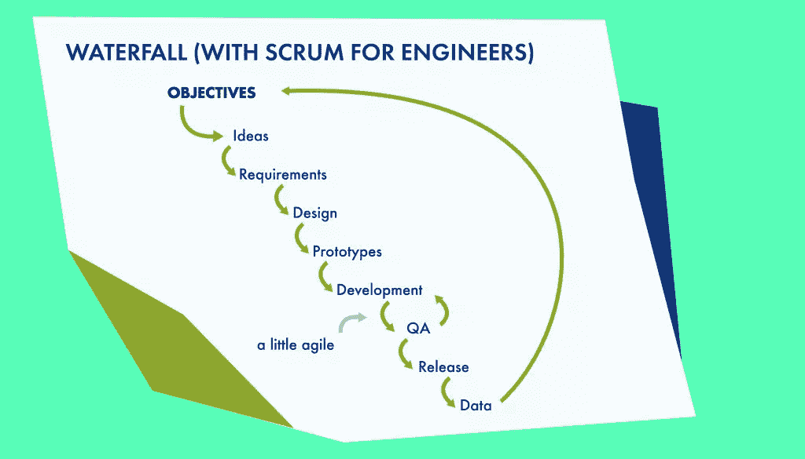

# 通过正确使用 Scrum 来激励你的团队

> 原文：<https://www.sitepoint.com/introducing-scrum/>

*以下是我们最近出版的书 [Scrum:新手到忍者](https://www.sitepoint.com/premium/books/scrum-novice-to-ninja)的一小段摘录，可以免费提供给 [SitePoint Premium 会员](https://www.sitepoint.com/premium/join)。印刷版在世界各地的商店都有出售，或者你可以在这里[订购](http://shop.oreilly.com/product/9780994346919.do)。我们希望你喜欢这个摘录，并发现它很有用。*

## 什么是 Scrum？

如果你拿起这本书来学习如何将 scrum 应用到你的 web 或移动开发团队中，你可能已经熟悉了 scrum 和敏捷这两个术语。也许你从你的公司收到了这本书，或者也许你被指派在你自己的组织中实施敏捷过程。不管是什么原因，从相关术语的清晰、共享的定义开始总是有用的。

Scrum 是管理产品开发组织的几种技术之一，集中在敏捷软件开发的大范畴下。 **敏捷** 方法被设计成支持迭代的、灵活的和可持续的方法来运行产品工程组织。

在各种敏捷技术中，scrum 特别适合开发网站和移动软件等产品的组织类型。专注于开发内聚的、模块化的、可测量的特性，这些特性可以被相对地估计、容易地跟踪，并且可能需要快速适应变化的市场条件，这使得 scrum 特别适合这些类型的项目。

Scrum 鼓励团队在有限的时间内专注于一组明确定义的功能，理解他们可能被要求开发的下一组功能可能是不可预测的，因为市场的变化、客户的反馈或任何数量的因素。Scrum 允许团队开发一种改进的能力，基于他们以前开发的功能所涉及的工作，以相对的方式估计生产一个新功能需要多少努力。scrum 为团队创造了反思过程并定期改进的机会，让每个人的反馈都发挥作用。

### 警告:不要混淆仅仅应用 Scrum 术语和实际使用 Scrum

在非敏捷组织中，一个常见的试图掩盖过程问题的反模式是使用 scrum 术语作为他们瀑布技术和工具之上的标签系统。这可能会造成混乱，甚至会在那些看到这些术语被错误使用的人中间产生负面的联想，并错误地认为他们已经看到了 scrum 的实际应用。

当我们阅读这本书的时候，你会发现更多关于 scrum 是如何运作的。你将被介绍 scrum 的所有方面，包括它的仪式，它的工件，以及它为组织中的人创造的角色。我们将向您介绍一个在 scrum 环境中工作的团队，并向您展示他们最初是如何采用 scrum 的，以及他们是如何适应它的。

在我们到达那里之前，有必要花点时间来定位 scrum 的历史背景。毕竟，scrum 不是组织产品开发的唯一方式。Scrum 出现在 web 开发出现在工程领域的时候，并且随着移动技术成为我们日常生活的一部分而蓬勃发展。如果你考虑 scrum 是如何工作的，它从何而来，以及我们如何应用它，我想你会发现这可能是有原因的。

### 注意:Scrum 的奇怪词汇

scrum 的词汇是独特的，听起来可能有些奇怪。那是故意的。Scrum 使用诸如仪式、工件和故事等术语来表明这些概念不同于其他项目管理方法中可能遇到的相关概念。

## Scrum 的简史

scrum 的最初概念来自日本，1986 年由竹内博孝和野中郁次郎引入，作为新产品开发游戏 的 *的一部分。他们应用了来自团队游戏橄榄球的 scrum 的概念，来描述基于以分层方式前进的跨职能团队组织。*

他们的概念在 1995 年由 Ken Schwaber 和 Jeff Sutherland 基于他们在他们自己的组织中应用这些概念的个人经验的联合报告中被编纂为 Scrum 方法论。这项工作激发了 Schwaber 和 Mike Beedle 在 2001 年写的书《用 Scrum 进行敏捷软件开发》。

当时，最流行的软件开发方法被称为 **瀑布模型** 。在瀑布模型下，产品开发分阶段进行，从需求到设计、实现和发布。直到 20 世纪 90 年代，大多数软件开发都是针对桌面计算机的打包软件交付。这类产品的开发和发布周期很长。虽然瀑布非常适合具有长开发轨迹的产品，但是它不太适合产品需要不断变化以响应变化的条件的情况。

20 世纪 90 年代中后期，出现了涉及电子媒体和互联网的新出版模式。为了支持这些，软件开发组织必须包含更多的灵活性，以适应不断变化的浏览器、紧张的媒体期限和各种具有不同需求的平台。此后不久，在台式电脑上开发的大型单片软件应用程序让位于通过移动设备交付的更小、更灵活的应用程序。发展这些需要不同的方法。

就在市场从桌面软件转向网络和移动软件的时候，敏捷方法被编纂并迅速流行起来，这并不是巧合。

## 比较 Scrum 和瀑布

瀑布开发的缓慢周期在硬件开发的世界中，甚至在游戏中仍然是合适的。这些行业依赖于长期稳定的市场，其中许多决策要么是重复性的，受到外部资源的限制，要么是因为巨大的开发规模和费用而需要提前很长时间做出。

网络和移动技术发展太快，不适合瀑布方法。当你开发完一个问题的解决方案并从用户那里收集反馈时，技术已经发展了，你可能只有很小的机会来利用你的解决方案。

图 1.1。瀑布

在瀑布方法中，关于需要开发什么的想法可能来自客户、高管、市场研究，或者来自做决策和制定预算的人的想象。这些想法被传递给产品经理，他们创建了一个长的产品路线图。他们建立并收集需求，写出经典的产品需求文档，然后将这些需求传递给设计师，以创建线框和模型的原型。这些原型被传递给实现这些想法的工程团队，并生产出最终可以投放市场的产品。在产品发布并交付给客户之前，流程中不会产生任何反馈。

图 1.2。敏捷组织

在一个敏捷的组织中，指导目标和关键绩效指标指导过程，但是团队管理自己来满足这些目标。产品负责人维护整体愿景，并与 scrum master 合作，确保团队中的每个人都清楚目标以及如何衡量目标。设计师和工程师的意见包含在这个过程的每个阶段。当团队准备好工作时，特性被构思并形成故事。没有想法会被固定在一个静态的产品时间线上。

公司雇佣自己的设计师和工程师团队的价值在于，这些人可以将他们的设计思想和当前的技术知识带到桌面上，以利于公司自身的目标。设计师应该评估用户体验，并找出解决真实客户问题的最佳方案，而不是修饰糟糕的想法，让它们变得实用。

让工程师参与构思可以让他们尽早引入最新的技术，因为他们最清楚什么在技术上是可行的。越早将设计师和工程师引入规划过程，开发就越敏捷。

Scrum 允许团队的全部资源在他们能做得最好的时候和地方被应用，并且以可持续和高效的方式一起工作。不是等到整个周期完成后才能将任何数据反馈到系统中，而是在每个阶段都产生想法，并鼓励在每个冲刺阶段结束时浮出水面。团队在过程的每个阶段的全面参与允许这些想法反馈到目标中，并支持组织的愿景。

### 警告:混合 Scrum 和瀑布

图 1.3。瀑布(使用 Scrum 进行工程设计)

虽然一些组织可能声称遵循 scrum，但他们中的许多人实际上遵循一种修改过的瀑布方法，只在开发中使用 scrum 技术。组织的其余部分围绕长期的产品时间表和静态目标来构建自己。虽然这可能是对纯瀑布的改进，因为它允许工程师迭代和改进他们的过程，但它没有充分利用 scrum 的潜力。将 scrum 隔离在开发循环中，而不邀请团队的知识进入计划和市场测试过程，是对资源的浪费，也是对机会的浪费。

在一个瀑布式的组织中混入一点 scrum 通常不是一个好主意，因为它会引起人们对不同方法之间的根本冲突的注意，并引发摩擦。

## 选择 Scrum for Web 和 Mobile 的理由

我们已经介绍了 scrum 是如何工作的，以及为什么它是构建 web 和移动产品开发的有效方式。在这一点上，有必要花点时间回顾一下 scrum 是如何应用于 web 和移动产品开发的。

从根本上说，scrum 提供了一种基于团队的项目工作方法，允许产品开发过程从迭代的自我反思中受益，帮助团队学习如何评估他们自己处理不熟悉任务的能力，公开关于团队效率的度量，鼓励关于功能实现而不是静态规范的对话，并以可持续的方式支持对不断变化的市场条件的快速响应。

当进行 web 和移动开发时，所有这些优势都会产生真正的影响。web 或移动开发中的大多数工作往往对时间非常敏感，需要快速响应市场的变化。无论这意味着新浏览器、新技术还是需要立即交流的新消息，web 和移动团队都必须能够快速响应。

Scrum 提供了一个框架，允许开发人员朝着一个愿景努力，并有机会随着环境的变化而改变方向，而不会感到偏离他们的焦点。

当遵循最佳开发实践时，构建和增强 web 或移动项目所涉及的工作类型往往会分解为可以独立工作的离散部分，其核心基础架构故事支持广泛的独立功能故事。这使得 web 或移动项目的一部分更容易独立开发，并利用同一项目其他部分的共享资源。

Scrum 鼓励团队详细说明新特性的工作，这样就可以并行开发，而不依赖于其他未开发的特性。通过使用故事，并确保每个故事被适当地格式化和评估，团队为一致的和富有成效的开发体验做好了准备。

### 注意:定义了一些 Scrum 术语

当 scrum 使用一个词时，它的意思就是 scrum 选择的意思。但是不像《透过镜子看 T2》中的汉仆·邓普蒂，scrum 依赖于熟悉和容易理解的定义。学习语言是获得新技能的第一步，持续使用语言是团队合作的基础。下面的术语只是其中的一部分，在本书的后面会有更详细的定义，但是浏览一下这些概念可能会有助于你继续阅读。

Agile

一套软件开发实践，旨在帮助工程师一起工作，快速轻松地适应变化。

Artifact

scrum 团队用来促进 scrum 过程的物理或虚拟工具

Blocker

任何阻止工程师继续进行正在进行的任务的事情

Customer

任何参与团队创造产品的人

Engineer/Developer

负责创造和维护产品技术的人

Engineering Organization

公司的一部分，工程师被雇佣来创造和维护产品

Product

工程组织为客户构建或维护的内容

Product backlog

产品的潜在功能或变化的不断发展的列表

Product owner

帮助团队定义产品的人，如果客户不满意，他的工作可能会受到威胁

Retrospective

团队反思他们做得如何以及他们可以做得更好的定期机会

Ritual

作为 scrum 过程的一部分，一群人在固定的时间聚集在一起，有特定的议程，以实现明确定义的结果

Scrum Master

负责维护工件和监督 scrum 仪式的人

Sprint

一个固定的天数，在此期间团队可以一起工作，对产品产生一组一致同意的变更

Sprint backlog

一组有限的、定义良好的故事，团队同意在当前的冲刺阶段合理地完成这些故事

Story

一种清晰一致的方式来分块、措辞和讨论团队可能需要在产品上做的工作

User

将使用该产品的人

Scrum 也足够灵活，可以支持产品负责人的工作方式，他们喜欢分解可以在一周、两周、三周、四周或更长时间内完成的故事。虽然大多数 web 和移动开发团队倾向于将工作分成一周或两周的部分——在 scrum 术语中称为 sprint——但是团队同意的任何事情都应该起作用。只要团队跟踪他们是如何一起工作的，并且他们有机会定期反思他们的时间表，scrum 就可以适应从最简单到最复杂的项目。

### 时间敏感性

Scrum 在每个 sprint 中都提供了机会，通过真实的客户数据来整合设计师、工程师、高管、客户、产品经理和客户的想法。由于 scrum 的循环性质，以及鼓励边走边学的迭代方法，scrum 允许移动和 web 项目快速适应不断变化的技术和不断变化的市场预期。

### 模块化开发

Scrum 支持在模块中开发项目的能力。因为 scrum 是基于从功能的角度来考虑的，所以它非常适合于开发独立的、可互操作的特性，这些特性可以被原子地开发并和谐地一起工作。

例如，网站的新部分可以从共享的样式指南和 CSS 结构继承样式，并且可以从共享的模板继承其功能。构建该部分的工作依赖于那些其他组件保持静态足够长的时间来完成工作。Scrum 提供了支持这一点的稳定性，而不会限制网站其他部分的开发。

与此同时，更新产品的基础设施以支持新功能可能会在过程中的任何时候发生，因此团队必须提前考虑如何安全地进行这些更改，而不中断正在对其他功能进行的工作。

再比如，有时候一个网站的每一个功能所依赖的 API 都需要改变。Scrum 鼓励团队以模块化、可测试的方式管理代码，这样其他正在进行的特性故事就可以继承这些变化，而不会出现不必要的中断。

### 灵活调度

为网络和移动领域的客户提供服务的公司需要能够快速响应变化。然而，工程师需要确信他们正在做的事情不会改变，然后才能开发出新的特性。很难平衡这两个目标。

Scrum 提供了足够长的机会窗口，允许一个 web 或移动特性得到充分开发，同时仍然允许产品在每个冲刺阶段结束时根据市场数据改变方向。

### 反思与改进

scrum 团队不仅仅希望改进产品:他们也希望改进他们自己的过程。随着时间的推移，Scrum 团队在估计他们能做多少工作方面变得更好，并且改进他们的工作方法，以便他们可以是最有生产力的。

通过让团队有机会审视自己的过程，并找出如何最好地协同工作，scrum 最大限度地利用了任何组织的有限资源。

## 总结

这是从 30，000 英尺的角度对 scrum 的一个快速概述。我们简单介绍了 scrum 是如何工作的，以及为什么它对某些类型的产品开发是有效的。我们对比了 scrum 和更传统的软件开发瀑布方法，并讨论了它出现的原因。我们也注意到 scrum 非常适合 web 和移动开发项目。

但是 scrum 不仅仅是一个抽象的概念和一堆不熟悉的术语。Scrum 是一种实用而灵活的产品开发方法，它依赖于真实的人的积极参与。所以在下一章，我们将会见到一些可能在网络或移动开发组织中工作的典型人物。我们将和他们谈谈他们的一些挫折，找出他们希望从 scrum 中得到什么，并询问他们在考虑 scrum 时的顾虑。

当我们阅读这本书时，请记住这些人。我们将再次与他们见面，并在他们学习并开始将 scrum 应用到工作中的过程中跟踪他们。

*喜欢这一章吗？下载整本书(以及我们的整个图书馆！)通过[加入 SitePoint Premium](https://www.sitepoint.com/premium/join)*

## 分享这篇文章