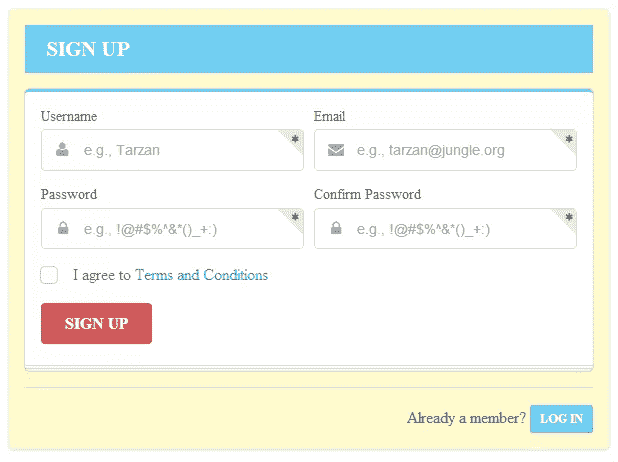

# 简介:语义 UI 组件库

> 原文：<https://www.sitepoint.com/introducing-semantic-ui-component-library/>

正如我们大多数人可能知道的那样，Bootstrap 和 Foundation 是前端开发框架中的领导者。但是历史告诉我们，最终会有更好的东西出现，在这种情况下，可能不会太远。

本文将向您介绍框架领域的一个新候选人，名为[语义 UI](http://semantic-ui.com/) 。

语义 UI 是一个现代化的前端开发框架，由 [LESS](http://lesscss.org/) 和 jQuery 提供支持。它拥有时尚、精致、扁平的设计外观，提供了轻量级的用户体验。

根据语义 UI 网站的说法，该框架的目标是“通过创建一种共享 UI 的语言”来赋予设计者和开发者权力。他们通过为其类和命名约定利用语义、描述性语言来做到这一点。它不像其他框架那样使用缩写，而是以更接近简单英语的方式使用真实的单词。

## 特征

语义用户界面在两个方面是独特的。首先是框架的构建方式。它使用五个描述性类别来定义可重用的 UI 组件。

*   一个 **UI 元素**是一个基本的构建模块。它可以单独出现，也可以整齐划一地成群出现。例如，按钮可以是独立的，也可以放在按钮组中。
*   UI 集合是一组相互依赖的不同种类的元素。例如，web 表单可以有按钮、输入、复选框、图标等等。
*   一个 **UI 视图**代表一个普通的网站内容。例如，提要或评论部分。
*   UI 模块是一个具有基于 JavaScript 的交互式功能的组件。示例包括手风琴、调光器、莫代尔等等。
*   一个 **UI 行为**是一个不能独立存在的组件，而是用来给其他组件注入功能的。例如，表单验证行为为表单组件提供验证功能。

几乎每个组件都有类型、状态和变化。例如，按钮组件的一些类型包括:标准按钮、带图标的按钮、动画按钮，并且按钮可以处于活动、禁用或加载状态。最后，按钮可以有不同的大小和颜色，可以格式化为基本、社交、流动、切换等等。这种模式为组件的外观提供了很大的灵活性。

如您所见，语义 UI 不仅在命名其类方面有意义且结构良好，而且在命名、定义和描述其组件方面也是如此。与 Bootstrap 或 Foundation 中的结构相比，这种结构更具语义性。

语义 UI 的第二个独特之处是它提供了一些其他框架中没有的独有特性和组件。例如，UI 视图组件中的 [Feed](http://semantic-ui.com/views/feed.html) 和 [Comment](http://semantic-ui.com/views/comment.html) 或者 UI 模块中的[工具条](http://semantic-ui.com/modules/sidebar.html)和 [Shape](http://semantic-ui.com/modules/shape.html) 。此外，当与语义 UI 组件交互时，您可以获得实时调试输出。只需打开您的 web 控制台，您就会看到您的组件正在准确地进行通信。

语义 UI 的另一个优势是它使用最小化和中性的样式，允许您自定义。它包括了重要和有用的东西，同时省略了你可能永远不会用到的附加功能。此外，该框架的组件是可移植的和独立的，因此您可以只获取和使用那些您需要的组件。

该框架使用`em`和`rem`单元作为其元素，使其完全响应和适应任何规模。你只需要改变基本字体，所有其他元素都会相应地调整。

最后，语义 UI 有很好的文档记录，网站提供了许多不同组件的例子。此外，它还有一个风格指南，提供了如何编写代码的技巧和方向。所有这些使得学习框架成为一种轻松的体验。

要了解语义 UI 如何与其他项目和工具集成，请查看[集成页面](https://github.com/Semantic-Org/Semantic-UI/wiki/Integration)。

想知道用语义 UI 构建的网站是什么样子，你可以访问 [Quirky](http://www.quirky.com) 。

好的。到目前为止，一切顺利。但是我认为，如果我们不动手，语义 UI 的概述就不会完整。所以让我们现在就品尝语义 UI 的甜头吧。我将向您展示如何使用各种语义 UI 组件创建出色的登录/注册表单。

## 如何创建带有语义 UI 的登录/注册表单

我们将创建一个表单，根据用户是想“登录”还是“注册”来切换视图。以下是这些视图的外观:




首先[下载语义 UI](http://semantic-ui.com/build/semantic.zip) ，打开压缩文件，解压名为“打包”的文件夹。将重命名为**语义 UI 表单示例**(或者可以用来容易识别它的其他名称)。

要查看我们表单示例的工作演示，只需[下载完整的 form.html 文件](https://uploads.sitepoint.com/wp-content/uploads/2014/02/form-semantic-ui-tutorial.zip)，并将其放入**语义 UI 表单示例**文件夹。在您的浏览器中打开`form.html`文件，并使用该表单来理解它。现在我将向您展示如何通过显示和解释相关代码来重新创建表单。

首先，将文件重命名为`complete_form.html`，并创建一个名为`form.html`的空文件。打开它并添加以下 HTML:

```
<!DOCTYPE HTML>
<html>
<head>
  <meta charset="utf-8" />
  <title>Semantic UI Sign In/Sign Up Form</title>

  <link href="css/semantic.css" rel="stylesheet" type="text/css" />

  <style type="text/css">  </style>

</head>
<body>

  <!-- content will go here -->

  <script src="https://code.jquery.com/jquery-1.10.2.min.js"></script>
  <script src="javascript/semantic.js" type="text/javascript"></script>

  <script type="text/javascript">  </script>      
</body>
</html>
```

这是我们的起始模板。它链接到`semantic.css`和`semantic.js`文件，并添加对 jQuery 库的引用。它还有我们将要添加的 JavaScript 和 CSS 的`script`和`style`标签。我在内部包含 JavaScript 和 CSS 只是为了学习，因为这样更容易，你不需要在多个文件之间跳转。但是在现实世界的项目中，使用外部文件总是更好。

在我们开始之前，让我们考虑一下语义 UI 是如何工作的。所有组件定义都以一个类`ui`开头，后跟组件名。例如，要添加一个**按钮**元素，你只需要给它一个类`ui button`。要添加状态和/或变化，只需插入所需的类。例如，要创建一个在悬停时颜色变为蓝色的按钮，添加`hover`状态类和`blue`变体类:`ui hover blue button`。

让我们回到我们的状态。我不打算解释每个类是做什么的，因为这些类或多或少是自我描述的，你可以在文档中看到更多关于它们的含义。

我们需要做的第一件事是添加一个包含表单的 **Segment** 元素。我们通过添加一个带有类`ui raised segment signin`的`div`标签来做到这一点。对于表单的标题，我们使用一个带有类`ui inverted blue block header`的`h3`标签。接下来，我们创建一个两列网格，在两列之间有一个垂直分隔线。在第一列中，我们添加了一个带有类`ui blue stacked segment`的`div`，它将保存我们的表单元素。在底部，我们放置了另一个**分隔符**元素，以及一个带有`footer`类的`div`。

```
<div class="ui raised segment signin">
  <h3 class="ui inverted blue block header"> SIGN IN </h3>
  <div class="ui two column grid basic segment">
    <div class="column">
      <div class="ui blue stacked segment">
           <!-- form here -->
      </div>
    </div>
    <div class="ui vertical divider"> OR </div>
    <div class="center aligned column">
      <!-- Facebook button here -->
    </div>
  </div>
  <div class="ui divider"></div>
  <div class="footer">
    <!-- text plus button here -->
  </div>
</div>
```

现在我们需要添加一些样式。将下面的代码放入当前空的`style`标签中。

```
body, .ui.vertical.divider {
  color: #696969;
}

.ui.vertical.divider {
  margin: 0 4px;
}

.ui.raised.segment {
  background-color: #fffacd;
  width: 600px;
  margin-top: 0;
  position: fixed;
  left: 10px;
  top: 10px;
}
```

接下来，在第一列(HTML 注释为“form here”)中，我们添加表单代码。为了创建表单，我们添加了一个带有类`ui form`的`div`标签。然后我们再添加两个`div`标签，每个标签带有一个`field`类，另一个标签带有一个`inline field`类，最后一个标签带有一个`ui red submit button`类。前两个字段用于*用户名*和*密码*。在第三个格式为`inline`的`div`中，我们放置了一个复选框。

```
<div class="ui form">
  <div class="field">
    <label> Username </label>
    <div class="ui left labeled icon input">
      <input type="text">
      <i class="user icon"></i>
    </div>
  </div>
  <div class="field">
    <label> Password </label>
    <div class="ui left labeled icon input">
      <input type="password">
      <i class="lock icon"></i>
    </div>
  </div>
  <div class="inline field">
    <div class="ui checkbox">
      <input id="remember" type="checkbox">
      <label for="remember"> Remember me </label>
    </div>
  </div>
  <div class="ui red submit button"> Sign In </div>
</div>
```

在包含类`center aligned column`的第二列中(HTML 注释显示“此处为脸书按钮”)，我们使用了一个`h4`标题并添加了语义 UI 的脸书社交按钮:

```
<h4 class="ui header"> Sign in with: </h4>
<div class="ui facebook button">
  <i class="facebook icon"></i>
  Facebook
</div>
```

我们通过添加一些文本和一个动画按钮来完成页脚，该按钮将我们的表单从登录切换到注册。在 HTML 注释为“text plus button here”的地方添加了以下 HTML:

```
<div class="text"> Not a member? </div>
<div class="ui vertical animated blue mini button signup">
  <div class="visible content"> Join Us </div>
  <div class="hidden content">
    <i class="users icon"></i>
  </div>
</div>
```

我们还需要添加一些样式来正确呈现我们的页脚。将以下 CSS 添加到我们的`style`标记中现有 CSS 的下方:

```
.footer {
  text-align: right;
}

.text {
  display: inline;
}
```

现在第一面(“报名”)准备好了。让我们创建第二个。我们从下面的代码开始，它类似于我们已经讨论过的代码。这个 HTML 被添加到我们现有的所有 HTML 的下面:

```
<div class="ui raised segment signup inactive">
  <h3 class="ui inverted blue block header"> SIGN UP </h3>
  <div class="ui blue stacked segment">
       <!-- form here -->
  </div>
  <div class="ui divider"></div>
  <div class="footer">
    <div class="text"> Already a member? </div>
    <div class="ui vertical animated blue mini button signin">
      <div class="visible content"> Log In </div>
      <div class="hidden content">
        <i class="sign in icon"></i>
      </div>
    </div>
  </div>
</div>
```

接下来，我们在刚刚添加的 HTML 中的`segment`元素内添加表单代码(HTML 注释显示“form here”)。具有类`ui error message`的`div`被放在表单的末尾，因为我们稍后将添加的**表单验证**行为要求它向用户显示错误。

```
<div class="ui form">
  <div class="two fields">
    <div class="field">
      <!-- Username here -->              
    </div>
    <div class="field">
      <!-- Email here -->
    </div>
  </div>
  <div class="two fields">
    <div class="field">
      <!-- Password here -->        
    </div>
    <div class="field">
      <!-- Confirm Password here -->
    </div>
  </div>
  <div class="inline field">
    <!-- checkbox here -->
  </div>
  <div class="ui red submit button"> Sign Up </div>
  <div class="ui error message"></div>
</div>
```

注意，上面 HTML 中的每个`field`元素都有一个注释，指示我们将在每个元素中添加表单的哪个部分。让我们现在做那件事。

以下是*用户名*字段的代码:

```
<label> Username </label>
<div class="ui left labeled icon input">
  <input id="username" placeholder="e.g., Tarzan" type="text">
  <i class="user icon"></i>
  <div class="ui corner label">
    <i class="asterisk icon"></i>
  </div>
</div>
```

以下是*电子邮件*字段的代码:

```
<label> Email </label>
<div class="ui left labeled icon input">
  <input id="email" placeholder="e.g., tarzan@jungle.org" type="text">
  <i class="mail icon"></i>
  <div class="ui corner label">
    <i class="asterisk icon"></i>
  </div>
</div>
```

以下是*密码*字段的代码:

```
<label> Password </label>
<div class="ui left labeled icon input">
  <input id="password" placeholder="e.g., !@#$%^&amp;*()_+:)" type="password">
  <i class="lock icon"></i>
  <div class="ui corner label">
    <i class="asterisk icon"></i>
  </div>
</div>
```

以下是*确认密码*字段的代码:

```
<label> Confirm Password </label>
<div class="ui left labeled icon input">
  <input id="confirm-password" placeholder="e.g., !@#$%^&amp;*()_+:)" type="password">
  <i class="lock icon"></i>
  <div class="ui corner label">
    <i class="asterisk icon"></i>
  </div>
</div>
```

复选框的代码:

```
<div class="ui checkbox">
  <input id="terms" type="checkbox">
  <label for="terms"> I agree to the <a href="#"> Terms and Conditions </a></label>
</div>
```

我们还为链接添加了样式:

```
a {
  text-decoration: none;
  color: #1E90FF;
}
```

现在表单的两个部分都准备好了，我们需要添加从表单的一边切换到另一边的代码。将以下代码放入空的`script`标签中。

```
$( document ).ready(function() {

  // Hide Sign Up side on initialization
  $( '.inactive' ).hide();

  $( '.mini.button.signup' ).click(function() {

    // Hide Sign In and show Sign Up side with slide down effect
    $( '.ui.segment.signin' )
      .hide()
      .end()
    .find( '.ui.segment.signup' )
      .slideDown();

  });

  $( '.mini.button.signin' ).click(function() {

    // Hide Sign Up and show Sign In side with slide down effect
    $( '.ui.segment.signup' )
      .hide()
      .end()
    .find( '.ui.segment.signin' )
      .slideDown();

  });
});
```

我们的表单看起来很好——但是如果用户输入无效的值呢？我们需要添加验证。我们通过在我们的`script`标签中添加下面的代码来做到这一点，在我们刚刚添加的代码之后:

```
$( '.ui.form' )
  .form({
    username: {
      identifier : 'username',
      rules: [
        {  
          type   : 'empty',
          prompt : 'Please enter a username'
        }
      ]
    },
    email: {
      identifier : 'email',
      rules: [
        {
          type   : 'email',
          prompt : 'Please enter a valid email addres'
        }
      ]
    },
    password: {
      identifier : 'password',
      rules: [
        {
          type   : 'empty',
          prompt : 'Please enter a password'
        },
        {
          type   : 'length[6]',
          prompt : 'Your password must be at least 6 characters'
        }
      ]
    },
    passwordConfirm: {
      identifier : 'confirm-password',
      rules: [
        {
          type   : 'empty',
          prompt : 'Please confirm your password'
        },
        {
          type   : 'match[password]',
          prompt : 'Password doesn\'t match'
        }
      ]
    },
    terms: {
      identifier : 'terms',
      rules: [
        {
          type   : 'checked',
          prompt : 'You must agree to the terms and conditions'
        }
      ]
    }
});
```

你可以在文档中阅读更多关于上述代码如何工作的信息。

干得好！这是一个相当简单的例子，我们仅仅触及了语义 UI 功能的表面。

## 结论

正如您所看到的，语义 UI 是前端开发框架的一个新的、新鲜的、在某些方面是独一无二的补充。从我们在这里所考虑的来看，虽然在撰写本文时，它只有几个月的历史，但你可以看到它非常有前途，值得列入今年许多开发者的观察名单。

同样，你可以[在这里](https://uploads.sitepoint.com/wp-content/uploads/2014/02/form-semantic-ui-tutorial.zip)下载完整的教程文件，记得在解压完整的语义 UI 库时将它添加到“打包”文件夹中。

## 分享这篇文章