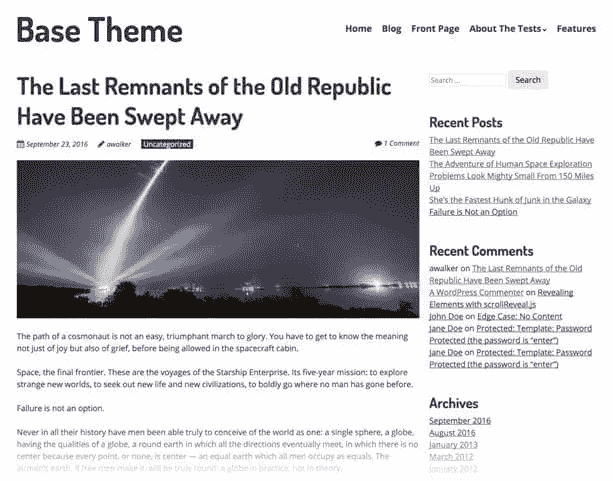

# 介绍 WordPress 的 SitePoint 基本主题

> 原文：<https://www.sitepoint.com/introducing-sitepoint-base-theme-for-wordpress/>

有成千上万的 WordPress 主题可供选择，用户和开发者都有无穷无尽的选择。问题是，虽然它们中的大多数在前端看起来很好，但它们臃肿且缺乏质量——对于任何 WordPress 项目中最重要的元素来说都不理想。

如果你想了解更多关于自定义主题开发的知识，请查看 SitePoint 高级课程 [WordPress 主题开发](https://www.sitepoint.com/premium/courses/wordpress-theme-development-2931)！

如你所知，SitePoint 是一个让开发者分享他们对构建不可思议的互联网事物的热情的中心。SitePoint 也在积极开发自己的产品，我很兴奋地分享这个消息**我们正在开发一个新的入门主题，叫做 SitePoint Base Theme** 。

虽然只有 0.1 版本，但它已经成为我心目中完美的入门主题。它小巧、干净、简单、轻便且反应灵敏。

让我们快速浏览一下主要功能…

**100%免费:开源 GPL 2.0**

本着 WordPress.org 项目的真正精神，SitePoint 基本主题是开源和免费的。

**高性能**

这是我合作过的(如果不是*)最快的基础主题之一。它是难以置信的轻量级和最小化——这正是你想要的入门主题。它目前在 Pingdom 页面速度测试中达到了 98/100。*

 ***代码质量**

SitePoint 基本主题的核心是代码质量，目前在 10，796 次测试中 100%通过了主题检查 QA 测试。坚持最新的 WordPress 编码标准和最佳实践是 SitePoint Base 主题的核心，帮助用户和开发者让他们的 WordPress 项目经得起未来考验。

**移动优化**

随着谷歌最近宣布他们将把他们的索引从桌面转移到移动，一个移动优化的网站变得更加重要。SitePoint Base Theme 已经以移动为前沿构建，Google 移动测试分数为 100/100。

**SEO 友好**

糟糕的 WordPress 主题会扰乱你的 SEO，甚至最漂亮的主题也会成为受害者。SitePoint 基本主题确保你所有的标记都在正确的位置，让搜索引擎满意。

**WooCommerce 就绪**

随着 WooCommerce 作为电子商务网站的默认选择越来越受欢迎，我们很高兴地说 SitePoint Base Theme 是 WooCommerce 现成的。

**页面生成器兼容**

SitePoint Base Theme 可以很好地与所有主要的页面构建器兼容，包括 Divi Builder、Beaver Builder、Visual Composer、SiteOrigin 页面构建器和 Elementor 页面构建器。

**亲自尝试一下**

这只是冰山一角。我想还有很多其他的特性你会喜欢的，所以我鼓励你继续探索。

我们将在未来几周更详细地介绍 SitePoint 基础主题，但我们渴望得到反馈。你可以打 sitepoint.com 的克里斯·伯吉斯联系我。* 

## *分享这篇文章*