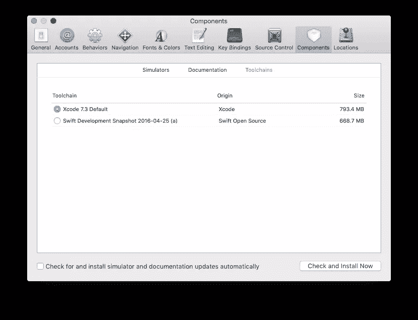

# 使用 Swift 软件包管理器进行依赖性管理

> 原文：<https://www.sitepoint.com/introducing-the-swift-package-manager/>

Swift 成为成熟的跨平台语言的旅程还在继续，因为它的贡献者们都在关注版本 3 的发布。任何想要长期存在的语言都需要一种添加功能的方式，这种方式不需要核心开发人员添加每个请求。这通常以包或依赖关系管理的形式出现，Swift 包管理器 (SPM)将是 Swift 3 增加的众多功能之一。

但是一些没有正式发布的东西从来没有阻止好奇的开发者在过去进行实验。在本文中，我将介绍 SPM，向您展示如何安装它和现有的软件包，以及如何创建自己的软件包。

**注意**:您应该能够在 OS X 或 Linux 平台上遵循我将介绍的步骤。

## 与 Swift 软件包管理器一起生活在边缘

SPM 不是当前 Swift 官方版本的一部分，您需要安装 V3 的主干开发快照才能使用它。这并不太难，你可以在这里找到说明[。](https://swift.org/download/#snapshots)

由于安装此快照可能会中断您的生产应用程序开发设置，我建议您安装 [swiftenv](https://github.com/kylef/swiftenv) ，它可以让您在已安装的 Swift 版本之间切换，对于试验 Swift 版本非常有用。一旦您安装了 swiftenv 并激活了主干开发版本，请运行以下命令检查您是否有软件包管理器:

```
swift build --version 
```

你将有希望看到类似`Apple Swift Package Manager 0.1`的东西。

如果您想使用 XCode，它会为您管理不同的 Swift 版本。打开 *XCode - > Preferences* ，在*组件*部分下设置*工具链*。



**注** : Swift 正在快速发展，事物总是在变化，打破项目。对于本教程，我使用了 2 月 8 日的快照以获得更好的兼容性。现在你可以明白为什么我提到了如何切换版本，并且在版本 3 之前你会经常这么做。

## 使用现有包

许多现有的 Swift 软件包是可用的，但目前没有像 NPM 这样的中央列表服务，所以找到它们可能很难。一个选择是 IBM Swift 包目录，但是它包含了 CocoaPods、Carthage 和 Swift 包的混合。我希望在未来的某个时候会有一份“官方”名单。

要将一个现有的包作为一个依赖项添加到一个项目中，创建一个名为 *Package.swift* 的文件，并添加以下内容:

```
import PackageDescription

let package = Package(
    name: "SitePointSPM",
    dependencies: []
) 
```

这是你设置一个`name`的包文件的基本结构，它是一个包本身和一个空数组。要添加依赖项，请将`dependencies[]`更改为:

```
...
dependencies: [
  .Package(url: "https://github.com/kylef/Curassow.git", majorVersion: 0, minor: 4),
]
... 
```

这使用[语义版本](http://semver.org/)从具有指定版本的 url(通常是 github)下载依赖项。

创建一个 *Sources* 文件夹，在其中创建 *Main.swift* 。添加以下代码:

```
import Curassow
import Inquiline

serve { request in
  return Response(.Ok, contentType: "text/plain", body: "Hello World")
} 
```

这段代码使用 [Curassow](https://github.com/kylef/Curassow) 和 [Inquiline](https://github.com/nestproject/Inquiline) 包来配置和启动一个基本的 http 服务器。

执行`swift build --configuration release`来运行这个简单的应用程序。请注意，当您首次构建时，Swift 构建流程将下载您的包文件中声明的依赖项，以及它声明的依赖项。

## 创建自己的包

您可以像构建“普通”应用程序一样构建 Swift 包。但是一个包通常包含位于 *Sources* 目录中的源文件。Apple 提供的[示例应用程序是了解其潜力的一个很好的例子。](https://swift.org/package-manager/#example-usage)

[在本例](https://github.com/apple/example-package-playingcard/blob/master/Sources/PlayingCard.swift)中，PlayingCard 包定义了一个`PlayingCard`。然后 DeckofPlayingCards 包[导入](https://github.com/apple/example-package-deckofplayingcards/blob/master/Package.swift)playing cards 包，并使用它的方法和对象创建一个随机洗牌的`PlayingCard`的`Deck`

## 这里是乐于助人的龙

在此介绍之后，您可能会遇到安装和使用 Swift 软件包管理器的问题。这表明它肯定还没有准备好投入生产应用。但是，使用和创建软件包很简单，无论您是决定等待稳定的 Swift 3，还是在每次出现问题时立即更新代码，Swift package manager 都是在未来 12 个月内使 Swift 成为真正的全栈语言的另一个难题。

你有什么想法？

## 分享这篇文章