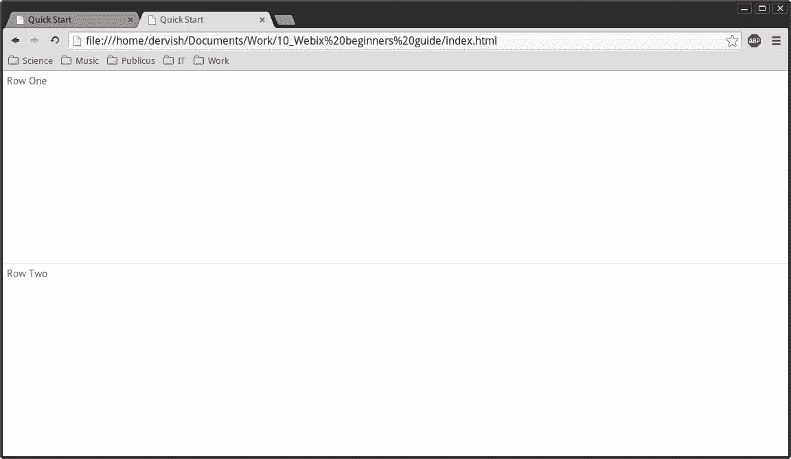
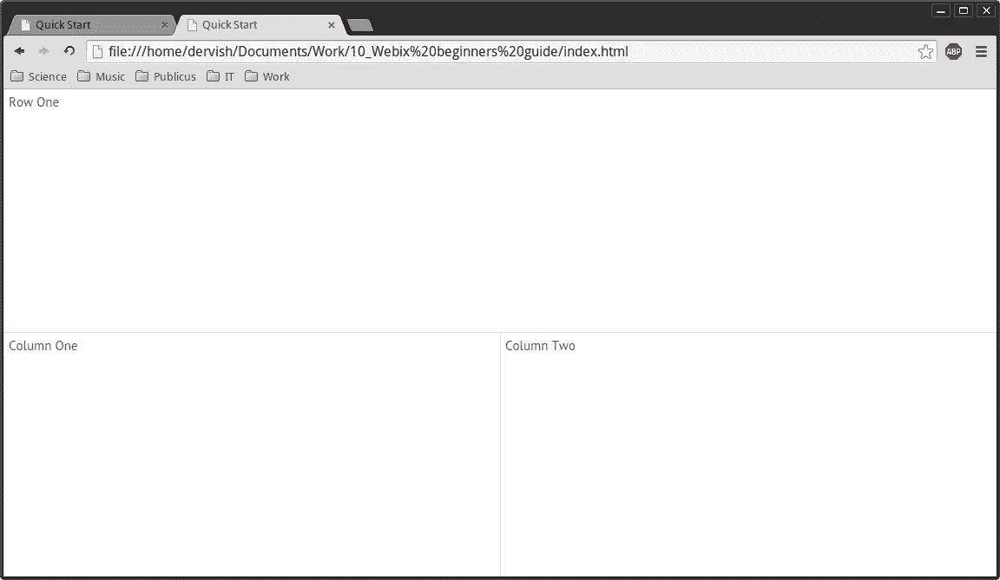
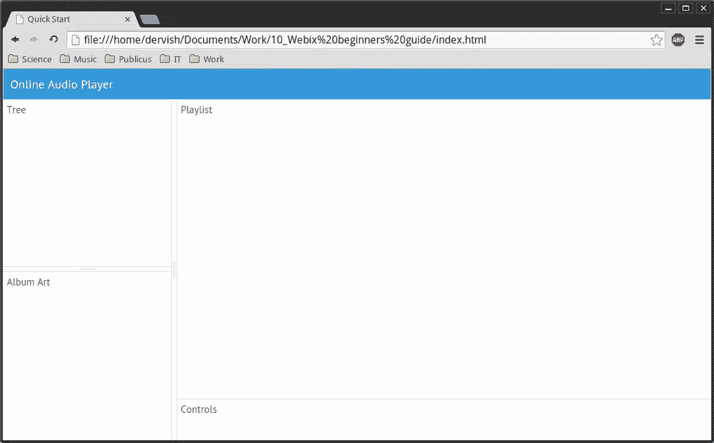
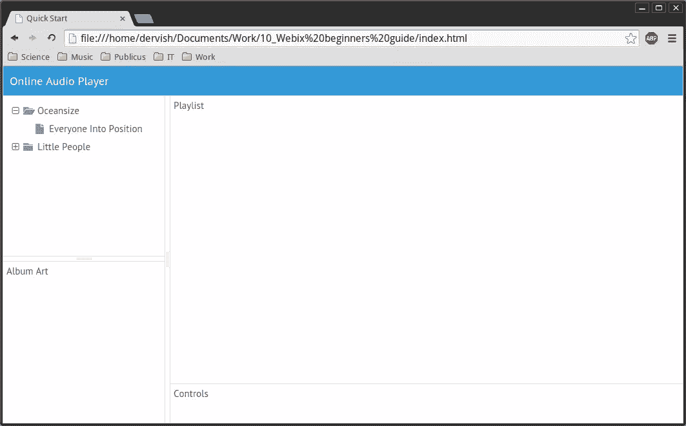
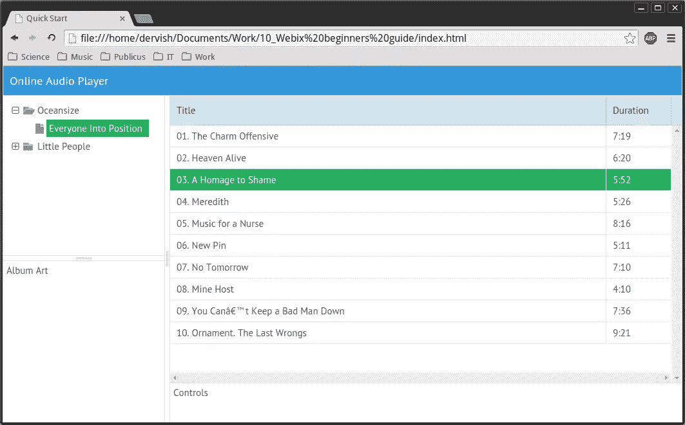
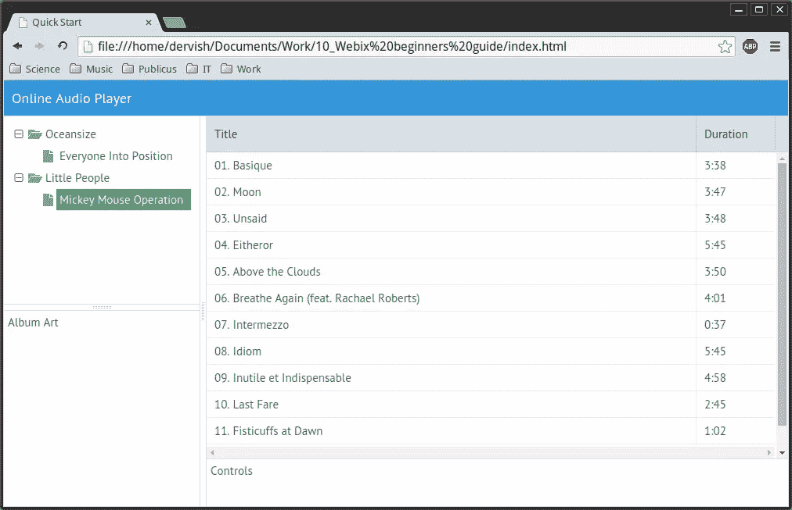
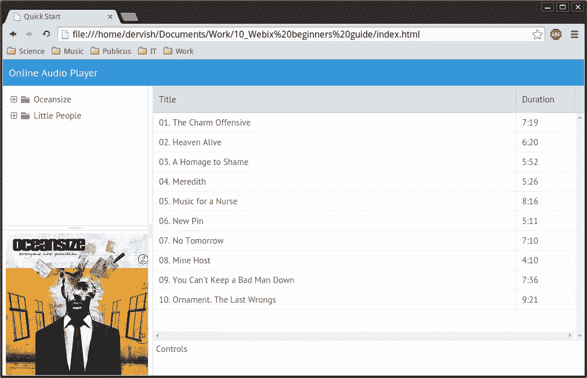
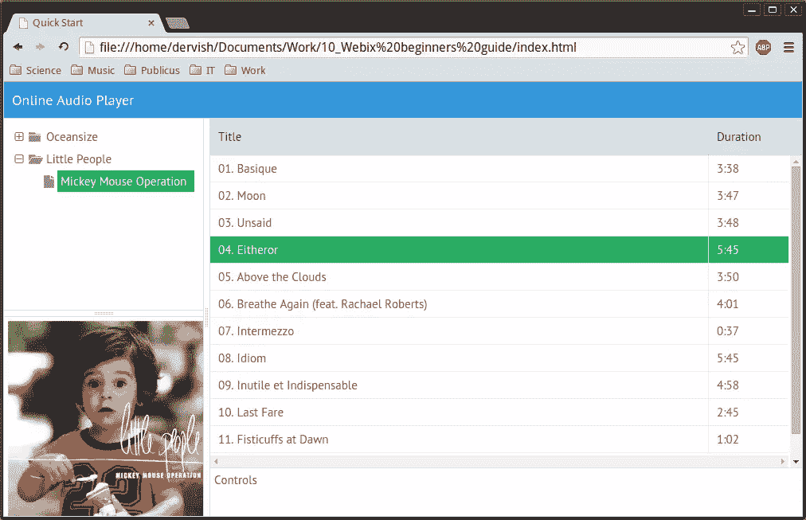
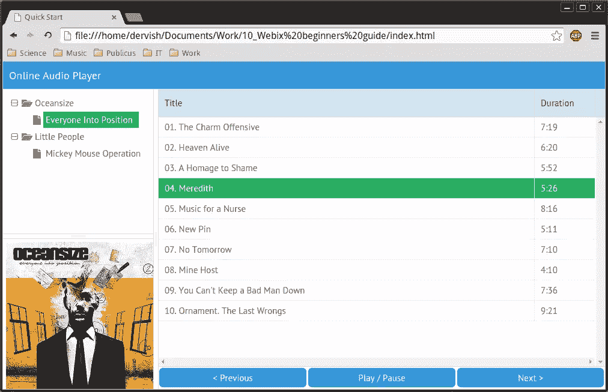
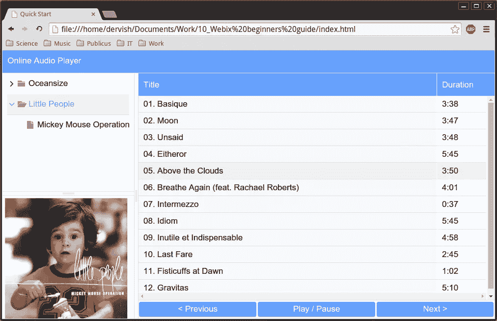

# Webix 框架简介

> 原文：<https://www.sitepoint.com/introducing-webix-framework/>

现在有很多框架，每个都有独特的东西。我们有 AngularJS、Ember 和 Aurelia.io。在 SitePoint 上，我们已经在许多场合介绍过这些框架:[用 Aurelia 创建下一代 JavaScript 应用](https://www.sitepoint.com/creating-next-generation-javascript-application-aurelia/) , [用 AngularJS 构建 Twitter 应用](https://www.sitepoint.com/building-twitter-app-using-angular/),[用 Torii 为 Ember.js 应用添加 Twitter 认证](https://www.sitepoint.com/twitter-authentication-ember-js-torii/)。

在本文中，我想介绍一下 [Webix](http://webix.com/) 框架。为了展示它是如何工作的，我将指导你创建一个[在线音频播放器模型](http://derrvish.github.io/webix-demo-player/)。请记住，这只是一个模型，所以没有播放。(不好意思，也许我会在后面的一篇文章里做。)你可以在[GitHub 页面](https://github.com/sitepoint-editors/webix-demo-player)查看源代码和演示。

## Webix 简介

Webix 是一个 JavaScript 和 HTML5 框架，用于开发具有响应用户界面的跨平台数据丰富的 web 应用程序。该库易学、快速、轻量。与 [Backbone.js](http://backbonejs.org/) 、 [Angular.js](https://angularjs.org/) 和 [jQuery](http://jquery.com/) 的集成可能会非常方便。例如，您可以使用 jQuery 方法和实用函数来创建 Webix 应用程序。我个人最喜欢的特点就是它的简洁。

## 开发项目

现在你知道 Webix 是什么了，让我们开始开发我们的项目。

### 启动发动机

在你下载了图书馆之后，创建一个`index.html`页面。在其中，您应该包括 CSS 和 JavaScript 文件:

```
<link rel="stylesheet" href="codebase/webix.css" /> 
<script src="codebase/webix.js"></script>
```

或者，您可以使用 Webix CDN 包含它们:

```
<link rel="stylesheet" href="//cdn.webix.com/edge/webix.css" />
<script src="//cdn.webix.com/edge/webix.js"></script>
```

我的建议是包含完整的库。“为什么？”你可能会问。原因之一是皮肤收集。我将在本文后面讨论这个主题以及如何使用皮肤。

但是现在，让我们开始初始化。您应该将所有代码放在`webix.ui()`构造函数中。如果您想确保您的应用程序将在页面完全加载后执行，请使用`webix.ready(function() { ... }`。因此，您的代码应该看起来像这样:

```
webix.ready(function(){
    webix.ui({
        /* your code */
    });
});
```

到目前为止，一切顺利。让我们现在创建我们的布局。而且也没有必要去搞乱 HTML 或者 CSS。我保证。

### 行和列:创建布局

Webix 提供了两个名为`rows`和`cols`的属性，可以帮助您创建任何想要的布局:

```
webix.ui({
    rows: [
        {template: "Row One"},
        {template: "Row Two"}
    ]
});
```

这是结果:



用`template:"Row One"`我们创建了一个简单的容器。您可以在其中放置任何 HTML 内容。您还可以使用嵌套容器来制作复杂的东西:

```
webix.ui({
    rows: [
        {template:"Row One"},
        {cols:[
            {template:"Column One"}, 
            {template:"Column Two"} 
        ]}  
    ]
});
```

结果如下所示:



通过组合嵌套的行和列，您可以创建您需要的布局。这是我的演示应用程序代码:

```
webix.ui({
    rows: [
        {type:"header", template:"Online Audio Player"},
        {cols: [
            {rows: [
                {template:"Tree"},
                {view:"resizer"},
                {template:"Album Art", width: 250, height: 250}
            ]},
            {view: "resizer"},
            {rows: [
                {template:"Playlist"},
                {template:"Controls", height: 60}
            ]}	
         ]
        }
    ]
});
```

如你所见，这里有新的东西:`type:"header"`。它把你的容器变成一个标题。我还使用了`view: resizer`来调整我的“专辑封面”和“播放列表”字段的大小。特别是，我们使用`view`属性来创建一个 UI 组件。

下图显示了迄今为止取得的成果:



### 树和表:在数据数组中导航

现在让我们给它注入一些活力。

#### 树小部件

我们将使用[树小部件](http://docs.webix.com/datatree__index.html)来处理我们的记录集合。这里是 [data.js 文件](https://github.com/sitepoint-editors/webix-demo-player/blob/master/data.js)，它包含了我们需要的所有数据。它定义了几个数组，所以这里没什么不寻常的。在我们继续之前，不要忘记将它包含在您的 HTML 文件中。

现在让我们在屏幕上呈现这些数据。为此，用实际的树代码替换`template: "Tree"`:

```
view: "tree",
id: "myTree",
data: recordsData,
select:true
```

这段代码构建了一个 ID 为`myTree`的树。它使用来自`data.js`文件的`recordsData`数组，然后使这个树可选。

让我们来看看:



#### 数据表小部件

如果你想创建一个数据列表，数据表窗口小部件很有用。比如…播放列表，对！

要创建我们的播放列表，我们应该将`template: "Playlist"`替换为:

```
view: "datatable",
id: "myList",
autoConfig: true,
data: oceanData
```

这段代码创建了一个带有`myList` ID 的数据表。然后它配置数据表，并根据来自`data.js`的`gridColumns`数组在其中创建列。最后一步，它使用`oceanData`数组作为数据源。

下面您可以看到我们的应用程序的当前状态:



看起来很好，这是排序！但是我们的树和播放列表是相互分离的。让我们把它们结合起来。

#### 树+数据表=数据浏览器

下面是我如何让我的树和播放列表一起工作的:

```
var selected = oceanData;
webix.ui({
    /* ... */
    {view:"tree", id:"myTree", data:recordsData , select: oceanData, on: {
        onSelectChange: function(){
            selected = $$("myTree").getSelectedId();
            if (isNaN(selected)) {
                $$("myList").clearAll();
                $$("myList").define("data", selected);
                $$("myList").refresh();
            }
        }
        }
    },
    /*...*/
    {view:"datatable", id:"myList", autoConfig:true, data:selected}
```

这是什么？`selected`变量包含默认相册值。DataTable 小部件现在使用它作为数据源。注意树小部件代码是如何扩展的。现在它包含了事件处理程序:

```
on: {
    onSelectChange: function() {
    }
}
```

该功能将在选择新的树项目后运行。在我们的例子中，`selected = $$("myTree").getSelectedId();`将当前选择的`id`分配给`selected`变量。如果我们选择一个文件夹，它将是一个数字；如果我们选择一个相册，它将是一个数组名。

因为我们不想使用文件夹数据，所以我们应该测试返回值:

```
if (isNaN(selected))
```

不是数字？好吧。让我们用三个简单的步骤来渲染它:

```
$$("myList").clearAll();
$$("myList").define("data", selected);
$$("myList").refresh();
```

首先，我们需要通过执行`clearAll()`方法来清除列表。然后使用`define()`方法用新的`selected`值初始化它。`"data"`是我们想要改变的属性，`selected`是它的新值。最后，我们调用`refresh()`。这是结果:



现在，我们可以选择任何我们想要的树元素，我们的播放列表内容将会改变。

### 图片和按钮。去观察和控制

让我们定义默认的覆盖值:

```
var coverPath = "imgs/oceanData.jpg";
```

我们希望“相册艺术”字段每次都刷新，所以我们选择一个新的树项目。为此，我们应该将以下代码粘贴到上面给出的事件处理程序中:

```
on: {
	onSelectChange: function(){
		/*...*/
		coverPath = "imgs/" + selected + ".jpg";
		$$("myCover").define("data", { src: coverPath });
	}	
}
```

封面的图像名称等于其专辑`id`值。这就是为什么我们可以再次使用`selected`变量。然后我们应用`define()`方法来刷新`myCover`容器。

现在让我们向用户显示正确的专辑封面。为此，请更换

```
template:"Album Art", width: 250, height: 250
```

使用:

```
width: 250, height: 250, id:"myCover", data: {src: coverPath},
    template: function (obj) {
        return ''
    }
```

属性定义了我们容器的内容。`src`包含图像路径。在我们的例子中是`coverPath`。当`onSelectChange`事件触发时，路径的值会改变。`template`函数将生成正确的 HTML 代码。

现在让我们来看看“专辑封面”是如何工作的。默认视图是:



选择了一个新相册:



现在，最好的部分:按钮！要执行此步骤，请更换

```
template:"Controls", height: 60
```

使用:

```
cols: [
   {gravity: 3 },
   {view:"button", value:"< Previous"},
   {view:"button", value:"Play / Pause"},
   {view:"button", value:"Next >"}
]
```

这段代码将创建三列，每列包含一个按钮。`gravity`参数为公共父容器中的元素设置相对大小比例。

这是我们的播放器带按钮时的样子:



### 飞行中的皮肤变化

还记得我告诉你的关于获得完整的图书馆而不是使用 CDN 服务吗？里面可以找到一堆皮！改变皮肤只需要一行代码:

```
<link rel="stylesheet" href="codebase/skins/touch.css" />
```

获得这个结果:



## 结论

如您所见，用 Webix 创建一个好看的响应性 web 应用程序非常简单。语法很直观，文档也写得很好。[演示](http://webix.com/demos/ "Webix demos")也有。最后一点，这个 [Webix 代码片段 playground](http://www.webix.com/snippet/) 将帮助你直接投入到行动中。尽情享受吧！

## 分享这篇文章