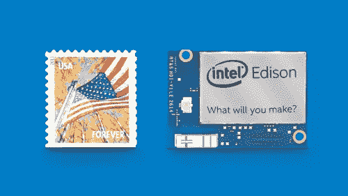
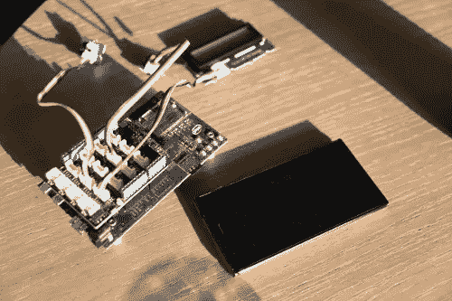
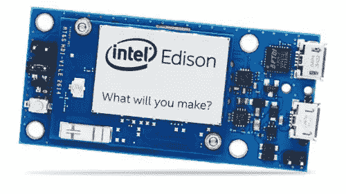

# 面向物联网开发人员的英特尔 Edison 简介

> 原文：<https://www.sitepoint.com/introduction-intel-edison-iot-developers/>

虽然移动设备在每次型号更新时都变得越来越大，但也有新一波越来越小的可穿戴设备进入市场。过去几年，随着 Arduino 引领硬件原型市场，创客运动不断壮大。去年，英特尔推出了一款对制造商很有吸引力的设备，也为物联网和可穿戴产品做好了准备，这就是英特尔爱迪生。

Edison 是小型计算模块，能够运行完整的 Linux 发行版，旨在支持下一代可穿戴设备和物联网(IoT)设备，其中尺寸和功耗是需要考虑的重要因素。我们来看看这个平台。我将描述主要的硬件特性，对 SitePoint 用户来说最重要的是，它为开发者提供了什么可能性。这种平台可以实现的项目取决于开发者的想象力，正如英特尔所说，“你会做什么”？

## 五金器具

英特尔 Edison 是一款小型主板，略大于 SD 卡(35.5 × 25.0 × 3.9 毫米)，具有双核双线程英特尔凌动 CPU(500 MHz)和 32 位英特尔 Quark 微控制器(100 MHz)。

可用内存为 1GB RAM 和 4GB 闪存。车载 WiFi 和蓝牙存在。它有一个 USB OTG 控制器和所有制造商可以梦想的接口，包括 UART，I2C，SPI，I2S，GPIO 和 SD 卡支持。

### 分线板

Edison 附带一个 70 针连接器，很难直接使用。为了简化原型制作，英特尔为开发人员提供了两种分线板。

它们是用于 Arduino 的英特尔爱迪生板和由英特尔官方支持的 T2 英特尔爱迪生分线板。它们在用途、大小和 IO 能力方面有所不同。

#### 面向 Arduino 的英特尔 Edison 主板

该板是目前最大、接口最丰富的板。它具有与 Arduino Uno 兼容的 I/O 引脚(除了 4 个 PWM 而不是 6 个 PWM)，20 个数字输入/输出引脚(包括 4 个作为 PWM 输出的引脚)。它提供 6 个模拟输入、UART (Rx/Tx)、I2C、ICSP 6 引脚接头(SPI)和一个微型 USB 或专用标准尺寸 USB 主机 A 型连接器。这个列表还没有结束，还有一个微型 USB 设备(连接到 UART)和一个 SD 卡连接器。Edison 可以作为一个很好的基础，作为项目的一部分，在那里你需要不同类型的接口或者只是想进行实验。

#### 英特尔爱迪生分线板

这种分线板比 Arduino one 小得多，尽管比 Edison 模块本身略大。该板具有一组最少的功能，包括暴露 Edison 模块的原生 1.8 V I/O、通孔焊点的 0.1 英寸栅格 I/O 阵列、带有 USB 微型 AB 型连接器的 USB OTG 和 USB OTG 电源开关。有一个电池充电器和一个带 USB 微型 B 型连接器的 USB 到设备 UART 桥。这块板可以节省很多空间。

## 软件

Edison 附带了一个预构建的 Yocto Linux 映像，但是它能够运行所选择的 Linux 发行版。Yocto 是嵌入式开发人员用来创建定制图像的元发行版。英特尔选择了这款操作系统，因此开发人员可以开始使用默认映像，根据需要进行配置和定制，然后在满意后为他们的产品准备一个定制映像，使用 Yocto 项目提供的简单命令尽可能简化这一过程。

在这样的设备上拥有完整的 Linux 发行版带来了很多可能性，因为开发人员可以重用大量可用的 Linux 包和库，从而使产品的开发更快、更简单。他们不需要学习任何新的语言、工具包或使用任何 SDK，而是可以直接在设备上使用标准 GNU/Linux 进行开发。

Intel 提供了几个工具来帮助开发人员开始 Edison 开发，这里我将介绍其中的一些。

### Edison SDK

英特尔 Edison SDK 为平台开发提供了所有必要的工具。它基于 Eclipse(是的，您计算机上的另一个 Eclipse 实例),包括交叉编译工具、在板上部署和调试软件的连接器以及开发所需的基本库和文档。它非常适合使用 C++的开发人员，但也适用于其他语言，包括 Javascript 和 Python。

### 英特尔 XDK 物联网版

英特尔发布了 XDK 环境的[物联网变体](https://software.intel.com/en-us/html5/xdk-iot)，在 SitePoint 的[其他文章中有所涉及。有了它，开发人员可以编写 Javascript 应用程序(在 Edison 上作为 Node.js 应用程序运行)并在设备上测试它们。英特尔简化了 HTML5 移动配套应用的开发，可以与主板进行通信。](https://www.sitepoint.com/?s=intel+xdk)

### 阿尔杜伊诺

通过使用 Edison 和 Arduino 分线板，可以运行 Arduino 的草图。有了正确的版本 [Arduino IDE](https://software.intel.com/en-us/iot/hardware/edison/downloads) 开发者就可以利用现有的各种库、示例和草图。结合完整 Linux 发行版的强大功能，这为专家和初学者开发人员提供了一个强大的平台。

### Wyliodrin

使用 Wyliodrin，不需要编程语言知识。新开发人员只需拖放模块，就可以使用可视化和流编程系统对他们的电路板进行编程。Wyliodrin 编写的代码，使得这对于初学者来说是一个有用的选择。

### 图书馆

英特尔致力于使开发人员的体验尽可能无缝，并发布了两个有用的库，包括 abstract、IO 和各种传感器，使开发人员能够专注于用户体验。这两个库都绑定了 C++、Python 和 Javascript。

#### 自由 MRAA

Lib MRAA 是一个 C/C++库(绑定了 JavaScript & Python ),与 Edison &其他平台的 IO 接口。它提供了一个结构化的、健全的 API，不依赖于特定的硬件，因为它在运行时提供板检测，所以引脚编号将匹配当前使用的板。

#### UPM

[UPM](https://github.com/intel-iot-devkit/upm) 是使用 libmraa 的传感器的高级存储库。UPM 通常将传感器表示为一个类，构造函数用于初始化传感器，参数用于提供电路板上的引脚位置。这些类公开了一个更新函数，该函数调用从传感器获取新数据。

## 摘要

Edison 为任何有可穿戴设备/物联网想法、想要在真正的产品就绪平台上进行实验的人提供了有趣的机会。这是一个功能丰富的平台，它使入门变得容易，因为大多数开发人员可以利用他们已经知道的语言。有了一套很酷的功能，随时可以使用的库和一个随时可以被黑客攻击的开放软件平台，英特尔在实现他们的目标方面做得很好。

## 分享这篇文章