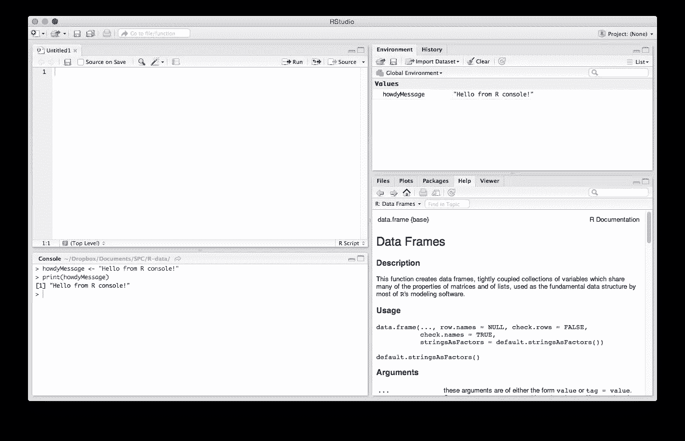
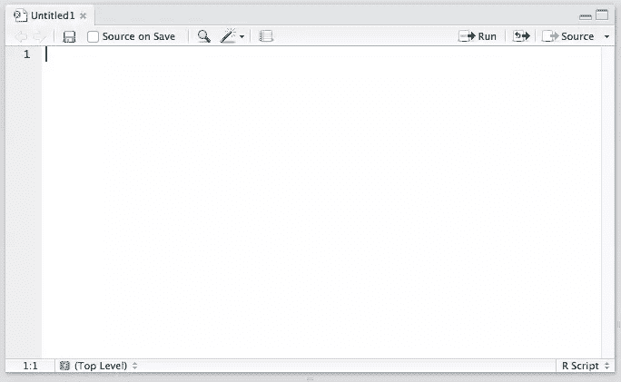
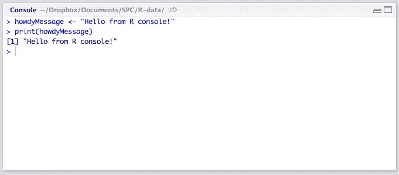
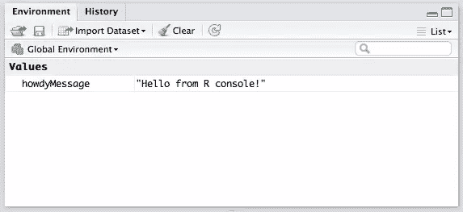
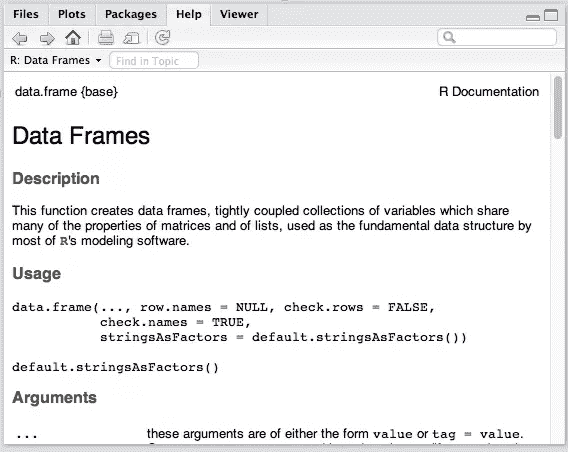
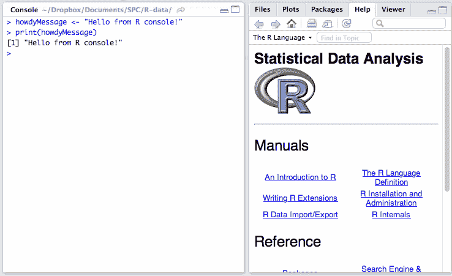
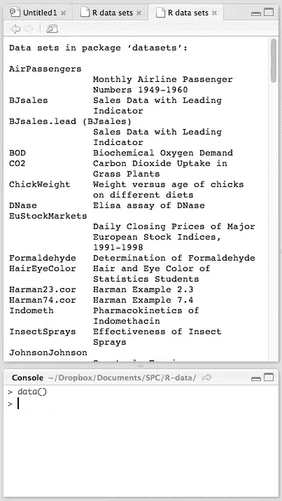
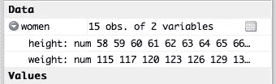

# R 和 RStudio 简介

> 原文：<https://www.sitepoint.com/introduction-r-rstudio/>

随着计算能力的增强，对大量可自由访问的数据的访问也在增加。人们用生产力、卡路里、健康和睡眠追踪器来追踪他们的生活。政府到处公布调查数据，公司进行需要分析的受众测试。即使是现在，也有大量的数据，随时可以获取和查看。

在本教程中，我们将了解 R 编程语言的基础——一种专为统计计算而构建的语言。我不会用[维基百科的定义](http://en.wikipedia.org/wiki/R_%28programming_language%29)来烦你。相反，让我们开始吧。在本简介中，我们将介绍默认 IDE 和语言的安装，以及它的数据类型。

## 安装

r 既是一种编程语言，也是一种软件环境，这意味着它是完全独立的。安装它有两个步骤:

*   下载并安装最新的 R:[www.r-project.org](http://www.r-project.org/)
*   下载并安装 RStudio，这个 IDE:[www.rstudio.com](http://www.rstudio.com/)

两者都是免费的，都是开源的。r 将作为底层引擎安装，为 RStudio 的计算提供动力，而 RStudio 将提供样本数据、命令自动完成、帮助文件和有效的界面，以便快速完成工作。您可以像在大多数其他语言中一样，在简单的文本文件中编写 R 代码，但是考虑到有这么多命令以及事情会变得如此复杂，我们并不推荐这样做。

安装完工具后，启动 R Studio。



### IDE 区域

让我们简单解释一下 GUI。主要有四个部分。我将解释默认顺序，尽管注意这可以在**设置/首选项** > **窗格布局**中更改。

#### 编辑



左上象限是编辑器。这是你写 R 代码的地方，你想留着以后用——函数、类、包等等。实际上，这与其他代码编辑器的主窗口是一样的。除了一些不言自明的按钮和其他在这个起点不需要你关心的按钮，还有一个“保存源”复选框。这意味着“每次保存文件时，将文件的内容加载到我的控制台的运行时中”。你应该一直开着它，因为它可以让你的开发流程一键加速。

#### 控制台



左下象限是控制台。这是一个 REPL，你可以在其中测试你的想法、数据集、过滤器和函数。这是你开始时花费大部分时间的地方。在将你的想法复制到上面的编辑器之前，你可以在这里验证它是否可行。这也是您的 R 文件在保存时将被*来源*到的环境(见上文)，所以无论何时您在上面的 R 文件中开发一个新函数，它都会自动在这个 REPL 中可用。在本教程的剩余部分，我们将花很多时间在 REPL 上。

#### 历史/环境



右上象限有两个选项卡:**环境**和**历史**。

**环境**指的是控制台环境(见上文),将详细列出您在控制台中定义的每一个符号(无论是通过 sourcing 还是直接定义)。也就是说，如果您在 REPL 中有可用的函数，它将在环境中列出。如果您有一个变量或数据集，它将在那里列出。在这里，您还可以手动导入自定义数据集，并使它们在控制台中立即可用，如果您不想键入命令来这样做的话。您还可以检查您安装和加载的其他软件包的环境。(稍后会有更多关于软件包的信息。)继续玩吧；你不能打碎任何东西。

**History** 列出了自从上一个项目开始以来你执行的每一个控制台命令。它被保存到项目文件夹中的一个隐藏的`.Rhistory`文件中。如果您在会话后没有选择保存您的环境，历史记录将不会被保存。

#### 混杂的



右下方的面板是“杂项”面板，包含五个独立的选项卡。第一个是 **Files** ，不言自明。

**Plots** 选项卡将包含您使用 r 生成的图表。在这里，您可以缩放、导出、配置和检查您的图表和绘图。

**Packages** 选项卡允许你在 r 中安装额外的包。每个可用的包旁边都有一个简短的描述，尽管这里列出的要多得多。我们将在以后的文章中讨论软件包仓库。

**帮助**标签可以让你搜索难以置信的广泛的帮助目录，并会自动打开，每当你在控制台中调用命令帮助。(通过在命令名前面加上问号来调用帮助，就像这样:`?data.frame`。)

最后，**浏览器**本质上是 RStudio 的[内置浏览器](https://support.rstudio.com/hc/en-us/articles/202133558-Extending-RStudio-with-the-Viewer-Pane)。是的，你可以用 R 开发 web 应用，甚至可以在其中启动本地托管的 web 应用。

### 内置数据集

在下面的文本中，每当我提到使用命令时，假设这意味着将它输入控制台。因此，如果我说“我们用`?data.frame`查看数据帧的帮助”，你这样做:



RStudio 附带了一些数据集，供新用户使用。为了使用一个内置数据集，我们用`data`函数加载它，并提供一个对应于我们想要的数据集的参数。要查看所有可用的内置集，请键入`data()`，不带参数。



查看可用数据集的列表，让我们先加载一个非常小的数据集:

```
data('women') 
```

您应该看到`women`变量出现在环境面板中，尽管它的第二个字段显示为`<Promise>`。在这种情况下，承诺仅仅意味着“数据会在你真正需要的时候出现”。我们告诉 R 加载这个集合，但是我们实际上还没有在任何地方使用它，所以它觉得没有必要把它完全加载到内存中。让我们告诉 R 我们需要它。在控制台中，只需调用以下命令即可打印出整个集合:

```
women 
```

这相当于:

```
print(women) 
```

*注意:我们将使用前一种方法，只是因为它需要较少的输入。请记住:在 R 中，最后一个不是表达式(比如赋值或求和)的值会自动打印到控制台。*

这些数字将在控制台中生成，并且`women`的环境条目应该会改变。现在，通过单击变量名旁边的蓝色展开箭头，您也应该能够在环境面板中看到数据。



这一套只有 15 个条目，因此没有提供任何有价值的东西，但它足够好了。

为了进一步研究您正在处理的集合，有几个函数需要记住(每个函数的演示可以在下面的解释中看到):

*   `nrow` / `ncol`将分别列出行数/列数。
*   `summary`将输出关于集合的列的摘要。在`women`集合的情况下，我们有两个数字列(两个列都是数字，或者换句话说，每个列都是一个数字向量；稍后将详细介绍数据类型和向量)。R 知道，当您要求它分析一个数字向量时，它应该会给出此类集合的典型值:集合中的最小值、最小值和平均值之间的平均值、平均值(所有值的平均值)、平均值和最大值之间的平均值以及最大值，即列中的最大值。它对高度和宽度都是如此。对于不同类型的向量(比如每个元素都是单词而不是数字的向量)，输出是不同的。
*   `str`是另一种总结。事实上，`str`代表“结构”,它输出数据集结构的摘要。在我们的例子中，它会告诉我们它是一个“data.frame”(一种特殊的数据类型，我们将在后面解释)，有 15 个 obs(观察值或行)和两个变量(或列)。然后，它列出数据帧中的所有列以及它们的一些(但不是全部)值，这样我们就能掌握我们正在处理的值的种类。
*   `dim`给出数据集的维度。调用`dim(women)`给我们`15 2`，这意味着 15 行和 2 列。`length`可以用来统计集合中垂直元素的个数。在向量中(见下文)，这是元素的数量；在像`women`这样的数据集中，这是列数:

```
> nrow(women)
[1] 15
> ncol(women)
[1] 2
> summary(women)
     height         weight     
 Min.   :58.0   Min.   :115.0  
 1st Qu.:61.5   1st Qu.:124.5  
 Median :65.0   Median :135.0  
 Mean   :65.0   Mean   :136.7  
 3rd Qu.:68.5   3rd Qu.:148.0  
 Max.   :72.0   Max.   :164.0  
> str(women)
'data.frame':    15 obs. of  2 variables:
 $ height: num  58 59 60 61 62 63 64 65 66 67 ...
 $ weight: num  115 117 120 123 126 129 132 135 139 142 ...
> dim(women)
[1] 15  2 
```

你会经常用到这些函数*，所以我建议你熟悉它们。加载一些其他数据集，并像这样检查它们。没必要把它们记在心里。本教程和帮助文件将一直作为参考，但不管怎样，能流利地使用它们是很好的。*

 *## 数据类型

r 有一些您已经从其他语言中了解到的典型原子数据类型，但是它也提供了一些更倾向于统计的类型。让我们简单地浏览一下。在解释这些类型的同时，我将讨论如何将*分配给*。R 中的赋值通过“左箭头”操作符或`<-`完成，如:

```
myString <- 'Hello, World!' 
```

然而，r 非常宽容，如果您不想每次都键入箭头，它将允许您在控制台这样的顶级环境中使用`=` [赋值操作符](https://stat.ethz.ch/R-manual/R-patched/library/base/html/assignOps.html):

```
myString = 'Hello, World!' 
```

不过，我建议你习惯用箭头，因为没有它你走不远。

要检查变量的类型(或类)，可以使用`class`函数(尽管上面的`str`几乎做了同样的事情):`class(myString)`。

### 原子学

原子类是构造其他类的基本类型。

#### 性格；角色；字母

`character`类是典型的字符串，由一个或多个字母组成:

```
> myString <- 'Hello, World!'
> class(myString)
[1] 'character' 
```

`[1]`将在下面的“矢量”一节中解释。

#### 数字的

`numeric`类对应其他语言中的`float`。它表示数字值，如 10，15.6，-4，以此类推。38460.88686868661

```
> myNum <- 5.983904798274987298
> class(myNum)
[1] 'numeric' 
```

您可以将数字字符串值强制转换为数字类型(更改类型),如下所示:

```
> myString <- '5.60'
> class(myString)
[1] 'character'
> myNumber <- as.numeric(myString)
> myNumber
[1] 5.6
> class(myNumber)
[1] 'numeric' 
```

还有一个代表无穷大的特殊数字`Inf`。它可用于计算:

```
> 1/0
[1] Inf 
```

另一个“数”是`NaN`，代表“不是数”。这是你做类似`0/0`的事情得到的结果。

#### 整数

整数是整数，尽管它们在保存到变量中时会自动强制转换成数字:

```
> myInt <- 209173987
> class(myInt)
[1] 'numeric' 
```

为了实际强制它们成为整数，我们需要调用一个手动强制它们的函数，名为`as.integer`:

```
> myInt <- as.integer(myInt)
> class(myInt)
[1] 'integer' 
```

您可以通过设置带有`L`后缀的整数来防止自动强制:

```
> myInt = 5L
> class(myInt)
[1] 'integer' 
```

注意，如果你给 R 一个大于它的内存所能存储的数，它会自动把它转换成一个实数，即使你把`L`放在末尾:

```
> myInt <- 2479827498237498723498729384
> class(myInt)
[1] 'numeric'
> myInt
[1] 2.479827e+27 
```

但是如果你试图将这个数强制转换成一个整数，R 将会丢弃它，因为它不能产生那么大的整数。您得到的不是数字，而是“NA”，这是 R 中的一种特殊类型，表示“不可用”，也称为缺失值:

```
> myIntCoerced <- as.integer(myInt)
Warning message:
NAs introduced by coercion
> myIntCoerced
[1] NA
> class(myIntCoerced)
[1] 'integer' 
```

NA 仍然是一种“整数”,但是没有值。

注意，当把数字强制转换成整数时，小数位会丢失。这同样适用于数字十进制字符串的强制转换:

```
> myString <- '5.60'
> myNumeric <- 5.6
> myInteger1 <- as.integer(myString)
> myInteger2 <- as.integer(myNumeric)
> myInteger1 == myInteger2
[1] TRUE
> myInteger1
[1] 5 
```

#### 复杂的

解释复数有点超出了本教程的范围，尤其是如果你在学校没有接触过它们，但是如果你很好奇，你可以在维基百科上找到更多关于复数的信息。它们采用`a + bi`的形式，其中`a`和`b`是实数，`i`是虚数。在 R 中，它们是用一个特殊的`complex`函数构造的:

```
> myComplex <- complex(1, 3292, 8974892)
> myComplex
[1] 3292+8974892i
> class(myComplex)
[1] 'complex' 
```

您可能不像需要其他类型那样经常需要它们，但是如果您想了解更多关于`complex`函数的信息，就打电话寻求帮助:`?complex`。

#### 逻辑学的

逻辑类型(布尔型)与大多数其他语言相同，可以是两种类型:真或假。真可以用`TRUE`或`T`来表示，假可以预见是`FALSE`或`F`:

```
> TRUE == T
[1] TRUE
> myBool <- TRUE
> myBool == T
[1] TRUE
> myComparison <- 5 > 6
> myComparison == FALSE
[1] TRUE
> class(myComparison)
[1] 'logical' 
```

每当你创建一个结果为“是”或“否”的表达式时，你就会得到一个`TRUE`或`FALSE`——就像上面的`5 > 6`一样。5 是*不是*大于 6，所以表达式变成`FALSE`。将`myComparison`与`FALSE`进行比较会产生`TRUE`，因为`myComparison`变量确实包含一个值`FALSE`。

当函数需要时，逻辑值将被强制转换成数字。这意味着，如果我写`1 + TRUE`，控制台将产生`2`，而`1 + FALSE`给出`1`。同样，我们可以很容易地将其他类型转换成逻辑类型(`as.logical(myVariable)`)。任何数值不等于 0 或 NA 的数字或整数都会给出`TRUE`。0 和 0L 会给`FALSE`。类似于“真”、“真”、“真”、“T”这样的字符串会变成 True，“假”、“假”、“假”、“F”会变成`FALSE`。任何其他字符串都将强制转换为逻辑 NA 值。

### 更高的类型

较高的类型是由较低的类型组成的类型。

#### 向量和列表

最重要的是，向量是同一类型元素的集合。在我们之前的数据集示例中，`women`数据集的一列是一个*数值向量*，这意味着它是一个只有数值的集合。向量只能有完全相同类型的元素。向量可以用`vector`函数创建，但通常用简写的`c`(连接)函数创建:

```
> myVector <- c('Hello', 'World', 'Third Element')
> class(myVector)
[1] 'character'
> myVector
[1] 'Hello'         'World'         'Third Element' 
```

我们在这里可以看到 vector 的类是“character”，这意味着它只包含字符类型的值。如果我们通过调用它的变量名来打印它，我们得到所有三个元素和一个`[1]`。`[1]`的字面意思是:“我正在输出你的向量的内容。这一行的第一个元素是 vector 中的 1 号元素。

你在`[]`中看到的完全取决于你的控制台面板的大小和阵列的长度。例如:

```
> myVector <- c('One', 'Two', 'Three', 'Four', 'Five', 'Six', 'Seven', 'Eight', 'Nine', 'Ten', 'Eleven', 'Twelve', 'Thirteen', 'Fourteen', 'Fifteen')
> myVector
 [1] 'One'      'Two'      'Three'    'Four'     'Five'     'Six'      'Seven'   
 [8] 'Eight'    'Nine'     'Ten'      'Eleven'   'Twelve'   'Thirteen' 'Fourteen'
[15] 'Fifteen' 
```

方括号中的数字只是表示“我之后的元素是集合中的第 n 个”。它纯粹是为了使输出更具可读性，并不影响实际数据。

注意向量是严格一维的。不能将另一个向量作为元素添加到现有向量中；它们的元素合并成一个:

```
> v1 <- c('a', 'b', 'c')
> v2 <- c('d', 'e', 'f')
> v3 <- c(v1, v2)
> v3
[1] 'a' 'b' 'c' 'd' 'e' 'f' 
```

您可以通过指定范围来生成完整的数字向量:

```
> myRange <- c(1:10)
> myRange
 [1]  1  2  3  4  5  6  7  8  9 10 
```

**列表**就像向量一样，只是它们没有只能容纳相同类型元素的限制。它们是用`list`函数或`c`函数构建的，如果您添加的元素之一是列表:

```
> myList <- list(5, 'Hello', 'Worlds', TRUE)
> class(myList)
[1] 'list'
> myList
[[1]]
[1] 5

[[2]]
[1] 'Hello'

[[3]]
[1] 'Worlds'

[[4]]
[1] TRUE 
```

和向量一样，一维规则也适用。将列表添加到另一个列表中会合并它们的元素。

`[[N]]`输出的意思是“这个列表的第一个元素是一个只有一个元素 5 的向量，这个列表的第二个元素是一个只有一个元素 Hello…等的向量。”将`[[N]]`附加到保存列表的变量实际上会返回元素。我们可以很容易地检查这一点:

```
> class(myList[[1]])
[1] 'numeric'
> class(myList[[2]])
[1] 'character'
> class(myList[[3]])
[1] 'character'
> class(myList[[4]])
[1] 'logical' 
```

#### 数据。基本框架

数据帧本质上是具有行和列的表格，很像电子表格。我们上面加载的`women`数据集是一个数据帧。通过对变量使用`$`操作符，后跟列名，可以访问数据帧的各个列:

```
> women$height
 [1] 58 59 60 61 62 63 64 65 66 67 68 69 70 71 72 
```

结果以数字向量的形式返回。用`class(women$height)`查其等级。

如果列名包含空格，可以用引号(`women$"Female Height"`)将它括起来，但是也可以通过列在列列表中的数字位置来访问列。例如，我们知道`height`是第一列:

```
> head(women[1])
  height
1     58
2     59
3     60
4     61
5     62
6     63
> head(women[[1]])
[1] 58 59 60 61 62 63 
```

`head`函数告诉 R 只返回前六个结果。这是为了让我们的控制台保持美观和无滚动，这对于简单浏览数据集而不需要完整打印出来是非常好的。(相反可以用`tail`实现，它打印出*最后的*六个结果。)

我们可以看到，当用单方括号`[1]`访问列时，我们得到了一个数据帧，但是少了一列。然而，如果我们用双方括号`[[1]]`访问它，我们会得到一个高度的数字向量。使用单括号返回的数据与父数据保持相同的类型，而双括号访问器以该列中的特定值为目标，并以它们最基本的形式(数字向量)返回它们。

我们用`data.frame`函数创建数据帧:

```
> men <- data.frame(height = c(50:65), weight = c(150:165))
> head(men)
  height weight
1     50    150
2     51    151
3     52    152
4     53    153
5     54    154
6     55    155 
```

在这里，我们创建了一个与之前的`women`数据集相似的样本`men`数据集。

如果我们只想得到列名，我们使用`names`函数。我们甚至可以给它赋值，从而改变列名:

```
> names(men)
[1] 'height' 'weight'
> names(men) <- c('Male Height', 'Male Weight')
> head(men)
  Male Height Male Weight
1          50         150
2          51         151
3          52         152
4          53         153
5          54         154
6          55         155 
```

#### [数]矩阵

矩阵是多维向量。它们类似于数据帧，但只能包含相同类型的值。它们是用`matrix`函数创建的，需要行数和列数作为参数，以及放入这些槽中的值:

```
> m <- matrix(nrow = 4, ncol = 5, 1:20)
> m
     [,1] [,2] [,3] [,4] [,5]
[1,]    1    5    9   13   17
[2,]    2    6   10   14   18
[3,]    3    7   11   15   19
[4,]    4    8   12   16   20 
```

如果提供的值的数量与单元格的数量不匹配，会发生什么情况？

```
> m <- matrix(nrow = 4, ncol = 5, 1:25)
Warning message:
In matrix(nrow = 4, ncol = 5, 1:25) :
  data length [25] is not a sub-multiple or multiple of the number of rows [4]
> m
     [,1] [,2] [,3] [,4] [,5]
[1,]    1    5    9   13   17
[2,]    2    6   10   14   18
[3,]    3    7   11   15   19
[4,]    4    8   12   16   20 
```

我们得到一个警告，但是矩阵还是被创建了，所有多余的值都被丢弃了。如果值少于单元格，则提供的值将循环使用，直到矩阵填满:

```
> m <- matrix(nrow = 4, ncol = 5, 1:16)
Warning message:
In matrix(nrow = 4, ncol = 5, 1:16) :
  data length [16] is not a sub-multiple or multiple of the number of columns [5]
> m
     [,1] [,2] [,3] [,4] [,5]
[1,]    1    5    9   13    1
[2,]    2    6   10   14    2
[3,]    3    7   11   15    3
[4,]    4    8   12   16    4 
```

就像数据帧有`names`属性/功能一样，矩阵也有`dim`(维度)属性/功能。更改此属性会改变矩阵的形式:

```
> m <- 1:15
> m
 [1]  1  2  3  4  5  6  7  8  9 10 11 12 13 14 15
> dim(m)
NULL
> dim(m) <- c(3,5)
> m
     [,1] [,2] [,3] [,4] [,5]
[1,]    1    4    7   10   13
[2,]    2    5    8   11   14
[3,]    3    6    9   12   15
> dim(m)
[1] 3 5
> dim(m) <- c(5,3)
> m
     [,1] [,2] [,3]
[1,]    1    6   11
[2,]    2    7   12
[3,]    3    8   13
[4,]    4    9   14
[5,]    5   10   15
> dim(m)
[1] 5 3
> dim(m) <- NULL
> m
 [1]  1  2  3  4  5  6  7  8  9 10 11 12 13 14 15 
```

这里，我们创建了一个由 15 个连续数字组成的数字向量(在这种情况下，我们可以省略`c`)。从返回 NULL 的`dim`函数可以明显看出，`dim`属性不存在，所以我们通过给它分配一个数值向量`3, 5`来改变它。这导致了元素的重组，以适应新构建的矩阵。然后，我们通过将列数和行数转换为`5, 3`，再次改变了维度，这再次产生了一个不同的矩阵。最后，*使*维度无效，从开始产生数字向量。

也可以使用`cbind`和`rbind`组合/扩展/改变矢量、数据帧和矩阵:

```
> v <- 1:5
> x <- 6:10
> bound <- cbind(v, x)
> bound
     v  x
[1,] 1  6
[2,] 2  7
[3,] 3  8
[4,] 4  9
[5,] 5 10
> bound <- rbind(v, x)
> bound
  [,1] [,2] [,3] [,4] [,5]
v    1    2    3    4    5
x    6    7    8    9   10 
```

#### 工厂

因素是带标签的向量。这不同于字符向量，甚至不同于数字向量，因为它们是 R 人们所说的“自我描述”,允许 R 的函数比其他类型的函数更能自动理解它们。它们是用`factor`函数构建的，该函数需要一个向量作为参数:

```
> f <- factor(c('Hello', 'World', 'Hello', 'Annie', 'Hello', 'World'))
> f
[1] Hello World Hello Annie Hello World
Levels: Annie Hello World
> table(f)
f
Annie Hello World
    1     3     2 
```

级别列出了因子中的唯一元素。`table`函数获取一个因子，并构建一个包含该因子中不同级别以及它们在该因子中出现的次数的表。

我个人还没有在我的项目中发现因素的用途，但是[我正在了解它们](http://stackoverflow.com/questions/3445316/factors-in-r-more-than-an-annoyance)。

## 结论

在本教程中，我们已经介绍了 R 中的基本数据类型以及使用 RStudio 的要点。现在，您已经掌握了开始一些基本数据操作所需的所有知识。记住，我们上面提到的所有函数都可以在带有`?function`的帮助文件中完全搜索到，其中“function”是函数名。

学习编程语言时，习惯上是先教数据类型，其次是逻辑操作符，第三是控制结构，然后才是函数和类之类的高级内容。但在本教程中，我相信我们已经打下了足够好的基础，可以直接投入到学习中去。

## 分享这篇文章*