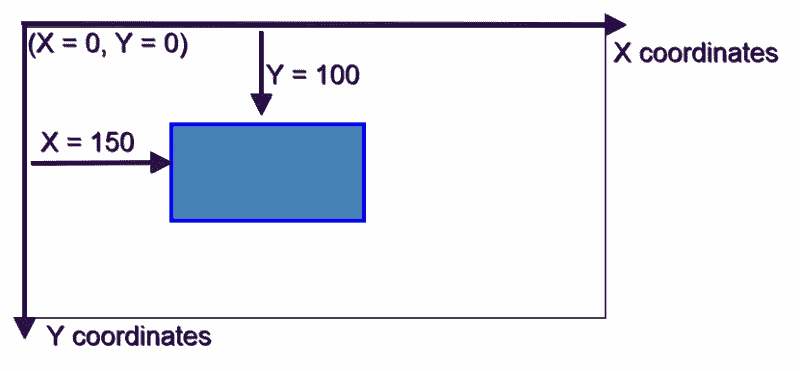

# jCanvas 简介:jQuery 与 HTML5 Canvas 相遇

> 原文：<https://www.sitepoint.com/introduction-to-jcanvas-jquery-meets-html5-canvas/>

HTML5 允许你使用 [`<canvas>`元素](https://html.spec.whatwg.org/multipage/scripting.html#the-canvas-element)和相关的 [JavaScript API](https://developer.mozilla.org/en-US/docs/Web/API/Canvas_API) 直接在网页上绘制图形。

在这篇文章中，我将向你介绍一个免费的开源的基于 jQuery 的 HTML5 Canvas API 库。

如果您使用 jQuery 开发，jCanvas 可以让您更容易、更快速地使用 jQuery 语法编写酷的画布绘图和交互式应用程序。

## jCanvas 是什么？

jCanvas 网站解释道:

> jCanvas 是一个 JavaScript 库，使用 jQuery 编写并用于 jQuery，它包装了 HTML5 canvas API，添加了新的特性和功能，其中许多是可定制的。功能包括层、事件、拖放、动画等等。
> 
> 结果是一个灵活的 API 被包装在一个甜蜜的、jQuery 风格的语法中，为 HTML5 画布带来了力量和方便。

jCanvas 使您能够使用本机 Canvas API 做您能做的一切事情，等等。如果您愿意，也可以将本机 HTML5 Canvas API 方法用于 jCanvas。 [draw()方法](http://projects.calebevans.me/jcanvas/docs/drawManually/)就是为了这个目的。此外，您可以使用 jCanvas 的 [extend()特性](http://projects.calebevans.me/jcanvas/docs/extending/)，用自己的方法和属性轻松扩展 jcan vas。

## 将 jCanvas 添加到项目中

要将 jCanvas 包含在您的项目中，[从官方网站或](http://projects.calebevans.me/jcanvas/downloads/)[GitHub 页面](https://github.com/caleb531/jcanvas)下载脚本，然后将其包含在您的项目文件夹中。如前所述，jCanvas 需要 jQuery 才能工作，所以一定要包含 jQuery。

您项目的脚本文件将类似于以下内容:

```
<script src="js/jquery.min.js></script>
<script src="js/jcanvas.min.js></script>
<script src="js/script.js></script>
```

最后一个是使用 jCanvas API 放置自定义 JavaScript 的地方。现在让我们来试驾一下 jCanvas。

## 设置 HTML 文档

为了跟随示例，首先向基本的 HTML5 文档添加一个`<canvas>`元素标签。

```
<canvas id="myCanvas" width="600" height="300">
  <p>This is fallback content 
  for users of assistive technologies 
  or of browsers that don't have 
  full support for the Canvas API.</p>
</canvas>
```

下面是上面代码片段的一些有趣之处。

*   默认情况下，`<canvas>` **绘图面**的尺寸为 300 像素乘 150 像素。您可以在元素标记内的宽度和高度属性中修改此默认大小。
*   添加一个`id`属性不是必需的，但这将是用 JavaScript 访问元素的一种简单方法。
*   元素里面的内容只是一个位图图像。这使得辅助技术的用户无法使用**。此外，不支持 Canvas API 的[浏览器将无法访问其内容或以任何方式与之交互。因此，虽然旨在使`<canvas>`更易访问](http://caniuse.com/#feat=canvas)的[技术还没有推出，但为这类用户添加一些**后备内容**是推荐的做法。](https://www.w3.org/Talks/2014/0510-canvas-a11y/#1)**

 **如果您使用本机 Canvas API，您的 JavaScript 将如下所示:

```
var canvas = document.getElementById('myCanvas'),
    context = canvas.getContext('2d');
```

上面代码中的变量`context`存储了对画布对象的 **2D 上下文**属性的引用。正是这个属性使您能够访问 HTML5 Canvas API 公开的所有其他属性和方法。

如果你想了解关于这个主题的更多信息，Ivaylo Gerchev 的《HTML5 画布教程:介绍》是一本很好的读物。

jCanvas 方法和属性已经包含了对 2D 上下文的引用，因此您可以直接进入绘图。

## 用 jCanvas 绘制形状

大多数 jCanvas 方法接受属性-值对的映射，您可以按照自己喜欢的任何顺序列出这些属性-值对。

让我们从画一个长方形开始。

### 矩形形状

这就是如何使用 jCanvas 对象的 [`drawRect()`方法](http://projects.calebevans.me/jcanvas/docs/rectangles)绘制矩形的方法。

```
// Store the canvas object into a variable
var $myCanvas = $('#myCanvas');

// rectangle shape 
$myCanvas.drawRect({
  fillStyle: 'steelblue',
  strokeStyle: 'blue',
  strokeWidth: 4,
  x: 150, y: 100,
  fromCenter: false,
  width: 200,
  height: 100
});
```

上面的代码片段将画布对象缓存到一个名为`$myCanvas`的变量中。`drawRect()`方法中的属性大部分是不言自明的，但这里有一个简短的概述:

*   `fillStyle`设置矩形的背景颜色；
*   `strokeStyle`设置其边框颜色；
*   `strokeWidth`设置形状的边框宽度；
*   `x`和`y`设置画布内矩形的**水平**和**垂直**位置对应的坐标。对于 *x* 的值为 *0* ，对于 *y* 的值为 *0* ，即(0，0)，对应于画布的左上角。`x`坐标向右增加，`y`坐标向画布底部增加。在绘制矩形时，默认情况下，jCanvas 将`x`和`y`坐标放在形状的中心。
*   要对此进行更改，使`x`和`y`对应于矩形的左上角，请将`fromCenter`属性设置为`false`。
*   最后，`width`和`height`属性设置矩形的尺寸。



这是一个矩形的演示:

见笔 [jCanvas 示例:矩形](http://codepen.io/SitePoint/pen/NxMxLd/)由 [CodePen](http://codepen.io) 上的 SitePoint ( [@SitePoint](http://codepen.io/SitePoint) )生成。**