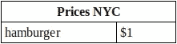
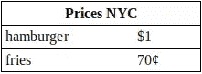
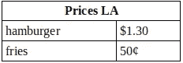
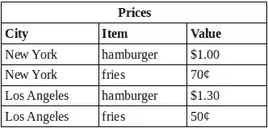

# PHP 数组简介

> 原文：<https://www.sitepoint.com/introduction-to-php-arrays/>

许多使我们所知的世界成为可能的事情是如此的平常，以至于我们忘记了它们的存在。我最喜欢的例子之一是电梯；升降平台或升降箱的想法由来已久，但它必须等到工业革命后才能成为实用的设备。1857 年，当奥蒂斯先生在崭新的 [E. V. Haughwout 大楼](http://en.wikipedia.org/wiki/E._V._Haughwout_Building "E. V. Haughwout Building - Wikipedia, the free encyclopedia")里成功安装了他的第一部电梯时，他为纽约市和圣保罗等大都市的垂直发展开辟了道路。

我另一个最喜欢的发明是桌子。不是餐饮类的，虽然它们对吃饭和工作都非常重要，而是存储信息的类型。这种桌子是我们日常生活的一部分，有数百种不同的变化。在许多国家，牛奶、黄油和谷物容器上都展示着营养价值表——尽管我不知道谁会阅读和理解它们。对于那些仍然阅读印刷版的人来说，大多数论文都被组织成一种表格。许多城市，尤其是在新大陆(这里扩展到包括澳大利亚和新西兰)，被组织成一个表格，街道作为行，大道作为列。孩子们一开始学习乘法和除法，就开始使用表格；其实葡萄牙语对乘法表有个有趣的词: *taboada* ，大致是“放在桌子上的东西！”没有表格，工程是不可想象的，而表格是管理技术的支柱，如[运筹学](http://en.wikipedia.org/wiki/Operations_research "Operations research - Wikipedia, the free encyclopedia")和[博弈论](http://en.wikipedia.org/wiki/Game_theory "Game theory - Wikipedia, the free encyclopedia")。

但是这篇文章的主题是什么呢，*数组*？

## 什么是数组？

表格以这样一种方式组织数据，我们可以很容易地找到相关性或执行简单的计算。数组本质上是一种以类似表格的方式组织数据的方法。“数组”这个名字和“排列”这个词来自同一个拉丁语词根。

为了帮助我们更好地理解数组，让我们从一个名为 *Prices NYC* 的表开始，显示纽约市一个汉堡包的价格是一美元:



我们可以把它写成一个数组，叫做，你永远也猜不到，`pricesNYC`:

```
pricesNYC ("hamburger"=1)
```

这条信息非常简单，用表或数组来表示它似乎是浪费时间。但是如果我们加上一面薯条的价格呢？我们可以写:



并且:

```
pricesNYC ("hamburger"=1, "fries"=.70)
```

这是一个*关联数组*。在关联数组中，每个值都由一个标签或一系列标签标识，称为*键*。*汉堡*和*薯条*是这个例子中的关键点，它们的值分别是 1 和. 70。键也可以是数字序列，而不是标签。在这种情况下，该数组被称为*非关联*。我们的非关联数组示例如下:

```
pricesNYC (0=1, 1=.70)
```

索引(或键)0 处的值为 1，索引 1 处的值为. 70。(在大多数编程语言中，出于历史和数学上的方便，非关联数组从索引 0 开始。)

有时没有明确给出索引，但是仍然可以通过它们的位置访问值。

```
pricesNYC (1, .70)
```

坚持使用关联数组，如果我们希望显示洛杉矶的相同价格，我们可以创建第二个表和数组:



```
pricesLA ("hamburger"=1.30, "fries"=.50)
```

或者，我们可以将两个表中的数据组合在一起，如下所示:



```
prices ("New York"=pricesNYC ("hamburger"=1, "fries"=.70),
        "Los Angeles"=pricesLA ("hamburger"=1.30, "fries"=.50))
```

我们已经开始在数组中创建数组，每个值现在由标签序列来标识。例如，纽约一个汉堡的价格现在的关键是*纽约*、*汉堡*。在`prices`中，顶层数组有两个键，*纽约*和*洛杉矶*。这些键中的每一个都指向实际上是其他数组的值。这些二级数组有标签*汉堡包*和*薯条*，它们最终指向一个数字，这是期望的价格。

在非关联方式中，该数组看起来如下所示:

```
prices (0=pricesNYC (0=1, 1=.70),
        1=pricesLA (0=1.30, 1=.50))
```

纽约一个汉堡的价格在这里找到，指数为 0 0。

## 创建数组

现在数组的概念已经建立，让我们继续讨论 PHP 如何实现它们，更重要的是，我们如何创建它们。创建数组最传统的方法是使用`array()`构造:

```
<?php
$pricesNYC = array();
```

我们创建的数组是空的。然后，我们可以使用括号中指定的键为数组赋值:

```
<?php
$pricesNYC["hamburger"] = 1;
$pricesNYC["fried"] = .70;
```

或者，我们可以在使用语法 *key* `=>` *value* 创建数组的同时填充数组。键/值对由逗号分隔:

```
<?php
$pricesNYC = array("hamburger" => 1, "fries" => .70);
```

当我第一次学习 PHP 时，我经常不得不回到文档中检查正确的操作符是`=>`还是`->`。有一天我想出了助记符“这个键*将等于那个值*”，现在我很容易记住`=>`是正确的选择。

那么对于非关联数组来说，上面的例子是什么样的呢？

```
<?php
$pricesNYC = array();
$pricesNYC[0] = 1;
$pricesNYC[1] = .70;
```

并且:

```
<?php
$pricesNYC = array(0 => 1, 1 => .70);
```

如果您想要的只是一个非关联数组，那么就没有必要指定索引。如果没有提供 key，PHP 会自动使用 key 序列中的下一个整数值，从 0 开始。这些示例生成了与我们刚才看到的相同的非关联数组:

```
<?php
$pricesNYC = array();
$pricesNYC[] = 1;
$pricesNYC[] = .70;
```

并且:

```
<?php
$pricesNYC = array(1, .70);
```

PHP 数组可以有混合键，即一些键可以是字符串，另一些可以是索引。到目前为止，我们已经看到了字符串(如 *hamburger* )和整数(0)的键。

现在让我们把双城表转换成一个数组，让事情变得更有趣一些。和以前一样，空数组的创建很简单:

```
<?php
$prices = array();
```

同样简单的是如何用括号语法填充数组:

```
<?php
$prices["New York"]["hamburger"] = 1;
$prices["New York"]["fries"] = 0.70;
$prices["Los Angeles"]["hamburger"] = 1.30;
$prices["Los Angeles"]["fries"] = 0.50;
```

或者，对于非关联数组:

```
<?php
$prices[1][0]=1;
$prices[1][1]=0.7;
$prices[0][0]=1.3;
$prices[0][1]=0.5;
```

当我们创建数组时，如何分配所有的值呢？由于我们的表有两层，第一层是城市，第二层是商品，我们将这个数组声明为一系列包含在另一个中的数组:

```
<?php
$prices = array("Los Angeles" => array("hamburger" => 1.3, "fries" => 0.5),
                "New York" => array("hamburger" => 1, "fries" => 0.7));
```

你会发现当你使用数组时，你经常用变量来表示键。这对于创建其值可以机械计算的数组非常有用。例如，此循环创建一个 10 元素数组，其值是键的平方:

```
<?php
$squares = array();
for ($key = 0; $key < 10; $key++) {
    $squares[$key] = $key * $key;
}
```

结果数组`$squares`的填充方式与我们编写的一样:

```
<?php
$squares = array();
$squares[0] = 0;
$squares[1] = 1;
$squares[2] = 4;
$squares[3] = 9;
...
$squares[9] = 81;
```

## 使用数组

我们已经学习了如何创建数组并用值填充数组，那么如何检索这些值呢？要在数组中使用一个值，您只需要用数组变量的名称和所需的索引来引用它。这样，纽约一个汉堡的价格是:

```
<?php
$price = $pricesNYC["hamburger"];
```

或者:

```
<?php
$price = $prices["New York"]["hamburger"];
```

如果我们想知道洛杉矶一份快餐(汉堡+薯条)的价格，我们可以这样计算:

```
<?php
$price = $prices["Los Angeles"]["hamburger"] + $prices["Los Angeles"]["fries"];
```

假设我们想要一份所有城镇小吃的费用清单。作为优秀的程序员，我们不会梦想对所有的城市重复这句话。相反，我们会试着写一个循环。这是个好主意，但是我们应该使用哪种循环结构呢？让我们尝试一个`for`-循环:

```
<?php
for ($key = _start_; $key <= _end_; $key++) {
    $price = $prices[$key]["hamburger"] + $prices[$key]["fries"];
}
```

Hrm…那不行，因为数组的键是字符串！我们不知道用什么来表示`_start_`或者`_end_`。幸运的是，PHP 有一个`foreach`-循环贯穿数组的每个元素，这正是我们想要做的:

```
<?php
foreach ($prices as $snack) {
    $price = $snack["hamburger"] + $snack["fries"];
}
```

这个循环将遍历数组`$prices`两次，因为它有两个一级元素。在第一次运行时，它将提取包含纽约州*的汉堡和薯条价格的数组。我们称这个数组为*$零食*。然后通过使用键汉堡包和薯条查找值来添加价格。当然，在真实的脚本中，`$price`还会发生其他事情，比如被打印或发送到数据表，但是我们在这里不需要这样做。然后，第一级数组自动递增到下一个元素，循环使第二级数组中包含洛杉矶*的价格*作为$snack。*

可以嵌套`foreach`循环。仅仅为了最后一个例子，让我们使用两个循环来计算价格。如果这令人困惑，用纸和笔把它抄下来(这是一种有几个世纪历史的学习工具，对启迪有奇效),并仔细通读。

```
<?php
foreach ($prices as $city => $snack) {
    echo  "<b>" . $city . "</b><br>";
    foreach ($snack as $item => $price) {
        echo $item . " = " . $price . "<br>";
    }
}
```

`foreach`可以使用`=>`语法使当前键和值对循环体可用。这个循环的输出将把按城市分组的汉堡包和炸薯条的价格发送给浏览器。

## 结论

数组是一种非常非常重要的通用数据结构。它们可以很方便地将各种相关信息组合在一起，一旦你掌握了它们，就很容易使用。但是除了增加价格，你还可以做更多的事情。我喜欢用它们来定制脚本，为网站域名、描述、关键字、数据库登录凭证等数据创建键/值对。还要注意 PHP 超级全局变量像`$_GET`、`$_POST`、`$_SESSION`和`$_SERVER`都是数组。现在，您正在成为一名熟练的阵列用户，您会注意到它们就在您的周围！

哎呀，所有那些表和数组让我感到饥饿。我想我要乘电梯下去，吃一个带薯条的汉堡。或者说我喜欢鱼和薯条？

<small>图片 via[keko 64](http://www.shutterstock.com/gallery-167056p1.html%22 "Stock Photos | Shutterstock: Royalty-Free Subscription Stock Photography & Vector Art")/[Shutterstock](http://www.shutterstock.com "Stock Photos and Royalty-Free Images by Subscription")</small>

## 分享这篇文章