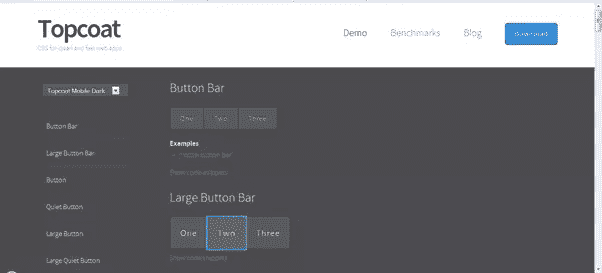
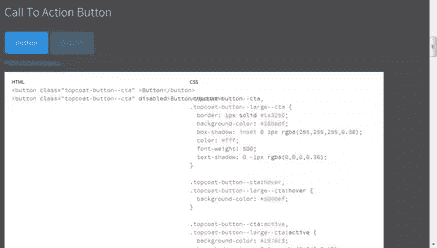
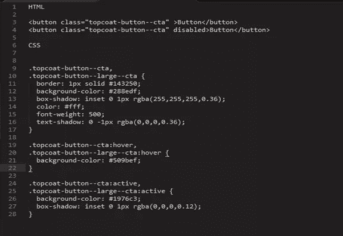

# 面漆介绍

> 原文：<https://www.sitepoint.com/introduction-topcoat/>

根据来自 PhoneGap 应用程序开发者社区的反馈，Adobe 的工作人员建立了一个新的开源 CSS 库，其设计考虑了速度。这对于 web 应用程序设计来说非常有用。该语言最初是基于括号和边缘回流的语言，并从那里发展而来。

Adobe 正在开发这个库，每个月都会发布新的版本，同时也在构建这个库，以确保它的贡献是简单的。根据 [Topcoat 的介绍性博客](https://topcoat.io/posts/introducing-topcoat/):“现在还为时过早，但我们已经在研究每个 CSS 控件是如何影响加载、布局和每秒帧数的。”

Topcoat 不包含任何 JavaScript，所有动画内容都可以用 CSS 动画来完成，让您可以自由地将它用于任何 JS 框架，或者编写自己的内容。作为一个加速移动 UI 元素的优秀工具，它很可能会成为许多开发者的无价工具。

## 面漆使用入门

Topcoat 可以放入一个 web 应用程序中，并立即使用，它包含了用于构建它的所有工具。这使得开发人员可以定制 Topcoat，以满足他们的确切要求和控制，这些都可以在单独的 git repos 中获得，允许您构建针对特定平台的应用程序。

1.  首先，[直接从网站下载 Topcoat](https://topcoat.io/) ，或者[克隆 repo](https://github.com/topcoat/topcoat) 。
2.  然后引用/css
3.  `<link rel="stylesheet" type="text/css" href="css/topcoat-mobile-light.min.css"/>`
4.  查看[样式指南](https://topcoat.io/topcoat/)中的示例

针对 Topcoat 进行了大量的基准测试，该工具对速度的影响是毋庸置疑的。然而，它仍处于起步阶段，因此将会有更多的测试，Adobe 也在积极寻找贡献者。

此外还有一个专门的“顶级涂层”Wiki，其中包含以下方面的大量信息:

*   编码指南
*   体系结构
*   特征检测
*   请求一个特写或提交一个 bug
*   安装和使用
*   控制列表
*   如何衡量绩效
*   在 Android 上运行性能测试
*   过渡效果

同样值得一看的是 Topcoat 网站的[基准测试区](https://bench.topcoat.io/),看看 Adobe 如何支持其关于性能的声明。在这里，您可以查看各种元素(如搜索输入、复选框和导航栏)的平均框架、加载和布局时间。

## 确信大衣会为你工作？

很棒的东西，让我们进一步看看它能做什么。首先，熟悉一下 Topcoat 网站的[演示区](https://topcoat.io/topcoat/)是一个好主意，它向您展示了 Topcoat 可以创建什么，它可能如何显示以及您可以使用的代码片段。

您可以在桌面模式下选择浅色或深色背景，也可以在移动模式下选择背景。页面左侧的菜单允许您选择不同的元素，例如不同大小的按钮、导航栏、列表、文本区域等等。

正如你所看到的，每个元素下面是一个打开代码片段的链接，下面是一个行动号召按钮的片段。

实际的代码片段如下所示:

通过选择“示例”下面的链接，还可以在 CodePen 中查看[的实时代码，在这里您还可以查看默认设置、可访问性和语义变化。](https://codepen.io/Topcoat)

通过[笔](https://codepen.io)上的面漆([@面漆](https://codepen.io/Topcoat))看到笔[面漆按钮栏](https://codepen.io/kerrybutters/pen/kdKyg)