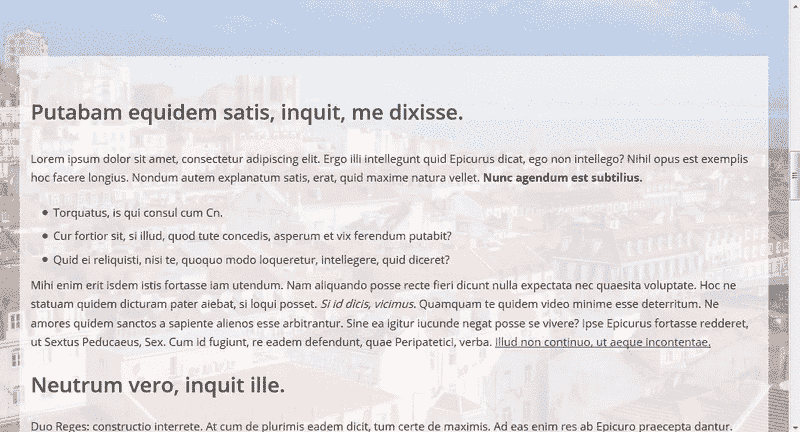
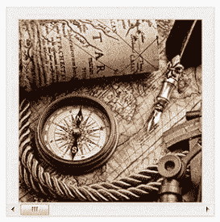
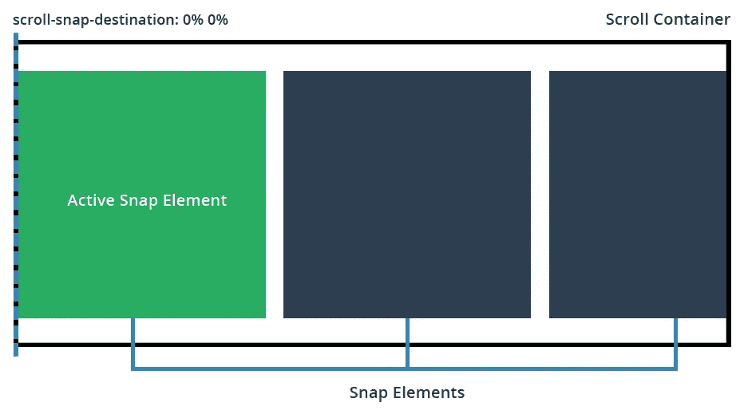
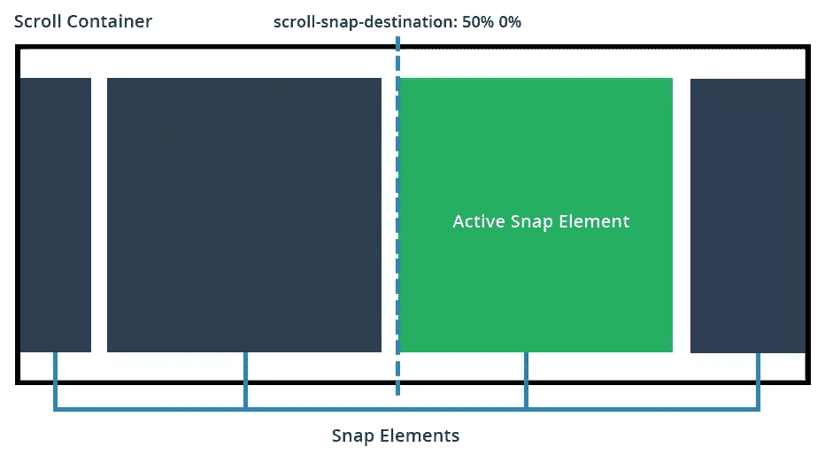
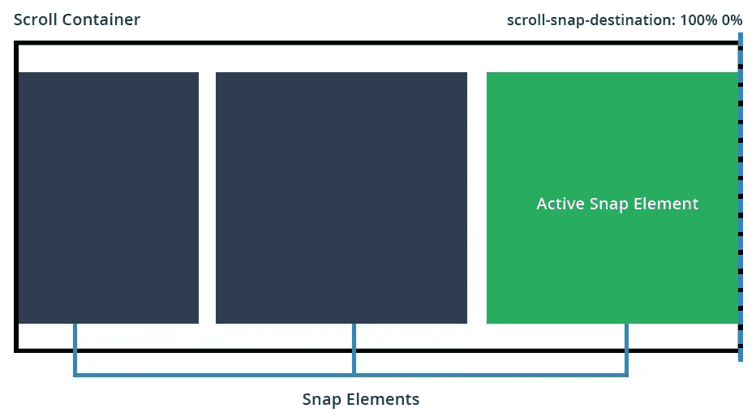
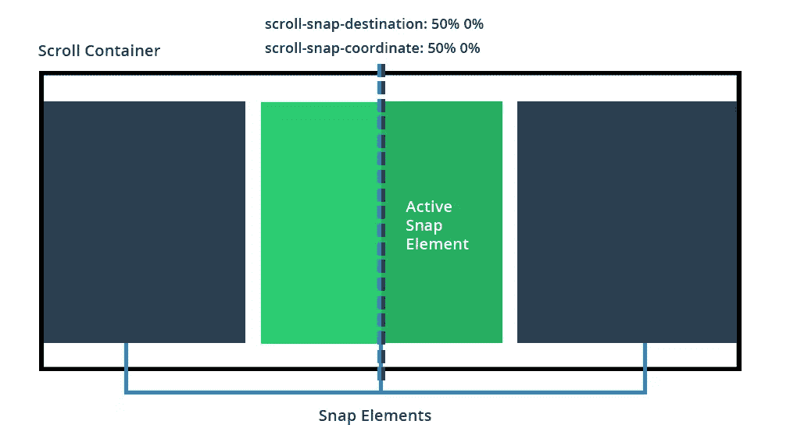
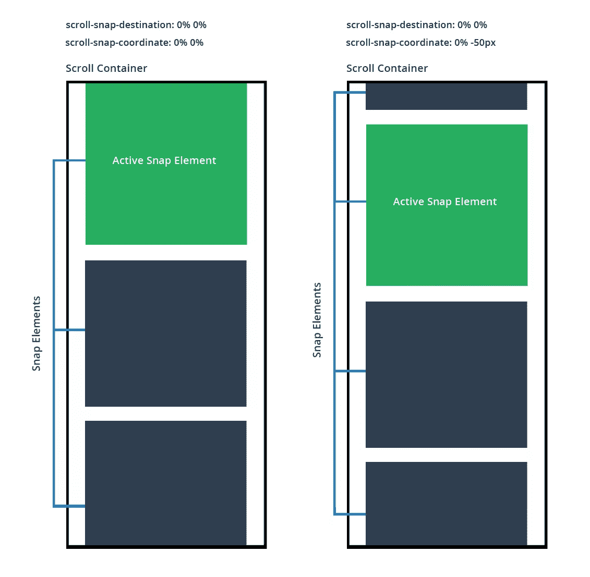

# 带有 CSS 滚动捕捉点的直观滚动界面

> 原文：<https://www.sitepoint.com/intuitive-scrolling-interfaces-with-css-scroll-snap-points/>

滚动捕捉点是一种仅用于 CSS 的原生技术，可用于创建内容易于滚动或平移的布局。有了这项新功能，您可以轻松控制内容的滚动方式以及如何“对齐”到正确的位置(让您轻松创建分页等功能)。

历史上，开发人员使用 JavaScript(通常是 jQuery)来创建完美的平滑滚动、捕捉界面。虽然这些都工作得很好，但拥有一个本质上做同样事情的原生 CSS 方法总是更好。

快照点的[规范仍然相对较新(并且正在开发中)；然而，它得到了一些浏览器的支持，并且足够稳定，我们可以开始玩了。](https://drafts.csswg.org/css-snappoints/)

## 捕捉点概述

捕捉点滚动的工作原理是定义一个**滚动容器**元素，然后将它的每个内部元素设置为**捕捉点。**一旦设置了这些元素，正常滚动将被修改，以便当用户滚动/平移时，他们将从一个捕捉点捕捉到下一个捕捉点。

保存所有其他你想要滚动的元素的主元素叫做**滚动容器**。这是我们的主要元素，大多数与快照相关的属性都将在这里设置。我们可以定义:

*   集装箱有多高/多宽
*   容器将在哪个/哪些轴上滚动(即 X、Y 或两者)
*   对齐元素的强度以及它们对滚动的反应
*   滚动时从容器到捕捉元素的位置/偏移量

滚动容器中的元素将成为我们的“捕捉点”。当我们与容器交互时，这些内容将被滚动/平移。对于单个捕捉点，您将定义:

*   当前对齐元素相对于滚动容器的偏移量。

## 滚动捕捉点属性

让捕捉点在项目中工作只需要几个 CSS 属性。让我们在下面概括一下，稍后我们可以看几个展示它们如何工作的例子。

### `scroll-snap-destination`

该属性在**滚动容器**上设置，它定义了里面的元素将捕捉到的 **X 位置**和 **Y 位置**值(相对于自身)。您可以使用该属性告诉容器它的元素将被捕捉到的确切位置。

以下是可能的值:

*   `unset`–用于声明该容器不是滚动容器(默认情况下没有容器，除非你设置了它)
*   `position`–您必须设置 X 和 Y 位置，否则浏览器将忽略您的属性
    *   值可以是像素，例如`scroll-snap-destination: 50px 100px;`，它告诉浏览器它将从左边 50px 和从顶部 100px 捕捉元素。
    *   值可以是一组百分比，如`scroll-snap-destination: 0% 100%;`，它告诉浏览器它将从 0%向左和 100%从顶部对齐元素。
    *   值也可以是其他允许的单位，例如`scroll-snap-destination: 0vw 50vw`，它告诉浏览器它将从当前视口高度的 0%向左和当前视口高度的 50%向上捕捉元素。

让我们来看一些视觉帮助，这样你就可以看到这个属性是如何工作的(因为它是你需要调整的属性之一，直到你得到正确的效果)。

**scroll-snap-destination:0% 0%**
将滚动目标设置为 0%将确保所有内部元素与容器的左前缘对齐。

**scroll-snap-destination:50% 0%**
在这里我们设置滚动容器以其宽度的 50%来捕捉内容。这意味着当我们滚动时，活动元素将会吸附到 50%位置的左侧。

**滚动-快照-目的地:100% 0%**
这次我们的快照目的地是 100%。这意味着当我们滚动时，每个内部元素都将靠齐容器的右侧。

### `scroll-snap-coordinate`

该属性在每个**捕捉元素**上定义，并确定该元素将捕捉到的 **X 位置**和 **Y 位置**值。该属性与容器上声明的`scroll-snap-destination`一起工作，确定元素从捕捉点的偏移量。

*   `none`–该元素没有偏移量。它将在滚动容器定义的地方直接对齐。
*   `position`–您必须设置 **X** 和 **Y** 位置，这样才能工作。
    *   值可以以像素为单位，如`scroll-snap-coordinate: 100px 0px`，它告诉浏览器捕捉元素将从捕捉点的左边缘偏移 100px，从顶部偏移 0px。
    *   Value 可以使用百分比，如`scroll-snap-coordinate: 25% 0%`，它告诉浏览器元素将从捕捉点的左边缘偏移其宽度的 25%(也从顶部偏移 0%)。
    *   值也可以是其他允许的度量，例如`scroll-snap-coordinate: 15vw 15vw`，这意味着捕捉元素从捕捉容器的顶部和左侧偏移 15%的视口宽度。
    *   `position (multiple)`–您还可以通过传递集合对为捕捉元素设置多个坐标，例如`scroll-snap-coordinate: 50% 0%, 100% 0%`，它告诉浏览器该元素将从捕捉点的左前缘捕捉到其宽度的 50%(从顶部捕捉到 0%)，并且还将从捕捉点边缘捕捉到其宽度的 100%(从顶部捕捉到 0%)。这很有用，因为有时在滚动列表的开始或结尾，一个项目应该在多个位置对齐，而不是一个位置。

如果未设置此属性，元素将按照滚动容器的定义进行简单的对齐。如果您设置了`scroll-snap-coordinate`属性，元素本身将根据您输入的内容进行自身偏移。这主要是为了让你可以将你的元素放在合适的位置(或者允许其他内容通过视窗查看)。

让我们看一些`scroll-snap-coordinate`的例子，并描述每个例子的作用:

**scroll-snap-coordinate:50% 0%**
这告诉浏览器元素应该向滚动容器的设定边缘对齐，但是它的对齐应该向左偏移其宽度的 50%。这基本上意味着它将自己居中对齐到捕捉点。

滚动捕捉坐标:0% 0%和滚动捕捉坐标:0% -50px
这里我们看到一个并排的比较，这样我们可以看看当你指定你的元素将有一个负偏移时会发生什么。

对于左边的例子，我们不设置坐标属性(它将只与它的父容器对齐)。在右边的例子中，我们明确地告诉浏览器将垂直对齐位置偏移-50px(让另一个元素在它之前溜进来)。

您可以调整坐标属性，直到您的捕捉适用于您的界面。

### `scroll-snap-type`

该属性确定滚动容器与其内部元素的对齐强度。以下是可能的值:

*   `none`–滚动容器忽略所有捕捉点(正常滚动)
*   `mandatory`–滚动容器将在滚动条上移动到下一个对齐元素，即使是很小的滚动或单击。滚动容器将立即移动并与捕捉点对齐。如果你想 100%确定当你的用户滚动时，他们总是会捕捉到下一个元素，这是最好的选择。
*   `proximity`–只有当滚动容器稍微靠近一个捕捉点时，它才会移动到下一个捕捉元素。当用户在滚动条上滚动或点击时，滚动运动看起来是正常的，但是如果用户靠近一个 snap 元素的边缘，它将会迅速就位。当您希望您的用户能够自由滚动，但希望滚动容器足够靠近内容(有点像磁铁)时，最好使用这种方法。

我发现使用`mandatory`效果最好，因为它是一个硬的强制快照，然而`proximity`在区域之间使用它的软快照也很好(缺点是没有办法定制它何时快照的敏感度)

### `scroll-snap-points-x`和`scroll-snap-points-y`

如果您查看规范的[当前版本，您会注意到它包含了对`scroll-snap-points-x`和`scroll-snap-points-y`属性的描述。正如](https://www.w3.org/TR/css-snappoints-1/)[在 MDN](https://developer.mozilla.org/en-US/docs/Web/CSS/scroll-snap-points-x) 上的一个通知中指出的，这两个属性已经被弃用，因此它们没有包含在[编辑的规范草案](https://drafts.csswg.org/css-snappoints/)中。所以我在这里就不赘述了。

## 滚动捕捉点的实际示例

现在我们已经介绍了基础知识，让我们来看一些例子，这样你就可以看到这一切在实践中是如何工作的。

下面的每个例子都有自己的代码笔，甚至有更多的注释讨论滚动是如何工作的(加上一些你可能遇到的小设计错误)。随意分享你自己的副本，用它们创造一些有趣的东西。

### 全幅交互式节滚动器

CSS 捕捉点的伟大之处在于它们很容易实现。你所要做的就是定义你的容器，它的元素，以及它将如何捕捉。看看我在下面构建的额外的全角容器滑块。以下是它包含的内容:

*   全宽外部容器(使用 vw 和 vh 装置)
*   每个部分都有自己的动态高度，而不是用 px 设置的高度
*   在滚动时，每个部分都将被对齐到滚动容器的顶部

[**见全页演示**](http://codepen.io/SitePoint/pen/EPapXK/)

### 带有不同大小图像的动态图库滑块

这个图库包含所有不同形状、大小和长宽比的图像。这里有一个描述:

*   处理不同的图像尺寸和纵横比(这是一个真实的例子)
*   将内容对齐容器的中心
*   它有反应。基于自动宽度/高度和由最大宽度/最大高度设置的附加最大值工作。图像被调整以适合(并且它们的滚动位置被更新)。
*   使用`scroll-snap-destination`和`scroll-snap-coordinate`的组合来处理捕捉

参见 [CodePen](http://codepen.io) 上 SitePoint ( [@SitePoint](http://codepen.io/SitePoint) )的笔[抓拍点演示:不同尺寸图像](http://codepen.io/SitePoint/pen/XXJPKg/)的滚动器。