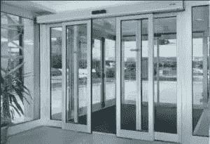
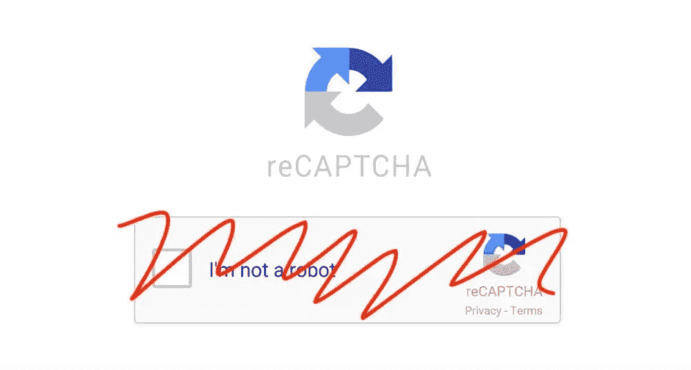
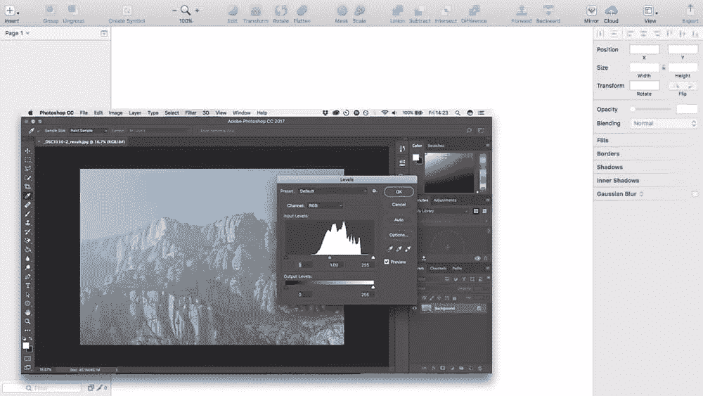
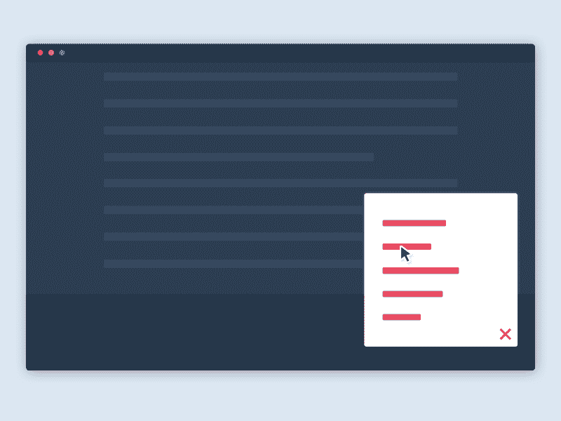
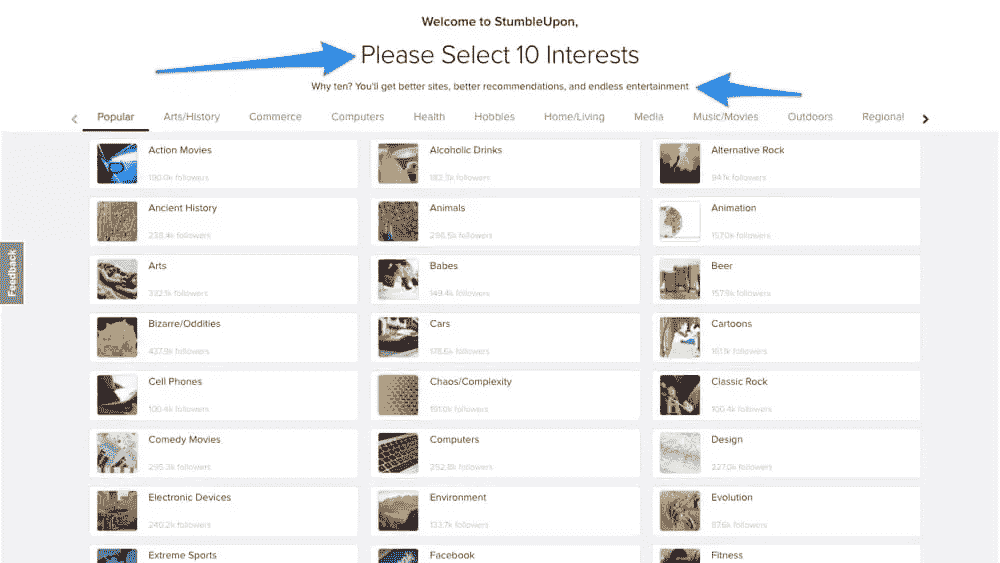

# 4 个在幕后提升 UX 的隐形用户界面示例

> 原文：<https://www.sitepoint.com/invisible-ui-boost-ux-behind-the-scenes/>

**隐形用户界面**是 2017 年流行的设计趋势之一。就像[的个性化用户界面](https://www.sitepoint.com/how-to-boost-engagement-with-personalized-uis/)一样，隐形用户界面也有一定的分量。通常，只有视觉趋势会很快消失，但是看不见的用户界面会一直存在。

我知道你在想什么，“用户如何与一个看不见的用户界面互动？”。嗯，其实更多的是一种比喻。

## 那么隐形 UI 到底是什么*？*

不可见的 UI 是指用户对某个功能的体验非常直观，以至于实际上并不需要 UI(就像 Photoshop、Adobe XD 和 Sketch 中的智能指南一样，它们会在您移动图层时自动出现，以帮助您对齐图层)。

一个真实的例子是自动滑动门。因为用户不必自己开门，所以避免了在应该拉门的时候推门的错误。不需要标牌，不需要按钮，解决方案是隐形的(非常直观！).

> “没有 UI？什么？”

这听起来很疯狂，但是你可能每天都在使用看不见的 ui，甚至没有意识到——实际上，这就是它们的美妙之处！通过更多地意识到不可见的用户界面，我们可以开始设计更直观的用户体验。

让我们来看看 3 个显著提升用户体验的不可见用户界面的例子。很快，你就会明白为什么看不见的 UI 会成为一种趋势，以及一点点对用户的同情如何帮助我们设计看不见的解决方案，而不是强迫用户点击、滚动和与 UI 进行不必要的交互。

*通过我们新的短期课程[思考 UX](https://www.sitepoint.com/premium/courses/thinking-ux-2952) 了解更多关于移情和 UX 的知识，该课程对 SitePoint Premium 用户是免费的。*

## 1.谷歌的隐形验证码

老实说，用户界面是一个障碍。即使微交互的数量减少到最少，UX 简单地令人愉快，用户界面仍然是一个障碍，因为*用户*已经通过与它交互来使动作发生。这对用户来说可能很烦人，尤其是当最终结果对他们没有任何好处的时候。让我们以验证码为例——没有人喜欢验证他们是人类。

Google 对此的“不可见”解决方案是创建一个验证码小部件，它可以验证用户是否是人类，而用户不必与 UI 交互(或者甚至不知道验证码就在那里！).这对用户来说是一个更好的体验，因为它减少了提交表单所需的步骤，这一点非常重要，因为用户不在乎验证码(当它对他们有利时，用户更倾向于交互)。

如果你有兴趣看看这个，它叫做 [Google NoCAPTCHA ReCAPTCHA](https://developers.google.com/recaptcha/docs/invisible) 。

我*会*包括一个截图来演示这一点，但该功能是完全看不见的！相当酷！

NoCAPTCHA 到底是如何工作的？

想象一下普通的 Google CAPTCHA……但是是不可见的——用户点击表单提交按钮会绑定到 CAPTCHA，在后台验证用户。类似地，您可以通过编程[找到用户的位置](https://www.sitepoint.com/html5-geolocation/)并将其插入到一个隐藏的表单字段中，使用户不必手动输入！

## 2.Sketch 和 Photoshop 中的智能指南

作为一名设计师，你可能会使用 Photoshop、Adobe XD 或 Sketch，它们都提供“智能向导”功能。当您在画布上移动层/对象时，智能参考线会自动激活(“自动”是这里的关键词)，显示该对象与任何附近对象之间的距离，让您可以最精确地对齐它们。

您能想象每次移动对象/层时都必须手动检查相对距离，以查看它是否正确对齐吗？实际上，如果我没记错的话，这是我们在旧的 Photoshop 版本中不得不对齐图层的方式，这是一次非常痛苦的经历！

智能指南通过在移动层时自动显示距离*来消除这一步骤，因此，这是一个不可见 UI 的极好例子，因为用户不必按键或点击按钮。*

我写过关于 [Sketch](https://www.sitepoint.com/premium/books/jump-start-sketch) 和 [Adobe XD](https://www.sitepoint.com/premium/books/jump-start-adobe-xd) 的书，它们都是强大、直观的设计工具！这些书对 SitePoint Premium 用户是免费的，或者 19 美元单独购买。或者，你可以在 O ' Reilly([Sketch](http://shop.oreilly.com/product/9780994346964.do)/[Adobe XD](http://shop.oreilly.com/product/9780995382619.do))上购买实体副本。

## 3.显示上下文界面

下面是另一个 Sketch/Adobe XD vs Photoshop 的例子:

众所周知，Photoshop 具有多种功能、标签和窗口，这可能会使应用程序显得非常笨重。另一方面，Sketch 和 Adobe XD 只向你展示与设计师在那个时刻试图完成的目标相关的特性。例如，如果选择了画板，设计者将无法访问检查器中的样式选项(因为您不能设置画板的样式)。除了层列表，Sketch 用户在任何给定的时间只会看到**一个**标签/侧边栏。

拥有这样的上下文界面减少了用户访问某些工具和功能所需的步骤，因此，这种上下文界面具有一些“不可见”的特性。创建不可见的用户界面是为了与用户感同身受，并为用户面临的问题提供直观的解决方案。

相关性是这里的关键。当有太多内容需要显示时，总是优先显示在*那个特定时刻*与用户相关的内容——这个例子中不太直观的方法需要用户手动切换标签，或者更糟，迫使用户深入挖掘应用程序的菜单导航(这既慢又令人沮丧！).

在 web 设计中，一个不可见的 UI 解决方案可能是有一个替代的导航，一旦静态导航在用户向下滚动后不可避免地消失，它就会出现并粘在页脚。这意味着用户不必一直滚动到顶部。

## 4.个性化

个性化是指界面和数据库协同工作，为用户提供完全独特的体验，这种体验是专为个人量身定制的。

这不仅让用户感到特别，*和*为用户提供了他们肯定会感兴趣的内容，而且这意味着他们可以花更少的时间搜索和点击菜单来吸引内容。*认为*:

*   脸书上的“建议帖子”
*   Pinterest 上的“定制别针”
*   相关的、有针对性的广告

大多数应用程序和网站通过在注册时要求用户提供他们的兴趣来获得他们的洞察力。

还记得 StumbleUpon 注册时的“请选择 10 个兴趣”屏幕吗？

现在是“哇”的时刻…

*复杂的平台*使用谷歌分析和 cookie 数据收集用户的兴趣和人口统计数据。你有没有在 Skyscanner 上搜索航班，却发现脸书*知道你搜索了那个航班，然后提醒你航班的费用？*

我更愿意看到我知道自己将要乘坐的航班的信息，而不是那些我完全不感兴趣的完全随机的信息。这就是不可见的 UI 解决方案如何使用个性化来获得最大效果。有趣的阅读: [Twitter 明确概述了](https://support.twitter.com/articles/20169421)他们如何确定哪些内容与个人相关！

## 结论

随着软件和互联网变得越来越有用，越来越需要设计不可见的用户界面。这种级别的直觉帮助用户更快、更容易地实现他们的目标。关键结果？用户满意地离开你的应用/网站**。你给了用户他们想要的东西，即使他们在打开应用时并不真正*知道*他们想要什么。**

 **在这个时代，找到一种“看不见的”方法来解决用户体验应该是最重要的事情。** 

## **分享这篇文章**