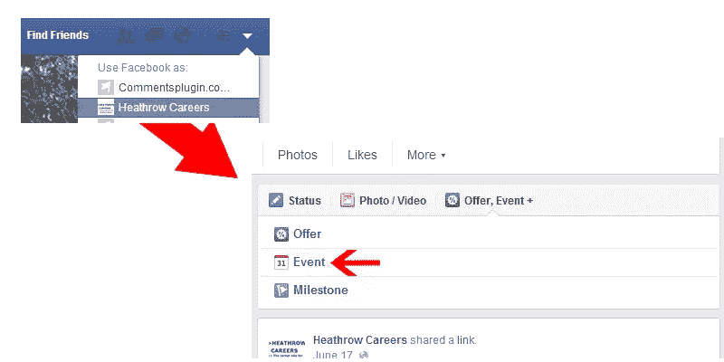
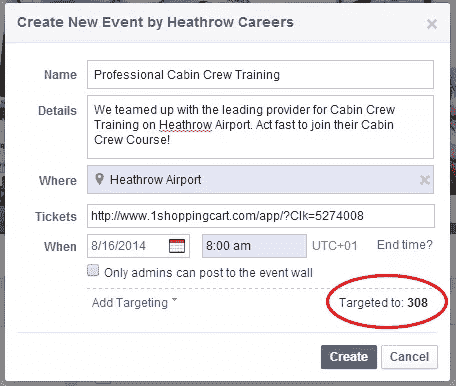
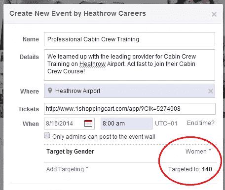
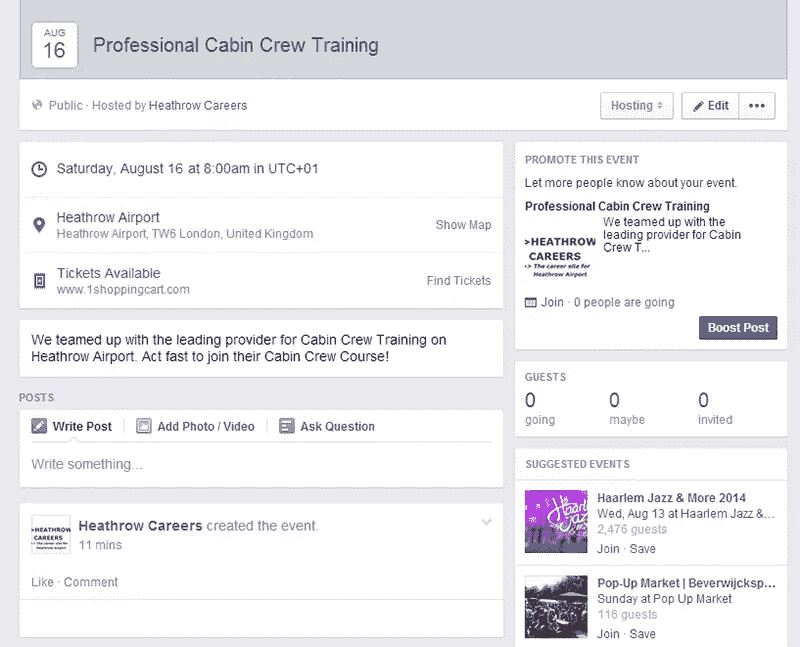
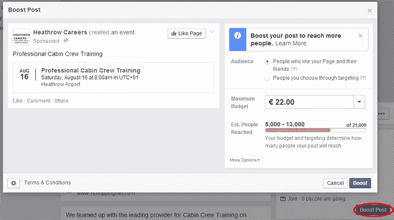
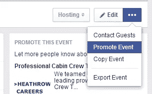
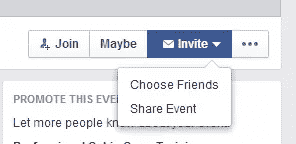

# 使用脸书页面创建和管理事件

> 原文：<https://www.sitepoint.com/invite-fans-facebook-page-event/>

如果你正在运行一个脸书网页，脸书事件是一个伟大的工具，邀请你的球迷到一个特定的事件。脸书最近让你更容易设置一个活动，并邀请你的所有粉丝，或只是一个选择的粉丝。让我们看看它是如何工作的。

## 设置活动

您只能为脸书页面设置活动，而不能为您的个人资料设置活动。所以你首先需要使用“使用脸书作为”功能，并选择你想工作的页面。然后点击“事件”按钮。

在弹出窗口中，您可以填写所有必要的事件详细信息。如你所见，你的活动是针对你所有的粉丝的(如你所见，我目前有 308 个赞)。您可以选择立即将事件添加到您的页面，或者定义更具体的目标。锁定目标并不意味着你接触到了你所有的粉丝，我会在下面解释这一点。

在我的例子中，我选择将我的活动专门针对我的女性粉丝，这降低了目标观众的数量，但可以增加出席率。您还可以瞄准:

*   关系状态
*   教育状况
*   感兴趣
*   年龄
*   位置
*   语言

结合这些定位方法可以降低你的目标粉丝，因为你在细化你的定位。注意:一旦添加了事件，就不能更改目标。

添加活动后，您可以就此打住。但是如果你想增加人们实际参加你的活动的机会，还有一些工作要做。

## 微调和推广您的活动

当您单击活动链接时，您将被带到活动页面。在这里，您可以添加关于活动的附加信息或更新，包括图片，甚至设置投票。您还可以在这里找到您的统计数据或参加活动的人。

有许多方法可以增加接触到的人数。这些方法是:
–宣传你的活动
–为你的活动制作广告
–使用你的个人联系人列表

### 提升您的活动

你可以选择提高你的事件，就像你会与一个正常的职位。您可以指定预算和目标方法。你应该总是给那些已经喜欢你的页面的人一些鼓励，以确保你能接触到所有的人。

脸书不会向所有粉丝展示您的活动。他们使用自己的算法，这是基于参与你的页面。基本上，如果你的页面参与度低，就很难接触到你的观众。

每一页都在争夺相同的眼球，所以脸书必须决定在有限的空间里展示哪一页。宣传你的活动可以增加你在粉丝中的影响力。你也可以选择那些还不是粉丝的潜在参与者。

### 为您的活动制作广告

第二个选择是为你的活动做一个广告。您会在“编辑”按钮旁边的下拉列表中找到“升级”按钮。

使用广告和宣传一个活动没什么不同。主要区别是:
–活动广告允许按点击和印象付费，并有价格控制。提升只允许按印象付费，脸书优化你的花费。

*   一个事件广告被放在右边栏，一个被提升的事件被放在观众的主时间线上。
*   广告事件广告允许附加信息和图片，其中提升的事件将按原样显示。

### 使用您的个人联系人列表

第三种选择的实现方式有点奇怪。您可以使用您的个人联系人列表(您的脸书朋友)发送邀请。为此，您需要采取以下步骤:

1.  切换到通过个人帐户使用脸书
2.  访问添加事件的页面
3.  单击事件链接

你现在可以看到一组新的按钮，最初是“编辑”和“推广”按钮。您可以选择亲自邀请朋友，或在您的日程表上分享活动。

## 结论

脸书非常重视活动功能，它为您提供了一个添加和推广活动的强大工具。如果你想把它做好，可能会花你一些钱。但是脸书营销仍然相对便宜，这不应该阻止你尝试它。

快速提示:我添加的事件实际上不是我自己的事件。它是由我合作的一家公司主办的，每次有人参加，我都会赚取佣金。这是一个以自然的方式推广你的会员链接的完美方式。

注意:脸书在其知识库中有一个关于[创建事件](https://www.facebook.com/help/190903567766714/)的帮助部分，但是非常有限。

## 分享这篇文章