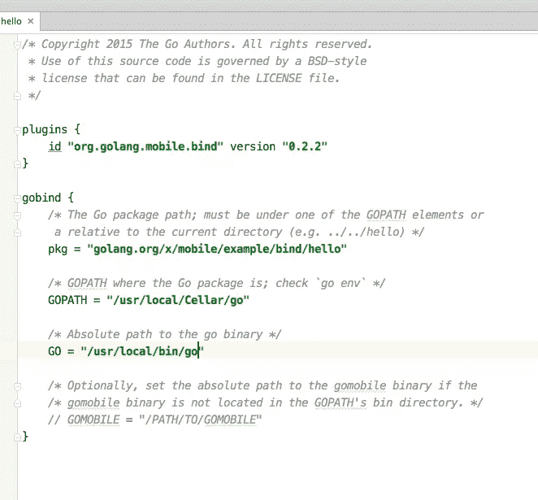
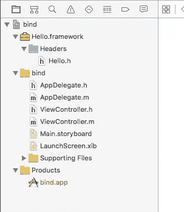

# 用 Go 进行 iOS 和 Android 编程

> 原文：<https://www.sitepoint.com/ios-and-android-programming-with-go/>

虽然 Go 不是一门新语言，但在过去的两年里，它已经引起了很多人的兴趣，使用这种语言的大项目的数量也在迅速增长。我写了一篇关于 SitePoint 语言的介绍性文章，偶然发现了移动支持的内容，所以我想我应该看看这种可能性。

我最兴奋的是看到 Android 上的 Go 支持是什么样的，因为它们都是谷歌的技术，并且已经有开发者支持一种语言来取代 Java。

## 入门指南

您需要安装 GoLang 1.5+。

接下来安装 [GoMobile](https://godoc.org/golang.org/x/mobile/cmd/gomobile) 工具，该工具可以编译并运行 Android 和 iOS 上已有的 Go 应用程序:

```
go get golang.org/x/mobile/cmd/gomobile
gomobile init
```

我们将在*GoLang**Install*dir/src/GoLang . org/x/mobile/example/中引用 gomobile 包附带的示例应用程序。如果您没有安装它们，请使用以下命令获取它们:

```
go get -d golang.org/x/mobile/example/basic
```

## 构建并安装本地 Go 应用程序

对于许多应用程序用例来说，编译到本机应用程序并忽略平台库和接口可能没问题。如果是这样的话，编译现有的 Go 代码就很简单了，只需要一部分可用的功能。这包括:

*   应用程序控制和配置
*   OpenGL ES 2 绑定
*   资产管理
*   事件管理
*   实验包包括 OpenAL 绑定、音频、字体、精灵和运动传感器

我们将使用一个预先存在的 gomobile 示例来逐步完成这个过程，但是这些可以用您自己的项目文件来替换。

### 机器人

#### 打造一个安卓 APK

```
gomobile build -target=android golang.org/x/mobile/example/basic
```

#### 部署到设备

```
gomobile install golang.org/x/mobile/example/basic
```

### ios

#### 构建一个 iOS IPA

```
gomobile build -target=ios golang.org/x/mobile/example/basic
```

#### 部署到设备

在 iOS 上没有与在 Android 上相同的部署命令，所以在创建了上面的应用程序后，你必须按照你自己喜欢的方式将其复制到设备或仿真器，例如 [ios-deploy](https://github.com/phonegap/ios-deploy) 工具。

对于一些更令人兴奋的事情，也可以用上面的*golang.org/x/mobile/example/audio*的例子来尝试这些步骤。

让我们来看看音频示例的内部(我不会在这里重复完整的代码)，你不需要对 GoLang 过于熟悉(我不是)，这更多的是看什么是可能的。

首先，您会看到一组导入语句:

```
import (
...
    "golang.org/x/mobile/app"
    "golang.org/x/mobile/asset"
...
)
```

如果你仔细研究在*GoLang**Install*dir/src/GoLang . org/x/mobile/*中导入的文件夹和文件，你会注意到用你的代码编译的各种 Java 和 Objective-C 文件。

进一步挖掘，您会看到代码中导入和使用的一些类的引用，比如`app`和`glctx`。

## 走向本土化

我们可以在 Go 中编码并构建一个紧凑和优化的原生应用程序，但现在它还不是非常“像原生的”，因为所有需要的支持库只在 Java 和 Objective-C / Swift 中可用。我们如何改善这种体验？

Go Mobile 团队创建了另一个选项，在本地应用程序中使用 Go 包(您的应用程序)。非常适合共享一些常见的 Go 代码和绑定到本机代码。这很容易开始，但从长远来看维护起来可能很复杂。

### 机器人

如果你用的是 Android Studio，从 *GoLang* *导入参考项目，安装*dir/src/GoLang . org/x/mobile/example/bind/Android，打开*build . grade(Module:hello)*文件更新你的`GOPATH`和`GO`路径，这里是我的(我用家酿安装了 GoLang):



同步梯度和应用程序，然后部署到模拟器或设备。

**注意:**目前这仅在基于 ARM 的设备和仿真器上受支持。

让我们看看 Java 和 Go 代码:

*MainActivity.java*

```
package org.golang.example.bind;

import android.app.Activity;
import android.os.Bundle;
import android.widget.TextView;

import go.hello.Hello;

public class MainActivity extends Activity {

    private TextView mTextView;

    @Override
    protected void onCreate(Bundle savedInstanceState) {
        super.onCreate(savedInstanceState);
        setContentView(R.layout.activity_main);
        mTextView = (TextView) findViewById(R.id.mytextview);

        // Call Go function.
        String greetings = Hello.Greetings("Android and Gopher");
        mTextView.setText(greetings);
    }
}
```

*src/golang . org/x/mobile/example/bind/hello/hello . go*

```
package hello

import "fmt"

func Greetings(name string) string {
    return fmt.Sprintf("Hello, %s!", name)
}
```

go 文件通过`import go.hello.Hello`导入，其中的`Greetings`函数可通过`Hello.Greetings`在 Java 文件中访问。不需要太多额外的步骤，go 函数和原生 UI 元素之间的绑定是可能的。

### ios

将 iOS 应用程序绑定到 Go 需要不同的步骤。首先执行以下命令:

```
cd GoLang_Install_dir/src/golang.org/x/mobile/example/bind
gomobile bind -target=ios golang.org/x/mobile/example/bind/hello
```

这将在当前文件夹中创建一个名为 *Hello.framework* 的框架包，我们可以在我们的项目中使用它。

打开位于 *GoLang* *的示例 iOS 项目，在 Xcode 中安装*dir/src/GoLang . org/x/mobile/example/bind/iOS/bind . Xcode proj，并将 *Hello.framework* 拖到项目中，选中<q>如果需要的话复制项目</q>。这将产生以下文件夹结构:



构建并运行应用程序，该应用程序很像 Android 应用程序，将 Go 方法调用到 Objective-C 代码中。

让我们看看代码:

```
#import "ViewController.h"
#import "hello/Hello.h"  // Gomobile bind generated header file in hello.framework

@interface ViewController ()
@end

@implementation ViewController

@synthesize textLabel;

- (void)loadView {
    [super loadView];
    textLabel.text = GoHelloGreetings(@"iOS and Gopher");
}

@end
```

`#import "hello/Hello.h"`导入之前生成的框架文件，`textLabel.text = GoHelloGreetings(@"iOS and Gopher");`调用它公开的函数来设置标签变量。

可以在基于 Swift 的项目中使用相同的自动生成的 [Objective-C 框架文件，然后使用类似如下的内容:](https://developer.apple.com/library/ios/documentation/Swift/Conceptual/BuildingCocoaApps/MixandMatch.html)

```
let msg = Hello.GoHelloGreetings("gopher")
```

## 值得吗？

嗯，简而言之，大概不会。如果你已经在用 Go 编写你的应用程序，并且你对非本地的界面没有问题，那么没有什么可以阻止你，因为你可以看到用 Go 编写的本地应用程序很容易构建和部署。如果您愿意采取额外的步骤来遵循绑定选项，那么您可以更进一步，但仍然在某些限制内。

如果您不使用 Go，那么它可能还不值得考虑作为一个移动原生编程选项。但是我仍然强烈地感觉到有足够的潜力和兴趣让它在不远的将来成为可能，当然，我很乐意听到你的意见。

## 分享这篇文章