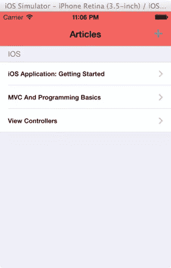
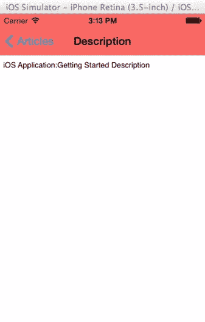
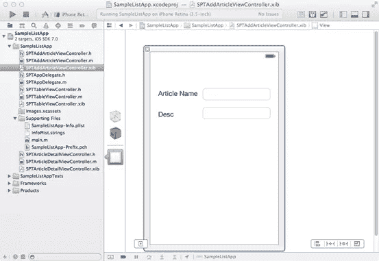
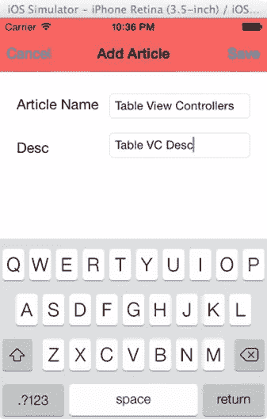

# iPhone 应用程序开发–模态和导航视图控制器

> 原文：<https://www.sitepoint.com/ios-application-development-modal-navigation-view-controllers/>

在我的[上一篇文章](https://www.sitepoint.com/mobile/ios/)中，我们使用表格视图控制器创建了一个列表应用程序。在本教程中，我们将创建一个模态视图控制器，将项目添加到列表中，并通过导航到另一个视图控制器来查看每个项目的详细信息。

打开“SampeListApp”应用程序。

让我们首先修改用于填充列表的数组，使它更合理一些。

创建一对包含两个条目的字典，关键字是“文章”和“Desc”，对象是文章的名称及其描述。

用于填充表格视图的数组“arrItems”不再是一个静态数组，因为我们将不断向数组中添加条目。所以改成' NSMutableArray '

表格视图控制器位于导航控制器内部。所以我们可以借助表格视图控制器的 title 属性来设置导航栏的标题。

我们还可以从添加到导航控制器堆栈的任何视图控制器中访问导航栏和导航项目。

我们还将改变导航栏的色调，并为其添加一个导航项'+'。我们将通过捕获这个导航项目的 click 事件向列表中添加项目。

执行上述更改后，您的“viewDidLoad”方法应该如下所示:

**SPTTableViewController.m**

```
- (void)viewDidLoad
{
    [super viewDidLoad];

    self.title = @"Articles";

    self.navigationController.navigationBar.barTintColor = [UIColor redColor];

    self.navigationItem.rightBarButtonItem = [[UIBarButtonItem alloc] initWithBarButtonSystemItem:UIBarButtonSystemItemAdd target:self action:@selector(addArticle)];

    NSDictionary *dictIosArticle1 = [[NSDictionary alloc] initWithObjects:[NSArray arrayWithObjects:@"iOS Application: Getting Started", @"iOS Application:Getting Started Description",nil] forKeys:[NSArray arrayWithObjects:@"Article",@"Desc", nil]];
    NSDictionary *dictIosArticle2 = [[NSDictionary alloc] initWithObjects:[NSArray arrayWithObjects:@"MVC And Programming Basics", @"MVC And Programming Basics Desc",nil] forKeys:[NSArray arrayWithObjects:@"Article",@"Desc", nil]];
    NSDictionary *dictIosArticle3 = [[NSDictionary alloc] initWithObjects:[NSArray arrayWithObjects:@"View Controllers", @"View Controllers Desc",nil] forKeys:[NSArray arrayWithObjects:@"Article",@"Desc", nil]];

    arrItems = [[NSMutableArray alloc] initWithObjects:dictIosArticle1,dictIosArticle2,dictIosArticle3, nil];
}
```

请注意，我们已经为导航项“Add”添加了一个 click 事件处理程序，并且还将目标设置为“self”

我们将在本教程的后面部分看到该方法的实现。

将 tableview 中的节数保持为 1。

更改“cellForRowAtIndexPath”方法以显示项目的名称。我们还将更改字体大小，并显示一个显示指示器来表示导航。

**SPTTableViewController.m**

```
- (UITableViewCell *)tableView:(UITableView *)tableView cellForRowAtIndexPath:(NSIndexPath *)indexPath
{
    static NSString *CellIdentifier = @"Cell";
    UITableViewCell *cell = [tableView dequeueReusableCellWithIdentifier:CellIdentifier];
    if (cell == nil) {
        cell = [[UITableViewCell alloc] initWithStyle:UITableViewCellStyleDefault reuseIdentifier:CellIdentifier];
    }

    NSDictionary *dictTmp = [arrItems objectAtIndex:indexPath.row];
    cell.textLabel.text = [dictTmp objectForKey:@"Article"];

    cell.textLabel.font = [UIFont boldSystemFontOfSize:12.0];
    cell.accessoryType = UITableViewCellAccessoryDisclosureIndicator;
    return cell;
}
```

让我们再实现两个协议方法来显示该部分的标题。应该对表格视图样式进行分组，以使部分标题可见。

**SPTTableViewController.m**

```
- (NSString *)tableView:(UITableView *)tableView titleForHeaderInSection:(NSInteger)section
{
    return @"iOS";
} 
- (CGFloat)tableView:(UITableView *)tableView heightForHeaderInSection:(NSInteger)section
{
    return 30.0f;
}
```

现在在 iOS 7 模拟器中运行应用程序



创建平面视图控制器“SPTArticleDetailViewController”以显示项目的说明。

在视图中放置一个“UITextView ”,并为其映射一个 outlet“txt details”。

在属性检查器的帮助下，尝试使文本视图不可编辑和不可选择。

使用@property 和@ synthesize 声明创建一个字符串变量“strDesc ”,以保存“SPTArticleDetailViewController”类中的描述详细信息。

在“viewDidLoad”方法中设置此视图控制器的标题

```
self.title = @"Description";
```

“txtDetails”文本应该是字符串“strDesc”的值，该值可以在“viewWillAppear”方法中设置

**SPTArticleDetailViewController.m**

```
- (void) viewWillAppear:(BOOL)animated
{
    [super viewWillAppear:YES];
    self.txtDetails.text = strDesc;
}
```

“strDesc”值将是文章的描述，并且应该在我们将“SPTArticleDetailViewController”推入导航堆栈之前在“SPTTableViewController”中设置。

在选择列表项时调用的“SPTTableViewController.m”文件中的方法“didSelectRowAtIndexpath”应更改如下。

**SPTTableViewController.m**

```
- (void)tableView:(UITableView *)tableView didSelectRowAtIndexPath:(NSIndexPath *)indexPath
{

    SPTArticleDetailViewController *detailViewController = [[SPTArticleDetailViewController alloc] initWithNibName:@"SPTArticleDetailViewController" bundle:nil];

    // Pass the selected object to the new view controller.

    NSDictionary *dictTemp = [arrItems objectAtIndex:indexPath.row];
    detailViewController.strDesc = [dictTemp objectForKey:@"Desc"];

    // Push the view controller.
    [self.navigationController pushViewController:detailViewController animated:YES];
}
```

不要忘记在“SPTTableViewController.m”文件中导入“SPTArticleDetailViewController”头文件。否则，将会引发错误。

“pushViewController”方法有助于将视图控制器推送到导航堆栈。

在模拟器中运行应用程序，并选择每个列表项。详细信息屏幕应该如下所示



当你按下“文章”按钮时，iOS 会自动弹出当前可见的视图控制器。

如果有这么多级别的导航，并且如果您想通过从导航堆栈中移除所有顶级视图控制器来直接移动到某个视图控制器或根视图控制器，那么可以使用以下两种方法。

```
- (NSArray *)popToViewController:(UIViewController *)viewController animated:(BOOL)animated; 
- (NSArray *)popToRootViewControllerAnimated:(BOOL)animated;
```

这些方法返回一组弹出的视图控制器。

如下所示，再创建一个视图控制器' SPTAddArticleViewController '



为文本字段映射出口。

我们将把这个视图控制器放在一个导航控制器中，并在导航栏中添加保存和取消按钮。

也添加按钮动作。

创建一个保存文章的协议。我们将把保存操作委托给“SPTTableViewController”

最后,' SPTAddArticleViewController.h '应该如下所示

**sptaddarticleviewcontroller . h**

```
@protocol SPTAddArticleDelegate <NSObject>

-(void) addArticleName:(NSString *)strName andArticleDesc:(NSString *) strArticleDesc;

@end

@interface SPTAddArticleViewController : UIViewController
@property (weak, nonatomic) IBOutlet UITextField *txtArticleName;
@property (weak, nonatomic) IBOutlet UITextField *txtArticleDesc;
@property (unsafe_unretained) id <SPTAddArticleDelegate> delegate;
- (void)saveAction;
- (void) cancelAction;
@end
```

包含委托属性的@ synthesize 声明。

在“viewDidLoad”方法中添加保存和取消按钮

**sptaddarticleviewcontroller . m**

```
- (void)viewDidLoad
{
    [super viewDidLoad];
    self.title = @"Add Article";
    self.navigationController.navigationBar.barTintColor = [UIColor redColor];
    self.navigationItem.leftBarButtonItem = [[UIBarButtonItem alloc] initWithBarButtonSystemItem:UIBarButtonSystemItemCancel target:self action:@selector(cancelAction)];
    self.navigationItem.rightBarButtonItem = [[UIBarButtonItem alloc] initWithBarButtonSystemItem:UIBarButtonSystemItemSave target:self action:@selector(saveAction)];
}
```

现在，按如下方式更改保存和取消操作。看看动作是如何在“saveAction”方法中委托的。

**sptaddarticleviewcontroller . m**

```
- (void)saveAction {

    [self dismissViewControllerAnimated:YES completion:nil];

    if((![self.txtArticleName.text isEqualToString:@""]) &&(![self.txtArticleDesc.text isEqualToString:@""]))
    {
        if([self.delegate respondsToSelector:@selector(addArticleName:andArticleDesc:)])
        {
            [self.delegate addArticleName:self.txtArticleName.text andArticleDesc:self.txtArticleDesc.text];
        }
    }
}

- (void)cancelAction{
    [self dismissViewControllerAnimated:YES completion:nil];

}
```

“dismissViewController”方法用于关闭显示的视图控制器“SPTAddArticleViewController”

“SPTTableViewController”类应该采用如下所示的协议

**SPTTableViewController.h**

```
#import "SPTAddArticleViewController.h"

@interface SPTTableViewController : UITableViewController<SPTAddArticleDelegate>
@property (nonatomic,strong) NSMutableArray *arrItems;
@end
```

在“SPTTableViewController.m”文件中，创建对“SPTAddArticleViewController”的私有引用

**SPTTableViewController.m**

```
@interface SPTTableViewController ()

@property(nonatomic,strong) SPTAddArticleViewController *addController;

@end

@implementation SPTTableViewController
@synthesize arrItems,addController;
```

实现协议方法

**SPTTableViewController.m**

```
-(void) addArticleName:(NSString *)strName andArticleDesc:(NSString *) strArticleDesc
{
    NSMutableDictionary *mutDict = [[NSMutableDictionary alloc] init];
    [mutDict setObject:strName forKey:@"Article"];
    [mutDict setObject:strArticleDesc forKey:@"Desc"];
    [arrItems addObject:mutDict];
    [self.tableView reloadData];
}
```

“reloadData”方法有助于用新的数据源或修改后的数组重新加载表视图。

最后一步是在 SPTTableViewController 中单击“+”或“添加”按钮时显示“SPTAddArticleController”。

应该实现“addArticle”函数来告别本教程

**SPTTableViewController.m**

```
-(void) addArticle
{
    addController = [[SPTAddArticleViewController alloc] initWithNibName:@"SPTAddArticleViewController" bundle:nil];
    addController.delegate = self;

    UINavigationController *navController = [[UINavigationController alloc] initWithRootViewController:addController];

    [self presentViewController:navController animated:YES completion:nil];
}
```

控制器已将其自身声明为“SPTAddArticleViewController”的委托

“presentViewController”方法有助于呈现模式视图控制器。

在模拟器中运行应用程序，单击 Add 按钮并检查这个模态视图控制器。



## 结论

当我们到达本教程的结尾时，我希望你对 iOS 中的一些概念更加清楚。

你可以[在这里](https://uploads.sitepoint.com/wp-content/uploads/2013/10/SampleListApp.zip)下载完整的代码示例。

我们将在我的下一篇文章中探讨另一个有趣的话题。

## 分享这篇文章