# iPhone 应用程序开发–故事板

> 原文：<https://www.sitepoint.com/ios-application-development-storyboards/>

在我的[之前的教程](https://www.sitepoint.com/mobile/ios/)中，我们在 XIBs 的帮助下开发了一个应用‘SampleListApp’。在本教程中，我们将在故事板的帮助下重新创建相同的应用程序。

## 什么是故事板？

故事板是应用程序中所有屏幕的可视化表示。它还告诉您各种屏幕之间的转换。

故事板被表示为场景和片断。

**场景**指的是单个视图或视图控制器。每个场景都有一个 dock，用于在视图及其视图控制器之间建立出口和动作连接。

一个**片段**管理两个场景之间的转换。通过按 ctrl 键并从一个场景拖动到另一个场景来建立一个片段。在 segue 的帮助下，可以很容易地将视图控制器推送到导航栈，并在单击按钮时呈现模态视图控制器，从而减少了编码的需要。

整个应用程序流可以在故事板文件中看到。

## 示例应用程序

使用“空应用程序”模板创建新的应用程序“SampleListAppNew”。

创建我们在之前的教程中创建的所有视图控制器(SPTTableViewController，sptartickedetailsviewcontroller，SPTAddArticleViewController)。不要在这些类文件中修改或添加任何代码。保留所有类文件的默认实现。我们将添加代码，当我们以前的项目需要时。

让我们创建一个新的故事板文件，并将其命名为“MainStoryboard”。

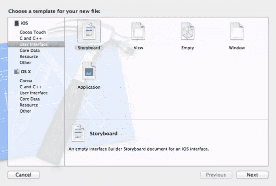

选择“SampleListAppNew-Info.plist”并添加一个新属性“主故事板文件基本名称”并将值设置为“Main storyboard”。

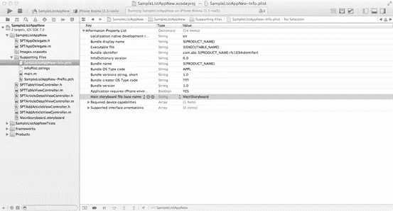

将“SPTAppdelegate.m”中的“application:didFinishLaunching”方法更改如下。

```
- (BOOL)application:(UIApplication *)application didFinishLaunchingWithOptions:(NSDictionary *)launchOptions
{
    return YES;
}
```

我们之前添加的应用程序属性列表中的新属性足以将故事板中的初始视图控制器的视图放入 UIWindow 对象中。所以在上面的 addpdelegate 的 applaunch 方法中不需要额外的编码。

现在，选择“MainStoryboard.storyboard”文件，并从对象库中拖动一个导航控制器。

选择“导航控制器场景”。属性检查器中的“是初始视图控制器”选项被选中，以指示这是应该加载的第一个视图控制器。

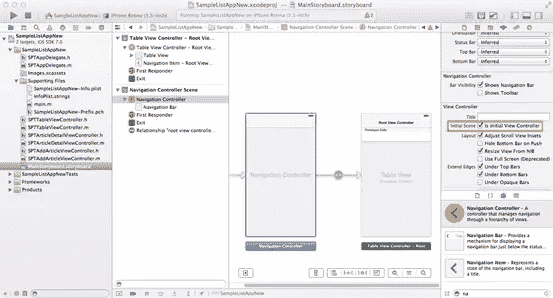

表格视图控制器被设置为导航控制器的根视图控制器。该关系在导航控制器场景下指定。我们应该将根视图控制器更改为“SPTTableViewController ”,如下所示。

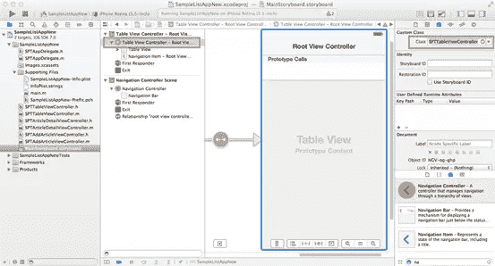

在导航控制器场景中选择导航栏，并按如下所示更改色调。

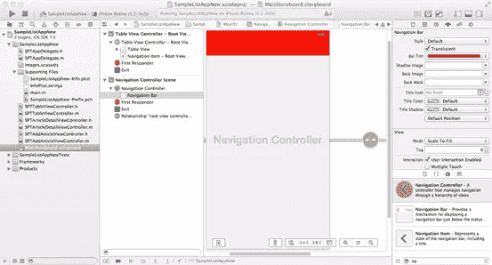

在表格视图控制器场景中进行以下更改。

选择导航项目，并使用属性检查器将其标题更改为“文章”。

选择表格视图，并使用属性检查器更改成组的样式

选择表格视图单元格，并将样式设置为“基本”,将附件设置为“显示指示器”,将单元格标识符设置为“文章单元格”

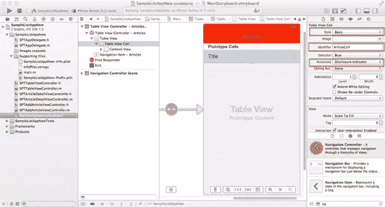

选择“内容视图”和“标签”,并更改字体大小。

从对象库中拖动一个条形按钮项目。将其放在导航栏上，并将其标识符更改为“添加”。

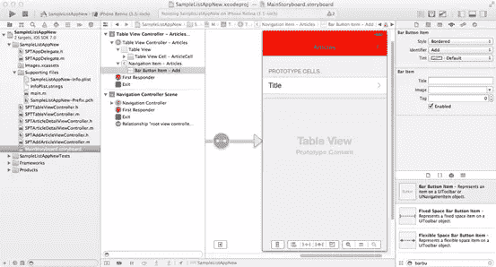

在“SPTTableViewController”类的“viewDidLoad”方法中包含用于填充上一教程中的表视图中的数据的数组和字典。“viewDidLoad”方法中包含的导航栏相关设置应该省略，因为我们已经在故事板文件中完成了所有更改。

您的“viewDidLoad”方法应该如下所示。

```
- (void)viewDidLoad
{
    [super viewDidLoad];

    NSDictionary *dictIosArticle1 = [[NSDictionary alloc] initWithObjects:[NSArray arrayWithObjects:@"iOS Application: Getting Started", @"iOS Application:Getting Started Description",nil] forKeys:[NSArray arrayWithObjects:@"Article",@"Desc", nil]];
    NSDictionary *dictIosArticle2 = [[NSDictionary alloc] initWithObjects:[NSArray arrayWithObjects:@"MVC And Programming Basics", @"MVC And Programming Basics Desc",nil] forKeys:[NSArray arrayWithObjects:@"Article",@"Desc", nil]];
    NSDictionary *dictIosArticle3 = [[NSDictionary alloc] initWithObjects:[NSArray arrayWithObjects:@"View Controllers", @"View Controllers Desc",nil] forKeys:[NSArray arrayWithObjects:@"Article",@"Desc", nil]];
    arrItems = [[NSMutableArray alloc] initWithObjects:dictIosArticle1,dictIosArticle2,dictIosArticle3, nil];
}
```

包括来自[前一示例](https://www.sitepoint.com/mobile/ios/)的表视图的数据源和委托实现。

不要包括“table view:didSelectRowAtIndexPath”方法。

“table view:cellforrowatdinexpath”方法应更改如下

```
- (UITableViewCell *)tableView:(UITableView *)tableView cellForRowAtIndexPath:(NSIndexPath *)indexPath
{
    static NSString *CellIdentifier = @"ArticleCell";
    UITableViewCell *cell = [tableView dequeueReusableCellWithIdentifier:CellIdentifier forIndexPath:indexPath];

    // Configure the cell...

    NSDictionary *dictTmp = [arrItems objectAtIndex:indexPath.row];
    cell.textLabel.text = [dictTmp objectForKey:@"Article"];
    return cell;
}
```

在 iOS 7 模拟器中运行应用程序

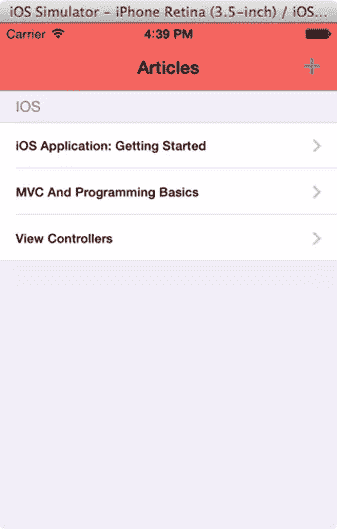

在“MainStoryboard”文件中拖动 UIViewController 对象。请将其源类更改为“SPTArticleDetailViewController”。

选择 UITableViewCell。CTRL +从单元格拖放到 SPTArticleDetailViewController。从弹出菜单中选择“推送选择”序列。

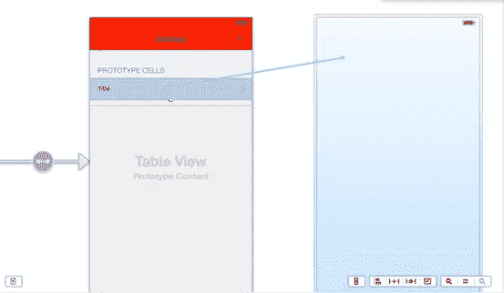
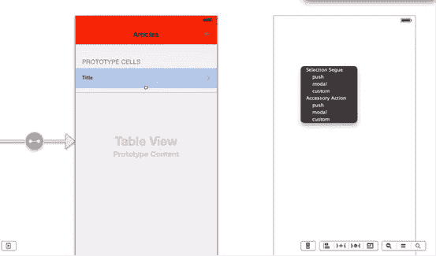


选择推送序列，并将标识符命名为“ArticleDesc”

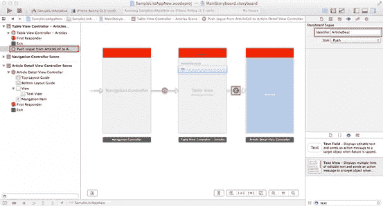

将“文章细节视图控制器”场景的标题设置为“描述”。添加文本视图并为其映射 outlet“txt details”。

包含上一教程中“SPTArticleDetailViewController”类的代码。不需要在代码中设置导航栏的标题。

为了将值从“SPTTableViewController”传递到“SPTArticleDetailViewController”，我们必须在“SPTTableViewController.m”中实现以下方法。

```
- (void)prepareForSegue:(UIStoryboardSegue *)segue sender:(id)sender
{

        if ([segue.identifier isEqualToString:@"ArticleDesc"]) {
            SPTArticleDetailViewController *detailViewController = (SPTArticleDetailViewController *)segue.destinationViewController;

            NSIndexPath *indexPath = [self.tableView indexPathForSelectedRow];
            NSDictionary *dictTemp = [arrItems objectAtIndex:indexPath.row];
            detailViewController.strDesc = [dictTemp objectForKey:@"Desc"];
        }

}
```

现在运行应用程序并检查导航是否正常工作。

在情节提要文件中拖动导航控制器。删除默认的根视图控制器，并从对象库中添加一个视图控制器。通过 ctrl +从导航控制器拖动到视图控制器来创建一个“根视图控制器”片段。将视图控制器的类设置为“SPTAddArticleViewController”。

更改导航栏色调颜色。

将标题更改为“添加文章”。

添加保存和取消按钮，以及映射插座动作。

添加文本字段，地图出口，包括保存和取消按钮动作实现类似于上一篇文章。

创建一个从“SPTTableViewController”中的“+”或“Add”按钮到新添加的导航控制器的“模态”序列。

最终的故事板文件应该如下所示。

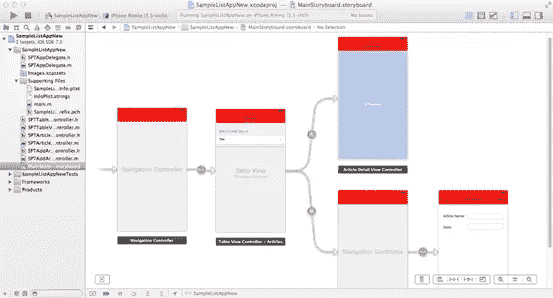

选择“Modal”段，并将标识符命名为“AddArticle”。

在“SPTTableViewController”类中包含委托实现。

还有一件事要做。“SPTTableViewController”应将其自身声明为“SPTAddArticleViewController”的委托。这可以在“prepareForSegue”方法中完成。

因此，该方法应更改如下

```
- (void)prepareForSegue:(UIStoryboardSegue *)segue sender:(id)sender
{
    if ([segue.identifier isEqualToString:@"ArticleDesc"]) {
        SPTArticleDetailViewController *detailViewController = (SPTArticleDetailViewController *)segue.destinationViewController;

        NSIndexPath *indexPath = [self.tableView indexPathForSelectedRow];
        NSDictionary *dictTemp = [arrItems objectAtIndex:indexPath.row];
        detailViewController.strDesc = [dictTemp objectForKey:@"Desc"];
    }
    else if([segue.identifier isEqualToString:@"AddArticle"])
    {

        UINavigationController *navigationController = segue.destinationViewController;
        SPTAddArticleViewController *addArticleController = (SPTAddArticleViewController *)[[navigationController viewControllers] objectAtIndex:0];
        addArticleController.delegate = self;
    }

}
```

现在在模拟器中运行应用程序，并检查所有转换。

## 结论

我们已经学会了使用 XIB 和故事板开发应用程序。开发应用程序时，选择对您来说更容易的方法。

在这里下载本教程中的所有代码。

下一篇教程中会有更多内容。

## 分享这篇文章