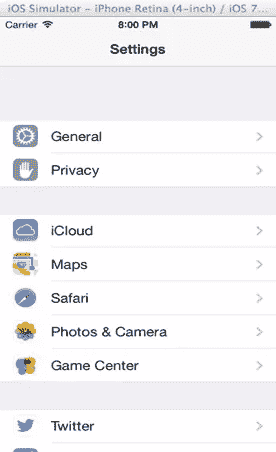
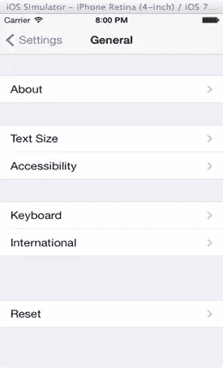
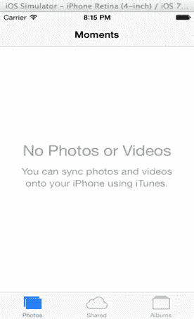
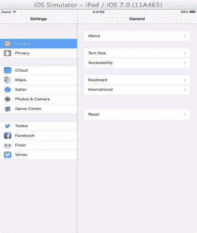
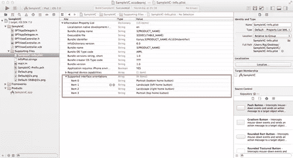

# iPhone 应用程序开发–查看控制器

> 原文：<https://www.sitepoint.com/ios-application-development-view-controllers/>

在本文中，我们将研究视图控制器及其生命周期。

## 什么是视图控制器？

视图控制器执行应用程序逻辑，并帮助管理应用程序中的视图和数据。

iOS 中所有控制器的基类都是`UIViewController`。因此，我们在应用程序中创建的定制控制器也应该是`UIViewController`的子类。

`UIViewController`将始终有一个对顶级`UIView`的引用。

```
@property(nonatomic,retain) UIView *view;
```

你可以在`UIViewController`的头文件中找到上面一行。按下`cmd`然后点击 XCode 中的`UIViewController`来访问它的头文件。

## 特殊视图控制器

iOS SDK 中有一些特殊的视图控制器，用于管理控制器集合。我们可以使用这些控制器来创建标准的 iOS 用户界面。

### UINavigationController

管理 MVC 的导航流或层次流。控制器以堆栈的形式排列。

例如:iPhone 中的设置应用程序。

当您按下任何设置选项，它导航到下一页。在内部，您将视图控制器推送到堆栈上。





### UITabBarController

管理 MVC 的集合。选项卡将显示在屏幕的底部，每个选项卡对应一个 MVC。一次只显示一个 MVC。

示例:照片应用程序

检查屏幕底部的选项卡。



### UISplitViewController

一次管理两个 MVC。它包含一个主视图控制器和一个细节视图控制器。屏幕分为两部分，显示两个控制器。这个控制器是专为 iPad 设计的。

示例:iPad 设置应用程序



## 查看控制器生命周期

以下方法构成了视图控制器的生命周期。

生命周期从以下初始化方法开始。

### initwitchnibname:bundle

*   视图控制器的默认初始化器。
*   `NSBundle` object 表示文件系统中应用资源(如图像文件、nib 文件、可执行文件、本地化文件等)的位置。，被存储。
*   `nibName`代表界面构建器文件(。xib)对应的控制器。
*   `Bundle`代表笔尖文件的位置
*   所以`UIViewcontroller`试图从 nib 或 xib 文件中获取视图。如果 nib 名称是 nil，它使用控制器的名称作为 nib 名称，如果 bundle 是 nil，它在 resources 文件夹中查找 nib 文件。

```
- (id)initWithNibName:(NSString *)nibNameOrNil bundle:(NSBundle *)nibBundleOrNil
{
    self = [super initWithNibName:nibNameOrNil bundle:nibBundleOrNil];
    if(self != nil)
    {
     // Any other initialization
    }
    return self;
}
```

### Loadview

当请求 View 属性并且该属性为零时，视图控制器调用此方法。

加载视图的默认实现执行以下任一操作

*   从故事板或 nib 文件加载视图
*   如果没有 nib 文件或故事板，它会生成一个空的`UIView`对象，并将其分配给视图控制器的视图属性

我们可以覆盖加载视图，并将我们自己的定制视图设置为视图控制器的视图。但是不要从被覆盖的 load view 方法中调用 super 方法，因为 super 类将执行不需要的默认实现。

```
- (void)loadView
{

// Set your custom view
    CustomView *cView = [[CustomView alloc] initWithFrame:CGRectZero];
    cView.backgroundColor = [UIColor whiteColor];
    self.view = cView;

}
```

### viewDidLoad

*   实例化并设置好网点后，调用`viewDidLoad`方法。
*   作为一个经验法则，我们将给 super class 一个机会在下面给出的所有生命周期方法中做任何额外的设置。
*   这是编写整个初始设置代码的地方。
*   请记住，视图的几何图形不是用这种方法设置的。在这种方法中，视图的几何图形取自故事板或 nib 文件。但是设备和它的实际方位可以不同。所以不要在这里做几何相关的东西。
*   它只被调用一次，除非你的视图被释放。

```
- (void)viewDidLoad
{
    [super viewDidLoad];

	// Do any additional setup after loading the view, typically from a nib.
}
```

### 视图将出现

这是在视图出现在屏幕上之前调用的。动画变量指定您希望视图是立即出现还是以动画方式出现。

您的视图可能会在应用程序中多次出现和消失。因此，每当您的视图将要出现在屏幕上时，就会调用这个方法。

与几何相关的初始化和基于其他屏幕中的变化或数据变化更新视图的代码可以在这里完成。

```
-(void) viewWillAppear:(BOOL)animated
{
    [super viewWillAppear:YES];

}
```

### 视图将消失

这是在视图从屏幕上消失之前调用的。

可以在这里编写保存视图中的数据或保存视图状态的代码。如果需要，也可以在这里清理代码。

记住不要在所有这些方法中加入任何耗时或昂贵的操作

```
-(void) viewWillDisappear:(BOOL)animated
{
    [super viewWillDisappear:YES];

}
```

### 视图消失和视图消失

顾名思义，这两个方法是在视图从屏幕上出现或消失后调用的

```
- (void)viewDidAppear:(BOOL)animated;
- (void)viewDidDisappear:(BOOL)animated;
```

### 自动旋转

当设备旋转时，顶级视图控制器也应该将其边界重定向到设备方向。

以下步骤可以实现这一点。

视图控制器应该在`shouldAutorotate`方法中返回`YES`。

```
-(BOOL) shouldAutorotate
{
    return YES;
}
```

`supportedOrientations`应该在视图控制器中定义

```
- (NSUInteger)supportedInterfaceOrientations
{
    return UIInterfaceOrientationMaskAll;
}
```

应用程序还应允许旋转到可在`info.plist`文件中指定的方向



每当轮换将要或已经发生时，都会触发以下通知

```
- (void)willRotateToInterfaceOrientation:(UIInterfaceOrientation)toInterfaceOrientation duration:(NSTimeInterval)duration;
- (void)didRotateFromInterfaceOrientation:(UIInterfaceOrientation)fromInterfaceOrientation;
```

我们可以用这种方法指定子视图的布局。这也可以通过自动布局技术来完成，这将帮助我们在布局约束的帮助下指定子视图的布局。

### didReceiveMemoryWarning

当应用程序耗尽内存时，视图控制器将在该方法的帮助下得到通知，并且该方法将被触发。

如果您在应用程序中使用了太多的图像或媒体文件，并且所有这些文件都在内存中，就有可能发生这种情况。如果这些文件没有被使用，并且可以被重新创建，我们应该将指向这些文件的指针设置为 nil。

```
- (void)didReceiveMemoryWarning
{
    [super didReceiveMemoryWarning];
    // Dispose of any resources that can be recreated.
}
```

## 结论

现在您已经了解了视图控制器，我们将在下一篇文章中讨论一些例子。

## 分享这篇文章