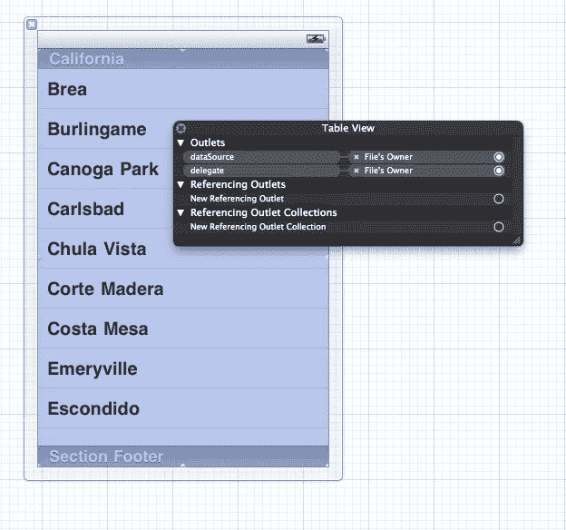
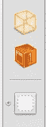
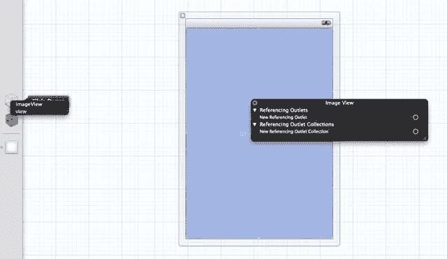
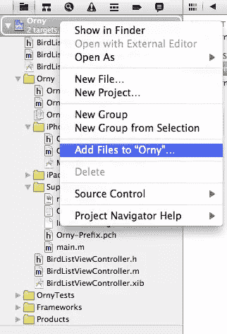
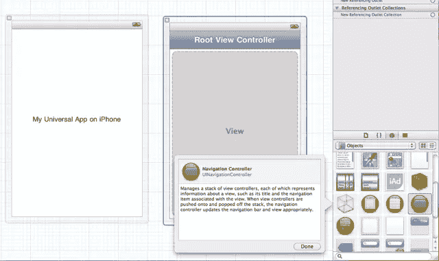

# 一个互动的 Orny

> 原文：<https://www.sitepoint.com/ios-development-basics-orny-2/>

这是正在进行的系列的第三部分。你可能希望阅读或回顾前面关于 [iOS 开发基础](https://www.sitepoint.com/mobile/ios/)和[带有美味 UI 的 iOS 应用](https://www.sitepoint.com/mobile/ios/)的章节。随着 [Orny](https://www.sitepoint.com/mobile/ios/) 系列的继续，我们将开发一个名为“Orny”的应用。我们在上一篇文章中没有真正解释它，但简单地说，它是一个工具…

*   允许鸟类学家(或准鸟类学家)查找鸟类
*   使鸟类学家能够拍摄和跟踪鸟类的照片(以及它们的位置)
*   能够与鸟类学团体(以及其他团体)共享这些数据

随着我们的学习，我们将逐步增强应用程序，从非常简单的东西开始，最终以可以在应用程序商店发布的东西结束。请注意，我不是设计师，应用程序可能不会看起来那么漂亮。这是突破口。

### 安装

这一次，我们将在之前项目的基础上继续努力。您可以从 [Github BuildMobile 项目或任何](https://github.com/buildmobile/orny)获得我用作本教程起点的源代码。本教程末尾的应用程序源代码将在适当的时候在一个单独的分支上提供。下载归档文件，解压缩，并在 Xcode 中打开它。

### 对孩子撒谎

在之前的教程中，我们实现了一个 UITableView 来显示鸟类列表。我们现在想让这个表格具有交互性，这样点击一只鸟的名字就会显示出它的图片。在我们走得太远之前，我们应该整理一下之前代码的一个方面。

UITableView 由 UITableViewCells 组成。目前的代码只是为表中的每个条目创建一个单元格。不断地创建细胞有点低效。苹果为我们提供了一种相当简单的方法，可以在现有的单元格滚出屏幕后重新使用它们(防止更多的美味珍贵的内存被使用)。)

在`BirdListViewController.m`中，找到方法`tableView:(UITableView*)table cellForRowAtIndexPath`并将其更改为如下所示:

```
- (UITableViewCell *)tableView:(UITableView *)tableView cellForRowAtIndexPath:(NSIndexPath *)indexPath {  
    UITableViewCell *newCell;

    if((newCell = [tableView dequeueReusableCellWithIdentifier:@"birdList"]) == nil) {
        newCell = [[[UITableViewCell alloc] initWithStyle:
            UITableViewCellStyleDefault reuseIdentifier:@"birdList"] autorelease];
    }

    NSDictionary *thisBird = [birds objectAtIndex:[indexPath row]];

    UILabel *newCellLabel = [newCell textLabel];
    [newCellLabel setText:[thisBird objectForKey:@"name"]];

    return newCell;
}
```

这里的关键是使用`dequeueReusableCellWithIdentifier`来获取任何“备用”单元。如果有一个单元格不在屏幕上，没有被显示出来，我们可以得到一个句柄，把它“编辑”成我们想要的单元格。如果没有多余，方法返回 nil，我们创建一个全新的单元格。

为此，给定表格中的所有单元格必须使用相同的标识符(因此在`[[UITableViewCell alloc] initWithStyle]`中使用了`@"birdList"`)。在将来使用这种技术时，请记住这一点。好多了！

### 制作可点击的行

我们现在想让我们的表格行可点击。单击时，我们将向用户显示所选鸟的图像(带有一些解释图像来源的属性文本)。

为此，我们需要让我们的`BirdListViewController`符合`UITableViewDelegate`协议的一部分。为此，修改`BirdListViewController.h`:

```
@interface BirdListViewController : UIViewController &lt;UITableViewDataSource, UITableViewDelegate&gt; {

}
```

我们只想在`BirdListViewController`–`tableView:didSelectRowAtIndexPath`上实现一个具体的方法。在`BirdListViewController.m`中增加以下内容:

```
- (void)tableView:(UITableView *)tableView didSelectRowAtIndexPath:(NSIndexPath *)indexPath {
    [tableView deselectRowAtIndexPath:indexPath animated:NO];

    NSDictionary *thisBird = [birds objectAtIndex:[indexPath row]];

    NSString *message = [NSString stringWithFormat:@"You clicked: %@", [thisBird objectForKey:@"name"]];

    UIAlertView *alert = [[[UIAlertView alloc] initWithTitle:@"You clicked a bird!" message:message delegate:self cancelButtonTitle:@"Neat!"otherButtonTitles:nil] autorelease];
    [alert dismissWithClickedButtonIndex:0 animated:TRUE];
    [alert show];
}
```

我们已经有了合适的方法——现在我们需要连接 UITableView 以使用控制器作为代理。打开`BirdListViewController.xib`，右键单击 UITableView。

[](https://www.sitepoint.com/wp-content/uploads/2011/06/figure_1.png)

图 1

将单词“delegate”右侧的圆圈拖放到左侧的“文件所有者”框中。

[](https://www.sitepoint.com/wp-content/uploads/2011/06/figure_2.png)

图 2

Yippee-kai-ay:构建并运行，当您单击一个表格单元格时，应该会看到弹出的警告。

### 创建我们的图像显示视图

我们现在要添加一个视图来显示我们鸟类的图像。当用户选择表中的一行时，我们将转换到新视图并显示图像，而不是显示警告。

我们将使用 UINavigationController 来完成这个任务，但是首先，让我们创建图像显示视图。我将稍微忽略一下这些步骤，因为我们之前已经多次创建了新的 UIViewControllers 和 XIB 文件。首先:

1.  添加一个名为`BirdListDetailViewController`的新 UIViewController 子类，带有一个 XIB 文件
2.  编辑 XIB 文件，并将一个 UIImageView 拖到视图中

当您在图像视图中拖动并保持一会儿时，您应该会发现它会调整大小以占据视图的整个空间。整洁！

### 你是水湾吗？

我们现在想将我们的`BirdListDetailViewController`连接到 XIB 文件中的 UIImageView。我们需要在控制器中创建 UIImageView 的“句柄”,并将 UIImageView 附加到 XIB 文件中的控制器。

我们通过在控制器上创建一个名为`IBOutlet` (Interface Builder Outlet)的属性来实现这一点。
使`BirdListDetailViewController.h`看起来像下面这样:

```
@interface BirdListDetailViewController : UIViewController {
    IBOutlet UIImageView *imageView;
}

@property (nonatomic, assign) IBOutlet UIImageView *imageView;

@end
```

我们已经声明了一个属性，所以我们需要@ synthesize 它——`BirdListViewController.m`的顶部需要类似这样的东西:

```
@implementation BirdListDetailViewController

@synthesize imageView;
```

切换到 XIB，右键单击您的 UIImageView。您应该会看到通常的右键菜单；从“新建参考插座”到左侧的“文件所有者”图标，拖放一条线。

[](https://www.sitepoint.com/wp-content/uploads/2011/06/figure_3.png)

图 3

您的控制器现在知道 UIImageView 在您的视图中的存在(XIB 文件)。您不需要对每个元素都这样做——只需要那些您想在运行时与之交互的元素。

### 获取一些图像

如果我们要向用户显示它们，我们需要一些我们的鸟的图像。你很幸运，我找到了一些我们能用的:

*   [symon ty 在 Flickr 上的 Rosella](http://www.flickr.com/photos/symonty/63704020/)
*   Teknorat 的 Flickr 上的喜鹊

在撰写本文时，这两张图片都是在知识共享许可下发布的。在 Flickr 用户 symonty 的 Rosella 图像的情况下，该图像是根据[知识共享署名无衍生品](http://creativecommons.org/licenses/by-nd/3.0/)许可证(CC-BY-ND)许可的——我们可以使用它，只要我们承认作者并且不改变图像。

在 Flick 用户 teknorat 的喜鹊图像的情况下，许可证是知识共享署名共享(CC-BY-SA)——只要我们注明作者，我们就可以使用图像，并共享我们在相同许可证下制作的他的作品的任何衍生物。

在这两种情况下，这意味着如果您计划向公众发布使用这些资源的应用程序，您将需要根据这些内容作者选择的许可条款，在图像上或图像周围包含关于其来源的信息。

无论哪种情况，下载这些图像的副本，并将它们存储在您容易记住的地方(通常是您的下载文件夹)。确保你用正常的方式给它们命名(即`rosella.jpg`和`magpie.jpg`)并注意小写！右键单击您的项目，并选择“添加文件到'或任何'”

[](https://www.sitepoint.com/wp-content/uploads/2011/06/figure_4.png)

图 4

选择文件，确保选中“将项目复制到目标组的文件夹中(如果需要)”，然后单击“添加”。如果还没有，将图像拖放到“支持文件”中。这不是必不可少的一步，但是让事情有条理是有好处的。我们马上就需要这些图像。

### 使用 UINavigationController 来回切换

我们将使用 UINavigationController 将视图推送到堆栈上，向用户显示它们，并控制返回主屏幕的转换(通过按钮控件)。

这意味着我们需要重新连接我们的`MainWindow_iPhone.xib`和`MainWindow_iPad.xib`。这两个文件都包含一个窗口和一个视图，视图被设置为窗口的 RootViewController。

进入每个文件，删除视图对象(您可以在左边选择它，然后点击 delete 删除它)。在对象面板中找到导航控制器，并将其拖动到 XIB 文件中。

[](https://www.sitepoint.com/wp-content/uploads/2011/06/figure_5.png)

图 5

右键单击窗口对象，从“RootViewController”拖放一条线到左侧图标栏上的“Navigation Controller”对象(或编辑视图中的导航控制器)。)

最后，选择 Properties 视图，并将导航控制器的“自定义类”更改为`BirdListViewContoller`。

现在，当您的应用程序启动时，我们的`BirdListViewController`视图将默认放置在 UINavigationController 中。

### 加载图像

前面我们写了一个函数来处理用户点击表格行的情况。我们想重写这个函数来初始化一个 BirdListDetailViewController，告诉它要加载哪个图像，并将其弹出到 UINavigationController 上。这将把它呈现给用户，并带有一个“返回”按钮来返回我们的主屏幕。

然而，我们需要特别注意这些操作发生的顺序，以及我们如何处理它们。BirdListDetailViewController 将首先被初始化，但是直到 UINavigationController 将视图推送到用户的视线中，它的视图才会从 XIB(或者用更老的说法，NIB)文件中被“唤醒”。

这意味着我们不能直接在 BirdListDetailViewController 内部的 UIImageView 中设置图像——相反，我们将传递文件名，并让 BirdListDetailViewController 在其视图出现时加载它。首先，我们将为`BirdListDetailViewController.h`添加一个“文件名”属性:

```
@interface BirdListDetailViewController : UIViewController {
    IBOutlet UIImageView *imageView;
    NSString *filename;
}

@property (nonatomic, assign) IBOutlet UIImageView *imageView;
@property (nonatomic, retain) NSString *filename;

@end
```

再次记住，我们需要“在`BirdListViewController.m`中合成”:

```
@implementation BirdListDetailViewController

@synthesize imageView, filename;
...
```

接下来，我们希望 BirdListViewController 在加载时将该文件加载到图像视图中。记住我们在上面已经完成的，使`BirdListViewController.m`中的`viewDidLoad`像这样:

```
- (void)viewDidLoad
{
    [super viewDidLoad];
    // Do any additional setup after loading the view from its nib.
    UIImage *image = [UIImage imageWithContentsOfFile: 
        [[NSBundle mainBundle] pathForResource:self.filename ofType:@"jpg"]];
    [self.imageView setImage:image];
}
```

### 推，滑，滑

这是一个痛苦的提阿非罗蓟参考。去 YouTube 上找找看。

当用户单击一行时，我们希望将视图“推”到 UINavigationController 上，它现在是我们应用程序的根视图。默认情况下，所有添加到 UINavigationController 的视图都有一个名为`navigationController`的属性。

修改`BirdListViewController.m`中的`tableView:didSelectRowAtIndexPath`,如下所示:

```
- (void)tableView:(UITableView *)tableView didSelectRowAtIndexPath:(NSIndexPath *)indexPath {

    [tableView deselectRowAtIndexPath:indexPath animated:NO];

    NSDictionary *thisBird = [birds objectAtIndex:[indexPath row]];

    BirdListDetailViewController *detail = [[BirdListDetailViewController alloc] initWithNibName:@"BirdListDetailViewController" bundle:[NSBundle mainBundle]];
    detail.filename = [thisBird objectForKey:@"image"];

    [[self navigationController] pushViewController:detail animated:YES];

    [detail release];

}
```

总之，该功能:

*   获取选定行的适当字典项
*   实例化 BirdListDetailViewController
*   告诉 BirdListDetailViewController 我们要加载哪个文件名，以及
*   将 BirdListDetailViewController 弹出到 UINavigationController 上

### 文件名

在之前的教程中，我们建立了一个由数组和字典组成的数据结构来保存我们向用户列出的鸟类的信息。不幸的是，之前的教程在数据结构中包含了完整的文件名。

由于我们在 BirdListDetailViewController 的`loadView`方法中调用`pathForResource`的方式，我们实际上并不希望这样。所以，把`BirdListViewController.m`中的`loadBirdData`编辑成这样:

```
-(void)loadBirdData {
    birds = [[NSMutableArray alloc] init];

    // Add a Magpie to our bird array
    [birds addObject:
     [NSDictionary 
      dictionaryWithObjects:[NSArray arrayWithObjects:@"Magpie", @"magpie", @"Black and white and crafty all over!", nil]
      forKeys:[NSArray arrayWithObjects:@"name", @"image", @"description", nil]
      ]
     ];

    // And another!
    [birds addObject:
     [NSDictionary dictionaryWithObjects:
      [NSArray arrayWithObjects:@"Rosella", @"rosella", @"A red and blue parrot", nil] 
                                 forKeys:[NSArray arrayWithObjects:@"name", @"image", @"description", nil]
      ]
     ];     
}
```

如果你点击运行，你现在应该看到当你点击鸟类名称的图像。

### 挑战模式！

本周，我将留给你们一些挑战。

*   如何将根视图控制器的标题从“根视图控制器”改变？
*   如何更改 BirdListDetailViewController 上的后退按钮？
*   你将如何着手改变项目以处理不同的文件格式？
*   我们可以使用哪些方法向表中添加更多的鸟类，而不必在 loadBirdData 中手动指定它们？

### 结论和进一步阅读

我们已经使我们的应用程序明显更具互动性，用户现在可以看到我们列出的一些鸟类的图像。下一次，我们将通过从 CoreData 数据库中提取鸟类物种数据来进一步扩展应用程序！

## “欧尼”系列

[安迪·怀特](http://twitter.com/arcwhite)在 BuildMobile 上提供了一个在 iOS 平台上开发应用的深度冥想。在手边有一杯可口的提神饮料的前提下，使用标签到所有[或任何](https://www.sitepoint.com/mobile/ios/)文章，或者直接从这个索引跳到一篇文章。

*   [使用 Xcode 4 的 iOS 开发基础知识](https://www.sitepoint.com/mobile/ios/)
*   [带有美味用户界面的 iOS 应用](https://www.sitepoint.com/mobile/ios/)
*   一个互动的 Orny
*   [使用 CoreData 管理信息](https://www.sitepoint.com/managing-information-with-coredata)

## 分享这篇文章