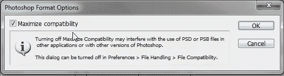
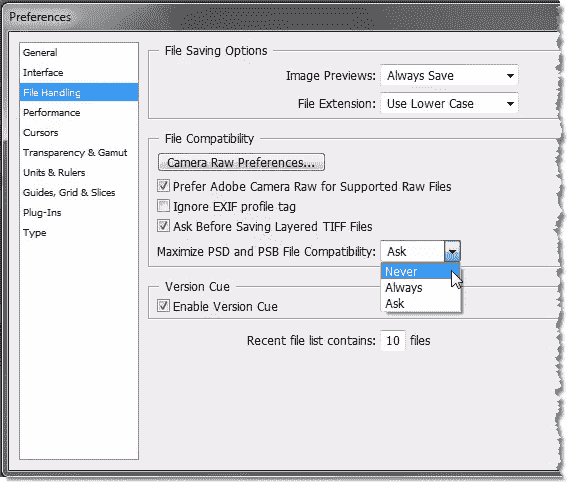

# Photoshop 中兼容性最大化还有意义吗？

> 原文：<https://www.sitepoint.com/is-there-any-point-in-maximizing-compatibility-in-photoshop/>

 当人们第一次开始保存 PSD 文件时，这个问题，或者真的“最大化兼容性意味着什么”在 Photoshop 课上出现了很多。当你保存一个 PSD，默认情况下 Photoshop 会询问你是否要通过勾选一个框来最大化兼容性。大多数人第一次看到这个消息框时，会想知道它到底意味着什么。

这个框出现的原因是因为 Photoshop 为你提供了一些向后兼容性。比方说，你在办公室或教室里有 Photoshop CS4，在家里有 Photoshop CS，你想把这些工作文件带回家。您在图层面板中所做的一切都需要与文件一起保存。CS4 中的新功能不会被旧版本理解，所以通过最大化兼容性，你可以尝试在两个不同的版本上打开你的 Photoshop 文件，所以这是值得的。

然而，除了每次保存新的 PSD 时出现烦人的消息框(它只在你第一次保存时询问你)之外，问题的一部分是，除了保存你的分层 PSD，Photoshop 还向你的文件添加了一个隐藏的扁平层。这显然会使文件变大，如果你保存了大量的 PSD，这可不是什么好消息。

这里有一个简单的例子向您展示文件大小可以有多大。下面你可以看到一个由两层组成的图像，一层是牛皮纸，另一层是文字，没有背景层。你在这里看到的是实际大小。当我在选中最大化兼容性的情况下保存时，文件大小为 1.68 MB。当我制作一个副本并用新名称保存并关闭最大兼容性时，文件大小为 0.98 MB。当不真正需要兼容性时，这是相当多的不必要的膨胀。

那么你如何解决这个问题呢？好吧，如果你确定你不需要 Photoshop 版本之间的兼容性(如果他们只有一个 Photoshop 版本，大多数人都不会需要)，那么你可以改变你的偏好，完全跳过唠叨的屏幕。

选择**编辑** > **首选项** > **文件处理**并将**最大化 PSD 和 PSB 文件兼容性**从默认的**询问**改为**从不**每次保存新文件时，Photoshop 都会停止询问您。

如果你确定你确实需要兼容性，但又不想看到唠叨的消息框，就把这个偏好设置设为“ **Always** ”，Photoshop 每次都会保存兼容性，而不会询问你。

所以希望你会发现这个小技巧很有用。这意味着可以大大节省文件大小，不仅对你的硬盘有好处，而且还可以节省打开文件的时间。

保存分层文件时，您通常会最大限度地提高兼容性，还是会取消选中该框？

## 分享这篇文章