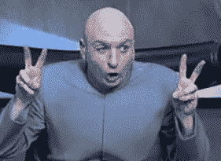
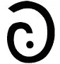
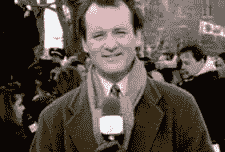
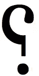
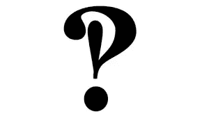
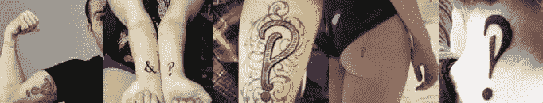
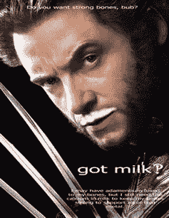

# 这是 Interrobang‽时代的开始吗

> 原文：<https://www.sitepoint.com/is-this-the-dawning-of-the-age-of-interrobang/>

你看，我已经把月亮变成了我喜欢称之为“死星”的东西。

口语单词和文本就像是亲密的兄弟姐妹。他们并不是在所有事情上都意见一致，而是经常互相借用。

当我们想在演讲中强调某个单词或短语在某些方面值得注意或有问题时，我们可能会使用“引号”(不要假装你从未做过)。那是我们用来说话的书写工具。

但反过来也一样。作家们发明了——或者至少是*试图*发明——新的印刷元素来模仿我们用言语交流的内容。让我们来看看几个，他们能为我们做些什么。

## 哦 ***确定*** ，我们需要更多的标点符号

在[土拨鼠日](https://en.wikipedia.org/wiki/Groundhog_Day)，电视气象员菲尔·康纳斯(比利·穆瑞饰)向他的观众抛出了这样一句话:

> 这是一次电视真的没有捕捉到一只大松鼠预测天气的真正兴奋

天才，但是穆雷的演讲是如此的面无表情，以至于 T2 几乎是认真的。我们知道他是不真诚的，但你如何从文本中看出这一点？

2006 年，Douglas Sak 提出了“Sarcmark ”,现在仍在运行一个项目来推广它的应用。WordPress 和 Windows 上有提供 sarcmark 的插件，但这项运动在诞生十年后似乎停滞了。

虽然我们的计算机使用的统一码集中没有内置的官方 sarcmark，但在名为“Yi 的加拿大统一土著音节块中有一个非常接近的匹配。它的 HTML 代码为'`&#5650;`'，如下所示:

## ᘒ

ᘒ:不管怎样，我确信萨克马克战役的情况会很快好转.. **ᘒ**

## 哦，讽刺的是

反语是一个很难解释的概念，人们已经做了很多尝试来寻找一种在文章中标记反语的方法。选项包括破折号、方括号和斜线，但最早的——可追溯到 16 世纪 80 年代——可能仍然最有吸引力。

英国印刷工亨利·丹汉姆提出了一种反过来的问号，称为“接触点”，主要用于不需要回答的反问。

该字形很容易找到并使用，有两个潜在的可用选项。你可以选择更精致的[阿拉伯问号](http://unicode-table.com/en/061F/)(`&amp#1567`–؟)或者坚持使用标准的[反问号](http://unicode-table.com/en/2E2E/)(`&amp#11822;`–⸮).)

## Interrobang Bang！

在'[公园&娱乐](https://en.wikipedia.org/wiki/Parks_and_Recreation)的一集中，罗恩·斯旺森看到伦敦塔的第一反应是:

> 你把那叫做塔？试试西尔斯大厦，朋友。"

尽管这句话很有趣，但它指出了英语的一个缺点。很明显，罗恩并没有真正质疑这座建筑*是否真的是一座塔。他故意不相信，但是当它被写下来的时候没有办法告诉区别。我们必须根据上下文来猜测。*

在 20 世纪 60 年代早期，广告人 Martin Speckter 写了一篇文章指出了这个缺失的特性，并提出了一个解决方案。他之前使用了？还有！，他把它们结合成一个重叠的混合物，共享一个时期(点)——‽.

他称之为“interro bang”——“interro”部分的意思是“问题”,而“bang”是传统印刷术中感叹号的俚语——尽管“*acloumaquest*”、 *quizding* 和“ *rhet* ”都被当作名字。我不知道什么是惊叹任务，但是，哎呀 wilikers，我想去！

你可以用`&amp#8253;`–‽召唤一个审问者

与 sarcmark 或讽刺符号不同，Speckter 的新字形在接下来的十年里获得了足够的动力，使 Remington 开始生产带有 interrobang 键的打字机。事实上，你甚至可以得到一些工具来改装你现在的打字机。我可以想象一个打字员打开那个坏男孩的盒子并准备战斗时的兴奋。

但无论出于何种原因，interrobang 从未成为标准的计算机键盘，因此自 20 世纪 70 年代以来，它就一直处于印刷炼狱中。更令人遗憾的是。在最好的情况下，它可能仅次于“和”符号，具有纯粹的雕刻般的优雅。

人们似乎真心喜欢 interrobang 的外形。你只需要在“ *interrobang 纹身*”上做一个快速的图像搜索，就能理解这个小雕文的精神拉力。Etsy 提供数十种 [interrobang 袖扣、耳环和其他珠宝选择](https://www.etsy.com/market/interrobang)。

那么，为什么人们这么快就用它来装饰自己的身体呢？

我不完全确定，但它确实诱使我尝试在重要的文本标题中使用它。

这当然比使用两个字符更简洁，而且不同寻常，足以真正吸引你的眼球。同时，我认为它仍然足够接近“？”和'！'不言自明——你不能为 sarcmark 做这样的声明。

我现在还没有一个明显的地方可以使用它，但是我会去找的。

你会吗？

然而，一个大问题依然存在:所有这些印刷上的华丽词藻注定要被不断涌现的露齿的黄色表情符号和便便图标淹没吗？

*原载于 [SitePoint 设计简讯](https://www.sitepoint.com/newsletter/)* 。

## 分享这篇文章