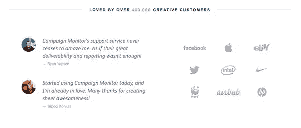
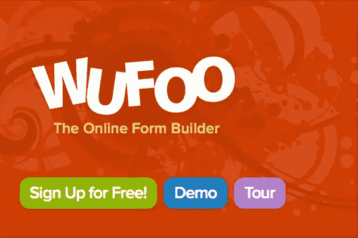
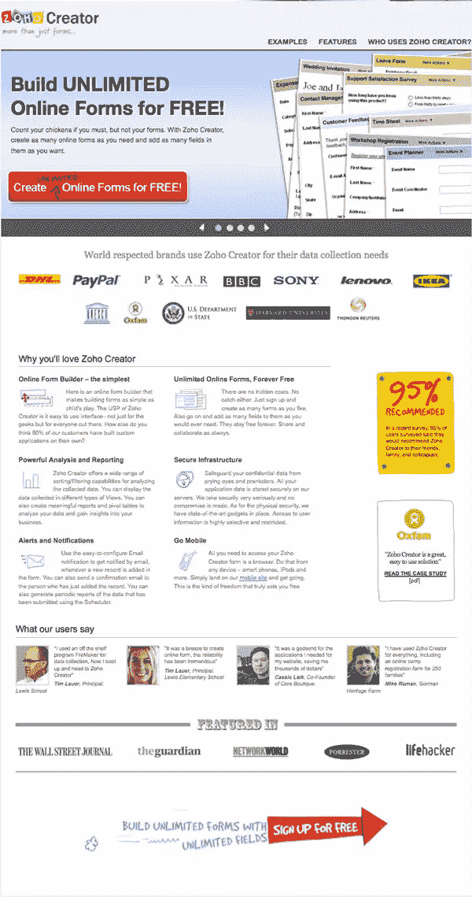
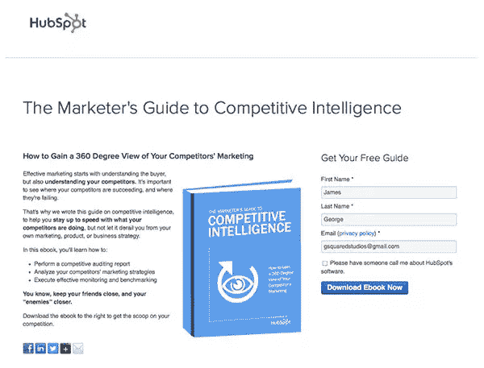
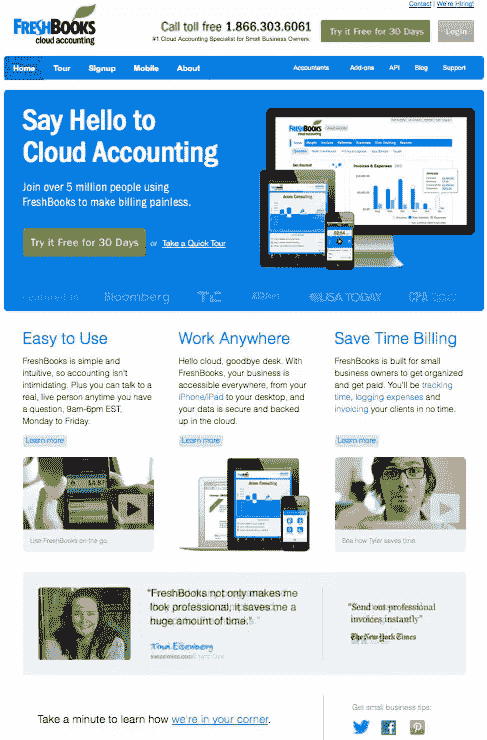

# 你的登陆页面太忙了吗？

> 原文：<https://www.sitepoint.com/is-your-landing-page-too-busy/>

推广产品或服务最困难的过程之一是开发一个优秀的登录页面。你的总体目标很简单:你希望尽可能多的感兴趣的访问者注册你的时事通讯，为你的服务付费，或者购买你的产品。这个指标叫做你的转换率。事实是，一个包含大量信息的设计并不总是有很高的转化率。创建一个优秀的登录页面需要考虑很多因素，有时候越少越好。你从你的登陆页面得到你想要的结果了吗？如果没有，下面的提示可以帮助你改进你的登陆页面，获得更好的结果。

### 让你的登陆页面尽可能简单

更多并不总是更好；登陆页面不是为了把你能在一页上得到的每一点信息都塞进去。事实上，你只有几秒钟的时间来吸引读者的注意力，让他们有足够的兴趣继续阅读。互联网时代孕育了注意力跨度越来越短的受众。使用以下提示来保持观众的兴趣:

1.  **有一个定义良好的标题**——给它空间并使其突出。使用醒目的颜色使其更加突出。使用副标题来支持你的主要标题，将读者的注意力进一步吸引到登陆页面。
2.  避免长篇幅的文字——观众短暂的注意力是你最大的敌人。没有人，即使他们对主题感兴趣，也不想阅读两三段巨大的文本。这么多的文字令人望而生畏，大多数观众会跳过它而不仔细检查。
3.  在你的页面上散布副标题。我们天生懒惰，所以在你的登陆页面中加入一些副标题是个不错的主意。这将使撇油器很容易找到他们感兴趣的部分。例如，如果有人在销售一种清洁产品，我想知道它能清洁哪些表面，或者它有多简单，我会寻找一个副标题，比如“用于这些表面”有人考虑你提供的服务，可能会想为什么他们应该选择你的服务而不是你的竞争对手，这将是一个伟大的标题和内容部分。

### 使用相关的、有意义的图像

一幅图像胜过千言万语这句古老的格言是完全正确的。虽然你应该很少使用一个以上，(除非他们之前和之后拍摄)，一个强有力的形象可以说很多关于产品或服务，它使登陆页面更适合众所周知的短暂的注意力。如果一个登陆页面全是文字，看起来会很吓人，所以添加一个高质量的图片来分散注意力是必须的。

上面的例子显示了如何在登录页面上有效地使用图像。甚至像表单构建站点这样简单的东西也可以将图像组合在一个区域，以加强整体设计，使页面不那么令人生畏，更有吸引力。这可能会导致更高的转化率。

### 选择正确的内容

仅仅有一个漂亮的登陆页面是不够的。如果你想保持简洁，迎合忙碌的访问者，你需要集中你的信息，让每一个字都有价值。如果有人对冗长的营销文案感到厌烦或分心，他们会离开你的网站，不再考虑你的设计。有一部分列出使用你的产品或服务的好处是至关重要的。提一下有多容易。亲自描述它如何为您的客户省钱、省时或解决问题。

### 选择正确的*数量*的内容

您也可以将优势部分用作可点击的摘要部分；想要了解更多的一丝不苟的访问者可以深入挖掘一点，找到更多精心制作的内容。如果你想为你的时事通讯争取更多的订阅者，你可以设立一个专区，让他们填写表格，然后收到一份最新的时事通讯。如果你正在销售一种产品，你可以有一个注册表格，导致一个免费的样品。

记住不要有长篇大论的登录页面内容，这一点很重要。你只是想激起他们的兴趣，让他们注册或购买。保留重要的信息，去掉不重要的。

### 使用证明

互联网产生了很多不信任和审查。许多人不愿意在网上采取行动，但获得信任的一个好方法是使用证明。来自知名、有声望的实体的证明(或奖项)是你自身可信度的有力证明。你能产生的信任感越强，访客就越有可能停下来关注你。

例如，如果一些知名公司已经使用了你的产品，你可以在你的登陆页面上放置他们的标志(经过许可),以帮助建立你的信誉。但是，不要用太多！从你最好的四个中选三个。如果你使用客户评价，最好有三四份来自满意客户的评价。再多，它将是多余的，过多的，无效的信息。

### 使用有效的行动号召

当试图迫使访问者采取行动时，不一定是你说了什么，而是你怎么说。你可以有一个更吸引人的按钮，而不是一个写着“提交”或“立即注册”的按钮。假设你有一本电子书，向其他人展示如何在一天内获得 1000 名 Twitter 用户；你可以有一个按钮，上面写着“现在就增加你的 Twitter 关注”。使用特定的措辞来吸引你的浏览者，让他们觉得填写表格或注册你的服务会立刻受益。通过使用默认文本，如“提交”或“输入”，你让他们看起来是在帮你的忙，而不是充分利用机会。

Wufoo 的行动号召非常好。它给了你三个选择，但是它让你行动起来，而且很有可能你会行动起来。按钮简单，色彩丰富，引人注目。你真的不能错过他们，他们是你看到的第一件事。

### 使用 A/B 测试

A/B 测试出奇的简单。您创建了同一个登录页面的两个相似版本。一个可能是你的当前页面，另一个可能有细微的变化，比如不同的图形或不同的语言来号召你的行动。你两个都用，然后分析哪一个获得了更高的转化率，迫使更高比例的观众采取行动。这种方法是一种常见的做法，它将帮助您通过一个小的、可衡量的改进的迭代过程来构建一个真正优化的登录页面。

### 优秀登录页面的示例

Zoho Form Creator 是一个实用、有用的登录页面的优秀实例。他们用一个非常清晰的标题来陈述他们的主要好处。一旦你被吸引，你会发现那些成功的大公司已经在使用这些表格了。他们有六段文字(这是一个相当大的复制量)，但文本是有组织的，并用微型图像分隔。

下面是额外的可信度增强器，显示他们的表格已经在华尔街日报出现，他们看到的最后一个元素是非常大的，彩色的，*有趣的*注册图形。

关于这个页面，我唯一要改变的是，我将删除黄色的 95%图形和乐施会图形。然后，我将利用新创建的空间将六个文本模块组成一个 3 列网格。这两个图形似乎不足以增强或吸引游客占据如此突出的房地产。我很有兴趣看看在删除这两个图形后，它们的转换率是否增加了。

Hubspot 绝对知道他们的东西，当谈到转换，测试和登陆页面。通过电子书赠品推广他们的服务，帮助他们几乎一夜之间就建立了业务。请注意，没有很长的一段文字。关键点被分为要点。只有一个图形，显示这本书，还有几个粗体字。这对那些肤浅地浏览内容的人很有帮助。

有一个简单的表格可以填写，以换取电子书，以及社交媒体按钮，以帮助推广工作。当人们找到免费的东西时，他们喜欢分享，所以你可以想象免费促销在网络上传播的速度有多快。它并不总是关于装饰和浮华的图形。重点是你努力的最终结果。

Freshbooks 和许多其他网站一样，似乎把自己的主页作为登陆页面。有一个醒目的标题欢迎您访问该网站，同时鼓励您采取行动。他们有策略地在两个地方放置了“免费试用 30 天”按钮，他们有特色的推荐，他们保持简单，有三个要点吸引你使用他们的服务。

我认为这里唯一缺少的是左下角那句低调的话。他们本可以使用按钮或更粗的文本。如果不是我在找，我早就错过了。除此之外，Freshbooks 有效地利用了他们的主页作为有效的登陆页面。

### 结论

上面的提示旨在帮助你简化登陆页面，并帮助你提高转化率。在吸引注意力和迫使访问者采取行动方面，少往往就是多。太多的杂乱会让你很难挑出重点并找到相关信息。尝试 A/B 测试来比较您的登录页面的长版本和短版本，您可以客观地确定哪个获得最佳结果。不要忘记使用强有力的行动号召，给你的访问者具体的指示。

你有没有尝试精简你的登陆页面的内容？如果是的话，你看到你的转化率上升了吗？你有自己的登陆页面可以炫耀吗？在下面的评论部分分享你的结果。

## 分享这篇文章