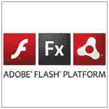

# 这是闪光，吉姆，但不是你所知道的！

> 原文：<https://www.sitepoint.com/its-flash-jim-but-not-as-you-know-it/>

如果你们错过了上周安德鲁·穆勒的闪光催化剂教程的[第一部分，那么你们现在肯定应该这样做，因为我们刚刚开始直播](https://www.sitepoint.com/article/flash-catalyst-flash-builder/)[第二部分](https://www.sitepoint.com/blog/)。Flash Catalyst 是 Adobe 的一款新工具，用于创建丰富的互联网应用程序，无论您是设计师还是开发人员，都绝对值得一试。

如果您没有听说过 Flash Catalyst，该工具是 Adobe 团队努力改进从模拟设计(在 Illustrator 或 Photoshop 中)到最终工作产品(在 Flash 或 Flex 中)的过程的结果。问题是，它在这方面做得非常好——以至于它可能会结束设计师和开发人员之间的长期争斗。web 开发世界的和平与和谐终于可以实现了！

嗯，也许这有点扯远了。但无论如何，你可以在我们最新的两部分系列中了解到这一切，*闪光催化剂:模型到杰作([第一部分](https://www.sitepoint.com/article/flash-catalyst-flash-builder/)和[第二部分](https://www.sitepoint.com/blog/) )* 。作为奖励，这两个教程都有一个小测验来测试你的注意力有多集中。

来看看吧！

*   *闪光催化剂:杰作模型，第一部分* ( [阅读文章](https://www.sitepoint.com/article/flash-catalyst-flash-builder)，[参加小测验](https://www.sitepoint.com/article/flash-catalyst-flash-builder))
*   *闪光催化剂:杰作模型，第二部分* ( [阅读文章](https://www.sitepoint.com/blog/)，[参加小测验](https://www.sitepoint.com/blog/))

## 分享这篇文章