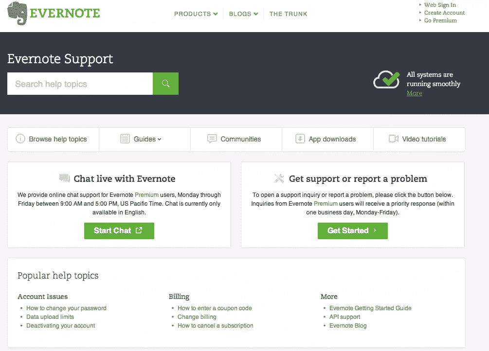
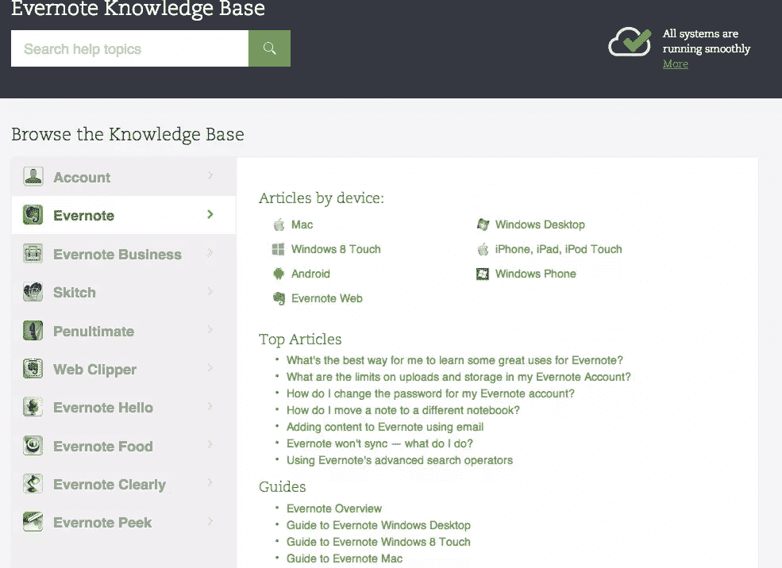
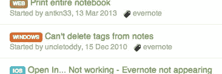

# 用人称代词构建帮助内容

> 原文：<https://www.sitepoint.com/its-not-yours-its-mine-framing-help-content-with-personal-pronouns/>

在今年早些时候的一篇有趣的帖子中，Dustin Curtis [提出了使用第二人称所有格限定词](http://dcurt.is/yours-vs-mine)——*your*——通过界面称呼用户的理由。

他的帖子提出了一些有趣的论点，支持和反对使用“我的”(如在我的帐户，我的设置)和“你的”(你的个人资料，你的历史)，特别是在系统界面中。

基本上，他的论点围绕着界面是用户的延伸，还是用户交互的工具。他最终决定后者。

这是一个有趣的讨论，但是在一些特殊的情况下，将界面转换为用户的扩展是有帮助的。其中之一是帮助内容。

## 这不是你的，是我的

让帮助内容采用第一人称(我的，我的)而不是第二人称(你的，你的)的论点似乎很明显:帮助内容通常以 FAQ 的形式呈现，用户的问题当然是第一人称的。

### 常见问题

看看最近重新制作的 [99designs 的帮助内容](http://99designs.com/help)，想象一下第二个人提出的这些问题:

*   我如何写一份好的设计简报？
*   我应该为我的比赛选择什么包装？
*   我如何在我的竞赛中留下评论？

这些问题适合第一人称，因为我们知道它们是以第一人称问的。他们完全按照我们内心的声音来阅读。因此，用第二人称重新表述它们，往好了说还过得去，往坏了说就不可思议了。

### 帮助

然而，如果你选择建立一个帮助中心或支持页面，事情很可能会变得不那么个人化。谷歌的[驱动帮助页面](https://support.google.com/drive/)就是一个很好的例子。它遵循柯蒂斯的交互工具论点，并以第二人称将帮助呈现为主题或主语:

*   在你的电脑上安装谷歌驱动
*   在电子表格中输入链接
*   整理您的文件

这些较短的主题式标题可能更容易浏览和理解，但它们在直接性方面的收获是以个性为代价的。谷歌很好地将自己呈现为一个巨大的、没有人情味的庞然大物，它的驱动帮助页面也不例外。

### 支持

Evernote 在这两个选项之间找到了一个有趣的折中方案。它的页脚显示了三个支持资源类别:支持主页、知识库和论坛。

[支持主页](http://evernote.com/contact/support/)提供对所有帮助资源的访问，并以第二人称呈现。在这里，我们与工具互动。

[知识库](http://evernote.com/contact/support/kb/#/product/evernote)的作用有点像一个索引，并显示知识库中的文章本身就像前面提到的 FAQ 一样以第一人称呈现。在我看来，这为帮助内容提供了人性化的一面，尤其是在包含指南标题和设备类别名称等其他非个性化元素的页面环境中。

最后，[论坛](http://discussion.evernote.com/)将整个 FAQ 概念向前推进了一步，正如你所料，真实的问题由真实的人提出。问题线索是按主题排列的，线索标题的表述就像你所期望的那样随意。

这里最有趣的一点？论坛帖子标题经常*暗示*第一人称，但是不要用人称代词 I。

尽管如此，我们从 Evernote 获得了全方位的帮助，从品牌构建的指南，到通过用户视角(FAQ)看到的品牌提供的帮助，到品牌的实际客户请求并给予彼此帮助，以及从 Evernote 员工那里获得帮助。

## 帮助:这不仅仅是你的事

正如这些例子所显示的，帮助是我/你争论变得棘手的一个领域。您使用的方法很可能取决于您构建或呈现帮助内容的方式——作为对常见问题的快速访问(如 la 99designs ),或作为完整的产品文档(如 Drive)。(顺便提一下，这篇[旧但仍然非常相关的帖子](http://www.g2meyer.com/usablehelp/singles/117.html)指出了反对将 FAQ 作为产品文档的观点。)

除此之外，你提供帮助的方式也可能反映出你的品牌。

99designs 是友好的，它的目标是小企业和企业家。个人的、有用的常见问题解答在这里很有意义。

谷歌是一个庞大的、正式的网络巨头，拥有大量的用户。给人以被一大群专家固定不变的印象的冷漠、非个人化的帮助对这个品牌来说似乎并不合适。

Evernote 在友好和权威之间取得了平衡，尽管使用了一系列方法来组织和提供对帮助内容的访问，但仍然保持了帮助内容的温暖。Evernote 有非常详细的帮助，它可以很容易地像谷歌一样展示它。但事实并非如此。

在您的帮助内容中，您是将用户称为“我”还是“您”？这对你的品牌有什么影响？我很想在评论中听到你的想法。

## 分享这篇文章