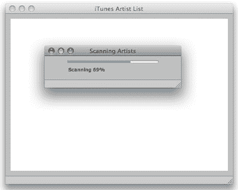
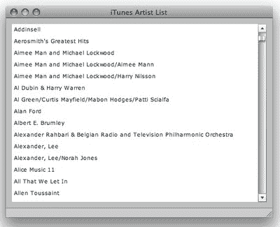
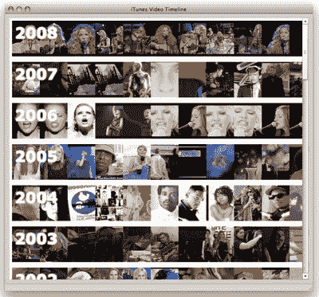

# 用 Adobe AIR 构建雅虎音乐混搭

> 原文：<https://www.sitepoint.com/itunes-yahoo-flex-air-mashup/>

**当雅虎发布[雅虎音乐应用编程接口(API)](http://developer.yahoo.com/music/) 时，我立刻被它迷住了！还有什么比使用包含音乐家、乐队、专辑列表和视频的数据源更酷的呢？在本文中，我们将构建一个 Adobe AIR 应用程序，利用这一丰富的数据源。**

诀窍是得到我最喜欢的艺术家的名单。我可以使用搜索字段，但这似乎有点过时了。然后我突然意识到，我的本地 iTunes 资料库包含了我喜欢的所有艺术家；更好的是，Adobe AIR 将允许我访问 iTunes 库，这样我就可以利用我的 web 编程技能来创建一个有趣的桌面应用程序。所以，我决定创建一个我的 iTunes 库和雅虎音乐 API 的混搭。

一路上，我学到了很多关于 AIR 文件 API 和 AIR 的 SQLite 数据库支持的知识，我用它来维护在应用程序调用之间检索的每个雅虎视频的列表。我还学到了很多关于如何在 AIR 中启动本机子窗口的知识——尤其是管理进度条。你很快就会看到，这些进度条是必要的，因为扫描 iTunes，然后从雅虎请求每个艺术家的视频的过程非常耗时。

**注意——最后会有一个[测验](https://www.sitepoint.com/quiz/flex3/itunes-yahoo-air-mashup/)！前 100 名完成测验的人将赢得一本我的书，*开始使用 Flex 3* ，由于 Adobe 的帮助，这本书将免费送到他们的门前。您还可以[在限定时间内免费下载 PDF 格式的书籍](https://www.sitepoint.com/quiz/flex3/itunes-yahoo-air-mashup/)。**

##### 开店

让我们深入研究一下，我将向您介绍我是如何构建这个应用程序的。SitePoint 上以前的 Adobe AIR 教程使用了 HTML、CSS 和 JavaScript。但是，您也可以使用 Adobe Flex 创建 AIR 应用程序，这就是我们在这里要做的事情。下载这个应用程序 *的[代码档案。zip，2.2 MB)](https://i2.sitepoint.com/examples/AdobeAIR/air-itunes-yahoo-mashup.zip)* 如果你想让所有的代码清单都容易访问。

我们的第一步是安装 Adobe Flex Builder 3。您可以[免费安装试用版](http://ad.doubleclick.net/clk;207369527;29584192;u#flex_builder)，或者如果您愿意，您可以通过[下载 Flex 软件开发工具包(SDK)](http://ad.doubleclick.net/clk;207369527;29584192;u#sdk) 和 [Air SDK](http://ad.doubleclick.net/clk;207319297;29550361;k) 来运行本文中的示例。但是，我绝对推荐下载 Flex Builder 集成开发环境(IDE)，因为它使构建 Flex 和 AIR 应用程序更加容易。

在本文中，我将分两部分介绍视频时间轴应用程序。在第一部分中，我们将介绍从 iTunes 音乐目录 XML 文件中访问艺术家列表的 iTunes 阅读器。第二部分将介绍如何构建一个应用程序来查找 Yahoo 的艺术家。

注意:这段代码目前不能在 Linux 系统上运行。虽然 AIR 可以在 Linux 上运行，但 iTunes 目前不能。

##### 访问 iTunes XML 数据库

苹果的 iTunes media player 将其完整的歌曲列表存储在苹果电脑的 Documents 目录下的一个 XML 文件中(在 Windows 上是 My Documents)。检索艺术家列表就像打开 XML 文件并找到正确的标签一样简单。因为这个过程需要相当长的时间来执行，所以我把它分成了两个步骤。该过程的第一部分包括打开文件并读入每个曲目的所有艺术家标签。在第二步中，我们将建立艺术家列表以及与每个艺术家相关的曲目；这是在计时器的帮助下分小块完成的。

如下面的代码所示，所有这些都是在`Artists` Singleton 对象中执行的。一个**单例**是一个在应用程序中只有一个实例的对象；您通过使用静态的`instance`方法来访问该实例。我选择让我们的`Artists`对象成为单例对象，因为在这个应用程序中我们一次只希望打开一个音乐库。`Artists`单例对象如下所示:

```
**File: Artists.as** 

package com.videomashup 

{ 

  import flash.events.Event; 

  import flash.events.EventDispatcher; 

  import flash.events.TimerEvent; 

  import flash.filesystem.File; 

  import flash.filesystem.FileMode; 

  import flash.filesystem.FileStream; 

  import flash.utils.ByteArray; 

  import flash.utils.Timer; 

  public class Artists extends EventDispatcher 

  { 

    private static var _artistsInstance:Artists = new Artists(); 

    public static function get instance() : Artists { 

      return _artistsInstance; 

    } 

    private var _artists:Object = {}; 

    private var _dicts:Array = []; 

    private var _dictsProcessed:uint = 0; 

    private var _dictsTotal:uint = 0; 

    private var _timer:Timer = null; 

    private var _artistCount:uint = 0; 

    public function get artists() : Array {  

      var out:Array = []; 

      for( var k:String in _artists ) 

        out.push( k ); 

      return out.sort(); 

    } 

    public function get count() : uint { 

      return _artistCount; 

    } 

    public function get bytesLoaded() : uint { 

      return _dictsProcessed; 

    } 

    public function get bytesTotal() : uint { 

      return _dictsTotal; 

    } 

    public function Artists() 

    { 

      super(); 

    } 

    public function startReader() : void { 

      var xmlFile:File = new File( File.userDirectory.nativePath+'/Music/iTunes/iTunes Music Library.xml' ); 

      var bytes:ByteArray = new ByteArray(); 

      var fileStream:FileStream = new FileStream(); 

      fileStream.open( xmlFile, FileMode.READ ); 

      var doc:XML = XML(fileStream.readUTFBytes(fileStream.bytesAvailable)); 

      fileStream.close(); 

      for each( var dict:XML in doc..dict.(key[2]=='Artist') ) 

        _dicts.push( dict ); 

      _dictsTotal = _dicts.length; 

      _timer = new Timer( 100 ); 

      _timer.addEventListener(TimerEvent.TIMER,onTimer); 

      _timer.start();       

    } 

    private function onTimer( event:Event ) : void { 

      if ( _dicts.length > 0 ) { 

        for( var i:int = 0; i < 50; i++ ) { 

          var dict:XML = _dicts.pop() as XML; 

          if ( dict == null || _dicts.length == 0 ) { 

            dispatchEvent( new ArtistEvent( ArtistEvent.ITUNES_ANALYSIS_COMPLETE ) ); 

            return; 

          } 

          _dictsProcessed++; 

          var art:XML = dict.string[2]; 

          if ( art != null ) { 

            var artName:String = String( art ); 

            if ( _artists[ artName ] == null ) { 

              _artists[ artName ] = { name:artName, count: 1 }; 

              _artistCount++; 

            } else 

              _artists[ artName ].count += 1; 

          } 

        } 

        dispatchEvent( new ArtistEvent( ArtistEvent.ARTIST_LIST_CHANGE ) ); 

      } 

    } 

  } 

}
```

这里使用的两种主要方法是`startReader`方法和`onTimer`方法。`startReader`方法解析 iTunes XML 文件，并从 XML 中提取所有艺术家标签。然后，它创建一个计时器来处理标签的异步处理。那个计时器的回调是`onTimer`方法。

`onTimer`方法处理一定数量的标签，然后调度`ARTIST_LIST_CHANGE`事件来通知我们的应用程序，可能有一些新的艺术家被添加到这个列表中。这是一个自定义事件，由`Artists` Singleton 发送，通知用户艺术家列表正在增长，并最终被处理。

当所有处理完成时，该方法发送`ITUNES_ANALYSIS_COMPLETE`消息。这两种消息的定义如下:

```
**File: ArtistEvent.as**  

package com.videomashup  

{  

  import flash.events.Event;  

  public class ArtistEvent extends Event  

  {  

    public static const ITUNES_ANALYSIS_COMPLETE:String = 'ITUNES_ANALYSIS_COMPLETE';  

    public static const ARTIST_LIST_CHANGE:String = 'ARTIST_LIST_CHANGE';  

    public function ArtistEvent(type:String, bubbles:Boolean=false, cancelable:Boolean=false)  

    {  

      super(type, bubbles, cancelable);  

    }  

  }  

}
```

我们的 iTunes 处理应用程序的 MXML 代码如下所示:

```
**File: iTunesVideos.mxml**  

<?xml version="1.0" encoding="utf-8"?>  

<mx:WindowedApplication xmlns:mx="http://www.adobe.com/2006/mxml" layout="vertical" creationComplete="onStartup()"  

  title="iTunes Artist List">  

<mx:Style>  

WindowedApplication { padding-bottom:10; padding-left:10; padding-right:10; padding-top:10 }  

</mx:Style>  

<mx:Script>  

<![CDATA[  

import com.videomashup.ArtistEvent;  

import com.videomashup.Artists;  

private function onStartup() : void {  

  Artists.instance.addEventListener( ArtistEvent.ITUNES_ANALYSIS_COMPLETE, onUpdateComplete );  

  var ar:ProgressWindow = new ProgressWindow();  

  ar.title = 'Scanning Artists';  

  ar.open( true );  

  Artists.instance.startReader();  

}  

private function onUpdateComplete( event:ArtistEvent ) : void {  

  artistList.dataProvider = Artists.instance.artists;  

}  

]]>  

</mx:Script>  

<mx:List width="100%" height="100%" id="artistList" labelField="name">  

</mx:List>  

</mx:WindowedApplication>
```

如你所见，没什么大不了的！该应用程序首先注册一个事件处理程序，它将监听 iTunes 库分析的完成情况。然后，该处理程序将列表框分配给检索到的艺术家列表。

应用程序创建的进度窗口告诉用户 iTunes XML 处理还有多少工作要做。该窗口的代码如下所示:

```
**File: ProgressWindow.mxml**  

<?xml version="1.0" encoding="utf-8"?>  

<mx:Window xmlns:mx="http://www.adobe.com/2006/mxml" layout="vertical" creationComplete="onStartup()"  

  styleName="main" width="300" height="70" horizontalAlign="center">  

<mx:Style>  

.main { padding-bottom:10; padding-left:10; padding-right:10; padding-top: 10; }  

</mx:Style>  

<mx:Script>  

<![CDATA[  

import com.videomashup.Artists;  

import com.videomashup.ArtistEvent;  

private function onStartup() : void {  

  prgBar.source = Artists.instance;  

  Artists.instance.addEventListener( ArtistEvent.ITUNES_ANALYSIS_COMPLETE, onFinished );  

}  

private function onFinished( event:Event ) : void {  

  close();  

}  

]]>  

</mx:Script>  

<mx:ProgressBar id="prgBar" label="Scanning %3%%" mode="polled" />  

</mx:Window>
```

此窗口启动并将进度条附加到艺术家列表。`Artists`类包含了`bytesLoaded`和`bytesTotal`的方法，它们被进度条自动调用以获得当前状态。然后，当显示“iTunes 分析完成”对话框时，窗口会自动关闭。

从 Flex Builder 启动应用程序时，将会打开一个空的主窗口和进度窗口，如图 1 所示。



处理完所有艺术家后，进度窗口将会消失。艺术家列表在主窗口中更新，如图 2 所示。



下一步是将完整的艺术家列表与雅虎音乐的视频服务合并。

##### 混搭雅虎音乐 API

首先你需要访问用户友好的雅虎音乐 API，是一个 API 键；你可以直接从[雅虎开发者网络主页](http://developer.yahoo.com/)申请一个。当你有一个 API 键时，你可以用它来执行任意数量的 Yahoo Music API 调用。例如，您可以进行 API 搜索，当给定艺术家姓名时，将返回匹配艺术家及其视频的列表。然后，您可以将这些视频存储在 SQLite 数据库中，这样您就不必再次从 Yahoo 进行相同的查询。

我们的`Artists`列表对象现在从雅虎*和* iTunes 获取数据，并管理一个缓存的视频数据库。这个对象的完整代码清单相当长，所以我只讨论关键功能。如果你有兴趣探索这个类中包含的任何其他方法，一定要[下载这个教程](https://i2.sitepoint.com/examples/AdobeAIR/air-itunes-yahoo-mashup.zip)的代码档案。

不同之处始于构造函数，我在一个名为 *`artists.db`* 的文件中构建了一个 SQLite 数据库。

```
**File: Artists.as**   

public function Artists()   

    {   

      super();   

      _sqlConnection = new SQLConnection();   

      var dbFile:File = File.applicationStorageDirectory.resolvePath( "artists.db" );   

      _sqlConnection.open( dbFile );   

      var artCreateStmt:SQLStatement = new SQLStatement();   

      artCreateStmt.sqlConnection = _sqlConnection;   

      artCreateStmt.text = 'CREATE TABLE IF NOT EXISTS artist ( artistName VARCHAR( 128 ), artistID VARCHAR( 32 ) )';   

      artCreateStmt.execute();   

      var vidCreateStmt:SQLStatement = new SQLStatement();   

      vidCreateStmt.sqlConnection = _sqlConnection;   

      vidCreateStmt.text = 'CREATE TABLE IF NOT EXISTS video ( artistID VARCHAR( 32 ), year INT, videoID VARCHAR( 32 ), name VARCHAR( 128 ) )';   

      vidCreateStmt.execute();   

    } 
```

从上面的代码可以看出，我们的`artists.db`数据库有两个表:Artist 和 Video。顾名思义，艺术家表存储艺术家的名字和他们的 id，这些都是由 Yahoo 提供的，而视频表存储每个艺术家的视频信息。这包括艺术家 ID、视频年份、视频 ID(视频缩略图需要)和视频名称。

有了这些，我们需要升级我们的`onTimer`方法来从数据库中检索艺术家 ID——如果它是已知的。如果 iTunes 扫描已经完成，那么`onTimer`方法也触发列表创建的 Yahoo 扫描部分。这是通过调用`updateArtistData`方法来完成的:

```
**File: Artists.as**   

private function onTimer( event:Event ) : void {   

      if ( _dicts.length > 0 ) {   

        for( var i:int = 0; i < 50; i++ ) {   

          var dict:XML = _dicts.pop() as XML;   

          if ( dict == null || _dicts.length == 0 ) {   

            dispatchEvent( new ArtistEvent( ArtistEvent.ITUNES_ANALYSIS_COMPLETE ) );   

            return;   

          }   

          _dictsProcessed++;   

          var art:XML = dict.string[2];   

          if ( art != null ) {   

            var artName:String = String( art );   

            if ( _artists[ artName ] == null ) {   

              _artists[ artName ] = { name:artName, count: 1 };   

              var fetchIdStmt:SQLStatement = new SQLStatement();   

              fetchIdStmt.sqlConnection = _sqlConnection;   

              fetchIdStmt.text = 'SELECT * FROM artist WHERE artistName=:name';   

              fetchIdStmt.parameters[':name'] = artName;   

              fetchIdStmt.execute();   

              var fetchResult:SQLResult = fetchIdStmt.getResult();   

              for each ( var row:Object in fetchResult.data ) {   

                _artists[ artName ].artistID = row.artistID;   

              }   

              _artistCount++;   

            } else   

              _artists[ artName ].count += 1;   

          }   

        }   

        dispatchEvent( new ArtistEvent( ArtistEvent.ARTIST_LIST_CHANGE ) );   

      }   

      else   

      {   

        if ( updateArtistData() == false ) {   

          _timer.stop();   

          dispatchEvent( new ArtistEvent( ArtistEvent.YAHOO_UPDATE_COMPLETE ) );   

        }   

      }   

    } 
```

`updateArtistData`方法首先检查对 Yahoo 的请求是否正在处理中。如果有一个挂起的请求，它会让这个调用继续。如果没有正在处理的请求，那么它会寻找第一个没有分配`ArtistID`的艺术家。然后，它请求雅虎搜索该艺术家。这个方法看起来是这样的:

```
**File: Artists.as**   

private function updateArtistData() : Boolean {   

  if ( _searchingYahoo == false ) {   

        dispatchEvent( new ArtistEvent( ArtistEvent.STARTING_YAHOO_SEARCH ) );   

        _searchingYahoo = true;   

      }   

      if ( _artistSearch == null ) {   

        _yahooSearchTotal = 0;   

        _yahooSearchCompleted = 0;   

        // Find any artist that doens't have an AristID associated with it           

        var artist:Object = null;   

        for each ( var art:Object in artists ) {   

          if ( art.artistID == null ) {   

            if ( artist != null )   

              artist = art;   

            _yahooSearchCompleted++;   

          }   

          _yahooSearchTotal++;   

        }   

        if ( artist == null )   

          return false;   

        // Send a search request to Yahoo for that artist   

        _searchingArtist = artist.name;   

        _artistSearch = new HTTPService();   

        _artistSearch.addEventListener( ResultEvent.RESULT, onArtistResult );   

        _artistSearch.addEventListener( FaultEvent.FAULT, onArtistFault );   

        _artistSearch.url = "http://us.music.yahooapis.com/artist/v1/list/search/artist/"+escape(artist.name)+"?appid="+Constants.APPID+"&response=videos";   

        _artistSearch.resultFormat = 'e4x';   

        _artistSearch.send();   

      }   

      return true;   

    } 
```

搜索结果被发送到`onArtistResult`或`onArtistFault`。在失败的情况下，我们将`ArtistID`设置为空白。如果记录了一个结果，我们找到列出的第一个艺术家，并将这个`ArtistID`和视频列表一起存储在数据库中。

这个类中的其余方法提供艺术家列表的信息。如您所见，它们的名称不言自明。例如，`videosMinYear`和`videosMaxYear`分别返回数据库中的最小和最大年份值；`getVideosByYear`方法返回任意给定年份的视频数组。这里就不一一列举了；随意浏览[代码档案](https://i2.sitepoint.com/examples/AdobeAIR/air-itunes-yahoo-mashup.zip)——代码被很好的评论。

我们的自定义事件类也需要一些升级来处理艺术家列表生成的新事件。更新后的代码如下所示:

```
**File: ArtistEvent.as**    

package com.videomashup    

{    

  import flash.events.Event;    

  public class ArtistEvent extends Event    

  {    

    public static const ITUNES_ANALYSIS_COMPLETE:String = 'ITUNES_ANALYSIS_COMPLETE';    

    public static const ARTIST_LIST_CHANGE:String = 'ARTIST_LIST_CHANGE';    

    public static const ARTISTID_UPDATE:String = 'ARTISTID_UPDATE';    

    public static const YAHOO_UPDATE_COMPLETE:String = 'UPDATE_COMPLETE';    

    public static const STARTING_YAHOO_SEARCH:String = 'STARTING_YAHOO_SEARCH';    

    public function ArtistEvent(type:String, bubbles:Boolean=false, cancelable:Boolean=false)    

    {    

      super(type, bubbles, cancelable);    

    }    

  }    

}
```

此代码包含艺术家列表开始搜索 Yahoo 的事件、艺术家 id 更新状态的通知以及艺术家列表全部更新完成的通知。

您还必须将 Yahoo API 密钥存储在`Constants`类中，如下所示:

```
**File: Constants.as**    

package com.videomashup    

{    

  public class Constants    

  {    

    public static const APPID:String = 'Your Yahoo APP ID';    

  }    

}
```

接下来，我们用从 Yahoo 收到的应用程序 ID 替换占位符字符串。我们的主界面也经历了一些升级，如下所示:

```
**File: iTunesVideos.mxml**    

<?xml version="1.0" encoding="utf-8"?>    

<mx:WindowedApplication xmlns:mx="http://www.adobe.com/2006/mxml" layout="vertical" creationComplete="onStartup()"    

  title="iTunes Video Timeline">    

<mx:Style>    

WindowedApplication { padding-bottom:10; padding-left:10; padding-right:10; padding-top:10 }    

</mx:Style>    

<mx:Script>    

<![CDATA[    

import com.videomashup.Artists;    

import com.videomashup.ArtistEvent;    

private function onStartup() : void {    

  Artists.instance.addEventListener( ArtistEvent.YAHOO_UPDATE_COMPLETE, onUpdateComplete );    

  Artists.instance.addEventListener( ArtistEvent.STARTING_YAHOO_SEARCH, onStartYahoo );    

  var ar:ProgressWindow = new ProgressWindow();    

  ar.title = 'Scanning Artists';    

  ar.open( true );    

  Artists.instance.startReader();    

}    

private function onStartYahoo( event:ArtistEvent ) : void {    

  var ar:ProgressWindow = new ProgressWindow();    

  ar.title = 'Scanning Yahoo';    

  ar.open( true );    

}    

private function onUpdateComplete( event:ArtistEvent ) : void {    

  timeline.dataProvider = Artists.instance.videosByYear;    

}    

]]>    

</mx:Script>    

<mx:List width="100%" height="100%" id="timeline" itemRenderer="YearRenderer">    

</mx:List>    

</mx:WindowedApplication>
```

现在我们有两个进度窗口:一个用于 iTunes 阅读器，另一个用于雅虎扫描。当所有这些处理完成后，`onUpdateComplete`方法将时间轴的`dataProvider`设置为艺术家列表。

时间轴本身是使用下面显示的`YearRenderer` MXML 代码自定义渲染的:

```
**File: YearRenderer.mxml**    

<?xml version="1.0" encoding="utf-8"?>    

<mx:Canvas xmlns:mx="http://www.adobe.com/2006/mxml" height="100" creationComplete="onDataChange()" dataChange="onDataChange()"    

  horizontalScrollPolicy="off" verticalScrollPolicy="off">    

<mx:Script>    

<![CDATA[    

import mx.controls.Image;    

private function onDataChange() : void {    

  if ( data == null || initialized == false ) return;    

  videosCanvas.removeAllChildren();    

  var index:int = 0;    

  for each( var video:Object in data.videos ) {    

    var img:Image = new Image();    

    img.x = ( index++ * 70 ) + 5;    

    img.y = 5;    

    img.toolTip = video.name;    

    img.source = "http://d.yimg.com/img.music.yahoo.com/image/v1/video/"+video.videoID+"?fallback=defaultImage&size=90x90";    

    videosCanvas.addChild( img );    

  }    

}    

]]>    

</mx:Script>    

<mx:Canvas id="videosCanvas" />    

<mx:Label text="{data.year}" left="10" top="10" fontSize="38" fontWeight="bold" color="white">    

<mx:filters>    

  <mx:GlowFilter blurX="5" blurY="5" color="#cccccc" />    

</mx:filters>    

</mx:Label>    

</mx:Canvas>
```

这个自定义渲染对象在我们的视频画布中创建了一组图像。图像代表该项目的数据字段中指定年份的所有视频。图像的创建在`onDataChange`方法中执行；该方法获取视频列表并创建指向 Yahoo 的`Image`对象。

咻！如果你已经理解了我们在这里讨论的所有内容，那么你做得很好。让我们在 Flex Builder 中启动这个应用程序；它应该看起来有点像图 3 中的截图，虽然当然有比我的库中存储的更酷的音乐的缩略图。


完整的视频时间线——减去进度窗口——如图 4 所示。



虽然我构建这个应用程序的动机是出于教育目的，但它实际上是一个很酷的 AIR 小部件，可以为有用的应用程序提供基础。这也是一种有趣的方式来想象你最喜欢的艺术家这些年来都在做什么。

##### 摘要

在本教程中，我们构建了一个完全成熟的 iTunes 库和 Yahoo Music API 的 Adobe AIR mashup。

剖析这个示例应用程序向我们展示了 Flex 和 AIR 平台的几个不同方面。在 Flex 方面，我们学习了如何从桌面和 web 服务解析 XML。我们还看到了一个如何使用`List`控件的例子，通过创建渲染器来滚动自定义可视化。

从 AIR 的角度，我们研究了如何从 XML 文件中读取数据，以及如何创建和维护 SQLite 数据库。我们还使用了`Window` Flex 类来创建本地弹出窗口，在主机操作系统中看起来就像在家一样。

我希望您喜欢混合您的 iTunes 库，并且您将使用这里的概念来构建您自己的令人兴奋的 AIR 应用程序！

##### 考考自己！

**通过[小测验](https://www.sitepoint.com/quiz/flex3/itunes-yahoo-air-mashup/)测试你对本文的理解，并免费获得我的书《Flex 3 入门》的 PDF 文档。感谢 Adobe Systems，前 100 名完成测验的人还将免费收到一份纸质副本。**

**[参加小测验！](https://www.sitepoint.com/quiz/flex3/itunes-yahoo-air-mashup/)**

## 分享这篇文章