# Java 小程序:过时了还是仍然是网络的一部分？

> 原文：<https://www.sitepoint.com/java-applets-obsolete-still-part-web/>

本文是在 Web 应用程序中嵌入 Applet 的后续文章。在本文中，我将列出一些与 java 和 Java 小程序相关的主题，这些主题将给出它们与适当资源一起使用的优点。这里还将讨论 Java 小程序的一些其他相关内容。

Java 被认为是全世界程序员都需要的技能。由于 Java Applet 是 Java 的一个应用程序，所以我想先介绍一些 Java 在现实世界中的应用信息:

## Java 的实际应用

*   Amadeus 是世界上最大的旅游公司，它使用 Java 作为其前端 GUI。
*   GWT (Google Web Toolkit)是一个用 Java 编写的开发工具包。
*   Android 设备在 Java 虚拟机上运行 Java 应用程序
*   Dalvik 是 Android 不可或缺的一部分。
*   Twitter 搜索使用一个名为 Blender([https://blog.twitter.com/2011/twitter-search-now-3x-faster](https://blog.twitter.com/2011/twitter-search-now-3x-faster))的 Java 服务器
*   Java 中有高质量的工具；Maven、Swing Explorer、Archiva、JMockit 等。
*   GDA 是一个用于为科学目的创建定制数据采集软件的框架。
*   在大型项目中，首选 Java。例子包括:
    *   复杂的网络应用，如[http://www.tdameritrade.com](http://www.tdameritrade.com)
    *   像 Kotak Mahindra[http://www.kotak.com](http://www.kotak.com/)这样的网上银行
    *   在线购物网站[http://www.ebay.com/](http://www.ebay.com/)
    *   Google Plus 是用 Java 和 JavaScript 写的:[https://plus.google.com/](https://plus.google.com/)
*   Java ME(微型版)为移动设备、传感器、打印机等提供了灵活的环境和用户界面。
*   Oracle SQL Developer 是用 Java 写的。
*   一个快速的 web 应用开发平台 ColdFusion 是用 Java 编写的。
*   被称为“Integrity”的软件系统生命周期管理(SSLM)和应用程序生命周期管理(ALM)平台是用 Java 编写的。
*   Google Guice 是一个开源软件框架，是用 Java 编写的

以下给出的统计信息摘自:[http://www.java.com/en/about/](http://www.java.com/en/about/)

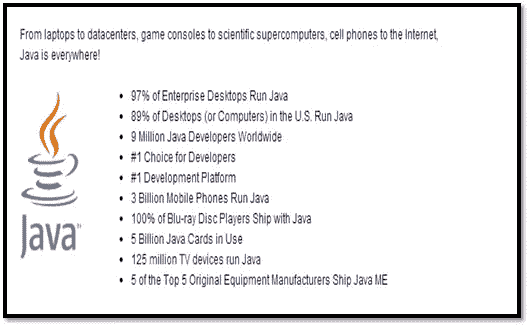

Figure 1: Real World Applications of Java

## Java 小程序的真实应用

*   ThinkFree:基于 Java 小程序和 Ajax 的专业在线办公套装。
*   JPC 模拟器:这是一个用 Java 编写的 x86 模拟器，使用 Java 小程序。
*   统计学:在统计学中开发 Web 应用程序时使用 Applets 还没有过时。
*   教育:仍然在大学里作为课程的一部分学习。
*   雅虎游戏:在游戏中使用 Java 小程序。
*   小型应用程序:开发小型应用程序的良好平台
*   客户端机器:当要使用客户端机器时，小程序可以被认为是一个很好的选择，例如在创建认证应用程序等方面
*   Android:数十亿的 Android 设备在 Java 虚拟机上运行
*   Java Web Start:这是一个开发用来在浏览器之外运行应用程序的框架，解释如下。

## Java Web Start

它也被称为*爪牙*或*爪牙*。它是作为一个独立的应用程序开发的。它允许使用网络浏览器在互联网上运行 Java 软件。该软件不像小程序一样在浏览器中运行。

### Java Web Start 优于小程序

Java Web Start 克服了浏览器、Java 插件和不同 JVM 版本的许多兼容性问题。Web Start 程序是在单独框架中运行的独立应用程序。他们也可以启动内部打包的未修改的小程序。jar 文件。

### 通过已签名的 Web Start 应用程序消除“受限访问”

Java Web Start 应用程序运行在受限环境中，不允许它们访问系统资源，如本地文件、网络等。发布者可以通过使用 Java 开发工具包附带的名为 jarsigner 的工具来签名他们的 Web Start 应用程序，从而轻松地消除这些限制。

### 真实世界的用法:

| 应用程序 | 描述/用法 |
| 交叉传输协议 | FTP 客户端和服务器。 |
| 杰克 2 | 地震 2 的 Java 端口。 |
| 超级教师 | 学校使用的学生成绩记录本程序 |
| 在线蠕虫 | 3D 大型多人在线幻想模拟器。 |
| Buho21 | 使用 Java Webstart 技术开发的游戏。 |
| Autoplot | 各种文件格式的绘图工具，如 ASCII、CDF 和 NetCDF |
| 运行现实 | 历史地图集和人类历史模型，包括国界、军队和人民。 |
| 基因调查员 | 研究人员探索研究和临床应用数据的在线平台。 |

### 启用 Web Start(继续上一个项目)

与小程序不同，按照以下步骤启用 **Web Start** 作为在浏览器外运行软件的合理方式:

右键-> **AmitJavaApplication - >属性**，进入应用下的 Web Start:

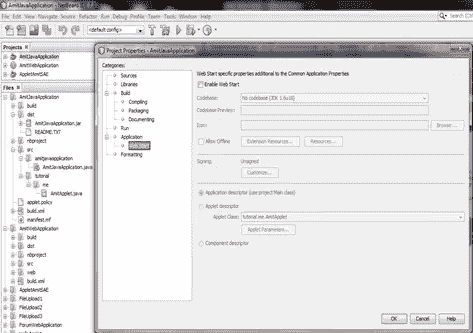

Figure 2: Enabling Web Start in NetBeansIDE

点击 Enable Web Start 并选择“CodeBase”作为本地执行。

之后，点击“签名”下的“定制…”并选择“通过生成的密钥自行签名”。

现在，选择“混合代码”作为“启用软件保护”。点击“确定”后:

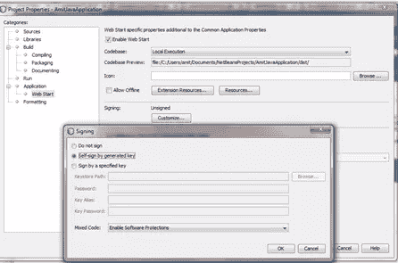

Figure 3: Enabling Web Start and signing

构建项目以在本地测试 Java Web Start。现在，您可以注意到目录下的一些更改，即创建了两个新文件(launch.html 和 launch.jnlp ),其中包含 AmitJavaApplication 项目 jar 文件“AmitJavaApplication.jar ”:

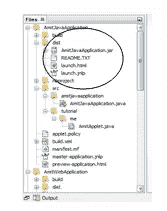

Figure 4: Directory Structure changes after building AmitJavaApplication

如上所示，Java Web Start 创建了三个文件:

*   jnlp 是 Java 网络启动协议。这是一个 XML 文件，其中的元素和属性指示浏览器如何运行应用程序。JNLP 文件的一些属性是 JNLP 规范版本、应用程序标题、供应商名称等。
*   launch.html——这是一个自动生成的 HTML 页面，有一个到 JNLP 文件的链接。用户单击此链接通过 Java Web Start 启动应用程序。
*   AmitJavaApplication.jar:项目 jar 文件。

要从任何其他位置测试 WebStart，请在 WebApplicationProject 中复制上面显示的三个文件，以便从任何其他位置运行 Web Start。对于“AmitWebApplication ”,复制后的目录如下所示:

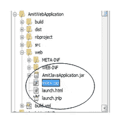

Figure 5: AmitWebApplication Directory Structure

运行项目并打开 launch.html，执行后会看到如下页面:

链接:[http://localhost:8080/AmitWebApplication/launch . html](http://localhost:8080/AmitWebApplication/launch.html)

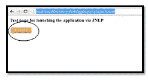

Figure 6: Executing launch.html

单击“Launch ”,之后您将可以选择下载 launch.jnlp 文件。在系统上的任何位置下载该文件:

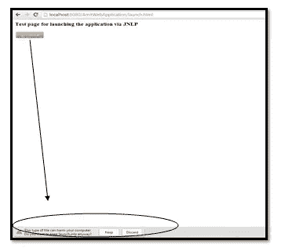

Figure 7: Downloading Web Start Software launch.jnlp

现在，双击“launch.jnlp”就可以看到，使用 Web Start 作为独立软件，同样的小程序是可见的。这项工作表明，它不是运行在浏览器下，如我的[前一篇文章](https://www.sitepoint.com/embedding-applet-web-application/)所示。因此，这是为用户提供下载和运行软件选项的另一种方式:

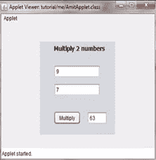

Figure 8: Applet visible outside browser

## 两种形式的 Java 小程序

*   抽象窗口工具包(AWT): AWT 类和组件包含在 java.awt 包层次结构中。它是一组 API，为 java 程序提供 GUI，如按钮、复选框等。awt 被认为是过时的。摆动优于 AWT 组件。
*   Swings: The Swing classes and components are contained in the javax.swing package hierarchy. Swing components are known as lightweight because they do not require allocation of native resources in the operating system’s windowing toolkit, whereas AWT components are referred to as heavyweight components.

    根据 Java 6 Update 12，可以混合使用 Swing 和 AWT 小部件，而不会出现 z 顺序问题(z 顺序是重叠的二维对象的顺序)。在 Java 6 Update 12 之前，混合 Swing 组件和基本 AWT 小部件导致了不希望的副作用。

    摆动被认为优于 AWT:

    1.  Swing 组件不是由特定于平台的代码实现的，它们完全是用 Java 编写的，因此与 AWT 组件不同，它们是独立于平台的，
    2.  它比 AWT 具有更灵活的组件。
    3.  在 J2SE 1.2 中，Swings 取代了 AWT 的小部件，因为它提供了更丰富的 UI 小部件。
    4.  Swing 绘制自己的小部件
    5.  尚未过时，与我在上一篇文章中使用的相同。

## Oracle Java 更新

本节提供了一些与 Java 更新相关的重要信息和一些外部网站资源。这包括由 Oracle Java 实施的安全增强、安全修复、代码签名、对话框更改等:

**Java 版本历史**
在继续之前，我希望你浏览一下维基百科提到的 [Java 版本历史](http://en.wikipedia.org/wiki/Java_version_history)。

**Java SE 6 更新 10**
[安全修复和下一代 Java 插件](http://www.oracle.com/technetwork/java/javase/6u10-142936.html)

**下一代 Java 插件**
此版本引入了一种新的 Java 插件实现，称为下一代 Java 插件，它结合了 applet 和 Java web Start 技术的最佳架构特性，为 Web 浏览器中的 applet 提供支持。它还为在 web 浏览器中部署 Java 和 JavaFX 内容提供了一个健壮的平台。

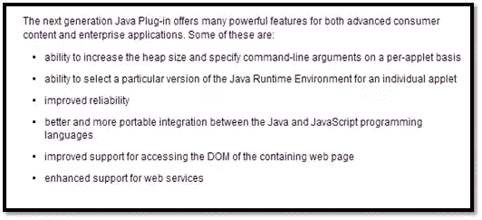

Figure 9: Next Generation Java Plug-in features as mentioned at Oracle Java Website

**Java SE 7 Update 10**
Oracle Java 网站上声明的安全增强功能:

*能够为浏览器中运行的未签名小程序、Java Web Start 应用程序和嵌入式 JavaFX 应用程序选择所需的安全级别。支持四种安全级别。此功能可以在 Java 控制面板中设置，或者(仅在 Microsoft Windows 平台上)使用命令行安装参数设置。*

**Java SE 7 更新 21**
此次更新与 Java Applet & Web Start 相关，代码签名是为了获得最佳用户体验。“如 Oracle Java 网站所述:

*“从 2013 年 4 月的 Java SE 7 Update 21 开始，鼓励所有 Java 小程序和 Web Start 应用程序使用可信证书进行签名。*

这些步骤将显著降低桌面用户的风险。

我们还将删除 Java 控制面板中的“低”安全设置(例如，低/自定义)，以防止用户无意中完全退出我们在 Java 中构建的安全补救措施。通过在系统上维护最新版本的 JRE，并要求代码由可信的证书颁发机构签名(而不是自签名或未签名的代码)，用户将得到更好的保护。”

**对话框消息**
未签名、自签名和已签名小程序的对话框消息已更改。这里的[就是解释这个](http://www.mendoweb.be/blog/java-applets-unsigned-vs-self-signed-vs-signed/)。

在 [Oracle Java 网站](http://www.oracle.com/technetwork/java/javase/tech/java-code-signing-1915323.html)上显示的对话消息

*“具体来说，在客户端浏览器中执行的所有 Java 代码都会提示用户。显示的对话消息的类型取决于风险因素，如代码签名或未签名、请求提升权限的代码、JRE 高于或低于安全基线等。低风险场景呈现一个非常小的对话框，并包括一个复选框，用于在将来不显示同一供应商提供的类似对话框。风险较高的场景，如运行未签名的 jar，由于风险增加，将需要更多的用户交互。”* 
**Java 控制面板**
如“Java SE 7 Update 21”所示，Java 控制面板中的“低”安全设置被删除。

在这里，我演示了如何在 windows 7-32 位中访问 Java 控制面板来检查当前的安全级别，甚至更改它:

从 jre bin 文件夹执行“javacpl.exe”时，可以访问 Java 控制面板

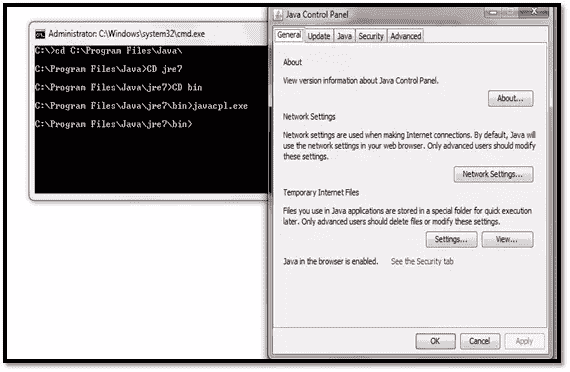

Figure 10: Accessing Java Control Panel from command prompt

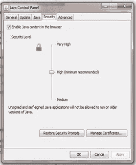

Figure 11: Java Control Panel Security Levels

**Java SE 7 更新 25:Java Applet&Web Start–代码签名**
如 Oracle Java 所述:“所有文件必须在签名前添加到 jar 中”以及

*“在启动 Applet 或 Java Web Start 之前，可能会弹出各种安全对话框，在这些对话框中添加了一个“更多信息”链接，以便用户获取有关该对话框的更多信息。”* 
**Java SE 7 更新 40:部署规则集**
如 Oracle Java:

*“部署规则集允许桌面管理员控制整个组织中客户端兼容性和默认提示的级别。”*

[富互联网应用部署流程](http://docs.oracle.com/javase/7/docs/technotes/guides/jweb/deployment_flow.html)

[部署规则集介绍](https://blogs.oracle.com/java-platform-group/entry/introducing_deployment_rule_sets)

**Java SE 7 更新 51(计划于 2014 年 1 月发布)**
这给出了 Java 7 更新 51 中计划的一些更新:

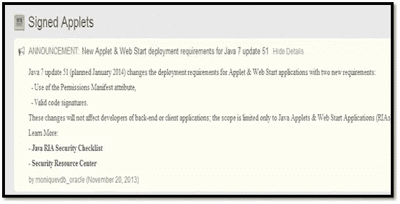

Figure 12: Java SE7 Update 51

**被阻止或混合代码**
[如果你的小程序被阻止或警告“混合代码”怎么办？](https://blogs.oracle.com/java-platform-group/entry/what_to_do_if_your)

**自签名证书**
帮助需要[使用自签名证书的用户，而不涉及公共认证机构](https://blogs.oracle.com/java-platform-group/entry/self_signed_certificates_for_a)。
描述代码签名的[角色。](https://blogs.oracle.com/java-platform-group/entry/signing_code_for_the_long)

**7u 51(2014 年 1 月)RIA 新安全要求**
[https://blogs . Oracle . com/Java-platform-group/entry/New _ security _ requirements _ for _ RIAs](https://blogs.oracle.com/java-platform-group/entry/new_security_requirements_for_rias)

**Oracle 为开发人员、最终用户、系统管理员和安全专业人员建立的安全资源中心**
[http://www . Oracle . com/tech network/Java/javase/overview/Security-2043272 . html](http://www.oracle.com/technetwork/java/javase/overview/security-2043272.html)

## 使用小程序的网站

[数学小程序](http://www.ltcconline.net/greenL/java/index.html)

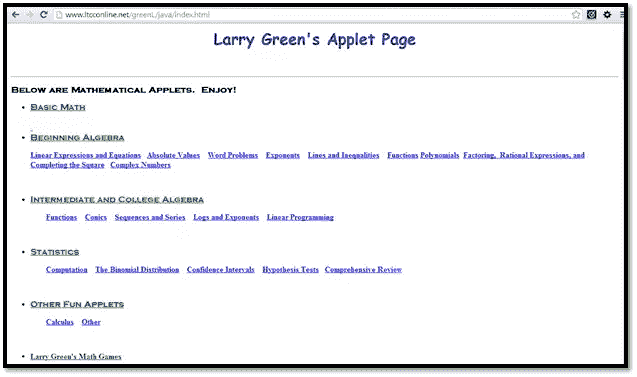

Figure 13: Larry Green’s Applet Page: http://www.ltcconline.net/greenL/java/index.html

[测试小程序的安全性](http://lionsgate.tripod.com/)

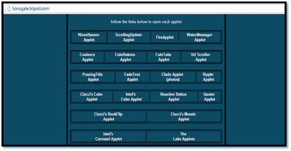

Figure 14: Another Java Applet Page: http://lionsgate.tripod.com/

[教育 Java 小程序](http://www.falstad.com/mathphysics.html)

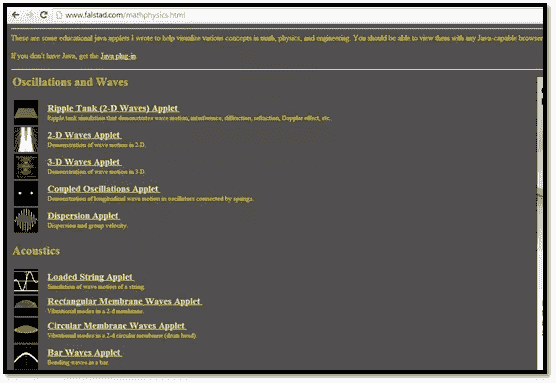

Figure 15: Mathematics, Physics and Engineering Applets: http://www.falstad.com/mathphysics.html

上述网站还提供了其他使用 Applet 的网站的链接。网站内容:*“链接到其他教育网站，提供数学/物理相关信息或对教学有用的 java 小程序”*:

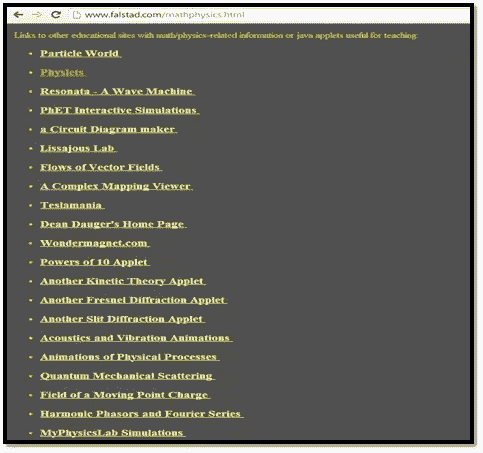

Figure 16: Links to other sites: [http://www.falstad.com/mathphysics.html](http://www.falstad.com/mathphysics.html)

[样本量计算器小程序](http://design.iasri.res.in/ssrs/ecalci2.jsp)

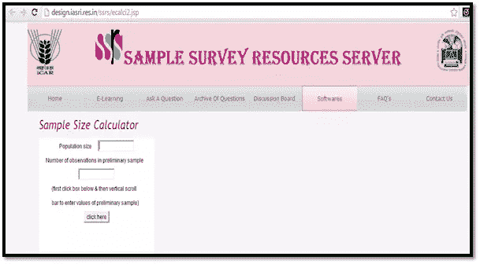

Figure 17: Sample Survey Resources Applet: http://design.iasri.res.in/ssrs/ecalci2.jsp

[Java 小程序:文字磁铁争夺](http://web.cortland.edu/flteach/mm-course/wordscrambleapplets/index.html)

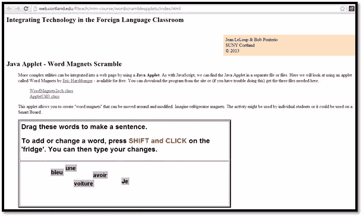

Figure 18: Word Magnets Scramble: http://web.cortland.edu/flteach/mm-course/wordscrambleapplets/index.html

DAE ja viewone pro

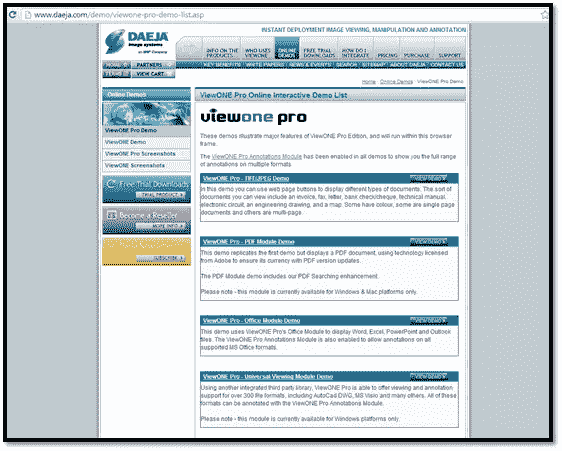

Figure 19: DAEJA viewONE pro: http://www.daeja.com/demo/viewone-pro-demo-list.asp

[交互式 Java 小程序](http://micro.magnet.fsu.edu/primer/java/scienceopticsu/powersof10/index.html)

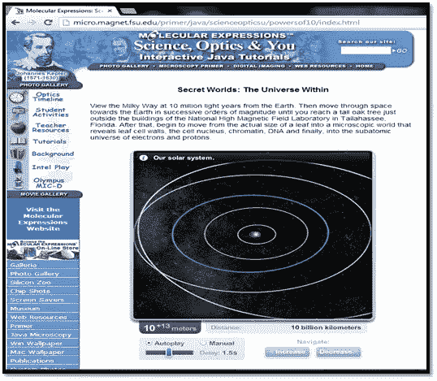

Figure 20: [Interactive Java Applets](http://micro.magnet.fsu.edu/primer/java/scienceopticsu/powersof10/index.html)

您可以将此网站上的[小程序添加到您的网站](http://www.javafile.com/)

最后，提供万维网(WWW)上的小程序列表。下面给出的截图摘自[http://www . Montgomery college . edu/~ dsolomon/273/ca 273y/Java/resources . html](http://www.montgomerycollege.edu/~dsolomon/273/ca273y/java/resources.html):

Figure 21: [List of Applets around WWW](http://www.montgomerycollege.edu/~dsolomon/273/ca273y/java/resources.html)

## 结论

任何编程语言，只要在适当的环境中完美地使用，并有几年的经验，就能被最好地理解。每种语言都有它的优点和缺点。C 和 C++已经存在 30 多年了，现在仍然在使用。Java 也是如此，即使它已经存在了 15 年。

我想提一下，我不是 Java 的拥护者，也不为 Oracle 工作(以前也从未为它工作过)。我是一名 java 软件开发人员和技术作家，这篇文章反映了我代表 web 上有经验的 Java 开发人员对 Java 和 Applets 的研究工作。

关于 Java 小程序，它们仍然是一种在网页中嵌入小 Java 程序的简单方法，并且在许多上下文中使用，如上所示。小程序仍然是大学课程的一部分。Oracle Java 已经提供了许多更新，重点是提高小程序的使用。

我们可以期待 Oracle 在 Applet 安全、签名、资源、可靠性等方面的进一步修复。甲骨文尚未将其视为折旧；这意味着他们正在为未来的 it 规划更好的东西(可能在 Java 8 中)。

在 Java(和小程序)的使用中发现了一些安全缺陷，但 Oracle 采取了必要的措施来解决这些问题，并对其进行了更新，以避免将来出现此类缺陷。在这里保持联系，了解即将到来的 Java 更新。

## 分享这篇文章