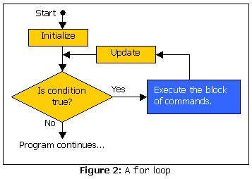

# Java 语言基础文章

> 原文：<https://www.sitepoint.com/java-language-basics-7/>

##### `for`循环

我们将在本文中看到的最终控制结构实际上只是一个更高级版本的`while`循环，称为`for`循环。相对复杂的语法往往会吓跑初学者；此外，任何一个`for`循环都可以写成一个`while`循环，这使得不使用这种特殊的控制结构变得非常诱人。然而，`for`循环为最常见的`while`循环应用提供了一个很好的捷径，所以在我看来这是值得学习的。下面是语法的样子:

```
for (initialize; condition; update) {       

  // loop body       

}
```

在上面的语句中，`initialize`是在第一次检查条件之前执行一次的语句。它通常用于为循环设置一个计数器变量。`condition`只是决定何时停止执行循环的条件(它与`while`循环中的条件完全一样)。最后，`update`是一个将在循环体之后、条件重新检查之前执行的语句。它通常用于更新计数器变量。图 2 展示了一个`for`循环是如何工作的。



为了在实践中演示一个`for`循环，我修改了上面的`Countdown`程序，使用一个`for`循环来代替`while`循环:

```
1  /**       

2   * Countdown.java       

3   * A simple Java program that counts down from 10\.       

4   */       

5         

6  class Countdown {       

7    public static void main(String[] args) {       

8      System.out.println("Countdown to liftoff...");       

9       

10     for (int count=10; count>0; count=count-1) {       

11       System.out.println(count + "!");       

12     }       

13       

14     System.out.println("Liftoff! We have liftoff!");       

15   }       

16 }
```

这个程序使用的实际代码与带有`while`循环的原始版本并没有太大的不同！`count`变量的创建和初始化变成了`for`循环中的‘初始化’语句，而从`count`变量的值中减去 1 的循环体命令变成了‘更新’语句。循环体的条件和剩余线保持不变。一个`for`循环让你做的是将所有与初始化、检查和更新计数器变量相关的命令(在这个例子中是`count`)合并到一行中，使得代码更容易阅读。

尽管任何`for`循环都可以扩展成一个`while`循环，并在循环体的前面和结尾使用适当的语句，但是通常的做法(通常更整洁)是将任何使用计数器变量的循环表示为一个`for`循环。

##### 总结和进一步阅读

在本文中，我们已经讨论了很多内容；很遗憾大部分都是如此干燥！

我们研究了变量如何让您存储用于计算的数据，数据如何以几种数据类型的形式出现，哪些运算符可用于将数据放在一起并获得结果，以及哪些控制结构让您可以编写程序，而不是直线运行。不幸的是，这些是任何编程语言中最不令人兴奋的方面；所以如果我让你厌烦了，我道歉。

好消息是，我已经介绍了 Java 语言的大部分普通细节，现在您应该准备好进入面向对象编程的世界了！因此，本系列的下一篇文章将涉及面向对象编程的概念以及它们在 Java 中的应用，这并不是巧合。我最后要回答一个大问题:如何将两个字符串放在一起比较，看它们是否匹配？别告诉我你不想知道！

如果你渴望有一个良好的开端，WROX 出版社的《Java 对象入门》这本书是一本很好的读物，它会让你像专家一样编织 Java 类的网络。请在本系列的下一期文章发布的同时查看相关评论！

**Go to page:** [1](https://sitepoint.com/java-language-basics) | [2](https://sitepoint.com/java-language-basics-2/) | [3](https://sitepoint.com/java-language-basics-3/) | [4](https://sitepoint.com/java-language-basics-4/) | [5](https://sitepoint.com/java-language-basics-5/) | [6](https://sitepoint.com/java-language-basics-6/) | [7](https://sitepoint.com/java-language-basics-7/)

## 分享这篇文章