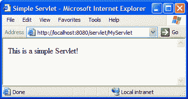

# Java servlet–第 1 部分文章

> 原文：<https://www.sitepoint.com/java-servlets-1/>

不管你是否认为自己是一名有经验的 Java 开发人员，你肯定听说过 Java 小程序。小程序是作为网页的一部分运行的小 Java 程序。因为它们是一种“迷你应用程序”，所以被称为“小应用程序”。Java**servlet**以类似的方式得名。

可以把 Servlets 想象成用 Java 编写的高效 CGI 程序。当支持 Servlet 的 Web 服务器接收到对对应于 Java Servlet 的 URL 的请求时，服务器会将请求交给 Servlet 进行处理。Servlet 动态地产生对请求的响应(通常是 HTML 网页),并将其发送回请求浏览器。如果您认为 Servlets 在这个上下文中是“迷你服务器”，那么它们的名字就非常有意义。

在本文中，我将带您了解在您自己的 Web 服务器上编写和部署 Java Servlets 的基础知识。我首先假设您已经配备了支持 Servlet 的 Web 服务器。虽然这个领域有许多产品，但阿帕奇和 T2 的自由组合是最容易得到的。大多数有经验的 Java 开发人员更喜欢圆滑的商业解决方案，如 [Caucho Resin](http://www.caucho.com/) 、 [IBM WebSphere](http://www.software.ibm.com/webservers/) 或 [Allaire JRun](http://www.jrun.com/) (参见[完整列表](http://www.servlets.com/engines/))；虽然这些方法中的大多数对于非商业用途是免费的，但是 Tomcat 支持的标准的“本质”方法是我们将在本文中使用的。如果您还没有安装 Apache 和 Tomcat，现在是一个好时机。参见我的 [JSP 快速入门指南](http://www.webmasterbase.com/article.php/305)以获得一个有用的演练，本文中的假设配置就是基于这个演练。

就 Java 程序的本质而言，Servlets 需要大量的知识来开发。至少，在开始编写第一个 Java Servlet 之前，您需要熟悉 Java 语言的基础知识。如果您刚刚开始 Java 编程，本系列的前几篇文章，Java 入门第 1 部分和第 2 部分[中的](http://www.webmasterbase.com/article/434)、 [Java 语言基础知识](http://www.webmasterbase.com/article/381)和[面向对象的概念绝对是必读的。](http://www.webmasterbase.com/article/397)

如果您对那些文章中介绍的 Java 语言的特性比较熟悉，并且已经在您的服务器上运行了 Apache 和 Tomcat，那么您就可以开始了！让我们写一个 Servlet！

##### 一个简单的 Servlet

归根结底，Servlet 只是一个 Java 类，您应该已经知道如何编写 Java 类:

`public class MyClassName {
// ... properties and methods ...
}`

但是不是任何一个类都可以。Web 上使用的 servlet 应该是`javax.servlet.http.HttpServlet`类的子类，它内置于每个支持 servlet 的 Web 服务器中。尽管不同的服务器可能会不同地实现这个类，但是它所支持的属性和方法是由 [Java Servlet 规范](http://java.sun.com/products/servlet/download.html#specs)规定的。在撰写本文时，版本 2.2 是该规范的最新版本，尽管版本 2.3 仍处于最终的草案阶段。构成规范的文档包括一个支持 Servlet 的服务器必须提供的所有类的[参考](http://java.sun.com/products/servlet/2.2/javadoc/index.html)。

所以创建 Servlet 就像创建`HttpServlet`的子类一样简单:

`import java.io.*;
import javax.servlet.*;
import javax.servlet.http.*;
public class MyServlet extends HttpServlet {
// ... properties and methods ...
}`

注意，我们正在导入上面的三个包`java.io`、`javax.servlet`和`javax.servlet.http`。`javax.servlet.http`包含我们正在扩展的`HttpServlet`类，而`javax.servlet`包含许多与 Servlets 相关的类，而`java.io`包含所有用于执行输入和输出的标准 Java 类。因为绝大多数 Servlets 使用后两个包中的类，所以最好一开始就包含它们，这样我们就不会忘记。

Servlet 必须至少提供一个 Web 服务器用来处理请求的方法。方法的名称取决于我们想要处理的请求的类型。HTTP GET 请求是最简单的页面请求形式，当用户键入一个 URL 或点击一个链接时就会出现。要让 Servlet 处理 GET 请求，您必须提供一个名为`doGet`的方法，如下所示:

`public void doGet(HttpServletRequest req, HttpServletResponse rsp)
throws ServletException, IOException {
// ... handle GET requests
}`

如您所见，`doGet`必须是一个不返回任何内容的`public`方法(`void`)，并接受两个参数:

*   一个`HttpServletRequest`对象(这个类是`javax.servlet.http`包的一部分)，在上面的例子中我们将它赋给了一个名为`req`的变量。
*   一个`HttpServletResponse`对象(也在`javax.servlet.http`中)，我们将其分配给`rsp`。

当调用这个方法时，作为参数传递的`HttpServletRequest` ( `req`)将是一个对象，它提供对与触发这个 Servlet 的浏览器请求相关的所有信息的访问。使用`HttpServletRequest`的各种方法，您可以找到请求浏览器的 IP 地址，或者 URL 查询字符串中发送的值(例如`index.html?name=value`)。同时，`HttpServletResponse` ( `rsp`)表示发送给浏览器的响应。例如，正是这个对象允许我们将 HTML 代码发送回浏览器。但稍后会详细介绍`req`和`rsp`。

如果您担心函数声明的`throws ServletException, IOException`部分，不必担心。我们在本系列之前的任何文章中都没有涉及到这一点，但是这确实非常简单。所有这些只是表明调用该方法可能导致的**异常**(错误)的类型。在这种情况下，当 Web 服务器调用`doGet`函数来处理 GET 请求时，它必须为可能出现的`ServletException`或`IOException`做好准备，并且必须优雅地处理这些错误。虽然这听起来很可怕，但它实际上让我们的工作变得更容易。例如，如果 Web 浏览器在下载完我们的 Servlet 发送给它的响应之前被关闭，就会发生`IOException`。但是由于`doGet`函数被声明为可能抛出(原因)`IOException` s，我们不必担心这些错误，因为当它们发生时，Web 服务器会为我们处理它们！

现在，在这个例子中，我们将让我们的 Servlet 向浏览器发送一个简单的 HTML 页面来响应它的请求。下面是`doGet`方法的完整代码:

`public void doGet(HttpServletRequest req, HttpServletResponse rsp)
throws ServletException, IOException {
rsp.setContentType("text/html");
PrintWriter out = rsp.getWriter();
out.println("<html>");
out.println("<head><title> Simple Servlet </title></head>");
out.println("<body>");
out.println("
This is a simple Servlet!
");
out.println("</body></html>");
}`

这也没有乍看起来那么复杂。让我们一次一行地遍历这个方法的主体:

`rsp.setContentType("text/html");`

在这一行，我们调用了`rsp`变量的`setContentType`方法(您会记得它包含一个`HttpServletResponse`对象)。这个方法将 HTTP `Content-Type`头设置为`"text/html"` MIME 类型，这告诉 Web 浏览器期待一个 HTML 网页。任何生成网页的 Servlet 都必须从设置这个内容类型开始。同样，生成纯文本文件的 Servlet 会将`Content-Type`设置为`"text/plain"`，生成 GIF 文件的 Servlet 会使用`"image/gif"`。

`PrintWriter out = rsp.getWriter();`

现在，因为我们要生成一个 Web 页面，所以我们要将 HTML 代码发送到 Web 浏览器。HTML 代码就是简单的纯文本，输出纯文本数据的标准 Java I/O 类是`java.io.PrintWriter`。在这一行，我们声明了一个名为`out`的变量来存储一个`PrintWriter`(回想一下我们导入了`java.io`包，所以我们可以直接引用这个类，而不用给出它的完全限定名)。要获得一个被设置为输出文本作为对 Web 浏览器的响应的`PrintWriter`对象，我们只需调用包含我们的响应对象的`rsp`的`getWriter`方法，并将返回值赋给我们新的`out`变量。

`out.println("<html>");`

其余的`doGet`方法只是使用`PrintWriter` ( `out`)向浏览器输出 HTML 代码。就像以前文章中的示例程序一样，我们可以用`System.out.println` ( `System.out`也是一个`PrintWriter`)将文本输出到屏幕，我们可以用`out`对象的`println`方法将文本行输出到 Web 浏览器。回想一下`println`在被告知输出的`String`的末尾自动开始新的一行。如果不想在 HTML 代码中另起一行，可以用`print`方法代替`println`。

下载完整的[MyServlet.java](http://www.webmasterbase.com/examples/servlets/MyServlet.java)文件，或者从上面的列表中打出来，保存在你电脑上某个方便的地方(例如，我使用一个名为`D:JavaDev`的目录)。接下来，我们将看到如何编译和部署 Servlet。

##### 编译 Servlet

到目前为止，我们看到的所有 Java 程序都很容易编译。不幸的是，如果您试图编译我们在上一节中生成的`MyServlet.java`文件，您将得到许多非常难看的错误消息:

`D:javadev> javac MyServlet.java
MyServlet.java:2: package javax.servlet does not exist
import javax.servlet.*;
^
MyServlet.java:3: package javax.servlet.http does not exist
import javax.servlet.http.*;
^
MyServlet.java:5: cannot resolve symbol
symbol  : class HttpServlet
location: class MyServlet
public class MyServlet extends HttpServlet {
^
...`

现在，我发现处理编译错误的最佳策略是首先查看顶部列出的错误，因为这些错误实际上可能会导致其他一些错误出现在下面。例如，在这种情况下，您可能看到的四个“无法解析符号”错误实际上是顶部的两个“包不存在”错误的结果。仔细观察，你会注意到编译器被我们用来导入`javax.servlet`和`javax.servlet.http`包的两个`import`命令卡住了。因为它不能导入那些包，我们将不能使用驻留在其中的任何类，结果是所有的“不能解析符号”错误都指向我们试图这样做的地方。

那么为什么它找不到那两个包呢？嗯，这两个包实际上并不像`java.io`那样内置到 Java 中。相反，它们带有支持 Servlet 的 Web 服务器(例如 Tomcat)。所以在 Java 编译器能够编译我们的 Servlet 之前，我们需要让它知道在哪里可以找到这两个包中的类。

所需的类通常存储在一个名为`servlet.jar`的文件中。该文件的确切位置取决于您使用的特定 Web 服务器软件，但是对于 Tomcat，您可以在 Tomcat 主安装目录的`lib`子目录中找到它(例如`d:Program FilesApache Groupjakarta-tomcat-3.2.3libservlet.jar`)。为了让 Java 编译器能够编译 Servlets，您需要将这个文件添加到 Java **类路径**中。默认情况下，Java 只在当前目录中查找类(`"."`)。因此，`"."`是默认的类路径。如果您将类路径更改为包含`servlet.jar`文件(Windows 下的`".;d:...libservlet.jar"`，Unix 下的`".:/usr/.../lib/servlet.jar"`，那么 Servlet 应该可以很好地编译。

您可以指定运行`javac.exe`时使用的类路径，如下所示:

`d:javadev> javac -classpath ".;d:Program FilesApache Group
jakarta-tomcat-3.2.3libservlet.jar" MyServlet.java`

显然，每次您想要编译 Servlet 时，输入到`servlet.jar`的路径可能会很长并且很痛苦。或者，您可以将一个名为`CLASSPATH`的环境变量设置为您想要的类路径。在您使用的特定操作系统中，以与设置`PATH`环境相同的方式进行设置(如果您需要，在 JDK 的安装说明中提供了在各种操作系统中调整`PATH`环境变量的说明)。要在 Windows 下临时设置`CLASSPATH`环境变量，可以在 MS-DOS 命令提示符下使用`SET`命令:

`d:javadev> SET CLASSPATH=.;d:Program FilesApache Group
jakarta-tomcat-3.2.3libservlet.jar
d:javadev> javac MyServlet.java`

无论您以何种方式设置您的类路径，您现在应该能够成功地编译`MyServlet.java`以获得`MyServlet.class`(或者在这里下载)。

##### 部署 Servlet

在默认配置中，Tomcat 希望您将编译好的 Servlets 放在 Tomcat 安装目录的`webappsROOTWEB-INFclasses`子目录中进行部署。将编译好的`MyServlet.class`文件放入该目录，然后(假设 Tomcat 正在本地计算机上运行)加载`http://localhost:8080/servlet/MyServlet`。如果你做的一切都是正确的，你应该会看到一个非常像这样的网页:

如果您安装了 Apache 来使用`mod_jk`与 Tomcat 接口，那么您也应该能够使用`http://localhost/servlet/MyServlet`查看您的 Servlet(或者`http://localhost:8000/servlet/MyServlet`，如果您已经将 Apache 配置为在端口 8000 上运行)。

大多数时候，这就是部署 Servlet 所需要做的全部工作！然而，在某些情况下，您希望从不同的地址使用您的 Servlet。一个常见的情况是当您将包名分配给 Servlet 时。例如，考虑如果通过添加以下代码行将`MyServlet`类放在包`com.sitepoint.web`中会发生什么

`package com.sitepoint.web;`

到`MyServlet.java`文件的顶部。要部署`MyServlet.class`文件，您应该将它放在`webappsROOTWEB-INFclassescomsitepointweb`(回想一下`.class`文件的位置必须反映它们的包名)，并用它的完全限定类名(`http://localhost:8080/servlet/com.sitepoint.web.MyServlet`)加载它。这已经是一个相当难看的 URL 了，而且日志包或类名会让事情变得更加混乱。

因此，您可能希望为您的 Servlet 分配一个别名。这是通过`WEB-INF`目录中的`web.xml`文件完成的(例如`webappsROOTWEB-INFweb.xml`)。这是一个 XML 文件，允许您配置已经部署的 Servlets。因为 XML 文件是纯文本，所以您可以简单地在记事本中打开它进行所需的更改。当您第一次安装 Tomcat 时，`web.xml`不包含任何配置信息:

`<?xml version="1.0" encoding="ISO-8859-1"?>
<!DOCTYPE web-app
PUBLIC "-//Sun Microsystems, Inc.//DTD Web Application 2.2//EN"
"http://java.sun.com/j2ee/dtds/web-app_2_2.dtd">
<web-app>
</web-app>`

通过在`<web-app>`和`</web-app>`之间添加标签，您可以为您的 servlets 添加配置信息。以下是如何将“我的”这个名字分配给`MyServlet`:

`<web-app>
<servlet>
<servlet-name>
my
</servlet-name>
<servlet-class>
MyServlet
</servlet-class>
</servlet>
</web-app>`

如果您保存以上更改，然后关闭并重启 Tomcat，您将能够以`http://localhost:8080/servlet/my`的身份访问您的 Servlet。这看起来没什么大不了的，但是当您的 Servlet 的类名长度为 25 个字符，并且深深地嵌套在一个包中时，您会很高兴能够给它一个漂亮的、简短的名称。

为您的 Servlet 指定一个名称还允许您使用该名称为您的 Servlet 指定额外的配置参数。例如，`<servlet-mapping>`标记允许您将 Servlet 映射到服务器上的任何 URL 或 URL 模式:

`<web-app>
<servlet>
<servlet-name>
my
</servlet-name>
<servlet-class>
MyServlet
</servlet-class>
</servlet>
<servlet-mapping>
<servlet-name>
my
</servlet-name>
<url-pattern>
/my.html
</url-pattern>
</servlet-mapping>
</web-app>`

上面的代码将让您以`http://localhost:8080/my.html`的身份访问您的 Servlet——完全隐藏您正在使用 Servlet 的事实！您还可以指定一个带有通配符的`<url-pattern>`，比如`/my/*`，它将使用您的 Servlet 显示任何以`"http://localhost:8080/my/"`开头的 URL，或者`*.blah`，它将把所有以`.blah`结尾的文件名请求映射到您的 Servlet。因为您的 Servlet 接收的`HttpServletRequest`对象让您的 Servlet 检查被请求的 URL，您可以想象将一个单独的 Servlet 映射到`/*`并让它处理您网站上的每个请求，根据被请求的 URL 发送不同的响应！

如果您将 Apache 设置为您的主 Web 服务器，并使用`mod_jk`将 Servlets 和 Java server Pages(JSP)请求转发给 Tomcat，您会发现`<url-pattern>`并不像预期的那样工作。这是因为，默认情况下，Apache 只会将对以`.jsp`结尾的文件或`/servlet`目录中的文件的请求转发给 Tomcat 进行处理。要向 Tomcat 转发额外的 URL 模式，必须在 Apache 配置文件中使用`JkMount`指令。确保在 Tomcat 的`mod_jk.conf-auto`文件(加载`JkMount`工作所需的模块)的`Include`行之后这样做。例如，映射/my/*。blah(`/my`目录中的所有`.blah`文件)添加到 Tomcat 中，您可以添加以下内容:

`JkMount /my/*.blah ajp13`

注意，我们为这个映射指定了更有效的用于 Apache 和 Tomcat 之间通信的`ajp13`协议(Tomcat 的`mod_jk.conf-auto`文件目前使用旧的、效率较低的`ajp12`作为它的默认映射)。完成更改后，重新启动 Tomcat 和 Apache，现在映射应该可以通过 Apache 服务器工作了。

正如您所看到的，当使用标准方法时，所有这些 Servlets 的部署和配置是一件相当麻烦的事情。像我在引言中提到的那些商业 Web 服务器通常提供漂亮的图形化管理界面，在后台为您进行所有这些低级的修改。然而，`web.xml`文件的格式是在 Servlet 标准中定义的，并且被所有支持 Servlet 的服务器支持，即使提供了更简单的方法来管理它包含的设置。

##### 一个生动的例子

到目前为止，我们使用的简单 Servlet ( `MyServlet`)并不令人兴奋，因为它在每次加载时都显示相同的内容。Servlets 的强大之处在于它们可以在每次加载时生成一个新的动态响应。Servlets 的常见用途包括从数据库中检索动态内容，使用 XSL 样式表将 XML 文档显示为 HTML，处理表单提交并采取适当的行动(例如电子商务应用程序)。

对于我们的第一个动态 Servlet，我们将显示当前的服务器日期和时间。下面是 servlet([Time.java](http://www.webmasterbase.com/examples/servlets/Time.java))的代码:

`import java.io.*;
import javax.servlet.*;
import javax.servlet.http.*;
import java.util.Date;`

 `公共类 Time 扩展 HttpServlet {
公共 void doGet(http servlet request req，http servlet response RSP)
throws servlet exception，io exception {
RSP . set content type(" text/html ")；
PrintWriter out = RSP . getwriter()；

Date now = new Date()；//当前日期/时间` 

`out.println("<html>");
out.println("<head><title> Time Check </title></head>");
out.println("<body>");
out.println("
The time is: " + now + "
");
out.println("</body></html>");
}
}`

总而言之，这个 Servlet 和`MyServlet`非常相似。让我们来看看新功能:

`import java.util.Date;`

我们从`java.util`包中导入 Java 的内置`Date`类。如果您对这个类的属性和方法感兴趣，可以在 Java API 文档中阅读这个类。

`Date now = new Date(); // The current date/time`

我们创建一个名为`now`的新变量，并在其中存储一个新的`Date`对象。创建日期对象时，它包含创建的日期和时间，并将它们作为`String`的一部分打印出来:

`out.println("
The time is: " + now + "
");`

编译这个文件(或者下载 [Time.class](http://www.webmasterbase.com/examples/servlets/Time.class) )并按照上一节所示进行部署。现在，当你加载`http://localhost:8080/servlet/Time`时，你会看到这样一个页面:

在浏览器中点击几次重新加载，观察每次页面的变化。

##### 进一步阅读的摘要和资源

在本文中，我们学习了 Java Servlets 的基础知识——在 Web 服务器内部运行的小型 Java 程序，处理浏览器请求并返回动态生成的网页作为响应。我们看到了如何使用所有支持 Servlet 的 Web 服务器支持的标准方法来编写、编译和部署一个简单的 Servlet。最后，我们看到了一个稍微复杂一点的例子，每当它被加载时就显示当前时间。

Servlets 有比我们在这里看到的更多的东西！在第 2 部分中，我们将看到如何用 Servlet 使用`HttpServletRequest`对象处理表单提交。我们还将查看`HttpServletResponse`对象，看看它还能做什么。最后，我们将学习更多的技巧，这些技巧可以在`web.xml`中用来微调安装在我们 Web 服务器上的 Servlets。

为了全面彻底地了解 Servlet 和它们的能力，我推荐 Jason Hunter 和 William Crawford 的优秀著作， [Java Servlet 编程第二版](http://amazon.com/exec/obidos/ASIN/0596000405/webmasterresou05/)。它不仅以令人难以置信的详细程度涵盖了关于 Servlets 的所有知识，而且还用实际例子和清晰、有时幽默的讨论来支持每一点。该书还深入研究了许多构建在 Servlets 框架之上的技术，如 JavaServer Pages (JSP)、元素构造集(ECS)和 Tea 框架。

## 分享这篇文章