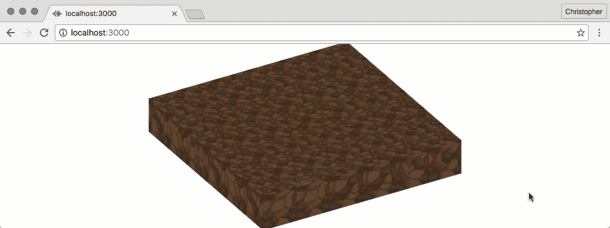
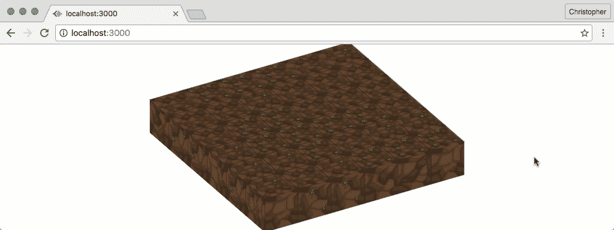
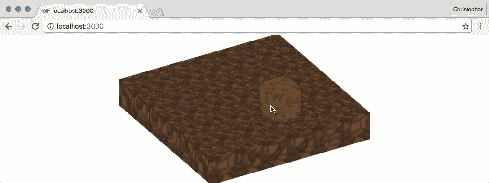

# 构建 JavaScript 3D《我的世界》编辑器

> 原文：<https://www.sitepoint.com/javascript-3d-minecraft-editor/>

这篇文章由 Paul O'Brien 进行了同行评审。感谢 SitePoint 的所有同行评审员使 SitePoint 的内容尽可能做到最好！


我一直想做一个 3D 游戏。我只是从来没有时间和精力去学习 3D 编程的复杂性。然后我发现我不需要…

有一天在修补的时候，我想到也许我可以用 CSS 转换来模拟一个 3D 环境。我偶然发现了一篇关于用 HTML 和 CSS 创建 3D 世界的旧文章。

我想模拟一个《我的世界》的世界(或者至少是其中的一小部分)。《我的世界》是一个沙盒游戏，你可以打破和放置块。我想要同样的功能，但是使用 HTML、JavaScript 和 CSS。

当我描述我所学到的，以及它如何帮助你在 CSS 转换中更有创造性时，请跟我来！

> **注:**本教程的大部分代码可以在 Github 上的[找到。我已经在最新版本的 Chrome 中测试过了。我不能保证它在其他浏览器上看起来完全一样，但核心概念是通用的。](https://github.com/assertchris-tutorials/tutorial-javascript-minecraft-editor/)

这只是冒险的一半。如果你想知道如何将设计持久化到一个真实的服务器上，可以看看姐妹帖 [PHP《我的世界》Mod](https://www.sitepoint.com/modding-minecraft-with-php-buildings-from-code/) 。在那里，我们探索与《我的世界》服务器交互的方法，实时操作它并响应用户输入。

## 我们已经在做的事情

为了建立网站，我已经写了相当多的 CSS，并且已经很好地理解了它。但是这种理解是建立在我将在 2D 空间工作的假设之上的。

让我们考虑一个例子:

```
.tools {
  position: absolute;
  left: 35px;
  top: 25px;
  width: 200px;
  height: 400px;
  z-index: 3;
}

.canvas {
  position: absolute;
  left: 0;
  top: 0;
  width: 100%;
  height: 100%;
  z-index: 2;
} 
```

这里我们有一个画布元素，从页面的左上角开始，一直延伸到右下角。除此之外，我们还添加了一个工具元素。它从页面左侧的`25px`开始，从页面顶部的`35px`开始，测量`200px`宽、`400px`高。

根据`div.tools`和`div.canvas`添加到标记的顺序，`div.canvas`完全有可能与`div.tools`重叠。除了应用于每一个的`z-index`风格。

你可能习惯于思考以这种方式设计的元素，因为 2D 表面有可能相互重叠。但是这种重叠本质上是第三维的。`left`、`top`、`z-index`不妨改名为`x`、`y`、`z`。只要我们假设每个元素都有一个固定的深度`1px`，并且`z-index`有一个隐含的`px`单元，我们就已经在用 3D 术语思考了。

我们中的一些人倾向于纠结的是在这个第三维度中旋转和平移的概念…

## 转换理论

CSS 翻译在一个 API 中复制了这种熟悉的功能，该 API 扩展了对我们的限制`top`、`left`和`z-index`。有可能用翻译取代我们以前的一些风格:

```
.tools {
  position: absolute;
  background: green;
  /*
    left: 35px;
    top: 25px;
  */
  transform-origin: 0 0;
  transform: translate(35px, 25px);
  width: 200px;
  height: 400px;
  z-index: 3;
} 
```

我们可以声明一个显式原点，而不是定义`left`和`top`偏移量(假设原点从左边开始为`0px`，从上面开始为`0px`)。我们可以对这个元素进行各种各样的变换，以`0 0`为中心。`translate(35px, 25px)`向右移动元素`35px`，向下移动`25px`。我们可以使用负值向左和/或向上移动元素。

有了为我们的转换定义原点的能力，我们也可以开始做其他有趣的事情。例如，我们可以旋转和缩放元素:

```
transform-origin: center;
transform: scale(0.5) rotate(45deg); 
```

每个元素都以默认的`50% 50% 0`的`transform-origin`开始，但是`center`的值将`x`、`y`和`z`设置为`50%`的等价物。我们可以将元素缩放到一个介于`0`和`1`之间的值，并按角度或弧度旋转它(顺时针)。我们可以在两者之间转换:

*   `45deg`=`(45 * Math.PI) / 180``0.79rad`
*   `0.79rad`=`(0.79 * 180) / Math.PI``45deg`

要逆时针旋转一个元素，我们只需要使用负的`deg`或`rad`值。

更有趣的是，关于这些变换，我们可以使用它们的 3D 版本。

> Evergreen 浏览器对这些样式有很好的支持，尽管它们可能需要厂商前缀。CodePen 有一个简洁的“自动修复”选项，但是你可以在你的本地代码中添加像 [PostCSS](https://github.com/postcss/autoprefixer/) 这样的库来达到同样的目的。

## 第一块

让我们开始创造我们的 3D 世界。我们将从腾出空间来放置积木开始。创建一个新文件，名为`index.html`:

```
<!doctype html>
<html>
  <head>
    <style> html, body {
        padding: 0;
        margin: 0;
        width: 100%;
        height: 100%;
      }

      .scene {
        position: absolute;
        left: 50%;
        top: 50%;
        margin: -192px 0 0 -192px;
        width: 384px;
        height: 384px;
        background: rgba(100, 100, 255, 0.2);
        transform: rotateX(60deg) rotateZ(60deg);
        transform-style: preserve-3d;
        transform-origin: 50% 50% 50%;
      } </style>
  </head>
  <body>
    <div class="scene"></div>
    <script src="https://code.jquery.com/jquery-3.1.0.slim.min.js"></script>
    <script src="http://ricostacruz.com/jquery.transit/jquery.transit.min.js"></script>
    <script> // TODO </script>
  </body>
</html> 
```

在这里，我们将身体拉伸到全宽和全高，将填充重置为`0px`。然后我们创建一个小的`div.scene`，我们将使用它来保存不同的块。我们使用 50% `left`和`top`，以及负的左上方`margin`(等于`width`和`height`的一半)来水平和垂直居中。然后我们稍微倾斜它(使用 3D 旋转),这样我们就有了方块所在位置的透视图。

> 注意我们是如何定义`transform-style:preserve-3d`的。这使得子元素也可以在 3D 空间中操作。

结果应该是这样的:

通过 [CodePen](http://codepen.io) 上的 SitePoint ( [@SitePoint](http://codepen.io/SitePoint) )看笔[空场景](https://codepen.io/SitePoint/pen/XjEArb/)。

现在，让我们开始添加一个方块形状的场景。我们需要创建一个新的 JavaScript 文件，名为`block.js`:

```
"use strict"

class Block {
  constructor(x, y, z) {
    this.x = x;
    this.y = y;
    this.z = z;

    this.build();
  }

  build() {
    // TODO: build the block
  }

  createFace(type, x, y, z, rx, ry, rz) {
    // TODO: return a block face
  }

  createTexture(type) {
    // TODO: get the texture
  }
} 
```

每个块需要是一个 6 面的三维形状。我们可以将构造的不同部分分解成(1)构建整个块，(2)构建每个表面，以及(3)获得每个表面的纹理的方法。

这些行为(或方法)中的每一个都包含在一个 [ES6 类](https://developer.mozilla.org/en/docs/Web/JavaScript/Reference/Classes)中。这是一种将数据结构和操作它们的方法组合在一起的好方法。你可能熟悉传统的形式:

```
function Block(x, y, z) {
  this.x = x;
  this.y = y;
  this.z = z;

  this.build();
}

var proto = Block.prototype;

proto.build = function() {
  // TODO: build the block
};

proto.createFace = function(type, x, y, z, rx, ry, rz) {
  // TODO: return a block face
}

proto.createTexture = function(type) {
  // TODO: get the texture
} 
```

这可能看起来有点不同，但基本相同。除了更短的语法，ES6 类还提供了扩展原型和调用重写方法的快捷方式。但是我跑题了…

让我们自下而上地工作:

```
createFace(type, x, y, z, rx, ry, rz) {
  return $(`<div class="side side-${type}" />`)
    .css({
      transform: ` translateX(${x}px)
        translateY(${y}px)
        translateZ(${z}px)
        rotateX(${rx}deg)
        rotateY(${ry}deg)
        rotateZ(${rz}deg) `,
      background: this.createTexture(type)
    });
}

createTexture(type) {
  return `rgba(100, 100, 255, 0.2)`;
} 
```

每个表面(或面)由一个旋转和平移的 div 组成。我们不能制作比`1px`更厚的元素，但我们可以通过覆盖所有的孔并使用多个相互平行的元素来模拟深度。我们可以给这个木块以深度的错觉，即使它是空心的。

为此，`createFace`方法采用一组坐标:`x`、`y`和`z`表示面部的位置。我们还提供了每个轴的旋转，所以我们可以调用任何配置的`createFace`，它将按照我们想要的方式平移和旋转面部。

让我们建立基本的形状:

```
build() {
  const size = 64;
  const x = this.x * size;
  const y = this.y * size;
  const z = this.z * size;

  const block = this.block = $(`<div class="block" />`)
    .css({
      transform: ` translateX(${x}px)
        translateY(${y}px)
        translateZ(${z}px) `
    });

  $(`<div class="x-axis" />`)
    .appendTo(block)
    .css({
      transform: ` rotateX(90deg)
        rotateY(0deg)
        rotateZ(0deg) `
    });

  $(`<div class="y-axis" />`)
    .appendTo(block)
    .css({
      transform: ` rotateX(0deg)
        rotateY(90deg)
        rotateZ(0deg) `
    });

  $(`<div class="z-axis" />`)
    .appendTo(block);
} 
```

我们习惯于考虑单个像素的位置，但是像《我的世界》这样的游戏可以在更大的范围内运行。每个块都更大，坐标系处理的是块的位置，而不是组成它的单个像素。我想在这里传达同样的想法…

当有人在`1` × `2` × `3`创建一个新的区块时，我希望这意味着`0px` × `64px` × `128px`。因此，我们将每个坐标乘以默认大小(在本例中为`64px`，因为这是我们将使用的纹理包中纹理的大小)。

然后我们创建一个容器 div(我们称之为`div.block`)。在里面我们放置了另外 3 个 div。这些将向我们展示我们区块的轴——它们就像 3D 渲染程序中的向导。我们还应该为我们的块添加一些新的 CSS:

```
.block {
  position: absolute;
  left: 0;
  top: 0;
  width: 64px;
  height: 64px;
  transform-style: preserve-3d;
  transform-origin: 50% 50% 50%;
}

.x-axis,
.y-axis,
.z-axis {
  position: absolute;
  left: 0;
  top: 0;
  width: 66px;
  height: 66px;
  transform-origin: 50% 50% 50%;
}

.x-axis {
  border: solid 2px rgba(255, 0, 0, 0.3);
}

.y-axis {
  border: solid 2px rgba(0, 255, 0, 0.3);
}

.z-axis {
  border: solid 2px rgba(0, 0, 255, 0.3);
} 
```

这种风格与我们之前看到的相似。我们需要记住在`.block`上设置`transform-style:preserve-3d`，以便轴在它们自己的 3D 空间中呈现。我们给它们不同的颜色，并使它们比包含它们的块稍大一些。这样即使方块有边，它们也是可见的。

让我们创建一个新块，并将其添加到`div.scene`:

```
let first = new Block(1, 1, 1);

$(".scene").append(first.block); 
```

结果应该是这样的:

在 [CodePen](http://codepen.io) 上通过 SitePoint ( [@SitePoint](http://codepen.io/SitePoint) )看笔[基本 3D 块](https://codepen.io/SitePoint/pen/YGaKVx/)。

现在，让我们添加这些面孔:

```
this
  .createFace("top", 0, 0, size / 2, 0, 0, 0)
  .appendTo(block);

this
  .createFace("side-1", 0, size / 2, 0, 270, 0, 0)
  .appendTo(block);

this
  .createFace("side-2", size / 2, 0, 0, 0, 90, 0)
  .appendTo(block);

this
  .createFace("side-3", 0, size / -2, 0, -270, 0, 0)
  .appendTo(block);

this
  .createFace("side-4", size / -2, 0, 0, 0, -90, 0)
  .appendTo(block);

this
  .createFace("bottom", 0, 0, size / -2, 0, 180, 0)
  .appendTo(block); 
```

我发现这段代码有点反复试验的味道(由于我对 3D 透视的经验有限)。每个元素从与`div.z-axis`元素完全相同的位置开始。也就是说，在`div.block`的垂直中心并面向顶部。

因此，对于“顶部”元素，我必须将其“向上”平移块大小的一半，但我不必以任何方式旋转它。对于“底部”元素，我必须将其旋转 180 度(沿着 x 或 y 轴)，并将其向下移动块大小的一半。

使用类似的思维，我旋转和平移其余的每一面。我还必须为它们添加相应的 CSS:

```
.side {
  position: absolute;
  left: 0;
  top: 0;
  width: 64px;
  height: 64px;
  backface-visibility: hidden;
  outline: 1px solid rgba(0, 0, 0, 0.3);
} 
```

*添加`backface-visibility:hidden`防止元素的“底部”被渲染。通常，无论如何旋转，它们看起来都是一样的(只是镜像)。隐藏背面时，仅渲染“顶”面。打开时要小心:你的表面需要以正确的方式旋转，否则方块的边会消失。这就是我给两边做 90/270/-90/-270 旋转的原因。*

通过 [CodePen](http://codepen.io) 上的 SitePoint ( [@SitePoint](http://codepen.io/SitePoint) )看笔 [3D 方块边](https://codepen.io/SitePoint/pen/wzmwdE/)。

让我们让这个块看起来更真实一点。我们需要创建一个名为`block.dirt.js`的新文件，并覆盖`createTexture`方法:

```
"use strict"

const DIRT_TEXTURES = {
  "top": [
    "textures/dirt-top-1.png",
    "textures/dirt-top-2.png",
    "textures/dirt-top-3.png"
  ],
  "side": [
    "textures/dirt-side-1.png",
    "textures/dirt-side-2.png",
    "textures/dirt-side-3.png",
    "textures/dirt-side-4.png",
    "textures/dirt-side-5.png"
  ]
};

class Dirt extends Block {
  createTexture(type) {
    if (type === "top" || type === "bottom") {
      const texture = DIRT_TEXTURES.top.random();

      return `url(${texture})`;
    }

    const texture = DIRT_TEXTURES.side.random();

    return `url(${texture})`;
  }
}

Block.Dirt = Dirt; 
```

> 我们将使用一个流行的纹理包，叫做 [Sphax PureBDCraft](http://bdcraft.net/purebdcraft-minecraft) 。它可以免费下载和使用(前提是你不打算出售它)，而且它有各种尺寸。我用的是`x64`版本。

我们首先为块的侧面和顶部的纹理定义一个查找表。纹理包没有指定哪些纹理应该用于底部，所以我们将只重用顶部的纹理。

如果需要纹理的一面是“顶部”或“底部”，那么我们从“顶部”列表中获取一个随机纹理。随机方法是不存在的，直到我们定义它:

```
Array.prototype.random = function() {
  return this[Math.floor(Math.random() * this.length)];
}; 
```

类似地，如果我们需要一个边的纹理，我们随机取一个。这些纹理是无缝的，所以随机化对我们有利。

结果应该是这样的:

在 [CodePen](http://codepen.io) 上通过 SitePoint ( [@SitePoint](http://codepen.io/SitePoint) )查看钢笔 [3D 方块纹理](https://codepen.io/SitePoint/pen/rrdBwB/)。

## 大吵大闹

我们如何让这种互动？好吧，一个好的开始是一个场景。我们已经在场景中放置了块，所以现在我们只需要启用动态放置！

首先，我们可以渲染块的平面:

```
const $scene = $(".scene");

for (var x = 0; x < 6; x++) {
  for (var y = 0; y < 6; y++) {
    let next = new Block.Dirt(x, y, 0);
    next.block.appendTo($scene);
  }
} 
```

太好了，这给了我们一个平面来开始添加积木。现在，当我们将光标悬停在表面上时，让我们突出显示这些表面:

```
.block:hover .side {
  outline: 1px solid rgba(0, 255, 0, 0.5);
} 
```

然而，奇怪的事情正在发生:



这是因为曲面会随机穿过彼此。没有很好的方法来解决这个问题，但是我们可以通过稍微缩放块来防止它发生:

```
const block = this.block = $(`<div class="block" />`)
  .css({
    transform: ` translateX(${x}px)
      translateY(${y}px)
      translateZ(${z}px)
      scale(0.99) `
  }); 
```


虽然这确实让事情看起来更好，但场景中的块越多，性能就会受到影响。一次缩放多个元素时要轻踩…

让我们用属于它的块和类型来标记每个表面:

```
createFace(type, x, y, z, rx, ry, rz) {
  return $(`<div class="side side-${type}" />`)
    .css({
      transform: ` translateX(${x}px)
        translateY(${y}px)
        translateZ(${z}px)
        rotateX(${rx}deg)
        rotateY(${ry}deg)
        rotateZ(${rz}deg) `,
      background: this.createTexture(type)
    })
    .data("block", this)
    .data("type", type);
} 
```

然后，当我们单击一个表面时，我们可以导出一组新的坐标并创建一个新的块:

```
function createCoordinatesFrom(side, x, y, z) {
  if (side == "top") {
    z += 1;
  }

  if (side == "side-1") {
    y += 1;
  }

  if (side == "side-2") {
    x += 1;
  }

  if (side == "side-3") {
    y -= 1;
  }

  if (side == "side-4") {
    x -= 1;
  }

  if (side == "bottom") {
    z -= 1;
  }

  return [x, y, z];
}

const $body = $("body");

$body.on("click", ".side", function(e) {
  const $this = $(this);
  const previous = $this.data("block");

  const coordinates = createCoordinatesFrom(
    $this.data("type"),
    previous.x,
    previous.y,
    previous.z
  );

  const next = new Block.Dirt(...coordinates);

  next.block.appendTo($scene);
}); 
```

有一个简单但重要的任务。给定边的类型和它所属的块的坐标，`createCoordinatesFrom`应该返回一组新的坐标。这些是新块将被放置的地方。

然后我们附加了一个事件监听器。每点击一次`div.side`就会触发一次。当这发生时，我们得到该边所属的块，并为下一个块导出一组新的坐标。一旦我们有了这些，我们就创建块并把它添加到场景中。

结果是奇妙的互动:

在 [CodePen](http://codepen.io) 上通过 SitePoint ( [@SitePoint](http://codepen.io/SitePoint) )查看笔[预填充场景](https://codepen.io/SitePoint/pen/jrzNLR/)。

## 看见鬼

在放置之前，最好能看到将要放置的砖块的轮廓。这有时被称为我们将要做的事情的“幽灵”。

实现这一点的代码与我们已经看到的非常相似:

```
let ghost = null;

function removeGhost() {
  if (ghost) {
    ghost.block.remove();
    ghost = null;
  }
}

function createGhostAt(x, y, z) {
  const next = new Block.Dirt(x, y, z);

  next.block
    .addClass("ghost")
    .appendTo($scene);

  ghost = next;
}

$body.on("mouseenter", ".side", function(e) {
  removeGhost();

  const $this = jQuery(this);
  const previous = $this.data("block");

  const coordinates = createCoordinatesFrom(
    $this.data("type"),
    previous.x,
    previous.y,
    previous.z
  );

  createGhostAt(...coordinates);
});

$body.on("mouseleave", ".side", function(e) {
  removeGhost();
}); 
```

主要区别在于我们维护了 ghost 块的一个实例。每创建一个新的，旧的就会被删除。这可能得益于一些额外的风格:

```
.ghost {
  pointer-events: none;
}

.ghost .side {
  opacity: 0.6;
  pointer-events: none;
  -webkit-filter: brightness(1.5);
} 
```

如果保持活动状态，与重影元素相关联的指针事件将抵消下面一侧的`mouseenter`和`mouseleave`事件。因为我们不需要与 ghost 元素交互，所以我们可以禁用这些指针事件。

这个结果非常简洁:

在 [CodePen](http://codepen.io) 上通过 SitePoint ( [@SitePoint](http://codepen.io/SitePoint) )看笔 [3D 块鬼](https://codepen.io/SitePoint/pen/QKmLqo/)。

## 改变视角

我们增加的互动越多，就越难看到发生了什么。似乎是时候做点什么了。如果我们能够缩放和旋转视窗，能够更好地看到正在发生的事情，那就太棒了…

先说变焦。许多界面(和游戏)允许通过滚动鼠标滚轮来缩放视口。不同的浏览器以不同的方式处理鼠标滚轮事件，所以使用抽象库是有意义的。

一旦安装完毕，我们就可以连接到事件:

```
let sceneTransformScale = 1;

$body.on("mousewheel", function(event) {
  if (event.originalEvent.deltaY > 0) {
    sceneTransformScale -= 0.05;
  } else {
    sceneTransformScale += 0.05;
  }

  $scene.css({
    "transform": ` scaleX(${sceneTransformScale})
      scaleY(${sceneTransformScale})
      scaleZ(${sceneTransformScale}) `
  });
}); 
```



现在我们可以控制整个场景的比例，只需滚动鼠标滚轮。不幸的是，当我们这么做的时候，旋转被覆盖了。我们需要考虑旋转，因为我们允许用鼠标拖动视口来调整它:

```
let sceneTransformX = 60;
let sceneTransformY = 0;
let sceneTransformZ = 60;
let sceneTransformScale = 1;

const changeViewport = function() {
  $scene.css({
    "transform": ` rotateX(${sceneTransformX}deg)
      rotateY(${sceneTransformY}deg)
      rotateZ(${sceneTransformZ}deg)
      scaleX(${sceneTransformScale})
      scaleY(${sceneTransformScale})
      scaleZ(${sceneTransformScale}) `
  });
}; 
```

该函数不仅会考虑场景的比例因子，还会考虑 x、y 和 z 旋转因子。我们还需要更改缩放事件侦听器:

```
$body.on("mousewheel", function(event) {
  if (event.originalEvent.deltaY > 0) {
    sceneTransformScale -= 0.05;
  } else {
    sceneTransformScale += 0.05;
  }

  changeViewport();
}); 
```

现在，我们可以开始旋转场景。我们需要:

1.  拖动动作开始时的事件侦听器
2.  鼠标移动时(拖动时)的事件侦听器
3.  拖动动作停止时的事件侦听器

类似这样的东西应该可以解决问题:

```
Number.prototype.toInt = String.prototype.toInt = function() {
  return parseInt(this, 10);
};

let lastMouseX = null;
let lastMouseY = null;

$body.on("mousedown", function(e) {
  lastMouseX = e.clientX / 10;
  lastMouseY = e.clientY / 10;
});

$body.on("mousemove", function(e) {
  if (!lastMouseX) {
    return;
  }

  let nextMouseX = e.clientX / 10;
  let nextMouseY = e.clientY / 10;

  if (nextMouseX !== lastMouseX) {
    deltaX = nextMouseX.toInt() - lastMouseX.toInt();
    degrees = sceneTransformZ - deltaX;

    if (degrees > 360) {
        degrees -= 360;
    }

    if (degrees < 0) {
        degrees += 360;
    }

    sceneTransformZ = degrees;
    lastMouseX = nextMouseX;

    changeViewport();
  }

  if (nextMouseY !== lastMouseY) {
    deltaY = nextMouseY.toInt() - lastMouseY.toInt();
    degrees = sceneTransformX - deltaY;

    if (degrees > 360) {
        degrees -= 360;
    }

    if (degrees < 0) {
        degrees += 360;
    }

    sceneTransformX = degrees;
    lastMouseY = nextMouseY;

    changeViewport();
  }
});

$body.on("mouseup", function(e) {
  lastMouseX = null;
  lastMouseY = null;
}); 
```

在`mousedown`时刻，我们捕获初始鼠标`x`和`y`坐标。随着鼠标的移动(如果按钮仍被按下)，我们按比例调整`sceneTransformZ`和`sceneTransformX`。让这些值超过`360`度或低于`0`度没有坏处，但是如果我们想在屏幕上渲染它们，这些看起来会很糟糕。

> 一个`mousemove`事件监听器内的计算可能计算量很大，因为这个事件监听器可能会被触发很多次。屏幕上可能有数百万个像素，当鼠标移动到每个像素时，这个侦听器就会被触发。这就是为什么如果鼠标按钮没有被按下，我们会提前退出。

当鼠标按钮被释放时，我们重置`lastMouseX`和`lastMouseY`，这样`mousemove`监听器停止计算。我们可以只清除`lastMouseX`，但是我觉得两个都清除更干净。

不幸的是，mousedown 事件会干扰块端的 click 事件。我们可以通过防止事件冒泡来解决这个问题:

```
$scene.on("mousedown", function(e) {
  e.stopPropagation();
}); 
```

试一试…

通过 [CodePen](http://codepen.io) 上的 SitePoint ( [@SitePoint](http://codepen.io/SitePoint) )查看笔[缩放旋转](https://codepen.io/SitePoint/pen/BLABmq/)。

## 移除块

让我们通过添加移除块的能力来完善实验。我们需要做一些微妙但重要的事情:

1.  将悬停边框颜色从绿色更改为红色
2.  禁用块重影

只要我们有一个 body 类来指示我们是处于加法(正常)模式还是减法模式，用 CSS 来做这些事情就更容易了:

```
$body.on("keydown", function(e) {
  if (e.altKey || e.controlKey || e.metaKey) {
    $body.addClass("subtraction");
  }
});

$body.on("keyup", function(e) {
  $body.removeClass("subtraction");
}); 
```

当按下一个修改键(`alt`、`control`或`command`)时，这个代码将确保`body`有一个`subtraction`类。这使得使用该类定位各种元素变得更加容易:

```
.subtraction .block:hover .side {
  outline: 1px solid rgba(255, 0, 0, 0.5);
}

.subtraction .ghost {
  display: none;
} 
```



*我们正在检查一些修饰键，因为不同的操作系统截取不同的修饰键。例如，`altKey`和`metaKey`在 macOS 上工作，而`controlKey`在 Ubuntu 上工作。*

如果我们点击一个模块，当我们处于减法模式时，我们应该删除它:

```
$body.on("click", ".side", function(e) {
  const $this = $(this);
  const previous = $this.data("block");

  if ($body.hasClass("subtraction")) {
    previous.block.remove();
    previous = null;
  } else {
    const coordinates = createCoordinatesFrom(
      $this.data("type"),
      previous.x,
      previous.y,
      previous.z
    );

    const next = new Block.Dirt(...coordinates);
    next.block.appendTo($scene);
  }
}); 
```

这与我们之前使用的`.side` click 事件监听器是一样的，但是我们不是在单击一侧时添加新的块，而是首先检查我们是否处于减法模式。如果是的话，我们刚才点击的方块将从场景中移除。

## 最终演示

最后一个演示非常棒:

看[码笔](http://codepen.io)上的 SitePoint ( [@SitePoint](http://codepen.io/SitePoint) )移除方块的笔[。](https://codepen.io/SitePoint/pen/xEWKpR/)