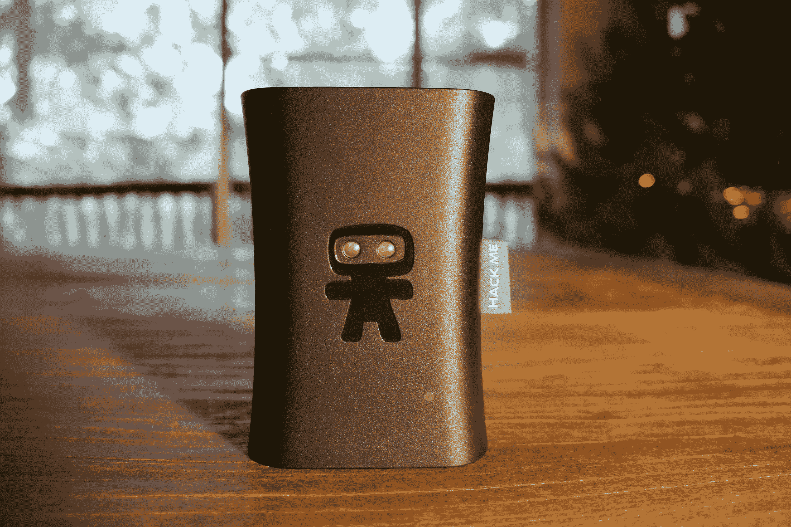
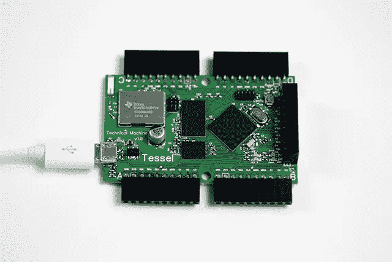
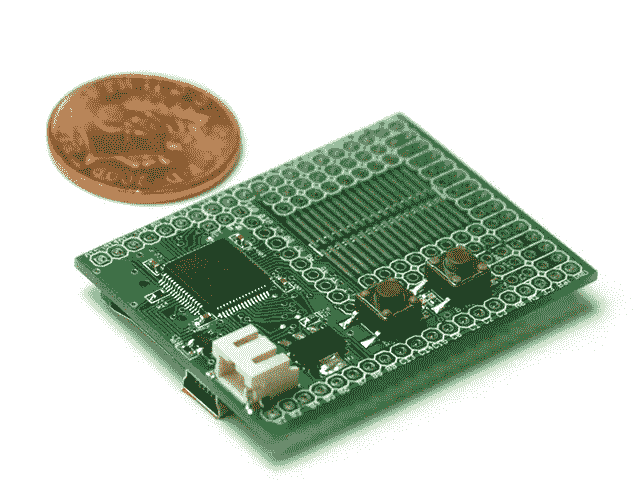

# 超越网络的 JavaScript

> 原文：<https://www.sitepoint.com/javascript-beyond-web/>

在短短几年时间里，JavaScript 已经迅速成为我使用过的最有价值的语言。我知道我并不孤单。我记得早期在 Netscape Navigator 上，当我看到我可以通过在提示对话框中向用户提问来改变网页上的文本时，我欣喜若狂。像所有伟大的技术时刻一样，这真的感觉像魔术一样。

从那时起，JavaScript 已经成长和成熟到我在早期脚本时代无法想象的程度。我们现在可以用 JavaScript 编写强大的网络应用、移动应用、Windows 8 应用，甚至整个服务器。

这种语言的真正多功能性达到了我认为是迄今为止最令人兴奋的时刻——它现在可以用来控制和监控你的手机、你家里的灯、机器人、谷歌眼镜的增强现实、你的手和手指的 Leap Motion 运动等等。

在这篇文章中，我想对一些支持“物联网”的技术做一个高层次的概述，JavaScript 开发人员现在就可以开始使用这些技术了。

如果你是一名 JavaScript 开发人员，并且想利用你现有的技能在互联网连接的世界里修修补补，有比大多数开发人员意识到的更多的选择。创新的机会如此之多，一些娱乐性的技术驱动的恶作剧也有同样诱人的机会…

## 忍者积木

*图片来源:忍者积木公司*

### 它们是什么？

[忍者积木](http://www.ninjablocks.com/)是一种小型计算机设备，可以让你从云端调用和响应现实世界中的设备。它通过 433Mhz 频段(遥控设备的一组常用频率)或 USB 连接与设备通信。它有一个 [JavaScript API](http://docs.ninja.is/index.html) ，允许你将其连接到你自己的节点服务器，并接入[忍者区块平台](http://ninjablocks.com/blogs/how-to/7229758-hello-ninja-writing-your-first-ninja-app)。

### 你能用它做什么？

每天都有新的技术组合出现，一些可能的例子包括:

*   通过推特上的推文打开你的灯
*   远程发射 Nerf 枪，并在连接的网络摄像头上拍下随后发生的事情
*   当你回家的时候，只要温度超过某个阈值，就打开空调
*   如果你的手机收到某些人的短信，把你的灯的颜色切换到某些颜色

## 阿尔杜伊诺

### 这是什么？

Arduino 板是使用开源平台控制电子设备的单板微控制器。幸运的是，对于 JavaScript 开发人员来说，已经开发了几个 JavaScript APIs 来与 Arduino 平台接口。我遇到的主要问题有:

*   [Johnny Five](https://github.com/rwaldron/johnny-five) ，开源 JS Arduino 框架
*   [node -arduino](https://github.com/voodootikigod/node-arduino) ，一个用于 Arduinos 的节点包
*   [Noduino](http://semu.github.io/noduino/) ，用于切换基本 Arduinos 控件的另一个节点和 JS 框架

### 你能用它做什么？

我见过的几个 Arduino 项目的例子是:

*   通过 JavaScript 控制的节点机器人
*   [激光竖琴](http://www.youtube.com/watch?v=sLVXmsbVwUs)
*   [蚀刻草图时钟](http://makezine.com/2008/03/06/etchasketch-clock/)

## 树莓派

### 这是什么？

树莓派是一台小型电脑，你可以把它插到你的电视上做任何事情，从播放高清视频到编辑电子表格。这是一台价格低廉、功能齐全的计算机，可以随意修改。对于所有 JavaScript 爱好者来说， [Pijs.io](http://pijs.io/) 允许你用 JavaScript 为 Pi 编写嵌入式应用，使用他们的云平台进行交流。也可以在 Raspberry Pi 上安装 Node，将它用作服务器，从连接到您的 Pi 的设备转发您想要的任何信息。

### 你能用它做什么？

*   运行在 Node、MongoDB、HTML5 和 web sockets 上的家庭自动化系统
*   [一个小组](http://hackerloop.com/upstagram/)根据皮克斯电影《飞屋环游记》制作了一个房子的微缩版，用 Pi 在 Instagram 上发布了照片
*   你甚至可以得到一个“ [Pi 外壳](http://ninjablocks.com/pages/picrust)”，它可以让你把你的树莓 Pi 变成忍者块

## 特塞尔

*图片来源:技术机*

### 这是什么？

[Tessel](http://tessel.io/) 是一款支持 wifi 的微控制器，允许您将它添加到硬件设备，以便它可以与网络通信并加入物联网。它旨在通过使用 JavaScript 开发人员已经拥有的相同工作流程和技能，帮助软件开发人员尽可能简单地过渡到硬件。它不仅仅有一个 JavaScript API 作为选项，JavaScript 是它的核心，这让我们 JavaScript 开发人员更加兴奋。遗憾的是，它目前还不可用，但您现在可以预订 2014 年版本。

### 你能用它做什么？

*   开发你自己的可以通过网络远程控制的小工具
*   通过添加加速度计、RFID、GPS 等 Tessel 模块，为现有硬件设备带来新功能

## 埃斯普罗伊诺

*照片信用 Pur3 Ltd*

### 这是什么？

用于微控制器的 JavaScript 解释器。Espruino 板类似于 Tessel，但是 Espruino 板便宜得多，只有 8KB 的 RAM，没有可即插即用的预设模块，如加速度计(您需要自己找到并连接一些)。

### 你能用它做什么？

*   与 Tessel 类似的用法，与电机、灯等交互，但是 Espruino 板可能更适合电池效率更高的小型项目

## 于{X}

### 这是什么？

[on{X}](https://www.onx.ms) 是一款 Android 应用程序，允许您通过 JavaScript API 控制您的设备，并对收到的文本消息、GPS 定位、电池寿命等事件做出响应。您可以远程添加和删除您制定的规则，这些规则将通过 web 安装到您的设备上。这是迄今为止我最喜欢的安卓应用之一。真正的程序员天堂。

### 你能用它做什么？

*   当你在一个地方停留超过 20 分钟时，启动 foursquare
*   当你的手机快没电时，给你的伴侣发短信
*   如果天气预报说那天会下雨，让你的手机建议你带把伞

## 跳跃运动

[//www.youtube.com/embed/3b4w749Tud8](//www.youtube.com/embed/3b4w749Tud8)

### 这是什么？

[Leap Motion](http://www.leapmotion.com) 是一个令人难以置信的小设备，可以感应和响应你的手、手指和笔的动作。通过 USB 将它连接到你的电脑上，Leap Motion 应用程序将能够对你的运动做出反应。绝对是那种让你感觉自己跌跌撞撞来到未来的设备。最好的部分是他们已经为它创建了一个 [JavaScript API](http://js.leapmotion.com/) 供你使用。

### 你能用它做什么？

*   创建一个绘图应用程序，让用户用手指在空中画画
*   让用户能够旋转网页上的对象，以便更详细地查看它，使用自然的手部动作调整它的大小等等
*   开发像水果忍者这样的游戏，可以通过手和手指滑动来控制

## 磨损脚本

[//www.youtube.com/embed/tOUgybfQp4A](//www.youtube.com/embed/tOUgybfQp4A)

### 这是什么？

WearScript 是一个可以让你在谷歌眼镜上运行 JavaScript 代码的库。他们的目标是为谷歌眼镜开发一个开放的应用生态系统，不依赖于谷歌自己的应用商店，开发者可以快速轻松地分享他们的创作。一个非常好的主意。

### 你能用它做什么？

*   开发谷歌眼镜应用程序，响应您的位置和显示信息
*   创建语音激活的简单应用程序，让每天的生活多一点互联网功能

## 最后

对于世界各地的 JavaScript 开发者来说，这里的信息很简单。你一直在阅读的“物联网”在你已经拥有的技能下是可能的。出去做些和魔法没什么区别的东西。

## 分享这篇文章