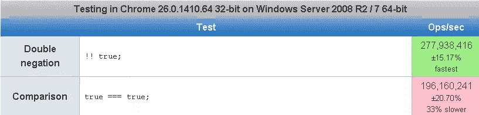
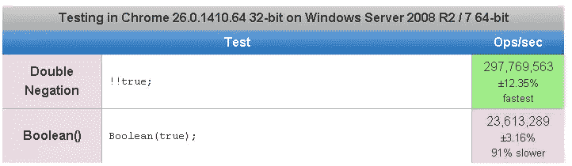
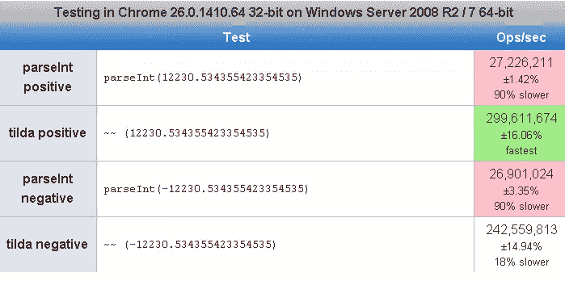

# JavaScript 双重否定(！！)捣蛋还是捣乱？

> 原文：<https://www.sitepoint.com/javascript-double-negation-trick-trouble/>

所以我被要求在我的[JavaScript Shorthands Techniques](http://www.jquery4u.com/javascript/shorthand-javascript-techniques/)帖子中加入一些**双重否定比较运算符**，并决定仔细看看我们是否可以在代码中更频繁地使用它。**见下面**的速度测试。

> ！！不是运算符。这只是！运算符两次

## 示例:

```
success = !!what()&&that()
return !!value

var x = "somevalue"var isNotEmpty = !!x.length;
Let's break it to pieces:
x.length   // 9
!x.length  // false
!!x.length // true
```

下列值在条件语句中等效于 false:

```
* false
	* null
	* undefined
	* The empty string "" ( '')
	* The number 0
	* The number NaN
```

所有其他值都等同于 true。

```
!!false === false
           !!true === true

              !!0 === false!!parseInt("foo") === false // NaN is falsy
              !!1 === true
             !!-1 === true  // -1 is truthy

             !!"" === false // empty string is falsy
          !!"foo" === true  // non-empty string is truthy
        !!"false" === true  // ...even if it contains a falsy value

     !!window.foo === false // undefined is falsy
           !!null === false // null is falsy

             !!{} === true  // an (empty) object is truthy
             !![] === true  // an (empty) array is truthy; PHP programmers beware!
```

还可以使用对应于原始类型的构造函数(不使用 new)来显式转换值，即

```
Boolean(foo) === !!foo
Number(foo)  === +foo
String(foo)  === ''+foo
```

还有更多例子！

```
return !!window; //Returns true
return !!null; //Returns false
return !!undefined; //Returns false
return !!false; //Returns false
return !!true; //Returns true
return !!""; //Returns false
return !!"Hi"; //Returns true
return !!0; //Returns false
return !!1; //Returns true
```

第一次求反将数据(无论它是什么数据类型)转换成一个[布尔值](https://www.sitepoint.com/boolean-data-type/)。第二次求反再次改变布尔值，以给出期望的结果。否定情况如果值为 null/undefined/false/""/0，则第一次求反会将其转换为 true。第二个否定将其变为假。

**阳性病例**

如果值是 object/true/"Value"/1，那么第一次求反会将其转换为 false。第二个否定把它变成真。

**是双重否定！！(expr)与类型转换布尔(expr)** 相同

是的。

```
Boolean(5) === !!5; Same casting, fewer characters.
```

但是说看看这个！脑残？

```
!!new Boolean(false) // true
!!Boolean(false) // false
```

瞧，解释:

new Boolean(false)是一个对象，一个对象即使包含一个 false 值也是真的！
Boolean(false)返回原语 false。

## 速度测试！

[](http://jsperf.com/double-negation-is-fastest)

[](http://jsperf.com/boolean-vs-double-negation)

[](http://jsperf.com/testrz)

## 使用双重否定的原因

有人称之为“Javascript 双重否定技巧”。本质上，它将一个值(null，undefined，objects 等)转换成一个原始的布尔值。类似于使用 Boolean(value)显式进行类型转换，只是这将值转换为 Bololean 对象，并且不是真正的 Boolean。双重否定技巧可用于确保在基于某些条件返回布尔值的方法中，返回值始终是布尔类型。

## 反对使用双重否定的理由

更难阅读和理解。这是一种非常晦涩的类型转换方式。！不是。所以！真的是假的，而且！假的就是真的。！0 为真，还有！1 是假的。

```
// Maximum Obscurity:
val.enabled = !!userId;

// Partial Obscurity:
val.enabled = (userId != 0) ? true : false;

// And finally, much easier to understand:
val.enabled = (userId != 0);
```

## 现实世界中的双重否定

**Google Closure 编译器**
值得注意的是，有些 minifiers(比如 Google 的 Closure 编译器)会把 true 变成！0 和 falseinto！1 为了节省字符(注意顺序看起来别扭但是是正确的，！0 ===真& &！1 ===假)。

**检测 HTML5 特性支持**
我们想写一个如果用户的浏览器支持 HTML5

<audio>元素就返回 true 的函数，但是我们不希望函数在</audio>

<audio>未定义的情况下抛出错误；而且我们不想用 try … catch 来处理任何可能的错误(因为它们很恶心)；我们也不希望在函数内部使用检查，因为这不会始终如一地揭示特性的真相(例如，即使不支持 HTML5</audio>

<audio>，document . createelement(‘audio’)仍将创建一个名为</audio>

<audio>的元素)。</audio>

```
// this won't tell us anything about HTML5 `

<audio>` as a featurevar foo = function(tag, atr) { return document.createElement(tag)[atr]; }

// this won't return true if the feature is detected (although it works just fine)var bar = function(tag, atr) { return !document.createElement(tag)[atr]; }

// this is the concise, feature-detecting solution we wantvar baz = function(tag, atr) { return !!document.createElement(tag)[atr]; }

foo('audio', 'preload'); // returns "auto"
bar('audio', 'preload'); // returns false
baz('audio', 'preload'); // returns true</audio> 
```

延伸阅读:
[Javascript 双否定绝招](http://navirudra.com/blog/javascript/javascript-double-negative-trick.html)
[双按位 NOT(~ ~)](http://james.padolsey.com/javascript/double-bitwise-not/)
http://stack overflow . com/questions/784929/what-is-the-NOT-NOT-operator-in-Javascript

## 分享这篇文章