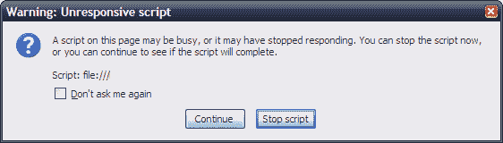

# JavaScript 执行和浏览器限制

> 原文：<https://www.sitepoint.com/javascript-execution-browser-limits/>

浏览器 UI 和 JavaScript 代码([有效*](#thread) )共享一个处理线程。不管浏览器是需要响应自己的菜单点击、呈现 HTML 页面还是执行 Ajax 调用，每个事件都被添加到一个队列中。当浏览器空闲时，会检索并执行其待办事项列表中的下一项。

**note:** Single Browser Threads

事实上，没有一个现代浏览器是在单线程上运行的。举个极端的例子，IE9 和 Chrome 为每个标签页启动一个新的 OS 进程。但是，每个查看的页面仍然有一个事件队列，一次只能完成一个任务。这是绝对必要的，因为浏览器或您的 JavaScript 可以在下载之前、期间或之后更改呈现的 HTML。

可以理解，浏览器必须限制 JavaScript 代码运行的时间。如果脚本运行时间过长，将会锁定应用程序，并可能导致操作系统不稳定。这就是为什么您会看到可怕的“无响应脚本”警告:

但是浏览器如何判断一个脚本运行了多长时间？正如您所料，前 5 名供应商实施了不同的技术和限制…

Internet Explorer
IE 将 JavaScript 执行限制在 500 万条语句以内。

火狐浏览器
火狐浏览器使用 10 秒的时间限制。

**Safari**
Safari 使用 5 秒的限时。

Chrome
Chrome 不会限制执行，但会检测浏览器何时崩溃或没有反应。

**Opera**
Opera 不实现限制，会无限期执行 JavaScript。但是，浏览器不会导致系统不稳定——您可以继续打开其他选项卡或关闭执行代码的页面。

有几个浏览器允许你配置执行限制参数，但是我不推荐这样做。我不会在这里公布细节，因为某个地方的某个人会用它来“修复”他们没有响应的页面！如果你喜欢的话，可以谷歌一下，但是针对行为不良的代码调整浏览器设置并不能解决问题的根源。

那么我们如何防止 JavaScript 执行警报呢？最好的解决方案是避免长时间运行的客户端任务。理想情况下，任何事件处理程序花费的时间都不应该超过几十毫秒。密集型处理任务通常应该由服务器处理，并通过页面刷新或 Ajax 调用来检索。

然而，我意识到最小化客户端处理对于今天大量使用 JavaScript 的应用程序来说不一定是一个可行的解决方案。幸运的是，有很多解决方案…请继续关注 [SitePoint](/) 以了解即将推出的几个备选方案。

**note:**Want more?

如果你想阅读更多 Craig 的文章，请订阅我们每周的科技极客时事通讯， *[《科技时报》](https://www.sitepoint.com/newsletter/)* 。

## 分享这篇文章