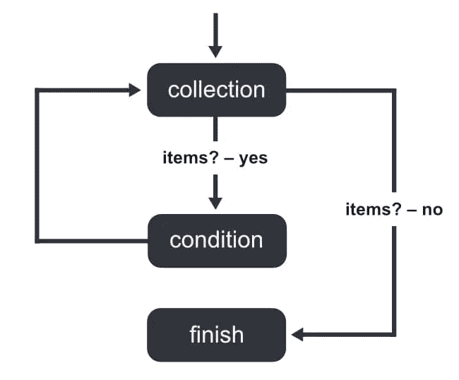

# 如何在 JavaScript 中使用 for 循环

> 原文：<https://www.sitepoint.com/javascript-for-loop/>

循环允许我们循环遍历数组或对象中的项目，并做一些事情，如打印、修改或执行其他类型的任务或动作。有不同种类的循环，JavaScript 中的 for 循环允许我们遍历一个集合(比如一个数组)。

在本文中，我们将了解 JavaScript 提供的`for`循环。我们将看看 JavaScript 中如何使用`for...in`循环语句，语法，它如何工作的例子，何时使用或避免它，以及我们可以使用什么其他类型的循环。

## 为什么在 JavaScript 代码中使用 For 循环

在 JavaScript 中，就像在其他编程语言中一样，我们使用循环来读取或访问集合中的项目。集合可以是数组或对象。每次循环语句遍历集合中的项目时，我们称之为**迭代**。

有两种方法可以访问集合中的项。第一种方式是通过它在集合中的键，即数组中的索引或对象中的属性。第二种方式是通过物品本身，不需要钥匙。

## for…in 循环的定义

JavaScript `for`循环遍历或迭代集合中的键。使用这些键，您可以访问它在集合中表示的项。

项目集合可以是数组、对象，甚至是字符串。

## for…in 循环的语法

`for`循环具有以下语法或结构:

```
for (let key in value) {
  //do something here
}
```

在这个代码块中，`value`是我们正在迭代的项目集合。它可以是对象、数组、字符串等等。`key`将是`value`中每一项的键，在每次迭代中变为列表中的下一个键。

注意，我们使用`let`或`const`来声明`key`。



## 对对象使用 for 循环

当使用`for...in`循环在 JavaScript 中迭代一个对象时，迭代的键或属性——在上面的代码片段中，由`key`变量表示——是对象自己的属性。

由于对象可能通过原型链继承项目，原型链包括对象的默认方法和属性以及我们可能定义的对象原型，因此我们应该使用 [hasOwnProperty](https://developer.mozilla.org/en-US/docs/Web/JavaScript/Reference/Global_Objects/Object/hasOwnProperty) 。

### 可迭代对象上的 For 循环示例

在下面的例子中，我们循环访问变量`obj`并记录每个属性和值:

```
const obj = {
  "a": "JavaScript",
  1: "PHP",
  "b": "Python",
  2: "Java"
};

for (let key in obj) {
  console.log(key + ": " + obj[key] )
}

// Output:
// "1: PHP"
// "2: Java"
// "a: JavaScript"
// "b: Python"
```

请注意，键的迭代顺序是升序的(即，从数字开始按数字顺序排列，然后是字母按字母顺序排列)。然而，该输出顺序不同于初始化对象时创建的项目的索引顺序。

在 [CodePen](https://codepen.io) 上通过 SitePoint ( [@SitePoint](https://codepen.io/SitePoint) )查看笔[循环对象](https://codepen.io/SitePoint/pen/ZEJWOML)。