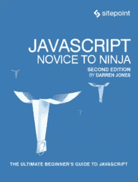

# 定义和重写自身的 JavaScript 函数

> 原文：<https://www.sitepoint.com/javascript-functions-that-define-and-rewrite-themselves/>



以下是我们新书的一小段摘录， [JavaScript:新手到忍者，第二版](https://www.sitepoint.com/premium/books/javascript-novice-to-ninja-2nd-edition)，作者是达伦·琼斯。这是 JavaScript 的终极初学者指南。SitePoint Premium 会员可以通过他们的会员身份访问，或者您可以在世界各地的商店购买一份。

JavaScript 的动态特性意味着函数不仅能够调用自己，还能够定义自己，甚至重新定义自己。这是通过将一个匿名函数赋给一个与函数同名的变量*来实现的。*

考虑以下函数:

```
function party(){
console.log('Wow this is amazing!');
party = function(){
    console.log('Been there, got the T-Shirt');
}
} 
```

这将在控制台中记录一条消息，然后重新定义自己以在控制台中记录一条不同的消息。当该函数被调用一次时，它就像是这样定义的:

```
function party() {
console.log('Been there, got the T-Shirt');
} 
```

每次在第一次调用该函数后，它都会记录消息“去过那里，得到了 t 恤”:

```
party();
<< 'Wow this is amazing!'

party();
<< 'Been there, got the T-Shirt'

party();
<< 'Been there, got the T-Shirt' 
```

如果函数也被赋给了另一个变量，这个变量将保持原来的函数定义，不会被重写。这是因为原始函数被赋给了一个变量，然后在函数内部，一个与函数同名的变量被赋给了一个不同的函数。如果我们创建一个名为`beachParty`的变量，并在第一次调用并重新定义之前将其分配给`party()`函数*，就可以看到这样一个例子:*

```
function party(){
console.log('Wow this is amazing!');
party = function(){
    console.log('Been there, got the T-Shirt');
}
}

const beachParty = party; // note that the party function has not been invoked

beachParty(); // the party() function has now been redefined, even though it hasn't been called explicitly
<< 'Wow this is amazing!'

party(); 
<< 'Been there, got the T-Shirt'

beachParty(); // but this function hasn't been redefined
<< 'Wow this is amazing!'

beachParty(); // no matter how many times this is called it will remain the same
<< 'Wow this is amazing!' 
```

#### 失去属性

注意:如果之前已经在函数上设置了任何属性，那么当函数重新定义自己时，这些属性将会丢失。在前面的例子中，我们可以设置一个`music`属性，并看到它在函数被调用和重新定义后不再存在:

```
function party() {
console.log('Wow this is amazing!');
party = function(){
console.log('Been there, got the T-Shirt');
}
}

party.music = 'Classical Jazz'; // set a property of the function

party();
<< "Wow this is amazing!"

party.music; // function has now been redefined, so the property doesn't exist
<< undefined
```

这被称为**惰性定义模式**，通常在首次调用时需要一些初始化代码时使用。这意味着初始化可以在第一次调用时完成，然后函数可以被重新定义为您希望它在以后每次调用时的样子。

### 初始化时分支

这种技术可以与我们在上一章中讨论的特性检测一起使用，来创建重写自身的函数，称为**初始时间分支**。这使得这些功能可以在浏览器中更有效地工作，并避免每次调用时都检查功能。

让我们以我们虚构的`unicorn`对象为例，它还没有得到所有浏览器的完全支持。在上一章中，我们看了如何使用特征检测来检查这是否被支持。现在我们可以更进一步:我们可以根据是否支持某些方法来定义一个函数。这意味着我们只需要在第一次调用函数时检查支持:

```
function ride(){
    if (window.unicorn) { 
        ride = function(){
        // some code that uses the brand new and sparkly unicorn methods
        return 'Riding on a unicorn is the best!';
    }
    } else {
        ride = function(){
        // some code that uses the older pony methods
        return 'Riding on a pony is still pretty good';
    }
    }
    return ride();
} 
```

在我们检查了`window.unicorn`对象是否存在(通过检查它是否真实)之后，我们根据结果重写了`ride()`函数。就在函数的末尾，我们再次调用它，以便调用重写的函数，并返回相关的值。需要注意的一点是，该函数第一次被调用两次，尽管它在随后的每次调用中会变得更加高效。让我们来看看它是如何工作的:

```
ride(); // the function rewrites itself, then calls itself
<< 'Riding on a pony is still pretty good' 
```

一旦该函数被调用，它就会根据浏览器的功能被重写。我们可以通过检查函数而不调用它来检查这一点:

```
ride
<< function ride() {
    return 'Riding on a pony is still pretty good';
    } 
```

这对于在第一次调用函数时初始化函数是一种有用的模式，可以针对正在使用的浏览器优化它们。

## 递归函数

一个**递归函数**是一个调用自身直到满足某个条件的函数。当涉及到迭代过程时，这是一个有用的工具。一个常见的例子是计算数字的[阶乘](http://en.wikipedia.org/wiki/Factorial)的函数:

```
function factorial(n) {
if (n === 0) {
    return 1;
} else {
    return n * factorial(n - 1);
}
} 
```

如果将`0`作为参数提供(0 阶乘为 1 ),该函数将返回`1`,否则它会将该参数乘以用一个减一的参数调用自身的结果。该函数将继续调用自己，直到最后参数为`0`并且`1`被返回。这将导致 1、2、3 以及直到原始参数的所有数字相乘。

数学界的另一个例子是[柯拉茨猜想](http://en.wikipedia.org/wiki/Collatz_conjecture)。这是一个说起来简单的问题，但是，到目前为止，还没有解决。它包括取任意正整数并遵循以下规则:

*   如果数字是偶数，就除以二

*   如果数字是奇数，就把它乘以三再加一

例如，如果我们从数字 18 开始，我们将得到以下序列:

18, 9, 28, 14, 7, 22, 11, 34, 17, 52, 26, 13, 40, 20, 10, 5, 16, 8, 4, 2, 1, 4, 2, 1, …

正如你所看到的，这个序列在最后陷入了一个循环，循环通过“4，2，1”。Collatz 猜想指出，每个正整数都会产生一个序列，并在这个循环中结束。这一点在所有 5 × 2⁶⁰以下的数字中都得到了验证，但没有证据表明它对所有高于 5 ×的整数都成立。为了测试猜想，我们可以编写一个函数，它使用递归来不断调用函数，直到它达到一个值`1`(因为我们希望我们的函数避免在最后陷入递归循环！):

```
function collatz(n, sequence=[n]) {
if (n === 1){
    return `Sequence took ${sequence.length} steps. It was ${sequence}`;
}

if (n%2 === 0) {
    n = n/2;
} else { 
    n = 3*n + 1;
}

return collatz(n,[...sequence,n]);
} 
```

这个函数接受一个数字作为参数，还有另一个名为`sequence`的参数，它有一个包含第一个参数的数组的默认值。第二个参数仅在函数递归调用自身时使用。

该函数做的第一件事是测试`n`的值是否为 1。如果是，该函数将返回一条消息，说明它执行了多少步。如果它没有达到 1，它检查`n`的值是偶数(在这种情况下，它将其除以 2)，还是奇数(在这种情况下，它乘以 3，然后加 1)。然后该函数调用自己，提供新的`n`值和新的序列作为参数。新序列是通过将旧序列和`n`的值放入一个新数组中，并对旧序列应用扩展运算符来构建的。

让我们看看数字 18 会发生什么:

```
collatz(18);
<< 'Sequence took 21 steps. It was 18,9,28,14,7,22,11,34,17,52,26,13,40,20,10,5,16,8,4,2,1' 
```

如你所见，它需要 21 步，但最终在 1 步结束。

试着使用这个函数，看看你是否能找到一个大于 5 × 2⁶⁰且不以 1 结尾的值——如果你找到了，你就出名了！

## 分享这篇文章