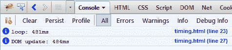
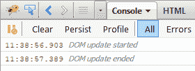
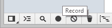
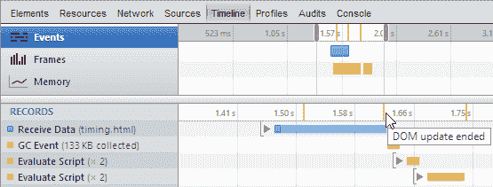

# 如何使用开发人员控制台跟踪 JavaScript 性能

> 原文：<https://www.sitepoint.com/javascript-performance-developer-console/>

有一个适用于所有网站和应用的通用规则:*它们必须很快*。(几年前，我会说网站应该是*响应式的*，尽管这个词现在有了 RWD 的含义)。

不幸的是，很明显一些开发者不关心网站速度。如果他们这样做了，几兆字节的怪物将是罕见的，平均页面重量将永远不会超过 1Mb。这(几乎)让我怀念起拨号上网的日子，那时 100Kb 的主页被认为是多余的！

轻量级和快速的用户体验从未如此重要。在发展中国家，手机和网络的使用正呈指数级增长，而高速宽带从来就不充足也不便宜。减少页面脂肪至关重要，优化 JavaScript 性能也是如此。幸运的是，有许多简单的方法可以确定您的脚本是否导致了显著的延迟。

## 控制台计时

Firebug、Webkit Inspector、Opera 蜻蜓和 IE11 都支持`console.time()`和`console.timeEnd()`方法

```
// start timer
console.time("DOM update");

// update
var p = document.getElementById("result");
for (var i = 0; i < 3000; i++) {
	p.textContent += i + " ";
}

// end timer
console.timeEnd("DOM update");
```

计时器名称被传递给`console.time()`和`console.timeEnd()`。您可以运行任意数量的计时器:

```
// start "DOM update" timer
console.time("DOM update");

// update
var p = document.getElementById("result");

// start "loop" timer
console.time("loop");
for (var i = 0; i < 3000; i++) {
	p.textContent += i + " ";
}
// end "loop" timer
console.timeEnd("loop");

// end "DOM update" timer
console.timeEnd("DOM update");
```

结果显示在开发人员控制台中:



## 分析时间戳

另一个选择是时间标记。这仅在 Firebug 和 Webkit Inspector 中可用——它记录执行过程中的一个点，例如

```
// record timestamp
console.timeStamp("DOM update started");

// update
var p = document.getElementById("result");
for (var i = 0; i < 3000; i++) {
	p.textContent += i + " ";
}

// record timestamp
console.timeStamp("DOM update ended");
```

遇到时间戳时，Firebug 会显示:



这可能有点帮助，但是 Webkit Inspector 有更多的技巧。点击窗口左下方的**时间线**选项卡，然后点击**记录**图标:



刷新页面，然后再次点击**记录**图标停止记录。时间线直观地显示了所有事件，您的时间戳在时间栏中以黄色标记:



非常有用。

## 移除您的计时器

理想情况下，您永远不应该将控制台日志记录留在生产代码中。如果你这样做了，你需要测试这些方法是否可用，因为它们会在不支持它们的浏览器中导致错误，例如

```
if (console && console.timeStamp) console.timeStamp("My timestamp");
```

我个人建议删除所有的控制台命令。一些构建过程会为您完成这项工作，或者您可以在编辑器中使用以下正则表达式来定位并删除所有与计时器相关的日志记录:

```
console.time[^(]*("[^"]+");
```

打开您的控制台，开始优化这些脚本！

## 分享这篇文章