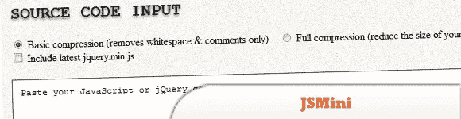
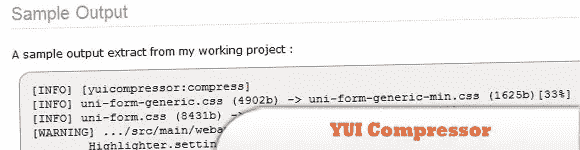
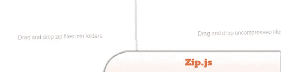
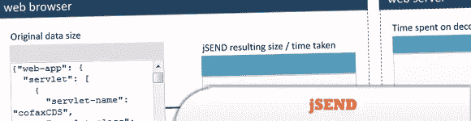
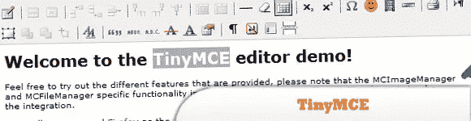
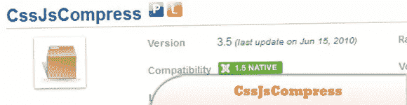

# JavaScript/jQuery Zip/File/Compressor 插件

> 原文：<https://www.sitepoint.com/javascriptjquery-zipfilecompressor-plugins/>

一个 JavaScript/jQuery Zip/File/Compressor 插件的集合,它允许你缩小你的 JS 代码并压缩你的 JS 文件以准备成 Zip 文件。尽情享受吧！

**相关帖子:**

*   [**10 个在线工具帮助优化和格式化 CSS**](http://www.jquery4u.com/dynamic-css-2/10-online-tools-apps-optimize-format-css/)
*   [**10 核心/客户端/服务器 JavaScript 东西**](http://www.jquery4u.com/javascript/10-core-javascript/)

## 茉莉属

在线 JavaScript & jQuery 迷你工具。缩小你的 JS 代码，免费且简单易用，闪电般的快速压缩。

  
[源+演示](http://jsmini.com/)

## YUI 压缩机 Maven Mojo

这个插件在编译时压缩静态文件。

  
[源+演示](http://alchim.sourceforge.net/yuicompressor-maven-plugin/)

## jquery.zipper.js

(python-like-zip-jquery)一个模仿 python zip()函数的 jquery 插件。

  
[源+演示](http://code.google.com/p/python-like-zip-jquery/downloads/detail?name=jquery.zipper.js&can=2&q=)

## zip.js

一个用于压缩和解压缩文件的 JavaScript 库。

  
[来源](http://gildas-lormeau.github.com/zip.js/)
[演示](http://gildas-lormeau.github.com/zip.js/demos/demo1.html)

## jSEND

是透明的、可靠的、轻量级的(缩小到 2.5 KB)并且完全兼容 UTF-8。

  
[来源](http://jsend.org/why-use-jsend/)
[演示](http://jsend.org/demo/)

## TinyMCE

带有压缩器的 jQuery 插件。

  
[源+演示](http://www.tinymce.com/tryit/jquery_plugin_compressor.php)

## CssJsCompress

可以自动优化外部资源，如 CSS 和 JavaScript，这可以减少网站的大小和请求数量。

  
[来源](http://extensions.joomla.org/extensions/core-enhancements/performance/site-performance/7350)
[演示](http://www.joomlatags.org/)

## JavaScript-maven-工具(压缩和绑定)

现场和捆绑压缩插件。

  
[源+演示](http://code.google.com/p/javascript-maven-tools/wiki/CompressionAndBundling)

## 分享这篇文章