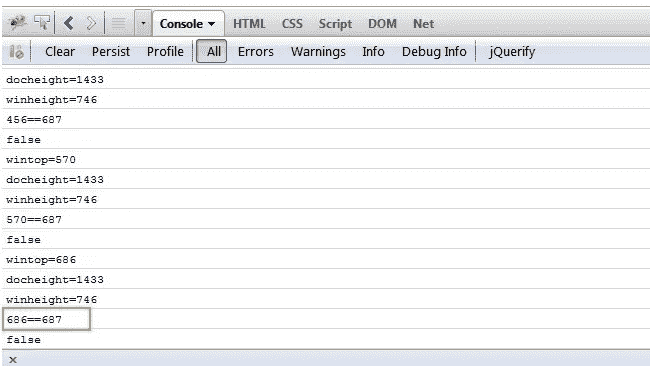
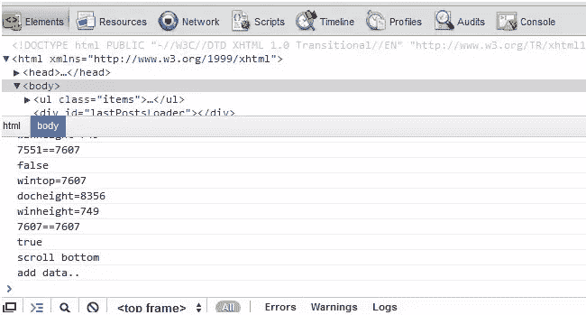
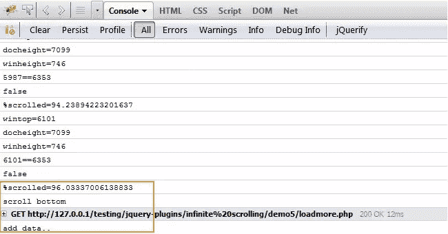

# 使用 jQuery 捕获垂直滚动百分比

> 原文：<https://www.sitepoint.com/jquery-capture-vertical-scroll-percentage/>

我已经写了几个**脚本来检测窗口滚动的百分比**，并在窗口滚动到指定的百分比时触发事件。

**更新 2013 年 6 月 3 日—**在下面的滚动示例中添加了锁定页脚。

这是非常有趣的，火狐 8 从来没有达到 100%的窗口滚动。我不完全相信这是 Firefox 的一个错误，或者是我对如何计算滚动百分比的理解有误。

正如你所看到的，窗口到达底部，但 FF8 只检测到 99.8%的滚动。



但是使用 chrome 12 是达到了预期的 100%。




```
//never reaches bottom
$(window).scroll(function(){

    var wintop = $(window).scrollTop(), docheight = $(document).height(), winheight = $(window).height();

    console.log('wintop='+wintop);
    console.log('docheight='+docheight);
    console.log('winheight='+winheight);
    console.log(wintop+'=='+(docheight-winheight));
    console.log(wintop==(docheight-winheight));

    if  ($(window).scrollTop() == $(document).height() - $(window).height()) {
       console.log('scroll bottom');
    }

});
```

## 使用 jQuery 检测垂直滚动的百分比

这个小脚本将在任意给定的百分比触发代码，当前设置为窗口视图的 95%。

```
//capture scroll any percentage
$(window).scroll(function(){

    var wintop = $(window).scrollTop(), docheight = $(document).height(), winheight = $(window).height();
    var  scrolltrigger = 0.95;

    console.log('wintop='+wintop);
    console.log('docheight='+docheight);
    console.log('winheight='+winheight);
    console.log(wintop+'=='+(docheight-winheight));
    console.log(wintop==(docheight-winheight));
    console.log('%scrolled='+(wintop/(docheight-winheight))*100);

    if  ((wintop/(docheight-winheight)) > scrolltrigger) {
       console.log('scroll bottom');
       lastAddedLiveFunc();
    }
});
```

现在我们可以看到，Firefox 8 fires 触发了事件。



## 滚动时锁定页脚示例

JS 代码。

 `//当页面向上/向下滚动时隐藏/显示锁定的页脚
$(窗口)。bind('scroll '，function(e)
{
var wintop = $(window)。scrollTop()，docheight = $(文档)。height()，winheight = $(窗口)。height()，
show trigger = ' 700 '，//700 向下它会显示
hide trigger = ' 200 '；//200 以上它会隐藏

//向下滚动时显示
//向上滚动时隐藏
if(wintop>show trigger)
{
$(' # footer ')。addClass('fixed ')。fade in()；
}
else if(wintop` 

## `分享这篇文章`