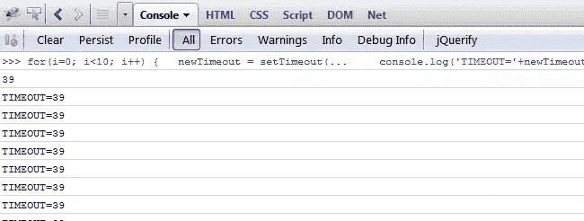
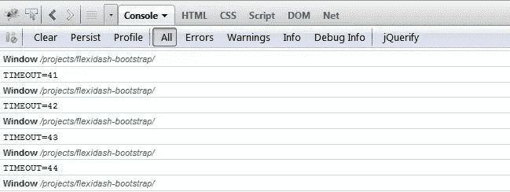

# jQuery 清除所有超时

> 原文：<https://www.sitepoint.com/jquery-clear-timeouts/>

首先，setTimeout()和 clearTimeout()是纯 JavaScript 函数，但是经常在 JavaScript 动画和 jQuery 库中使用。有时，当您设置了超时，您可能想要取消它们，为此，您需要将 settimeout 存储在一个变量中。

## 循环超时

在这个循环中，超时值总是相同的:例如:超时=1773

```
for(i=0; i<10; i++)
{
  newTimeout = setTimeout(function()
  {
      console.log('TIMEOUT='+newTimeout);
  });
}
```



如果我们稍微调整一下，加入一个 setInterval 来控制它工作的时间。

```
i = 0;
var interval = setInterval(function()
{
    newTimeout = setTimeout(function()
    {
        console.log(this);
        console.log('TIMEOUT='+newTimeout);

    }, 100);

    i++;
    if (i > 10)
    {
        clearInterval(interval);
    }
}, 200);
```

输出:



在这里，我们可以清楚地看到超时被分配了一个整数值。这就是我们如何使用这个来清除它们:

### 清除所有超时

```
for(i=0; i<100; i++)
{
  window.clearTimeout(i);
}
```

## 进一步阅读

我想知道是否可以使用 jQuery 将对象上的超时存储为数据？？？

那么，如果一个动画使用 setTimeout 进行排队，如果它正在播放，甚至还没有开始播放，它就可以停止播放了？嗯…

```
if (animateWidget !== undefined)
{
    //only do 10 windows
    for(i=0; i<10; i++)
    {
      window.clearTimeout(i);
    }
    //stop all animations on windows
    $('.containerPlus').stop();
}
var animateWidget = setTimeout(function()
{
    console.log('TIMEOUT: '+animateWidget);
    EVI.FLEXIDASH.tileDash();
}, 300);
```

## 分享这篇文章