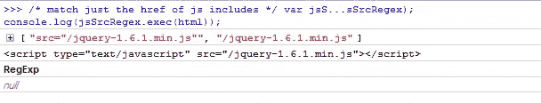
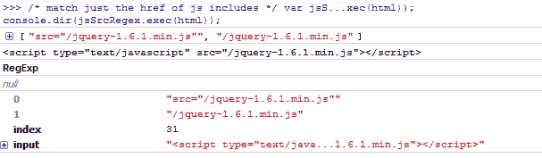
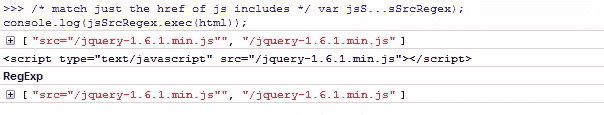

# 使用 jQuery。exec()和。compile()正则表达式

> 原文：<https://www.sitepoint.com/jquery-exec-compile-regex/>

如果你经常使用 JavaScript [正则表达式](https://www.sitepoint.com/learn-regex/)(像我一样),这是值得了解的。对于那些不知道 exec()方法的人来说，它只是测试字符串中的匹配，如果找到匹配，就返回匹配的文本，否则就返回 null。

```
/* match just the href of js includes */
var jsSrcRegex = /src="(.+?)"/igm; 

/* html for js include */
var html = '<script type="text/javascript" src="/jquery-1.6.1.min.js"></script>';

console.log(jsSrcRegex.exec(html));

console.log(html);
console.log(jsSrcRegex);

console.log(jsSrcRegex.exec(html));
```



没有结果吗？！有趣的是，如果我们再添加一个额外的 console.log 和…结果回来了！嗯…



## regex.compile()修复了这个问题

如果你使用。compile()对正则表达式有效！

```
/* match just the href of js includes */
var jsSrcRegex = /src="(.+?)"/igm; 

/* html for js include */
var html = '<script type="text/javascript" src="/jquery-1.6.1.min.js"></script>';

console.log(jsSrcRegex.exec(html));

/* recompile the regex */
jsSrcRegex.compile(jsSrcRegex);

console.log(html);
console.log(jsSrcRegex);

console.log(jsSrcRegex.exec(html));
```

如你所见，一旦我们重新编译，就会找到结果数组。



它基本上是在代码执行期间编译/重新编译正则表达式，所以一般来说，如果你改变正则表达式，你应该运行。编译()。这也适用于使用。循环中的 exec()只包括。在它之前编译()。了解一下很有用。

## 分享这篇文章