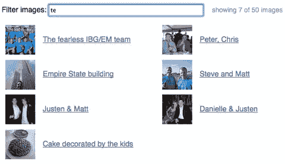

# jQuery 过滤器图像(搜索过滤器)

> 原文：<https://www.sitepoint.com/jquery-filter-images/>

[](http://www.mattryall.net/demo/filter/)

嗨，伙计们，我偶然发现了一个非常漂亮的照片图像搜索过滤器，当你开始打字时，它会搜索并更新图片。下面是使用 Flickr 提供的图片创建自己的图片搜索的完整代码。


## 用于实时图像搜索的 jQuery 代码

```
$("#filter").keyup(function () {
    var filter = $(this).val(), count = 0;
    $(".filtered:first li").each(function () {
        if ($(this).text().search(new RegExp(filter, "i")) Demo
[Source](http://www.mattryall.net/blog/2008/07/jquery-filter-demo)

It uses the [Live Search with QuickSilver Style jQuery plugin](http://orderedlist.com/blog/articles/live-search-with-quicksilver-style/) based upon the QuickSilver string ranking algorithm in JavaScript.

[QuickSilver Search Demo](http://static.railstips.org/orderedlist/demos/quicksilverjs/)  `## Quicksilver Live 搜索插件

[js]
(function($) {  
        var self = null;

        $.fn.liveUpdate = function(list) {        
                return this.each(function() {
                        new $.liveUpdate(this, list);
                });
        };

        $.liveUpdate = function (e, list) {
                this.field = $(e);
                this.list  = $('#' + list);
                if (this.list.length > 0) {
                        this.init();
                }
        };

        $.liveUpdate.prototype = {
                init: function() {
                        var self = this;
                        this.setupCache();
                        this.field.parents('form').submit(function() { return false; });
                        this.field.keyup(function() { self.filter(); });
                        self.filter();
                },

                filter: function() {
                        if ($.trim(this.field.val()) == '') { this.list.children('li').show(); return; }
                        this.displayResults(this.getScores(this.field.val().toLowerCase()));
                },

                setupCache: function() {
                        var self = this;
                        this.cache = [];
                        this.rows = [];
                        this.list.children('li').each(function() {
                                self.cache.push(this.innerHTML.toLowerCase());
                                self.rows.push($(this));
                        });
                        this.cache_length = this.cache.length;
                },

                displayResults: function(scores) {
                        var self = this;
                        this.list.children('li').hide();
                        $.each(scores, function(i, score) { self.rows[score[1]].show(); });
                },

                getScores: function(term) {
                        var scores = [];
                        for (var i=0; i  0) { scores.push([score, i]); }
                        }
                        return scores.sort(function(a, b) { return b[0] - a[0]; });
                }
        }
})(jQuery);`

## 图像搜索的完整代码

 `/* 
 * jQuery 过滤器演示
 *马特·瑞亚尔【http://www.mattryall.net/blog/2008/07/jquery-filter-demo】* T2
*
*根据知识共享署名 3.0 获得许可。
* http://creativecommons.org/licenses/by/3.0/
*/
jQuery(function($){
var thumbnail URL = " http://farm { farm-id } . static . Flickr . com/{ server-id }/{ id } _ { secret } _ s . jpg "；
var linkUrl = " http://www . Flickr . com/photos/mjryall/{ id }/"；
 $。getJSON("/flickr-photos.cgi？count=50 "，函数(数据){
var photos = data . photos . photo；
 var list = $("

").attr("src "，url) 
。attr("title "，photo.title)。attr("alt "，" Flickr 上的一张照片")；
var href = linkurl . replace(" { id } "，photo . id)；
 var link = $(" ")。attr("href "，href)。追加(img)；
 var caption = $(" ")。attr("href "，href) 
。文本(照片.标题)。add class(" caption ")；
 var div = $("

").追加(链接)。追加(标题)；
 $(列表)。追加($("

*   ").追加(div))；
    })；
     $("#flickr-photos。正在加载”)。移除()；
     $("#flickr-photos ")。追加(列表)；
     })

    $("#filter ")。keyup(function(){
    var filter = $(this)。val()，count = 0；
     $(”。过滤:先李”)。每(function () { 
     if ($(此)。文本()。搜索(新正则表达式(筛选器，“I”))

## 分享这篇文章` 
```