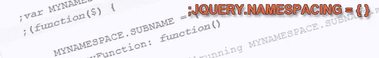

# 用简单的英语描述 jQuery 函数命名空间

> 原文：<https://www.sitepoint.com/jquery-function-namespacing-plain-english/>



对于任何 JavaScript 开发人员来说，命名空间都是必须知道的，尤其是在学习基础知识的时候，**你必须有一个坚实的基础，并且知道如何保护你的代码**。我认为一个好的开始方式是解释什么是什么，并给出一些 JavaScript/jQuery 中命名空间的例子。

## 什么是命名空间？

简而言之，命名空间是一种保护代码**的方法，它使用 javascript 对象文字符号来提供封装**。通过在单个名称空间内构造方法/数据来最小化根范围内的代码足迹，应该是每个正派开发人员的目标。优点是你可以随意命名你的变量，而不必担心其他代码会覆盖它的值。在这篇文章中，我将向您展示嵌套对象命名空间，因为这是 jQuery 中最常见的命名空间形式。

好的，让我们直接看一些例子。

> 你可以将这些例子直接粘贴到 [Firebug 控制台](http://www.jquery4u.com/utilities/live-jquery-debugging-firebug/)中，看看它能做什么，然后玩玩它。

这是在 JavaScript 中声明函数的常规方式。

```
myFunction = function()
{
	console.log('running myFunction...');
};
myFunction(); //function call
```

现在的问题是，任何其他代码也可以声明一个函数调用“myFunction ”,这将覆盖你的！不太好。那么解决办法是什么呢？你猜对了，命名空间！

## 基本命名空间

下面是如何创建一个基本名称空间来保护您的函数:

```
;MYNAMESPACE = {

	myFunction: function()
	{
		console.log('running MYNAMESPACE.myFunction...');
	}

}
MYNAMESPACE.myFunction(); //function call
```

现在，没有什么可以覆盖你的函数，所有的东西都包含在一个名为“MYNAMESPACE”的名称空间中。要调用您的函数，您只需在函数前包含名称空间。

## 命名您的共享空间

好了，你看了上面的代码，想知道为什么名称空间都是大写字母。我倾向于用大写字母来表示名称空间，因为它们是 JavaScript 引用的对象，但是这个**取决于你个人或工作的编码实践**。让它们尽可能的短也是一件好事，所以我可能应该把我的名称空间命名为“NS”或类似的名称空间(这是因为当名称空间链接在一起时会变得很长，我们将在后面的文章中讨论这个问题)。

## 具有多种功能的名称空间

您还可以声明变量和更多函数，数量不限。所有这些对于该名称空间都是“本地的”(它有点像代码的控制器)。请记住名称空间中的语法变化，因为您引用了一个对象文字，所以**您需要在每个语句后添加逗号，而不是分号**。

```
;MYNAMESPACE = {

    name: 'MYNAMESPACE',

	myFunction1: function()
	{
		console.log('running MYNAMESPACE.myFunction...');
	},
	myFunction2: function()
	{
		console.log('running MYNAMESPACE.myFunction...');
	}

}
console.log(MYNAMESPACE.name); //variable call
MYNAMESPACE.myFunction1(); //function call
MYNAMESPACE.myFunction1(); //function call
```

## 命名空间内的命名空间

现在你在想，在名称空间中的**名称空间怎么样，有点像子名称空间。是的，这也是可能的，你只需要确保你的主命名空间是预先声明的，就像这样:**

```
;var MYNAMESPACE = {};
MYNAMESPACE.SUBNAME = {

	myFunction: function()
	{
		console.log('running MYNAMESPACE.SUBNAME.myFunction...');
	}

}
MYNAMESPACE.SUBNAME.myFunction(); //function call
```

## 自我封装的 jQuery 名称空间结构

好的，现在假设您想使用一个**自封装 jQuery 函数**(也称为“**匿名函数**”或“自执行函数”)来包装您的名称空间，但是您希望能够引用其中保存的对象、函数和变量。

首先，您需要在封闭函数之外声明名称空间，以使对象可以从外部访问，如下所示:

```
;var MYNAMESPACE = {};
```

如果不在外部作用域中创建变量，肯定会看到下面的错误: *'ReferenceError: MYNAMESPACE 未定义'。*

这是代码的完整结构，它使用命名空间进行了完全封装，并包含了美元符号($)，仅在封闭的 jQuery 函数内用于 jQuery 代码，以[防止与其他框架](http://www.jquery4u.com/dom-modification/types-document-ready/)的命名冲突。

```
;var MYNAMESPACE = {}; 
;(function($) {

	MYNAMESPACE.SUBNAME = {
		myFunction: function()
		{
			console.log('running MYNAMESPACE.SUBNAME.myFunction...');
		}
	}

})(jQuery);
MYNAMESPACE.SUBNAME.myFunction(); //function call
```

## 使用窗口范围替代方案

将参数传递给匿名函数(如 jQuery)非常棒，因为在您的情况下，即使设置了 jQuery.noConflict()，它也允许您使用$。因此，从这个意义上说，如果您的名称空间中的代码使用' $ '，那将是非常合理的。

实际上，通过将 MYNAMESPACE 赋给 window 作用域，您仍然可以将所有代码放在自执行函数中(与在上面的全局作用域中使用 var 的效果相同)。然后你有了你的封装，你就可以自由地使用$。

```
;(function($) {
    // declare var in global scope
    window.MYNAMESPACE = {};

    MYNAMESPACE.SUBNAME = {
        myFunction: function()
        {
            console.log('running MYNAMESPACE.SUBNAME.myFunction...');
        }
    }

})(jQuery);
MYNAMESPACE.SUBNAME.myFunction(); //function call
```

**就是这样！**我希望你已经了解了 JavaScript/jQuery 中的命名空间。如果没有，请随时留下评论。下一篇文章，我将研究活动命名空间，这太棒了。

## 分享这篇文章