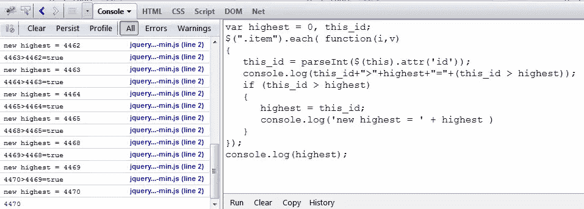

# jQuery 获取页面上元素的最高 id

> 原文：<https://www.sitepoint.com/jquery-highest-id-elements-page/>

一个 jQuery 代码片段来获取页面上指定元素组的最高 id。如果您为容器元素提供一个 id，并且您需要加载下一个元素，该元素需要高于任何当前的元素 id，那么这是非常有用的。例如，加载产品并将产品的 id 存储在容器 div 中，然后当用户向下滚动页面时，它可以加载更多的产品，但会获取最高的 id 以传递给服务器端脚本来返回产品数据。




### DOM 结构示例

```
 ... 
 ... 
 ... 
...
```

### 代码

```
//filtered by class, but you could loop all elements
var highest = 0, this_id;
$(".item").each( function(i,v)
{
   this_id = parseInt($(this).attr('id'));
   console.log(this_id+">"+highest+"="+(this_id > highest));
   if (this_id > highest)
   {
      highest = this_id;
      console.log('new highest = ' + highest )
   }
});
console.log(highest);
```

## 分享这篇文章