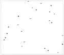
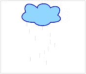
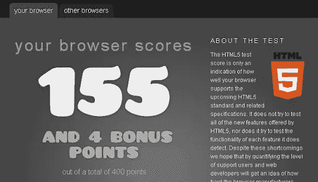

# jQuery 和新的 HTML5 基础

> 原文：<https://www.sitepoint.com/jquery-html5-essentials/>

除了时髦的新标识，HTML5 还为 jQuery 开发者提供了什么？
我想我应该写一篇关于 HTML5 的兴起以及我们作为 jQuery 大师如何利用它的文章。

**html 5 上的背景？**
HTML5 是取代 HTML4.01 和 XHTML1.1 的新版本，作为最新的 HTML 网页格式使用。
新的 W3C HTML5 规范“最后一次调用”将于 2011 年 5 月完成(根据他们的网站)。特别是，HTML5 增加了许多新的语法特性。其中包括、和元素，以及 SVG 内容的集成。这些功能旨在使包含和处理网络上的多媒体和图形内容变得容易，而不必求助于专有插件和 API。其他新元素，如、、和，旨在丰富文档的语义内容。出于同样的目的引入了新的属性，同时删除了一些元素和属性。一些元素，如和，已被更改、重新定义或标准化。API 和 DOM 不再是事后的想法，而是 HTML5 规范的基础部分。HTML5 还详细定义了对无效文档的必要处理，以便所有兼容的浏览器和其他用户代理统一处理语法错误。【http://en.wikipedia.org/wiki/HTML5】参考:T4

## 需要了解的重要事项:

**新标签！！！**

```
 New - Defines an article
 New - Defines content aside from the page content

<audio> New - Defines sound content

<canvas> New - Defines graphics
<command></command> New - Defines a command button
 <datalist>New - Defines a dropdown list
 <details>New - Defines details of an element
<embed> New - Defines external interactive content or plugin

 New - Defines the caption of a figure element
 New - Defines a group of media content, and their caption
 New - Defines a footer for a section or page
 New - Defines a header for a section or page

<hgroup> New - Defines information about a section in a document
<keygen> New - Defines a generated key in a form
 <mark>New - Defines marked text
 <meter>New - Defines measurement within a predefined range
 New - Defines navigation links

<output> New - Defines some types of output
 <progress>New - Defines progress of a task of any kind
 <rp>New -	Used in ruby annotations
 <rt>New - 	Defines explanation to ruby annotations.
 <ruby>New - Defines ruby annotations
 New - Defines a section
<source> New - Defines media resources
 <summary>New - Defines the header of a "detail" element
 <time>New - Defines a date/time
 <video>New - Defines a video
<wbr> New - Defines a possible line-break</video></time></summary></ruby></rt></rp></progress></output></meter></mark> </hgroup></details></datalist> </canvas>

</audio> 
```

**弃用的标签！！！**

```
 <acronym>Not supported in HTML5.
 <applet>Not supported in HTML5.
<basefont> 	Not supported in HTML5.
 <big>Not supported in HTML5.

<center> 	Not supported in HTML5.

<dir> 	Not supported in HTML5.
 <font>Not supported in HTML5.
 	Not supported in HTML5.
 	Not supported in HTML5.

<noframes> 	Not supported in HTML5.
 ~~Not supported in HTML5.
 `Not supported in HTML5.
 <u>Not supported in HTML5.
 <xmp>Not supported in HTML5.</xmp></u>`~~</noframes></font> </dir>

</center></big></applet></acronym> 
```

**W3C HTML5 参考:**【http://www.w3schools.com/html5/html5_reference.asp 

**，替换用于显示媒体内容。**

```
 <video src="movie.webm" poster="movie.jpg" controls="">This is fallback text to display if the browser
does not support the video element.</video> 
```

请注意，所有浏览器默认支持的媒体格式尚未确定。

**新文档类型:**触发符合标准的渲染模式

Canvas 元素:允许 2D 形状和位图图像的动态脚本化呈现

## 画布示例

JavaScript 代码可以通过类似于其他常见 2D API 的全套绘图功能来访问该区域，从而允许动态生成图形。canvas 的一些预期用途包括构建图形、动画、游戏和图像合成。用 jQuery 在画布上进行动态绘制？

```
 <canvas id="example" width="200" height="200">
This text is displayed if your browser does not support HTML5 Canvas.
</canvas> 
```

```
//This code draws a red rectangle on the screen.
var example = document.getElementById('example');
var context = example.getContext('2d');
context.fillStyle = "rgb(255,0,0)";
context.fillRect(30, 30, 50, 50);
```

参考:[http://en.wikipedia.org/wiki/Canvas_element](http://en.wikipedia.org/wiki/Canvas_element)

## 更多很酷的 HTML5 画布示例

**Google logo balls 动画**
[](https://www.sitepoint.com/demos/html5-canvas-animation/) 
**掉落纸屑动画**
[](http://www.html5canvastutorials.com/labs/html5-canvas-interactive-building-map/)
**潇潇云动画**
[](http://www.html5canvastutorials.com/labs/html5-canvas-elastic-stars-with-kineticjs/)

如果你对基于网络的图形感兴趣，你可能想看看 WebGL。
它使用 HTML5 canvas 元素，通过文档对象模型接口访问。
参考:【http://en.wikipedia.org/wiki/WebGL】T4

HTML5 规范预计将包括对拖放的**支持。但 gmail 使用基于网络的拖放功能。我更喜欢用 jQuery 来拖放东西！**

**更好的 MIME 类型处理:**阅读更多:http://en.wikipedia.org/wiki/MIME_type

**微数据的使用:**这基本上是嵌套在内容中的数据(html 机器可读注释)，以便搜索引擎和网络爬虫更好地理解网页中包含什么信息。阅读更多关于微数据词汇表的文章:http://www.data-vocabulary.org/

## 微数据示例

```
 Hello, my name is 
        Jhon Doe, 
        I am a 
        graduate research assistant 
        at the 
        University of Dreams. 
        My friends call me 
        Jhonny. 
        You can visit my homepage at 
        [www.JhonyD.com](http://www.JhonnyD.com). 

                I live at 
                1234 Peach Drive 
                Warner Robins
                , 
                Georgia. 
```

一个常见的误解是 HTML5 可以在网页内提供动画，这是不真实的。JavaScript/jQuery 或 CSS3 是制作 HTML 元素动画所必需的。使用 JavaScript/jQuery 和 HTML 4 也可以制作动画。

更好的错误处理:html 5(文本/html)浏览器将灵活地处理不正确的语法。

HTML5 的设计使得旧浏览器可以安全地忽略新的 HTML5 构造。再也没有标记汤了！

**对文件 API 的改进:**W3C 官方工作草案的大量阅读材料:【https://www.w3.org/TR/FileAPI/

## 浏览器测试


我用这个[网站分析工具](http://html5test.com)测试了使用 firefox 3.6 的 HTML5，它似乎只是击败了 IE，落后于其他 3 个主要浏览器。不知道这个工具有多准确，但谷歌 Chrome 的结果看起来很有希望。

最新浏览器 HTML5 评分:

1.  谷歌浏览器 10.0.648 - **288 分**
2.  歌剧 11.1 - **244 分**
3.  苹果 Safari 5.0.3 - **228 分**
4.  Mozilla Firefox 3.6 - **155 分**
5.  微软 Internet Explorer 9 - **130 分**

**最终想法:**
因为规范还没有最终确定，我建议确保你使用的标签能被你的目标浏览器基于它们的布局引擎广泛支持。参见此[对照表](http://en.wikipedia.org/wiki/Comparison_of_layout_engines_%28HTML5%29#Elements)检查对元素、属性、全局、表单、API 等的支持。特别要注意 Gecko(火狐)、Trident(互联网浏览器)和 Webkit (Safari/Chrome)的布局引擎。更多关于 jQuery 和 HTML5 的内容即将发布！！！

## 分享这篇文章