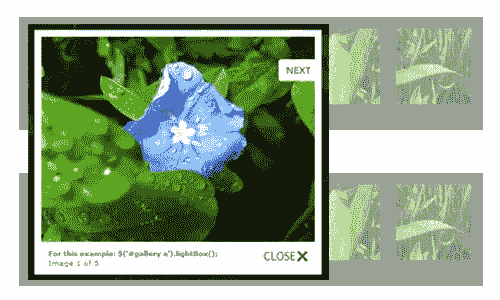
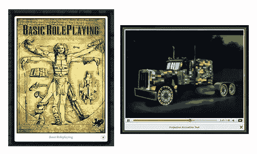
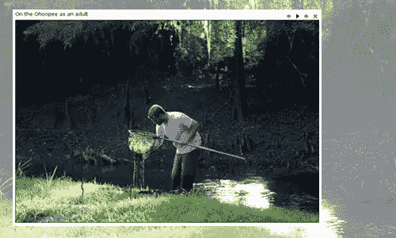
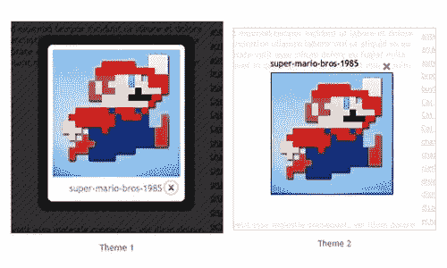
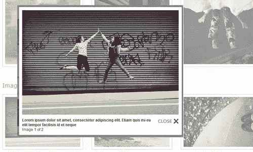
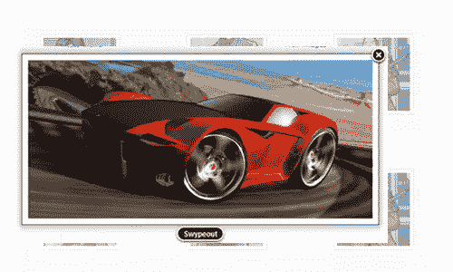
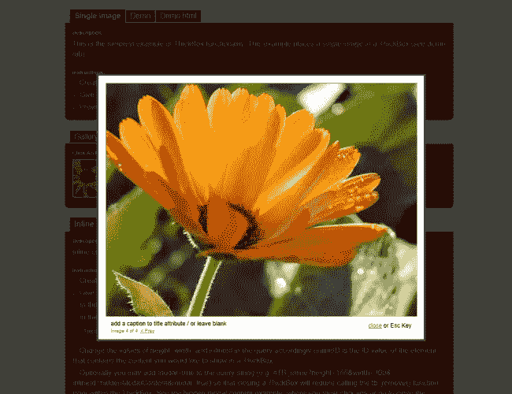
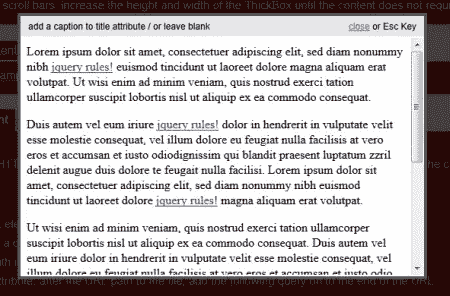

# jQuery light box vs ColorBox vs fancy box vs Thickbox——主要区别是什么？

> 原文：<https://www.sitepoint.com/jquery-lightbox-colorbox-fancybox-thickbox/>

最近好像每个人都在问这个问题！这些 light box/thickbox/fancy box/colorbox jQuery 插件有什么共同点，又有什么区别？我想我会去做我的下一个博客任务，这是结果。我还包括了 WordPress 选项的下载链接，因为它们都可以在 WordPress 上使用。

**相关帖子:**

*   [**10 jQuery LightBox 插件**](http://www.jquery4u.com/plugins/10-jquery-lightbox-plugins/)
*   [**100 个图片/内容的 jQuery 滑块**](http://www.jquery4u.com/plugins/100-jquery-sliders-part1/)

## 什么是 jQuery lightBox？

### lightBox

它是 jQuery 的一个插件，灵感来自于 Lightbox JS 中的 Lokesh Dhakar。

### 特点:

>简单、优雅且不引人注目的插件。
>不要求额外加价。
>可定制的 jQuery lightBox 插件。
>用于通过 jQuery 选择器的强大功能和灵活性在当前页面上叠加图像。它有一些配置，你可以在调用它的时候定义。

[来源](http://leandrovieira.com/projects/jquery/lightbox/#example)
[演示](http://leandrovieira.com/projects/jquery/lightbox/#example)
[下载](http://leandrovieira.com/download/7/)

### 对于 WordPress 选项:

Lightbox Plus 允许用户在不离开当前页面的情况下查看更大版本的图片。Lightbox 能够添加一个 lightbox 到 WordPress 画廊图片，显示简单的幻灯片，视频，表格和外部内容。

[来源](http://wordpress.org/extend/plugins/lightbox-plus/)
[演示](http://wordpress.org/extend/plugins/lightbox-plus/screenshots/)
[下载](http://downloads.wordpress.org/plugin/lightbox-plus.2.4.zip)

## 什么是 jQuery ColorBox？

### color box-颜色方块

是用于 jQuery 1.3+的轻量级可定制 lightbox 插件。轻量级(9kb)，支持照片、照片组、幻灯片、Ajax、内嵌和 iframed 内容。

### 特点:

>完全不引人注目的插件。
>选项在 JS 中设置，不需要对现有的 HTML 进行修改。
>外观是通过 CSS 控制的，所以可以重新样式化。
>可以用回调和事件挂钩来扩展，而不用改变源文件。
>预载照片组中即将出现的图像。
>用在成千上万的网站上，包括 imgur。

[来源](http://jacklmoore.com/colorbox/)
[演示](http://jacklmoore.com/colorbox/example1/)
[下载](http://jacklmoore.com/colorbox/colorbox.zip)

### 对于 WordPress 选项:

WordPress 插件有 11 个主题供你选择。下图是十一个主题的两个例子。

[来源](http://wordpress.org/extend/plugins/jquery-colorbox/)
[演示](http://www.techotronic.de/plugins/jquery-colorbox/theme-screenshots/)
[下载](http://downloads.wordpress.org/plugin/jquery-colorbox.4.2.zip)

## jQuery FancyBox 是什么？

### 法克斯足球俱乐部

这是一个在 Mac 风格的“灯箱”中显示图像、HTML 内容和多媒体的工具，它漂浮在网页的上方。

### 特点:

>可以显示图像、HTML 元素、SWF 电影、Iframes 以及 Ajax 请求。
>可通过设置和 CSS 定制。
>对相关项目进行分组并添加导航。
>如果页面中包含鼠标滚轮插件，那么 FancyBox 也会响应鼠标滚轮事件。
>使用缓动插件支持花式转场。
>在缩放的项目下添加一个漂亮的阴影。

[来源](http://fancybox.net/)
[演示](http://fancybox.net/)
[下载](http://fancybox.googlecode.com/files/jquery.fancybox-1.3.4.zip)

### 对于 WordPress 选项:

WordPress 的 FancyBox 是一个 WP 插件，它使用 jQuery 在点击时显示图像，无需重新加载页面。它使用的是 T2 的 Janis Skarnelis 的 FancyBox。

[来源](http://blog.moskis.net/downloads/plugins/fancybox-for-wordpress/)
[演示](http://blog.moskis.net/downloads/plugins/fancybox-for-wordpress/)
[下载](http://downloads.wordpress.org/plugin/fancybox-for-wordpress.2.7.5.zip)

## 什么是 jQuery Thickbox？

### 厚盒

ThickBox 是在 jQuery 库之上用 JavaScript 编写的网页 UI 对话框小部件。它的功能是显示单个图像、多个图像、内联内容、iframed 内容或通过 AJAX 以混合模式提供的内容。

### 特点:

> ThickBox 是使用超级轻量级 jQuery 库构建的。压缩后，jQuery 库是 20k，解压缩后是 58k。
>ThickBox JavaScript 代码和 CSS 文件只是在 jQuery 代码的基础上额外增加了 15k(使用 thickbox-compressed.js 只有 10k)。如果需要，CSS 文件还可以被压缩。
> ThickBox 会调整比浏览器窗口大的图片大小。
> ThickBox 提供了多功能性(图像、iframed 内容、内联内容和 AJAX 内容)。
> ThickBox 会隐藏 Windows IE 6 中的表单元素。
>即使当用户滚动页面或者改变浏览器窗口的大小时，ThickBox 也会保持在窗口中央。单击图像、覆盖或关闭链接将删除 ThickBox。
>由于 ThickBox 创建者认为过渡应该由个人作者来定制，ThickBox 窗口没有实现花哨的过渡。如果你觉得合适，可以随意添加。这是特色吗？有些人可能会说是。
> ThickBox 可以从链接元素、输入元素(通常是一个按钮)和区域元素(图像地图)中调用。

[来源](http://jquery.com/demo/thickbox/)
[演示](http://jquery.com/demo/thickbox/#examples)

### 对于 WordPress 选项:

Thickbox 也可以作为 wordpress 插件使用。如果你想把 ThickBox 嵌入到你的博客中，只需安装这个插件，在任何你想要的地方插入 ThickBox 兼容的标记，你就一切就绪了。

[来源](http://wordpress.org/extend/plugins/thickbox/)
[演示](http://wordpress.org/extend/plugins/thickbox/screenshots/)
[下载](http://downloads.wordpress.org/plugin/thickbox.1.5.zip)

## 结论

如果你打算彻底研究这四个插件，你会发现它们彼此之间没有太大的区别。它们都是轻量级的，可以通过设置和 CSS 进行个性化/定制。选项是在 JavaScript 中设置的，不需要对现有的 HTML 标记进行任何更改。所有这些都是完全不引人注目的插件，都是为他们的目的而构建的。请记住，虽然 Thickbox 不再被维护，但 Colorbox 和 Fancybox 是首选。

## 分享这篇文章