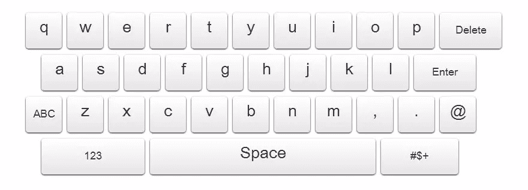

# jQuery 屏幕键盘

> 原文：<https://www.sitepoint.com/jquery-on-screen-keyboard/>

这是一个简单的屏幕键盘，由 JavaScript/jQuery 提供支持。我对 [jsKeyboard 插件](http://code.technolatte.net/TouchScreenKeyboard/)做了一些增强，修复了它的一些 bug，并将其添加到 GitHub 中。

[下载](https://github.com/sdeering/onscreenkeyboard)

*   *更新了默认键盘布局
*   *与多个现场输入相连
*   *添加了光标以在键入时显示
*   *修正了错误:在光标位置键入字符，而不是追加
*   *修正了错误:删除字符位置而不是最后一个字符
*   *修正了一个错误:空格实际上增加了一个空格
*   *添加了 HTML5 验证规则

## 分享这篇文章